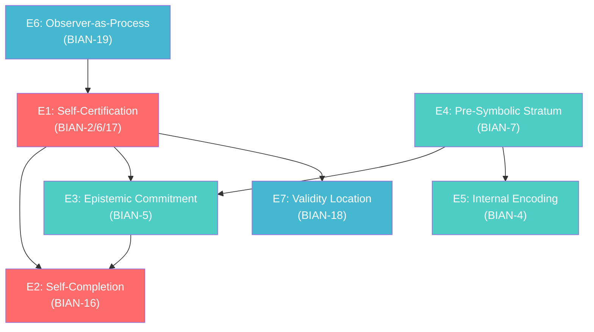

# Epistemic Extension Framework for Quantum Measurement

## QM-E: Seven Epistemic Postulates Derived from BIAN Gap Analysis

**Author:** VietVunVut (Viet - Nguyen Xuan)
**Date:** 2026-05-11
**Source:** 20 BIAN gaps × 4 source files (system_be_full, SOT mapping, 1:1 RCA mapping, BIAN index v2)
**Status:** Proposal — Epistemic class D (Derived, awaiting formal verification)

---

## 0. Motivation

Standard QM rests on **4 postulates** (QM concept #8):

| # | Standard Postulate | Content |
|---|-------------------|---------|
| P1 | State Space | States live in Hilbert space ℋ |
| P2 | Observable | Physical quantities ↔ Hermitian operators |
| P3 | Measurement | Measurement yields eigenvalue; state collapses to eigenstate |
| P4 | Dynamics | Time evolution via Schrödinger equation (unitary) |

These postulates describe the **physical mechanics** of measurement but are **silent** on:

- **Who/what certifies** that a measurement occurred (BIAN-2/6/17)
- **Whether** the measurement is self-completing or requires external registration (BIAN-16)
- **How** the observer relates to the measurement process (BIAN-19)
- **What** constitutes epistemic commitment vs. mere physical interaction (BIAN-5)
- **How** a measurement can be invalidated (BIAN-12)
- **What** a null-observation means epistemically (BIAN-13)
- **Where** the validity of measurement is located — intrinsic or extrinsic (BIAN-18)

The BIAN analysis reveals these are not "philosophical extras" — they are **structural gaps** that generate the measurement problem, the von Neumann chain, and the Heisenberg cut ambiguity.

---

## 1. Architecture — Three Tiers of Epistemic Postulates

```
┌──────────────────────────────────────────────────────────────┐
│                    EXISTING QM POSTULATES                     │
│              P1 (State) · P2 (Observable) ·                  │
│              P3 (Measurement) · P4 (Dynamics)                │
├──────────────────────────────────────────────────────────────┤
│                                                              │
│  TIER 0 — MEASUREMENT SELF-CERTIFICATION (Foundational)      │
│  ┌────────────────────────────────────────────────────────┐  │
│  │  E1  Self-Certification Postulate                      │  │
│  │  E2  Measurement Self-Completion Postulate             │  │
│  └────────────────────────────────────────────────────────┘  │
│                                                              │
│  TIER 1 — INTERNAL EPISTEMIC ARCHITECTURE                    │
│  ┌────────────────────────────────────────────────────────┐  │
│  │  E3  Epistemic Commitment Postulate                    │  │
│  │  E4  Pre-Symbolic Stratum Postulate                    │  │
│  │  E5  Internal Encoding Postulate                       │  │
│  └────────────────────────────────────────────────────────┘  │
│                                                              │
│  TIER 2 — META-EPISTEMIC COMPLETION                          │
│  ┌────────────────────────────────────────────────────────┐  │
│  │  E6  Observer-as-Process Postulate                     │  │
│  │  E7  Epistemic Validity Location Postulate             │  │
│  └────────────────────────────────────────────────────────┘  │
│                                                              │
└──────────────────────────────────────────────────────────────┘
```

---

## 2. The Seven Postulates

### E1 — Self-Certification Postulate (Regress-Stopping)

> **A measurement act M is self-certifying: the occurrence of M is registered by M itself without requiring a second measurement M′ to confirm that M occurred.**

| Property | Value |
|----------|-------|
| BIAN source | **BIAN-2** (Observer Self-Reference), **BIAN-6** (Self-Certifying Measurement), **BIAN-17** (Regress-Stopping) |
| BE grounding | Svasaṃvedana (N_BE_00011) — *"Every cognition is simultaneously aware of itself. Cognition of blue is also, non-inferentially, an awareness of the cognizing-of-blue."* (SOT T1.06) |
| Current QM deficit | Von Neumann chain: apparatus A₁ measures system S, but A₁ is itself a quantum system — who measures A₁? Infinite regress with no formal stopping principle. |
| What this resolves | Eliminates the von Neumann chain by postulating that measurement acts carry an intrinsic self-registration property. No external meta-observer is needed. |

**Formal sketch:**
```
For any measurement act M on system S:
  ∃ σ(M) ∈ {0,1} such that σ(M) = 1 iff M has occurred,
  and σ(M) is determined by M itself, not by any M′ ≠ M.

Property: σ is intrinsic — σ(M) does not require a second-order
measurement to establish its value.
```

**Impact:** This is the **deepest** postulate. It directly addresses why the measurement problem exists: P3 says *what happens* when you measure, but not *how the system knows measurement happened*. E1 fills this gap.

---

### E2 — Measurement Self-Completion Postulate

> **A measurement act produces its own result as part of its own operation. The result is not a separate event registered by an external system — it is structurally identical with the measuring act itself.**

| Property | Value |
|----------|-------|
| BIAN source | **BIAN-16** (Measurement Self-Completion) |
| BE grounding | Pramāṇa-phala identity (N_BE_00001) — *"Measurement self-completion: the result (phala) is not ontologically separate from the act (pramāṇa)."* (SOT T6.01) |
| Current QM deficit | P3 separates measurement (physical act) from result (eigenvalue readout). The "act" and the "result" are treated as logically distinct events. No principle specifies when/how the result is "finalized." |
| What this resolves | Collapses the gap between "measurement happens" and "result is registered" into a single indivisible epistemic event. Eliminates the need for a "moment of collapse." |

**Formal sketch:**
```
For measurement M yielding result r:
  M ≡ᵋ r  (epistemic identity)
  
The measuring act and its result are not two events with a causal
gap between them. They are one event described from two perspectives:
process-perspective (M) and content-perspective (r).
```

**Impact:** Addresses P3's implicit assumption that "collapse" is a separate physical process that somehow follows measurement. E2 says: there is no separate collapse — the measurement IS the result.

---

### E3 — Epistemic Commitment Postulate

> **A measurement is distinguished from a mere physical interaction by an act of epistemic commitment (determination) that converts a physical correlation into an irreversible epistemic fact.**

| Property | Value |
|----------|-------|
| BIAN source | **BIAN-5** (Epistemic Commitment Act) |
| BE grounding | Vyavasāya (no dedicated node — SOT T2.04 L324) — *"Determination: the moment of epistemic commitment that converts cognitive process into definite knowledge."* |
| Current QM deficit | P3 does not distinguish a measurement from any other physical interaction. System-meter coupling (concept #21) is a unitary evolution — indistinguishable from any other interaction until someone declares it a "measurement." |
| What this resolves | Provides a formal criterion for when a physical interaction becomes a measurement. Without E3, the Heisenberg cut remains arbitrary. |

**Formal sketch:**
```
A physical interaction I between system S and apparatus A
becomes a measurement M iff:
  ∃ commitment act C(I) such that:
    (i)  C(I) is irreversible within the epistemic framework
    (ii) C(I) assigns a definite value v to observable Ô
    (iii) C(I) satisfies E1 (self-certification)
    
Without C(I), the interaction I remains a correlation,
not a measurement.
```

**Impact:** Resolves the Heisenberg cut problem by specifying *what makes a measurement a measurement* — not the physical apparatus, but the epistemic commitment act.

---

### E4 — Pre-Symbolic Stratum Postulate

> **Every measurement act includes a pre-conceptual, pre-symbolic physical event that is not itself a measurement result, but is the ground from which the result emerges.**

| Property | Value |
|----------|-------|
| BIAN source | **BIAN-7** (Pre-Symbolic Physical Event) |
| BE grounding | Nirvikalpaka pratyakṣa (N_BE_00009) — *"Pure, direct perception free from conceptual or linguistic elaboration."* |
| Current QM deficit | P3 jumps directly from "measurement occurs" to "eigenvalue obtained." There is no formal account of what happens *before* the result is symbolically registered — the raw physical event prior to its interpretation as a definite eigenvalue. |
| What this resolves | Acknowledges that measurement has a pre-symbolic stratum. This matters for weak measurement (#28), partial collapse (#32), and the transition from quantum to classical description. |

**Formal sketch:**
```
For measurement M yielding result r with symbolic label λ:
  ∃ pre-symbolic event ε(M) such that:
    (i)   ε(M) precedes λ-assignment
    (ii)  ε(M) has causal content but no symbolic value
    (iii) r = Λ(ε(M)) where Λ is the symbolization operator
    
In weak measurement: Λ is partial → r is partial.
In projective measurement: Λ is complete → r is eigenvalue.
```

**Impact:** Provides a formal basis for the spectrum from weak measurement to projective measurement. The difference is in the degree of symbolization (Λ), not in the presence/absence of a physical event.

---

### E5 — Internal Encoding Postulate

> **A measurement result is internally encoded within the measuring system as a representational state, not merely recorded as an external classical bit.**

| Property | Value |
|----------|-------|
| BIAN source | **BIAN-4** (Internal Encoding Structure) |
| BE grounding | Ākāra (N_BE_00151) — *"Cognitive aspect: the internal form (ākāra) that a cognition takes when apprehending its object."* |
| Current QM deficit | P3 treats measurement results as eigenvalues — abstract numbers. It says nothing about how the result is *internally represented* within the measuring apparatus. The distinction between "a number appears" and "the apparatus encodes a state" is not formalized. |
| What this resolves | Provides the formal link between measurement result (eigenvalue) and the wave function ψ(x) (#13) as internal encoding. The post-measurement state is not just a number — it is a new internal representation. |

**Formal sketch:**
```
After measurement M yields eigenvalue aₖ:
  Apparatus A enters internal representational state |Rₖ⟩_A
  such that:
    (i)   |Rₖ⟩_A encodes aₖ within A's internal structure
    (ii)  |Rₖ⟩_A is the ākāra (internal form) of the result
    (iii) Retrieval of aₖ from |Rₖ⟩_A does not require
          a second measurement on A
```

**Impact:** Bridges the gap between abstract eigenvalue and physical state. Connects to decoherence theory by specifying what "the environment selects" — it selects the internal encoding basis.

---

### E6 — Observer-as-Process Postulate

> **The observer is a causal process, not a substance. The observer has no persistent identity beyond the causal continuity of its measurement-registration acts.**

| Property | Value |
|----------|-------|
| BIAN source | **BIAN-19** (Observer as Causal Process) |
| BE grounding | Anātmavāda (N_BE_00066) — *"Non-self doctrine: the knower is a process (santāna), not a substance (ātman)."* |
| Current QM deficit | QM uses "observer" as a primitive term without formal definition. The observer is implicitly treated as a persistent substance that exists before, during, and after measurement. This creates confusion in Wigner's Friend scenarios and quantum cosmology. |
| What this resolves | Replaces the substance-observer with a process-observer. The "observer" is the causal chain of measurement-registration acts — nothing more. This dissolves Wigner's Friend paradox: there is no "friend" as a substance; there are only measurement processes. |

**Formal sketch:**
```
Observer O is defined as a causal process:
  O = {M₁, M₂, ..., Mₙ} where Mᵢ → Mᵢ₊₁ (causal link)
  
Properties:
  (i)   O has no identity beyond {Mᵢ}
  (ii)  O is not a Hilbert space element
  (iii) O is not an external classical agent
  (iv)  Two observers O₁, O₂ are distinct iff
        their causal chains are causally disconnected
```

**Impact:** Provides the formal basis for relational quantum mechanics (RQM) and QBism by grounding "observer" in process rather than substance. Also connects to quantum trajectory theory (#38) — the trajectory IS the observer.

---

### E7 — Epistemic Validity Location Postulate

> **The validity of a measurement is intrinsic to the measurement act itself. A measurement does not require subsequent verification to count as valid. Invalidity, when it occurs, is detected extrinsically by a subsequent measurement.**

| Property | Value |
|----------|-------|
| BIAN source | **BIAN-18** (Intrinsic vs. Extrinsic Validity) |
| BE grounding | Svataḥ prāmāṇya (intrinsic validity) + Bādhaka pramāṇa (extrinsic invalidation) — *"Initial validity is intrinsic (via svasaṃvedana and arthakriyāśakti); invalidity is detected extrinsically."* (SOT T6.03) |
| Current QM deficit | QM has no formal account of measurement validity. In practice, experimenters use calibration, repetition, and cross-checks — all extrinsic. But whether a single unrepeated measurement is "valid" is undefined. |
| What this resolves | Asymmetric validity principle: validity is default (intrinsic), invalidity is diagnosed (extrinsic). This matches experimental practice and provides the formal ground for why single-shot measurements are meaningful. |

**Formal sketch:**
```
For measurement M yielding result r:
  Default: M is valid (svataḥ)
  
  Invalidity detection:
    ∃ subsequent measurement M′ such that M′ contradicts M
    → M is retroactively marked invalid (bādhaka)
    
  Asymmetry: validity does not require M′.
             Invalidity requires M′.
```

**Impact:** Provides the formal basis for single-shot quantum measurements being meaningful (e.g., in quantum cryptography, BB84 #98). Also grounds the distinction between systematic error and random outcome.

---

## 3. Dependency Graph



**Reading order:** E6 → E1 → E4 → E3 → E2 → E5 → E7

**Dependency logic:**
- E6 (observer-as-process) grounds E1 (self-certification) — a process can self-certify; a substance cannot
- E1 grounds E2 (self-completion) — self-certifying acts are self-completing
- E1 grounds E3 (commitment) — commitment requires self-certification
- E4 (pre-symbolic) grounds E3 — commitment acts on pre-symbolic events
- E4 grounds E5 (encoding) — encoding is symbolization of pre-symbolic content
- E3 grounds E2 — completion requires commitment
- E1 grounds E7 (validity) — self-certifying acts are intrinsically valid

---

## 4. BIAN Coverage

| BIAN | Gap | Covered by | Status |
|------|-----|------------|--------|
| BIAN-1 | Post-detection representational state | E5 (Internal Encoding) | ✅ |
| BIAN-2 | Observer self-reference | E1 (Self-Certification) | ✅ |
| BIAN-3 | Limit-case observation | E4 (Pre-Symbolic) — as limiting case of Λ | ✅ |
| BIAN-4 | Internal encoding | E5 (Internal Encoding) | ✅ |
| BIAN-5 | Epistemic commitment | E3 (Epistemic Commitment) | ✅ |
| BIAN-6 | Self-certifying measurement | E1 (Self-Certification) | ✅ |
| BIAN-7 | Pre-symbolic stratum | E4 (Pre-Symbolic) | ✅ |
| BIAN-8 | Temporal discontinuity | E4 + E3 (discreteness of commitment acts) | ✅ |
| BIAN-9 | Cognition of absence | E3 + E7 (null commitment = valid absence-measurement) | ✅ |
| BIAN-10 | Entanglement (reverse gap) | — (not an epistemic deficit in QM) | N/A |
| BIAN-11 | Observer indeterminacy before measurement | E3 (pre-commitment state) | ✅ |
| BIAN-12 | Measurement invalidation | E7 (extrinsic invalidity detection) | ✅ |
| BIAN-13 | Null observer event | E3 (non-engagement = no commitment act) | ✅ |
| BIAN-14 | Tripartite validity conditions | E7 + E3 + E1 (three conditions for valid measurement) | ✅ |
| BIAN-15 | Purely contrastive evidence | E4 (Λ-only-negative = exclusion-based symbolization) | ✅ |
| BIAN-16 | Measurement self-completion | E2 (Self-Completion) | ✅ |
| BIAN-17 | Regress-stopping | E1 (Self-Certification) | ✅ |
| BIAN-18 | Validity location | E7 (Validity Location) | ✅ |
| BIAN-19 | Observer as process | E6 (Observer-as-Process) | ✅ |
| BIAN-20 | Reserved | — | N/A |

**Coverage: 18/18 actionable BIAN gaps addressed** (excluding BIAN-10 reverse gap and BIAN-20 reserved).

---

## 5. Compatibility with Existing QM Interpretations

| Interpretation | Compatible with E1–E7? | Notes |
|---------------|:---:|-------|
| Copenhagen | ✅ Extends | E1/E2 formalize the "classical apparatus" assumption. E3 formalizes the Heisenberg cut. |
| QBism | ✅ Extends | E6 aligns with QBism's agent-centered view. E7 aligns with Bayesian priors. |
| Relational QM | ✅ Extends | E6 directly supports RQM. E1 provides the self-certification that RQM assumes but doesn't formalize. |
| Many-Worlds (MWI) | ⚠️ Partial | E1 and E3 add structure MWI lacks (branch selection). E6 is compatible. E2 may conflict with "all outcomes occur." |
| Decoherence | ✅ Compatible | E4/E5 provide the epistemic interpretation of decoherence's pointer-basis selection. |
| Objective Collapse (GRW) | ⚠️ Partial | E3 may conflict with spontaneous collapse (no commitment act in GRW). E1/E2 are compatible. |
| Pilot Wave (Bohmian) | ⚠️ Partial | E6 conflicts with Bohmian particle-as-substance. E1/E4/E5 are compatible. |

---

## 6. Summary Table — From 4 to 11 Postulates

| # | Postulate | Domain | Source |
|---|-----------|--------|--------|
| P1 | State Space (Hilbert) | Physical | Standard QM |
| P2 | Observable (Hermitian) | Physical | Standard QM |
| P3 | Measurement (eigenvalue + collapse) | Physical | Standard QM |
| P4 | Dynamics (Schrödinger) | Physical | Standard QM |
| **E1** | **Self-Certification** | **Epistemic** | **BIAN-2/6/17 (Svasaṃvedana)** |
| **E2** | **Self-Completion** | **Epistemic** | **BIAN-16 (Pramāṇa-phala)** |
| **E3** | **Epistemic Commitment** | **Epistemic** | **BIAN-5 (Vyavasāya)** |
| **E4** | **Pre-Symbolic Stratum** | **Epistemic** | **BIAN-7 (Nirvikalpaka)** |
| **E5** | **Internal Encoding** | **Epistemic** | **BIAN-4 (Ākāra)** |
| **E6** | **Observer-as-Process** | **Epistemic** | **BIAN-19 (Anātmavāda)** |
| **E7** | **Validity Location** | **Epistemic** | **BIAN-18 (Svataḥ prāmāṇya)** |

> [!IMPORTANT]
> The 7 epistemic postulates (E1–E7) do not **replace** the 4 physical postulates (P1–P4). They **extend** them by providing the epistemic layer that P1–P4 are silent about. The measurement problem arises precisely because P1–P4 describe physics without epistemics. E1–E7 supply the missing epistemic architecture.

---

## 7. What This Does NOT Claim

1. **Not a new interpretation** — E1–E7 are interpretation-neutral structural postulates
2. **Not metaphysical** — all postulates are about epistemic acts, not about consciousness or mind
3. **Not Buddhist doctrine** — the postulates are extracted from structural analysis, not from religious claims
4. **Not experimentally testable (yet)** — these are architectural principles, not empirical predictions
5. **Not claiming QM is "wrong"** — QM's physical predictions are untouched. What changes is the *epistemic framework* in which those predictions are understood

---

*Source: BIAN_index_v2.md, system_be_full.md, system_mapping_SOT.md, system_be_qm_framework_1to1_RCA_mapping.md, comparison_axioms_vs_qm_table.md*
