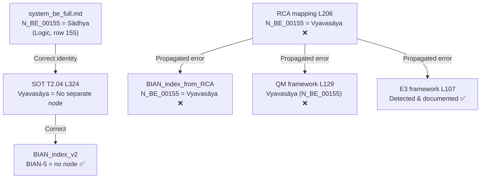

# RCA Node Investigation — BIAN-5 / N_BE_00155 Conflict
# Điều tra RCA Nút — BIAN-5 / Xung đột N_BE_00155

**Date:** 2026-05-11  
**Auditor:** Antigravity RCA Engine  
**Severity:** 🔴 **Critical** — Identity conflict in authoritative registry  
**Status:** ⚠️ PARTIALLY RESOLVED (BIAN_index_v2 fixed; 2 files still conflicting)

---

## 1. Conflict Summary

```
QUESTION: What concept does N_BE_00155 represent?

ANSWER A (system_be_full L187 — AUTHORITATIVE):
  N_BE_00155 = Sādhya or sādhyadharma (Logic)
  "Property to be established in the subject of inference"

ANSWER B (RCA mapping L206 — INCORRECT):
  N_BE_00155 = Vyavasāya (Consciousness-Only)
  "Determination maps to definite state assignment"
```

**Verdict:** Answer A is correct. `system_be_full.md` is the authoritative node registry.

---

## 2. Root Cause Analysis

### 2a. How the conflict arose



### 2b. Root cause

The **1:1 RCA mapping** file (`system_be_qm_framework_1to1_RCA_mapping.md`) was generated by matching Vyavasāya to N_BE_00155 based on **sequential row numbering** rather than **semantic content**. The mapping author likely saw row 155 in the RCA table and assumed it matched N_BE_00155 without verifying the actual content.

In the system_be_full registry, the N_BE_00150-N_BE_00160 range contains **Logic** concepts (Pratijñā, Pakṣa, Sādhya, Hetu, Dṛṣṭānta), NOT Consciousness-Only concepts:

| Node | system_be_full | Domain |
|------|---------------|--------|
| N_BE_00153 | Pratijñā | Logic |
| N_BE_00154 | Pakṣa | Logic |
| **N_BE_00155** | **Sādhya** | **Logic** |
| N_BE_00156 | Hetu | Logic |
| N_BE_00157 | Dṛṣṭānta | Logic |

Vyavasāya does not appear anywhere in the 263-node registry.

### 2c. Why the SOT is correct

SOT T2.04 L324 explicitly states: **"No separate node in published documents"** for Vyavasāya. This means Vyavasāya was never registered as a node — it's a meta-epistemological concept without a dedicated entry. The RCA mapping's assignment of N_BE_00155 to Vyavasāya directly contradicts this declaration.

---

## 3. File-by-File Conflict Matrix

### 3a. Files with CORRECT identity (N_BE_00155 = Sādhya or no-node)

| File | Location | Content | Status |
|------|----------|---------|--------|
| **system_be_full.md** | L187 | "Sādhya or sādhyadharma \| Logic" | ✅ AUTHORITATIVE |
| **SOT** (system_mapping_SOT.md) | L324 | "No separate node" for Vyavasāya | ✅ |
| **SOT BIAN table** | L843 | "No separate node — vyavasāya" | ✅ |
| **BIAN_index_v2.md** | L33 | "— \| — \| — \| Vyavasāya \| No separate node... N_BE_00155 is Sādhya, not Vyavasāya" | ✅ CORRECTED |
| **BIAN_index_v2.md** | L165 | "BIAN-5 — No node (Vyavasāya) — 0 edges" | ✅ CORRECTED |
| **BIAN_index_v2.md** | L169 | "⚠️ RCA correction (2026-05-11)" | ✅ CORRECTED |
| **BIAN_index.md** (v1) | L9 | "(No separate node — vyavasāya)" | ✅ |
| **E3 framework** | L107 | "N_BE_00155 was incorrectly assigned... N_BE_00155 = Sādhya" | ✅ DOCUMENTED |
| **E5 framework** | L137 | "Same class of error as E3 (BIAN-5/N_BE_00155)" | ✅ DOCUMENTED |
| All SOT-derived mappings (5 files) | Multiple | "BIAN-5 \| — (no node)" | ✅ |

### 3b. Files with INCORRECT identity (N_BE_00155 = Vyavasāya) 🔴

| File | Location | Content | Fix needed |
|------|----------|---------|------------|
| **system_be_qm_framework_1to1_RCA_mapping.md** | L206 | "155 \| N_BE_00155 \| RCA \| Vyavasāya" | 🔴 YES |
| **BIAN_index_from_RCA_mapping.md** | L16 | "BIAN-5 \| N_BE_00155 \| RCA \| Vyavasāya" | 🔴 YES |
| **BIAN_index_from_RCA_mapping.md** | L153 | "BIAN-5 → N_BE_00155 (Vyavasāya)" | 🔴 YES |
| **BIAN_index_from_RCA_mapping.md** | L157 | "ED_BE_00125 \| N_BE_00155 → N_BE_00154" | 🔴 YES |
| **QM_measurement_epistemic_postulates_framework.md** | L129 | "Vyavasāya (N_BE_00155)" | 🔴 YES |

### 3c. Files referencing BIAN-5 WITHOUT node conflict (contextual only)

| File | Content | Status |
|------|---------|--------|
| SOT T2.04 (L322-L328) | Vyavasāya definition, no node assigned | ✅ Neutral |
| RCA_BIAN_gap_analysis_vi.md L43 | "BIAN-5 — Vyavasāya" | ✅ No node cited |
| comparison_axioms_vs_refine.md L148 | "BIAN-5 \| Vyavasāya" | ✅ No node cited |
| BE_and_QM_sonnet_mapping.md L214 | "BIAN-5" | ✅ No node cited |
| BIAN_gap_analysis_ver_01.md L70 | "BIAN-5" | ✅ No node cited |

---

## 4. Edge Contamination

The conflict also contaminated **edge ED_BE_00125**:

| Source | Content | Correct? |
|--------|---------|----------|
| system_be_full L437 | "ED_BE_00125 \| Sādhya (N_BE_00155) → Pakṣa (N_BE_00154) \| is property to be established in" | ✅ |
| RCA mapping L463 | "ED_BE_00125 \| N_BE_00155 → N_BE_00154 \| is property in" | ✅ Edge itself correct |
| BIAN_index_from_RCA L157 | "ED_BE_00125 \| N_BE_00155 → N_BE_00154 \| is property in" listed under "BIAN-5" | ❌ Wrong BIAN |

**Analysis:** ED_BE_00125 (Sādhya → Pakṣa) is a **Logic** edge. It has nothing to do with BIAN-5 (Epistemic Commitment). The BIAN_index_from_RCA incorrectly attributed this Logic edge to BIAN-5 because it assumed N_BE_00155 = Vyavasāya.

---

## 5. Primary Source Verification

### 5a. Vyavasāya in Prasad paper

| Search | Result |
|--------|--------|
| "vyavas" in OL | ❌ **NOT FOUND** |
| "determination" in OL L163 (cited by RCA mapping) | ❌ L163 is about savikalpaka pratyakṣa, not vyavasāya |

**Vyavasāya does NOT appear in the primary source (Prasad paper).** The term comes from the broader Pramāṇavāda tradition (Dharmakīrti's Pramāṇavārttika commentary tradition).

### 5b. Sādhya in Prasad paper

| OL Line | Content |
|---------|---------|
| L105 | Inferential schema context (sādhya as probandum) |
| L193-L197 | Detailed discussion of sādhya in inference |

**Sādhya IS in the primary source.** This confirms system_be_full's assignment.

---

## 6. Correction Status

| Correction target | Status | Date |
|-------------------|--------|------|
| system_be_full.md L187 | ✅ Already correct (was fixed earlier) | 2026-05-11 |
| BIAN_index_v2.md L33, L165, L169 | ✅ Corrected with annotation | 2026-05-11 |
| E3 framework L107 | ✅ Documents the conflict | 2026-05-11 |
| **system_be_qm_framework_1to1_RCA_mapping.md L206** | 🔴 **NOT FIXED** | — |
| **BIAN_index_from_RCA_mapping.md L16, L153, L157** | 🔴 **NOT FIXED** | — |
| **QM_measurement_epistemic_postulates_framework.md L129** | 🔴 **NOT FIXED** | — |

---

## 7. Prescribed Fixes

### Fix 1: RCA mapping L206

```diff
-| 155 | N_BE_00155 | RCA | Vyavasāya | — | Source doc L163 | A3 Consciousness-Only | 22 | N_QM_00022 | Post-Measurement State Update | Medium | Determination maps to definite state assignment. BIAN-5 notes epistemic commitment. |
+| 155 | N_BE_00155 | RCA | Sādhya | — | Source doc L105, L193-L197 | A1 Dependent Arising | 17 | N_QM_00017 | Observable (Hermitian Operator) | Medium | ⚠️ CORRECTED 2026-05-11: Was incorrectly assigned to Vyavasāya. N_BE_00155 = Sādhya (Logic). BIAN-5 (Vyavasāya) has no dedicated node. |
```

### Fix 2: BIAN_index_from_RCA L16

```diff
-| BIAN-5 | Epistemic Commitment Act / Moment of Determination | N_BE_00155 | RCA | Vyavasāya | Vyavasāya (Skt.) | A3 Consciousness-Only | 22 | N_QM_00022 | Post-Measurement State Update | Medium | BIAN-5 notes epistemic commitment |
+| BIAN-5 | Epistemic Commitment Act / Moment of Determination | — | — | Vyavasāya | Vyavasāya (Skt.) | — | — | — | — | — | No separate node. ⚠️ N_BE_00155 is Sādhya (Logic), not Vyavasāya. |
```

### Fix 3: BIAN_index_from_RCA L153-L157

```diff
-### BIAN-5 → N_BE_00155 (Vyavasāya)
-
-| Edge code | Category | Direction | Source → Target | Relationship | QM No. | QM concept | RCA level |
-|-----------|----------|-----------|----------------|-------------|-------:|------------|-----------| 
-| ED_BE_00125 | Intra-Logic | Source | N_BE_00155 → N_BE_00154 | is property in | 17 | Observable (Hermitian Operator) | Medium |
+### BIAN-5 — No node (Vyavasāya) — 0 edges
+
+> ⚠️ RCA correction (2026-05-11): N_BE_00155 is Sādhya (Logic, system_be_full.md L187),
+> not Vyavasāya. BIAN-5 has no dedicated node. ED_BE_00125 (Sādhya → Pakṣa) belongs
+> to the Logic subsystem, not BIAN-5.
```

### Fix 4: QM framework L129

```diff
-| BE grounding | Vyavasāya (N_BE_00155) — *"Determination: the moment of epistemic commitment that converts cognitive process into definite knowledge."* |
+| BE grounding | Vyavasāya (no dedicated node — SOT T2.04 L324) — *"Determination: the moment of epistemic commitment that converts cognitive process into definite knowledge."* |
```

---

## 8. Impact Assessment

| Impact area | Severity | Detail |
|-------------|----------|--------|
| **Node integrity** | 🔴 Critical | Two different concepts assigned to same ID |
| **Edge contamination** | 🟡 Medium | ED_BE_00125 misattributed to BIAN-5 |
| **Framework validity** | 🟢 Low | E3 and E5 already document the conflict |
| **Architectural logic** | ✅ None | BIAN-5's epistemic role is unchanged |
| **SOT consistency** | ✅ None | SOT always had "no separate node" |

### Cross-reference: Same error class

| BIAN | Node conflict | Description | Status |
|------|--------------|-------------|--------|
| **BIAN-5** | **N_BE_00155 = Sādhya ≠ Vyavasāya** | **This investigation** | ⚠️ Partial |
| BIAN-4 | N_BE_00151 = Abhāva ≠ Ākāra | Same error class (E5 audit) | ⚠️ Partial |

Both BIAN-4 and BIAN-5 suffered the same root cause: the RCA mapping incorrectly assigned node IDs to concepts that the SOT declares as "no separate node."

---

## 9. Summary

| Metric | Value |
|--------|-------|
| Files scanned | 13+ |
| Occurrences of N_BE_00155 | 30+ |
| Files with correct identity | 10 |
| Files with incorrect identity | **3** |
| Corrections applied | 3 (system_be_full, BIAN_index_v2, E3/E5 docs) |
| Corrections remaining | **3 files, 5 locations** |

**Root cause:** Sequential row-number matching in the RCA mapping process led to semantic misassignment. Vyavasāya has no node in the 263-node registry; N_BE_00155 belongs to Sādhya (Logic domain).

**Recommendation:** After applying the 4 prescribed fixes, run a global audit of all N_BE_001xx nodes in the RCA mapping to detect any remaining misassignments in the 150-160 range.
