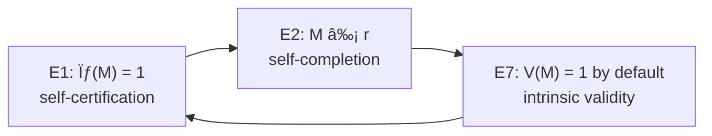

Author: VietVunVut (Viet - Nguyen Xuan); GitHub: https://github.com/AIhugART/; Facebook: https://www.facebook.com/xuanviet

**Ghi chú phiên bản cũ / Legacy note:** File này thuộc đường dẫn cũ `VVV-EQM` và chỉ giữ để tham chiếu lịch sử. Khi làm việc hiện tại phiên bản VVV-QMRF (after 2026-05-14), bắt buộc phải dùng phiên bản mới tại `documents\research_documents\vvv-qmrf\VVV_QMRF_vs_Standard_QM_system_diagram.md`; nếu phát hiện đang dùng file cũ này, phải tự cập nhật hướng làm việc sang phiên bản mới.

# RCA System Diagram: VVV-EQM vs Standard Quantum Measurement

## Vietnamese title

Sơ đồ RCA hệ thống VVV-EQM và hệ thống đo lượng tử chuẩn hiện tại

## Document status

- **Document type:** RCA system diagram / sơ đồ hệ thống RCA
- **Primary frame:** Buddhist Epistemology
- **Mapped domain:** Quantum Measurement
- **Claim level:** Interpretive mapping and formal epistemic model
- **Boundary:** This diagram preserves standard quantum probabilities and state-update rules. It does not claim to replace standard quantum mechanics.

---

# 1. RCA finding

## English

**Symptom:** Diagrams of quantum measurement often compress the physical outcome and the known/validated outcome into one box called "measurement".

**Root cause:** The physical quantum state `ρ` and the registration state `K` are not separated explicitly. This makes it too easy to confuse a physical state transition with a registration-state update.

**Fix:** Draw the systems as two layers:

1. Standard Quantum Measurement keeps the physical layer: `ρ`, `M = {E_o}`, `p_QM(o)`, `o`, and `ρ_after`.
2. VVV-EQM adds the registration-state layer: `K_before → K_after`, formalized as `K_after = U_K(K_before, o)`.

**Verification:** The diagram keeps `p_QM(o) = Tr(E_o ρ)` unchanged. Novelty is placed only in `U_K`, not in the Born rule or physical collapse mechanism.

## Tiếng Việt

**Triệu chứng:** Nhiều sơ đồ phép đo lượng tử gom kết quả vật lý và kết quả đã được biết/xác nhận vào một hộp duy nhất gọi là "measurement".

**Nguyên nhân gốc:** Trạng thái lượng tử vật lý `ρ` và trạng thái ghi nhận `K` chưa được tách rõ. Vì vậy dễ nhầm chuyển đổi vật lý với "registration-state update" / cập nhật trạng thái ghi nhận.

**Cách sửa:** Vẽ hệ thống thành hai tầng:

1. Hệ đo lượng tử chuẩn giữ tầng vật lý: `ρ`, `M = {E_o}`, `p_QM(o)`, `o`, và `ρ_after`.
2. VVV-EQM thêm tầng trạng thái ghi nhận: `K_before → K_after`, hình thức hóa bằng `K_after = U_K(K_before, o)`.

**Kiểm chứng:** Sơ đồ giữ nguyên `p_QM(o) = Tr(E_o ρ)`. Điểm mới chỉ nằm ở `U_K`, không nằm ở "Born rule" hay cơ chế vật lý của "collapse".

---

# 2. Diagram A — Standard Quantum Measurement system

```mermaid
flowchart LR
  subgraph SQM["Standard Quantum Measurement system / Hệ đo lượng tử chuẩn hiện tại"]
    direction LR
    rho0["ρ_before<br/>physical quantum state"]
    setting["M = {E_o}<br/>measurement setting / effects"]
    born["p_QM(o) = Tr(E_o ρ_before)<br/>Born rule"]
    detector["apparatus detector response<br/>physical signal only"]
    outcome["o<br/>outcome / eigenvalue readout"]
    rho1["ρ_after = ρ_o<br/>standard state update"]
    registering["registering system<br/>formal black box"]

    rho0 --> setting --> born --> outcome --> rho1
    setting --> detector --> outcome
    registering -. "registration not formalized as K" .-> outcome
  end
```

## RCA note

Standard Quantum Measurement has a precise physical-probabilistic structure. Its weak point for this project is not the physical mathematics, but the undefined registration side: the registering system is needed in practice but not formalized as a `K`-state.

---

# 3. Diagram B — VVV-EQM two-level measurement interface

```mermaid
flowchart TB
  subgraph VVV["VVV-EQM two-level measurement interface / Giao diện đo hai tầng"]
    direction TB
    input["Input<br/>ρ_before + K_before + M"]

    subgraph physical["Physical layer preserved from Standard QM / Tầng vật lý giữ nguyên QM chuẩn"]
      direction LR
      rho["ρ_before"]
      effects["M = {E_o}"]
      prob["p_QM(o) = Tr(E_o ρ)"]
      response["detector response<br/>physical trace D_o"]
      rhoupdate["ρ_after = ρ_o"]

      rho --> effects --> prob --> response --> rhoupdate
    end

    subgraph epistemic["Registration-state layer K / Tầng cập nhật trạng thái ghi nhận K"]
      direction LR
      k0["K_before"]
      eps["ε(M)<br/>pre-symbolic event"]
      lambda["Λ<br/>symbolization"]
      akara["Ä€<br/>internal encoding"]
      vyava["V_yava<br/>registration lock"]
      k1["K_after = U_K(K_before, o)"]

      k0 --> eps --> lambda --> akara --> vyava --> k1
    end

    input --> rho
    input --> k0
    response --> eps
    lambda --> outcome["o enters K update<br/>outcome becomes registrable"]
    outcome --> k1
  end
```

## RCA note

VVV-EQM does not replace the physical layer. It opens the black box between detector response and validated registration. The key move is to model the K-side update explicitly while leaving standard physical probabilities intact.

---

# 4. Diagram C — VVV-EQM self-validation loop

## RCA note

This loop addresses the regress problem at the registration-validity level. It should not be read as a new physical collapse equation. It says why a registration can be treated as complete and valid inside the VVV-EQM registration model.

---

# 5. Diagram D — Boundary map between the two systems

```mermaid
flowchart LR
  subgraph STD["Standard QM / QM chuẩn"]
    std1["ρ_before"] --> std2["M = {E_o}"] --> std3["p_QM(o)=Tr(E_oρ)"] --> std4["o"] --> std5["ρ_after"]
  end

  subgraph VVVK["VVV-EQM addition / Phần VVV-EQM thêm vào"]
    kbefore["K_before"] --> uk["U_K(K_before,o)"] --> kafter["K_after"]
  end

  std4 --> uk
  std3 -. "preserved unchanged" .-> guard["No Born-rule modification"]
  uk -. "novel contribution" .-> novelty["formalizes registration-state update"]
```

## RCA note

The boundary is the outcome `o`. Standard QM explains how `o` is physically probable and how `ρ` updates. VVV-EQM explains how `o` becomes registered, classified, and validated as `K_after`.

---

# 6. Claim ladder for this diagram

| Level | Allowed claim | Not allowed claim |
|---|---|---|
| Diagram level | VVV-EQM adds a registration-state layer to Standard QM. | VVV-EQM replaces Standard QM. |
| Mathematical level | `K_after = U_K(K_before, o)` can be formalized. | `p_QM(o)` is changed without a new equation. |
| Physical level | Current status is interpretive unless `δ(o) ≠ 0`. | The framework already gives a new experimentally verified physical theory. |
| RCA level | Root cause is the hidden mixing of `ρ` and `K`. | The root cause is that QM mathematics is simply wrong. |

---

# 7. Source traceability

| Source file | Role in this diagram |
|---|---|
| [vvv_qmrf_framework_formal_registration_state_measurement_model.md](research_documents/framework/vvv_qmrf_framework_formal_registration_state_measurement_model.md) | Defines the conservative two-level model: `ρ` transition plus `K` registration-state update. |
| [vvv_qmrf_synthesis_s1_registration_state_update_pipeline.md](research_documents/synthesis/vvv_qmrf_synthesis_s1_registration_state_update_pipeline.md) | Defines the S1 registration pipeline: `ε(M) → Λ → Ā → V_yava`; `Ā` and `V_yava` remain source notation, not physical QM names. |
| [vvv_qmrf_synthesis_s2_self_certifying_registration_loop.md](research_documents/synthesis/vvv_qmrf_synthesis_s2_self_certifying_registration_loop.md) | Defines the S2 loop: E1 self-certification, E2 self-completion, E7 intrinsic validity. |
| [system_qm_full.md](../SYSTEM_Quantum_Measurement/system_qm_full.md) | Provides the Quantum Measurement system nodes and standard measurement concepts. |
| [system_be_full.md](../SYSTEM_Buddhist_Epistemology/system_be_full.md) | Single RCA SOT for Buddhist Epistemology node and edge definitions. |

---

# 8. Final RCA verification

- **Root cause removed:** The diagram explicitly separates `ρ` and `K`.
- **Physical boundary preserved:** Standard QM probability remains `p_QM(o) = Tr(E_o ρ)`.
- **Novelty localized:** VVV-EQM novelty is `U_K`, the registration-state update function.
- **No category error:** The diagram does not claim that Buddhist Epistemology supplies a new physical collapse mechanism.
- **Scope respected:** The diagram stays within Buddhist Epistemology as the primary frame and Quantum Measurement as the mapped domain.

