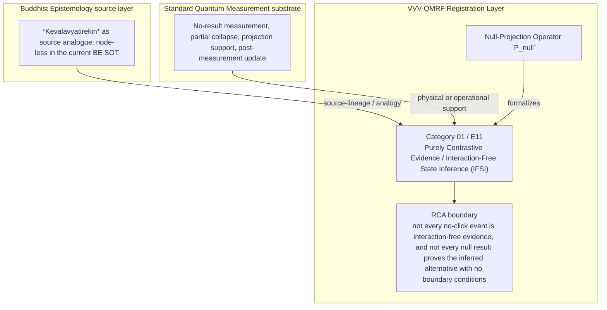

Author: VietVunVut (Viet - Nguyen Xuan); GitHub: https://github.com/AIhugART/; Facebook: https://www.facebook.com/xuanviet

# Formal Registration Category: Contrapositive Quantum Registration Evidence
# Phạm trù Ghi nhận: Bằng chứng Ghi nhận Lượng tử Thuần Loại trừ

**Framework:** VietVunVut Quantum Measurement Registration Framework (VVV-QMRF)
**Document type:** category
**Author:** VietVunVut (Viet - Nguyen Xuan)
**GitHub:** https://github.com/AIhugART/
**Facebook:** https://www.facebook.com/xuanviet
**Date:** 2026-05-11
**Status:** Proposal — Registration class D (Derived, awaiting formal verification)
**Lineage:** gap/ (BIAN-15) → category/ (Category 01) → framework/ (E11)

> **Context / Ngữ cảnh:** This document formally establishes a new registration category for Quantum Mechanics (QM) to resolve structural gap **BIAN-15** identified in the Buddhist Epistemology - Quantum Measurement mapping. BIAN-15 highlights the absence of a formal QM category for evidence established entirely through null results (bounded source analogue: *Kevalavyatirekin* in Buddhist logic).
>
> *Tài liệu này chính thức thiết lập một phạm trù ghi nhận mới cho Cơ học Lượng tử (QM) nhằm giải quyết khoảng trống cấu trúc **BIAN-15** được xác định trong bản đồ đối chiếu Nhận thức luận Phật giáo - Đo lường Lượng tử. BIAN-15 chỉ ra sự thiếu hụt của QM về một phạm trù chính thức dành cho các bằng chứng được thiết lập hoàn toàn thông qua kết quả rỗng (dùng khái niệm Kevalavyatirekin trong logic Phật giáo như một đối chiếu nguồn có giới hạn).*

---

## 1. Category Identity / Định danh Phạm trù

* **English Name:** Purely Contrastive Registration Evidence / Interaction-Free State Inference (IFSI).
* **Vietnamese Name:** Bằng chứng Thuần Loại trừ / Suy luận Trạng thái Phi Tương tác.
* **Buddhist Source Analogue / Đối chiếu nguồn Phật giáo:** *Kevalavyatirekin* (Purely contrastive inferential mark / Dấu hiệu suy luận thuần loại trừ).
* **Proposed Mathematical Symbol / Ký hiệu Toán học đề xuất:** Null-Projection Registration Operator $\hat{P}_{null}$ (Toán tử Chiếu vắng mặt).

---

## 2. Definition / Định nghĩa

**English:**
The acquisition of definite registration status (reaching 100% probability) regarding a quantum state or the presence of an object within an interferometer path *solely* through the absence of a physical interaction event at a designated detector, derived via contrapositive logic from the wave function's superposition structure.

**Vietnamese:**
Là sự thu nhận thông tin xác định (đạt mức xác suất 100%) về trạng thái của một hệ lượng tử hoặc sự hiện diện của hạt vật chất trên một đường đi của giao thoa kế, **không thông qua bất kỳ sự trao đổi năng lượng hay động lượng nào**, mà hoàn toàn thông qua sự **vắng mặt của một sự kiện vật lý** (máy dò không kêu) dựa trên cấu trúc chồng chập (superposition) và suy luận phản chứng (contrapositive logic).

---

## 3. Formal Structure / Cấu trúc Hình thức

**English:**
While a traditional Projective Measurement (PVM) operates on the principle of direct positive correlation ("Signal detected $\rightarrow$ Particle present" — analogous to *Anvaya / Sapaksa*), this category operates entirely on contrapositive logic:
1. **Premise:** If the particle enters path A $\rightarrow$ Detector A will certainly click.
2. **Observation:** Detector A does **not** click (Null event).
3. **Registration Conclusion (Phala):** The particle is definitely in path B. Standard QM supplies the null-measurement state update; VVV-QMRF names the K-side registration conclusion.
4. **Registration-State Mechanism:** The VVV-QMRF novelty is the **registration-state update** produced by excluding a possibility, not a replacement for the standard physical state-update rule.

**Vietnamese:**
Trong khi phép đo lượng tử truyền thống (PVM) hoạt động theo nguyên lý tương quan trực tiếp ("Có tín hiệu $\rightarrow$ Có hạt" — tương tự có giới hạn với *Anvaya / Sapaksa*), phạm trù này hoạt động hoàn toàn theo nguyên lý phản chứng:
1. **Tiền đề:** Nếu hạt đi vào nhánh A $\rightarrow$ Máy dò A chắc chắn sẽ kêu.
2. **Sự kiện quan sát:** Máy dò A **không** kêu (Null event).
3. **Kết luận ghi nhận (Phala):** Hạt chắc chắn nằm ở nhánh B. QM chuẩn cung cấp cập nhật trạng thái do phép đo rỗng; VVV-QMRF gọi tên kết luận ghi nhận phía K.
4. **Cơ chế trạng thái ghi nhận:** Điểm mới của VVV-QMRF là **"registration-state update" / cập nhật trạng thái ghi nhận** khi loại trừ được một khả năng, không phải thay thế quy tắc cập nhật trạng thái vật lý chuẩn.

---

## 4. Foundational Implications / Ý nghĩa Nền tảng

BIAN-15 resolution: Purely Contrastive Evidence / Interaction-Free State Inference (IFSI) supplies the missing registration-layer category for standard QM has null measurement and state update, but no category that makes controlled non-click evidence a registration-authoritative inference class. Formalizing IFSI has three bounded implications:

1. It raises controlled non-click evidence to a registration-layer category rather than treating it as mere absence of data.
2. It keeps `P_null` as framework notation built on ordinary projection and null-measurement support.
3. It requires a negative-control distinction between informative silence and broken-detector silence.

> **Conclusion:** Purely Contrastive Evidence / Interaction-Free State Inference (IFSI) resolves BIAN-15 only as a VVV-QMRF registration-layer category. It preserves the standard QM substrate while adding the missing K-side classification and validity boundary.

---

## 5. RCA Concept Traceability Matrix / Bảng Truy vết RCA Khái niệm

**Purpose / Mục đích:** This table records traceability for the main concepts used in this category. It separates direct SOT evidence, framework-derived proposals, QM-only support, and boundary-sensitive applications so that Purely Contrastive Evidence / Interaction-Free State Inference (IFSI) is not confused with ordinary canonical QM or with an unrestricted Buddhist equivalence.

**RCA labels / Nhãn RCA:**
- **Strong:** direct node/edge or SOT evidence exists.
- **Medium:** structurally supported, but not a direct concept-node equivalence.
- **Derived:** proposed by this category/framework, not a source-system node.
- **QM-only:** supported in QM only, not Buddhist Epistemology.
- **No node:** no dedicated node/edge exists in the current SOT.
- **Overclaim:** wording is stronger than the traceable evidence.
- **External:** external experimental or historical support, not a current SOT node.

| Claim anchor | Concept | Evidence / Bằng chứng truy vết | Node code | Edge code | RCA label | Boundary / Fix note |
|---|---|---|---|---|---|---|
| §1-§2 | BIAN-15 / gap diagnosis | BIAN SOT resolves this gap through Category 01 + E11. | —; support: N_BE_00213, N_BE_00018, N_BE_00253, N_BE_00015 | ED_BE_00110; ED_BE_00116; ED_BE_00057 | Strong / No node | Gap diagnosis is not by itself an empirical proof; it identifies the missing registration category. |
| §1-§2 | Purely Contrastive Evidence / Interaction-Free State Inference (IFSI) | VVV-QM RCA assigns the category support in node_QM_VVV. | N_QM_VVV_00001; N_QM_VVV_00002; N_QM_VVV_00003; support: N_QM_VVV_00004, N_QM_VVV_00005 | — | Derived | Framework category; not a canonical QM postulate unless independently validated. |
| §1 | BE source analogue | *Kevalavyatirekin* as source analogue; node-less in the current BE SOT | —; support: N_BE_00213, N_BE_00018, N_BE_00253, N_BE_00015 | ED_BE_00110; ED_BE_00116; ED_BE_00057 | Medium | Source lineage or analogy; do not collapse BE ontology into QM physics. |
| §2-§3 | QM substrate | No-result measurement, partial collapse, projection support, post-measurement update | N_QM_00033; N_QM_00032; N_QM_00018; N_QM_00022 | ED_QM_00039; ED_QM_00012; ED_QM_00014; ED_QM_00025 | QM-only | Canonical QM supports the physical substrate, not the whole VVV-QMRF category. |
| §3 | Formal symbol / operator | Null-Projection Operator `P_null` | N_QM_VVV_00001; N_QM_VVV_00002; N_QM_VVV_00003; support: N_QM_VVV_00004, N_QM_VVV_00005 | — | Derived | Framework notation; do not cite as a source-system operator. |
| §4 | Category implication | Treat controlled non-click evidence as IFSI only when the counterfactual detector condition is valid and broken-detector silence is ruled out. | N_QM_VVV_00001; N_QM_VVV_00002; N_QM_VVV_00003; support: N_QM_VVV_00004, N_QM_VVV_00005 | — | Medium | Valid only within the stated registration-layer boundary. |
| §4 | Overclaim risk | not every no-click event is interaction-free evidence, and not every null result proves the inferred alternative with no boundary conditions | — | — | Overclaim | Keep wording conditional and registration-layer specific. |

### 5.1. RCA Summary / Tóm tắt RCA

1. **BIAN-15 is a structural gap, not a direct physical discovery.** The gap identifies missing registration architecture.
2. **The BE source is bounded.** *Kevalavyatirekin* as source analogue; node-less in the current BE SOT anchors the analogy or source lineage, but does not automatically become a QM mechanism.
3. **The QM substrate is real but insufficient.** No-result measurement, partial collapse, projection support, post-measurement update provides support, while Purely Contrastive Evidence / Interaction-Free State Inference (IFSI) names the added K-side layer.
4. **The VVV node(s) are derived.** N_QM_VVV_00001; N_QM_VVV_00002; N_QM_VVV_00003; support: N_QM_VVV_00004, N_QM_VVV_00005 belong to the framework proposal and should be labeled as derived unless later validated.
5. **Boundary control is mandatory.** The main overclaim to avoid is: not every no-click event is interaction-free evidence, and not every null result proves the inferred alternative with no boundary conditions.

### 5.2. RCA Five-Step Analysis / Phân tích RCA 5 bước

#### 5.2.1 Define — observed issue / Xác định vấn đề

**Symptom:** The old formulation can make Purely Contrastive Evidence / Interaction-Free State Inference (IFSI) look like either ordinary QM vocabulary or a direct Buddhist-QM equivalence.

**Cause:** The category document did not fully separate BE source support, canonical QM substrate, VVV-QMRF derived formalism, and boundary-sensitive claims.

#### 5.2.2 Trace — 5 Whys / Truy nguyên 5 lần hỏi “vì sao”

1. **Why does the ambiguity appear?** Because the same words describe source analogy, physical measurement support, and framework proposal.
2. **Why is that a schema problem?** Because older category files lacked a complete RCA matrix and assertion-boundary section.
3. **Why can this create overclaim?** Because a derived registration category may be read as a canonical QM postulate or as a literal BE equivalence.
4. **Why is traceability required?** Because each claim needs a node/edge, QM substrate, or explicit `No node` status.
5. **Why does Category 01 exist?** Because BIAN-15 isolates a registration-layer gap: standard QM has null measurement and state update, but no category that makes controlled non-click evidence a registration-authoritative inference class.

#### 5.2.3 Isolate — root cause / Cô lập nguyên nhân gốc

**Root cause:** The document needed explicit schema-level separation between source-system evidence, QM support, VVV-derived notation, and boundary conditions.

#### 5.2.4 Fix — corrected formulation / Sửa đúng nguyên nhân

Use this bounded formulation when precision is required:

```text
Purely Contrastive Evidence / Interaction-Free State Inference (IFSI) = a VVV-QMRF registration-layer category for BIAN-15.
BE source: *Kevalavyatirekin* as source analogue; node-less in the current BE SOT.
QM substrate: No-result measurement, partial collapse, projection support, post-measurement update.
VVV formalism: Null-Projection Operator `P_null` / N_QM_VVV_00001; N_QM_VVV_00002; N_QM_VVV_00003; support: N_QM_VVV_00004, N_QM_VVV_00005.
Boundary: not every no-click event is interaction-free evidence, and not every null result proves the inferred alternative with no boundary conditions.
```

#### 5.2.5 Verify — root cause removed / Kiểm chứng đã loại bỏ nguyên nhân gốc

The ambiguity is removed if every use of Category 01 distinguishes:

```text
BE source analogue = *Kevalavyatirekin* as source analogue; node-less in the current BE SOT.
QM substrate = No-result measurement, partial collapse, projection support, post-measurement update.
VVV-QMRF category = Purely Contrastive Evidence / Interaction-Free State Inference (IFSI).
Formal symbol = Null-Projection Operator `P_null`.
Boundary = not every no-click event is interaction-free evidence, and not every null result proves the inferred alternative with no boundary conditions.
```

### 5.3. Gap Type Classification / Phân loại Loại Khoảng trống

| Gap aspect | Classification | RCA note |
|---|---|---|
| Source gap | **BIAN-15** | Standard qm has null measurement and state update, but no category that makes controlled non-click evidence a registration-authoritative inference class. |
| Gap type | **Contrastive-evidence registration gap** | The missing piece is a registration-category distinction, not merely a prettier sentence. |
| Resolution type | **Category + framework postulate** | Category 01 supplies the detailed category; E11 installs it into VVV-QMRF architecture. |
| Why not only canonical QM? | Canonical QM supports the substrate but not the K-side classification. | Use QM nodes as support, not as proof that the category already exists in standard QM. |
| Boundary | **node-less BE analogue; VVV-QMRF derived category** | Keep labels such as Derived, Medium, No node, or QM-only visible in publication-facing prose. |

### 5.4. Prototype IFSI Instance / Trường hợp Mẫu của IFSI

```text
Prototype IFSI instance:

  Setup: interferometer path A would trigger detector A if occupied.
  Event: detector A does not click under calibrated conditions.
  Gate: broken detector and non-measurement paths are ruled out.
  Update: K-side registration-state update excludes path A and infers the contrastive alternative.
  Contrast: E9-style failed silence is rejected.

  → IFSI instance confirmed only within its boundary.
```

**RCA boundary:** The prototype is valid only when the stated source support, QM substrate, and registration-validity conditions are all kept distinct.

### 5.5. Layer Architecture Position / Vị trí trong Kiến trúc Tầng

```text
gap/BIAN-15
  ↓ diagnoses missing registration structure
category/Category 01 — Purely Contrastive Evidence / Interaction-Free State Inference (IFSI)
  ↓ specifies detailed category and boundary conditions
framework/E11
  ↓ installs the rule into VVV-QMRF postulate architecture
VVV-QMRF registration-state update layer
  ↓ applies the category without replacing canonical QM physics
```

| Layer | Document / component | Role |
|---|---|---|
| Gap | BIAN-15 | Diagnoses the missing registration distinction. |
| Category | Category 01 | Defines the detailed registration category. |
| Framework | E11 | Promotes the category into postulate-level architecture. |
| BE source | *Kevalavyatirekin* as source analogue; node-less in the current BE SOT | Supplies source-lineage or analogy under RCA boundary. |
| QM substrate | No-result measurement, partial collapse, projection support, post-measurement update | Supplies physical or operational support only. |

---

## 6. Assertion Level / Mức Khẳng định

| Component EN | Thành phần VN | RCA assertion class | Evidence / Boundary |
|---|---|---|---|
| BE source supports the category lineage | Nguồn BE hỗ trợ dòng nguồn của phạm trù | **M** — source-supported | —; support: N_BE_00213, N_BE_00018, N_BE_00253, N_BE_00015; ED_BE_00110; ED_BE_00116; ED_BE_00057. |
| QM provides the physical substrate | QM cung cấp nền vật lý | **M / QM-only** | N_QM_00033; N_QM_00032; N_QM_00018; N_QM_00022; ED_QM_00039; ED_QM_00012; ED_QM_00014; ED_QM_00025. |
| Purely Contrastive Evidence / Interaction-Free State Inference (IFSI) is a VVV-QMRF category | Bằng chứng Thuần Loại trừ / Suy luận Trạng thái Phi Tương tác là phạm trù VVV-QMRF | **D** — framework-derived | N_QM_VVV_00001; N_QM_VVV_00002; N_QM_VVV_00003; support: N_QM_VVV_00004, N_QM_VVV_00005; E11. |
| Null-Projection Operator `P_null` formalizes the category | Null-Projection Operator `P_null` hình thức hóa phạm trù | **D** — notation-derived | Framework notation, not a canonical source-system operator. |
| The category resolves BIAN-15 | Phạm trù giải quyết BIAN-15 | **D / M** — bounded resolution | Resolution holds at registration-layer architecture level. |
| Boundary-free reading of the category | Cách đọc không ranh giới về phạm trù | **O** — overclaim | not every no-click event is interaction-free evidence, and not every null result proves the inferred alternative with no boundary conditions. |

**Summary / Tóm tắt:** The category is traceable as a VVV-QMRF registration-layer proposal. Its BE source and QM substrate support the architecture, but neither should be overstated as a direct one-to-one physical equivalence.

---

## 7. What Category 01 / E11 Does NOT Claim / Những gì Category 01 / E11 KHÔNG tuyên bố

1. **Not a canonical QM replacement** — Purely Contrastive Evidence / Interaction-Free State Inference (IFSI) is a VVV-QMRF registration-layer proposal built beside standard QM support.
   *Không thay thế QM chuẩn; đây là tầng ghi nhận VVV-QMRF đặt bên cạnh nền vật lý QM.*

2. **Not unrestricted equivalence with the BE source** — *Kevalavyatirekin* as source analogue; node-less in the current BE SOT supplies source-lineage or analogy only within the stated boundary.
   *Không đồng nhất vô điều kiện với nguồn BE; nguồn BE chỉ làm mô hình nguồn hoặc phép tương tự có ranh giới.*

3. **Not boundary-free application** — not every no-click event is interaction-free evidence, and not every null result proves the inferred alternative with no boundary conditions.
   *Không áp dụng tự do ngoài điều kiện hợp lệ đã nêu.*

4. **Not a detector-engineering shortcut** — validity still depends on calibration, context, and the relevant E10-style gate where applicable.
   *Không bỏ qua hiệu chuẩn, bối cảnh, hoặc cổng hợp lệ kiểu E10 khi cần.*

5. **Not an empirical proof of a new physical mechanism** — the category remains derived unless formal predictions and tests are supplied.
   *Chưa phải bằng chứng thực nghiệm cho cơ chế vật lý mới nếu chưa có dự đoán và kiểm nghiệm.*

6. **Not human-consciousness dependence** — registration-state update is a K-side framework term broader than human cognition.
   *Không phụ thuộc ý thức con người; cập nhật trạng thái ghi nhận là thuật ngữ tầng K rộng hơn cognition của người.*

---

## 8. Vietnamese Explanation / Giải thích tiếng Việt rõ ràng

Nói đơn giản, Category 01 / E11 xử lý câu hỏi:

```text
Trong trường hợp này, cái gì thật sự được ghi nhận ở tầng K,
và điều kiện nào làm cho ghi nhận đó hợp lệ?
```

Câu trả lời của VVV-QMRF là:

```text
Nếu máy đáng lẽ phải kêu khi hạt đi qua nhánh A, nhưng máy không kêu trong điều kiện hợp lệ, thì sự im lặng đó có thể là bằng chứng loại trừ. Đây là `IFSI`, không phải mọi im lặng của detector.
```

Ranh giới cần nhớ:

```text
BE source không tự động trở thành cơ chế vật lý QM.
QM substrate không tự động chứa toàn bộ category VVV-QMRF.
VVV-QMRF thêm tầng registration-state update / cập nhật trạng thái ghi nhận.
Nếu thiếu điều kiện hợp lệ, claim phải bị hạ xuống Medium, Derived, No node, hoặc Overclaim.
```

---

## 9. Mermaid Diagram Map / Sơ đồ Mermaid

### 9.1 Local Arrow Semantics / Quy ước mũi tên local

This table explains only the arrows used in this diagram. It follows the broader Arrow Semantics rule in `documents/research_documents/vvv-qmrf/schema_guide.md`.

Bảng này chỉ giải thích các mũi tên dùng trong sơ đồ này. Nó tuân theo quy tắc Arrow Semantics rộng hơn trong `documents/research_documents/vvv-qmrf/schema_guide.md`.

| Diagram arrow label | Local meaning | Must not imply |
|---|---|---|
| `source-lineage / analogy` | The Buddhist Epistemology source supplies bounded source lineage or structural analogy for the VVV-QMRF registration category. | Direct identity between Buddhist ontology and Quantum Mechanics. |
| `physical or operational support` | Standard Quantum Mechanics supplies the physical or operational substrate that the registration category analyzes. | Replacement or modification of Standard Quantum Mechanics probability or state-update rules. |
| `formalizes` | The proposed VVV-QMRF notation formalizes the registration-layer category. | A canonical Quantum Mechanics operator or experimentally validated physical mechanism by itself. |
| Unlabeled category-to-boundary arrow | The category must be read under its RCA boundary. | Boundary-free application outside the stated registration conditions. |



---

*Source: BIAN_index_SOT.md (BIAN-15), system_be_full.md (Trairūpya/Vipakṣe asattvam, Anupalabdhi, Apoha support), SYSTEM_Quantum_Measurement/system_qm_full.md, node_QM_VVV.md (N_QM_VVV_00001-00003), framework/E11_interaction_free_state_inference_postulate.md*

---

## Schema Validation Checklist / Checklist Kiểm chứng Schema

| Check | Status | RCA note |
|---|---|---|
| Document type declared | Pass | Declared as `category` for schema alignment. |
| Source traceability | Pass | Existing source/cross-reference sections provide the trace base. |
| Claim traceability | Pass | Existing assertion/claim sections classify the major claims. |
| Boundary / non-claim guardrail | Pass | Existing boundary/non-claim text limits overclaiming. |
| Validation rule | Pass | Reuse only with source, claim type, and boundary preserved; unresolved items must be marked `TODO(HOTFIX)` before publication use. |
