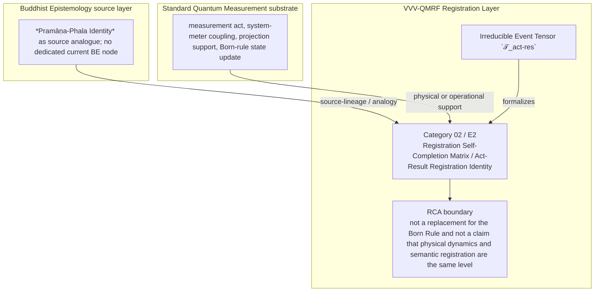

Author: VietVunVut (Viet - Nguyen Xuan); GitHub: https://github.com/AIhugART/; Facebook: https://www.facebook.com/xuanviet

# Formal Registration Category: Registration Self-Completion Matrix (BE source: Pramāṇa-Phala Identity)
# Phạm trù Ghi nhận: Sự Tự hoàn tất Ghi nhận (Nguồn BE: Đồng nhất giữa Nhận thức và Kết quả)

**Framework:** VietVunVut Quantum Measurement Registration Framework (VVV-QMRF)
**Author:** VietVunVut (Viet - Nguyen Xuan)
**GitHub:** https://github.com/AIhugART/
**Facebook:** https://www.facebook.com/xuanviet
**Date:** 2026-05-11
**Status:** Proposal — Registration class D (Derived, awaiting formal verification)
**Lineage:** gap/ (BIAN-16) → category/ (Category 02) → framework/ (E2)

> **Context / Ngữ cảnh:** This document formally establishes a new registration category for Quantum Mechanics (QM) to resolve structural gap **BIAN-16** identified in the Buddhist Epistemology - Quantum Measurement mapping. BIAN-16 highlights QM's failure to formally unite the physical detector response with the resulting registration outcome into a single irreducible event (equivalent to the *Pramāṇa-Phala identity* in Buddhist logic).
>
> *Tài liệu này chính thức thiết lập một phạm trù ghi nhận mới cho Cơ học Lượng tử (QM) nhằm giải quyết khoảng trống cấu trúc **BIAN-16** được xác định trong bản đồ đối chiếu Nhận thức luận Phật giáo - Đo lường Lượng tử. BIAN-16 chỉ ra sự thất bại của QM trong việc hợp nhất detector response vật lý và kết quả ghi nhận thành một biến cố duy nhất không thể chia cắt (tương đương với sự đồng nhất Pramāṇa-Phala trong logic Phật giáo).*

---

## 1. Category Identity / Định danh Phạm trù

* **English Name:** Registration Self-Completion Matrix / Act-Result Registration Identity.
* **Vietnamese Name:** Ma trận Tự hoàn tất Ghi nhận / Sự đồng nhất Hành động - Kết quả Ghi nhận.
* **Buddhist Framework Equivalent / Tương đương trong Hệ thống Phật giáo:** *Pramāṇa-Phala Identity* (Cognition is its own result / Nhận thức chính là Kết quả).
* **Proposed Mathematical Symbol / Ký hiệu Toán học đề xuất:** Irreducible Event Tensor / Tensor Biến cố Bất khả phân $\mathcal{T}_{act-res}$.

---

## 2. Definition / Định nghĩa

**English:**
A formal structural principle stating that the detector response and the resulting K-side registration-state update are structurally inseparable within the registration layer. It denies a registration-layer gap between the physical detector response and the registered result, without redefining the standard physical collapse law.

**Vietnamese:**
Là một nguyên lý cấu trúc chính thức khẳng định rằng detector response và cập nhật trạng thái ghi nhận phía K phát sinh từ nó là không thể tách rời trong lớp ghi nhận. Nó phủ nhận khoảng trống ở tầng ghi nhận giữa detector response vật lý và kết quả đã ghi nhận, nhưng không định nghĩa lại luật sụp đổ vật lý chuẩn.

---

## 3. Formal Structure / Cấu trúc Hình thức

**English:**
Standard QM describes physical interaction and outcome probabilities through its existing formalism. Under this VVV-QMRF category, the registration act and registered result are modeled as one K-side closure:
1. **Act = Result:** The operator representing the registration process ($\hat{M}$) is mathematically paired with the Projection Operator - registration of the outcome ($\hat{P}_i$).
2. **Elimination of the Secondary Step:** At the registration layer, a valid detector response and its locked result form one closure event. There is no intermediate K-state where the measurement has occurred but the registered result has not yet crystallized.
3. **The Act-Result Tensor:** This is formalized as a tensor $\mathcal{T}_{act-res}$ where the process matrix and the outcome vector are inseparable within the registration-layer model.

**Vietnamese:**
Hiện tại, QM mô tả tương tác vật lý (tiến hóa Schrödinger) và sau đó áp đặt riêng biệt Quy tắc Born để ra kết quả. Hành động và Kết quả bị tách rời. Với phạm trù mới này:
1. **Hành động = Kết quả:** Toán tử đại diện cho quá trình đo lường ($\hat{M}$) được hợp nhất toán học với Projection Operator - registration của kết quả ($\hat{P}_i$).
2. **Loại bỏ Bước trung gian:** Ở tầng ghi nhận, detector response hợp lệ và kết quả đã khóa tạo thành một biến cố đóng duy nhất. Không tồn tại một trạng thái lấp lửng nào mà phép đo đã xảy ra nhưng kết quả chưa kết tinh.
3. **Tensor Bất khả phân:** Điều này được hình thức hóa thành một tensor $\mathcal{T}_{act-res}$ nơi ma trận tiến trình và vector kết quả không thể bị tách rời.

---

## 4. Foundational Implications / Ý nghĩa Nền tảng

BIAN-16 resolution: Registration Self-Completion Matrix / Act-Result Registration Identity supplies the missing registration-layer category for canonical QM supplies the physical detector response and state update, but does not name the K-side closure that unites the valid act with its registered result. Formalizing RSCM has three bounded implications:

1. It closes the K-side gap between detector response and registered result.
2. It treats the act-result tensor as notation for registration inseparability, not a new canonical tensor in standard QM.
3. It preserves the distinction between physical state update and registration-state update.

> **Conclusion:** Registration Self-Completion Matrix / Act-Result Registration Identity resolves BIAN-16 only as a VVV-QMRF registration-layer category. It preserves the standard QM substrate while adding the missing K-side classification and validity boundary.

---

## 5. RCA Concept Traceability Matrix / Bảng Truy vết RCA Khái niệm

**Purpose / Mục đích:** This table records traceability for the main concepts used in this category. It separates direct SOT evidence, framework-derived proposals, QM-only support, and boundary-sensitive applications so that Registration Self-Completion Matrix / Act-Result Registration Identity is not confused with ordinary canonical QM or with an unrestricted Buddhist equivalence.

**RCA labels / Nhãn RCA:**
- **Strong:** direct node/edge or SOT evidence exists.
- **Medium:** structurally supported, but not a direct concept-node equivalence.
- **Derived:** proposed by this category/framework, not a source-system node.
- **QM-only:** supported in QM only, not Buddhist Epistemology.
- **No node:** no dedicated node/edge exists in the current SOT.
- **Overclaim:** wording is stronger than the traceable evidence.
- **External:** external experimental or historical support, not a current SOT node.

| Claim anchor | Concept | Evidence / Bằng chứng truy vết | Node code | Edge code | RCA label | Boundary / Fix note |
|---|---|---|---|---|---|---|
| §1-§2 | BIAN-16 / gap diagnosis | BIAN SOT resolves this gap through Category 02 + E2. | —; support: N_BE_00001 | ED_BE_00001-ED_BE_00004 | Strong / No node | Gap diagnosis is not by itself an empirical proof; it identifies the missing registration category. |
| §1-§2 | Registration Self-Completion Matrix / Act-Result Registration Identity | VVV-QM RCA assigns the category support in node_QM_VVV. | N_QM_VVV_00027; N_QM_VVV_00028 | — | Derived | Framework category; not a canonical QM postulate unless independently validated. |
| §1 | BE source analogue | *Pramāṇa-Phala Identity* as source analogue; no dedicated current BE node | —; support: N_BE_00001 | ED_BE_00001-ED_BE_00004 | Medium | Source lineage or analogy; do not collapse BE ontology into QM physics. |
| §2-§3 | QM substrate | measurement act, system-meter coupling, projection support, Born-rule state update | N_QM_00019; N_QM_00021; N_QM_00018; N_QM_00022; N_QM_00016 | ED_QM_00017-ED_QM_00025 | QM-only | Canonical QM supports the physical substrate, not the whole VVV-QMRF category. |
| §3 | Formal symbol / operator | Irreducible Event Tensor `𝒯_act-res` | N_QM_VVV_00027; N_QM_VVV_00028 | — | Derived | Framework notation; do not cite as a source-system operator. |
| §4 | Category implication | Model valid detector response and registered result as one registration-layer closure without replacing Born probabilities or physical collapse rules. | N_QM_VVV_00027; N_QM_VVV_00028 | — | Medium | Valid only within the stated registration-layer boundary. |
| §4 | Overclaim risk | not a replacement for the Born Rule and not a claim that physical dynamics and semantic registration are the same level | — | — | Overclaim | Keep wording conditional and registration-layer specific. |

### 5.1. RCA Summary / Tóm tắt RCA

1. **BIAN-16 is a structural gap, not a direct physical discovery.** The gap identifies missing registration architecture.
2. **The BE source is bounded.** *Pramāṇa-Phala Identity* as source analogue; no dedicated current BE node anchors the analogy or source lineage, but does not automatically become a QM mechanism.
3. **The QM substrate is real but insufficient.** measurement act, system-meter coupling, projection support, Born-rule state update provides support, while Registration Self-Completion Matrix / Act-Result Registration Identity names the added K-side layer.
4. **The VVV node(s) are derived.** N_QM_VVV_00027; N_QM_VVV_00028 belong to the framework proposal and should be labeled as derived unless later validated.
5. **Boundary control is mandatory.** The main overclaim to avoid is: not a replacement for the Born Rule and not a claim that physical dynamics and semantic registration are the same level.

### 5.2. RCA Five-Step Analysis / Phân tích RCA 5 bước

#### 5.2.1 Define — observed issue / Xác định vấn đề

**Symptom:** The old formulation can make Registration Self-Completion Matrix / Act-Result Registration Identity look like either ordinary QM vocabulary or a direct Buddhist-QM equivalence.

**Cause:** The category document did not fully separate BE source support, canonical QM substrate, VVV-QMRF derived formalism, and boundary-sensitive claims.

#### 5.2.2 Trace — 5 Whys / Truy nguyên 5 lần hỏi “vì sao”

1. **Why does the ambiguity appear?** Because the same words describe source analogy, physical measurement support, and framework proposal.
2. **Why is that a schema problem?** Because older category files lacked a complete RCA matrix and assertion-boundary section.
3. **Why can this create overclaim?** Because a derived registration category may be read as a canonical QM postulate or as a literal BE equivalence.
4. **Why is traceability required?** Because each claim needs a node/edge, QM substrate, or explicit `No node` status.
5. **Why does Category 02 exist?** Because BIAN-16 isolates a registration-layer gap: canonical QM supplies the physical detector response and state update, but does not name the K-side closure that unites the valid act with its registered result.

#### 5.2.3 Isolate — root cause / Cô lập nguyên nhân gốc

**Root cause:** The document needed explicit schema-level separation between source-system evidence, QM support, VVV-derived notation, and boundary conditions.

#### 5.2.4 Fix — corrected formulation / Sửa đúng nguyên nhân

Use this bounded formulation when precision is required:

```text
Registration Self-Completion Matrix / Act-Result Registration Identity = a VVV-QMRF registration-layer category for BIAN-16.
BE source: *Pramāṇa-Phala Identity* as source analogue; no dedicated current BE node.
QM substrate: measurement act, system-meter coupling, projection support, Born-rule state update.
VVV formalism: Irreducible Event Tensor `𝒯_act-res` / N_QM_VVV_00027; N_QM_VVV_00028.
Boundary: not a replacement for the Born Rule and not a claim that physical dynamics and semantic registration are the same level.
```

#### 5.2.5 Verify — root cause removed / Kiểm chứng đã loại bỏ nguyên nhân gốc

The ambiguity is removed if every use of Category 02 distinguishes:

```text
BE source analogue = *Pramāṇa-Phala Identity* as source analogue; no dedicated current BE node.
QM substrate = measurement act, system-meter coupling, projection support, Born-rule state update.
VVV-QMRF category = Registration Self-Completion Matrix / Act-Result Registration Identity.
Formal symbol = Irreducible Event Tensor `𝒯_act-res`.
Boundary = not a replacement for the Born Rule and not a claim that physical dynamics and semantic registration are the same level.
```

### 5.3. Gap Type Classification / Phân loại Loại Khoảng trống

| Gap aspect | Classification | RCA note |
|---|---|---|
| Source gap | **BIAN-16** | Canonical qm supplies the physical detector response and state update, but does not name the k-side closure that unites the valid act with its registered result. |
| Gap type | **Act-result registration closure gap** | The missing piece is a registration-category distinction, not merely a prettier sentence. |
| Resolution type | **Category + framework postulate** | Category 02 supplies the detailed category; E2 installs it into VVV-QMRF architecture. |
| Why not only canonical QM? | Canonical QM supports the substrate but not the K-side classification. | Use QM nodes as support, not as proof that the category already exists in standard QM. |
| Boundary | **framework-derived act-result closure category** | Keep labels such as Derived, Medium, No node, or QM-only visible in publication-facing prose. |

### 5.4. Prototype RSCM Instance / Trường hợp Mẫu của RSCM

```text
Prototype RSCM instance:

  Setup: detector response is valid under the measurement context.
  Event: the physical measurement produces a determinate detector response.
  Gate: no second meta-registering system is required for first K-side closure.
  Update: the result closes as registered status in the same act-result matrix.
  Contrast: later audit may verify, but does not create the first closure.

  → RSCM instance confirmed only within its boundary.
```

**RCA boundary:** The prototype is valid only when the stated source support, QM substrate, and registration-validity conditions are all kept distinct.

### 5.5. Layer Architecture Position / Vị trí trong Kiến trúc Tầng

```text
gap/BIAN-16
  ↓ diagnoses missing registration structure
category/Category 02 — Registration Self-Completion Matrix / Act-Result Registration Identity
  ↓ specifies detailed category and boundary conditions
framework/E2
  ↓ installs the rule into VVV-QMRF postulate architecture
VVV-QMRF registration-state update layer
  ↓ applies the category without replacing canonical QM physics
```

| Layer | Document / component | Role |
|---|---|---|
| Gap | BIAN-16 | Diagnoses the missing registration distinction. |
| Category | Category 02 | Defines the detailed registration category. |
| Framework | E2 | Promotes the category into postulate-level architecture. |
| BE source | *Pramāṇa-Phala Identity* as source analogue; no dedicated current BE node | Supplies source-lineage or analogy under RCA boundary. |
| QM substrate | measurement act, system-meter coupling, projection support, Born-rule state update | Supplies physical or operational support only. |

---

## 6. Assertion Level / Mức Khẳng định

| Component EN | Thành phần VN | Epistemic class | Evidence / Boundary |
|---|---|---|---|
| BE source supports the category lineage | Nguồn BE hỗ trợ dòng nguồn của phạm trù | **M** — source-supported | —; support: N_BE_00001; ED_BE_00001-ED_BE_00004. |
| QM provides the physical substrate | QM cung cấp nền vật lý | **M / QM-only** | N_QM_00019; N_QM_00021; N_QM_00018; N_QM_00022; N_QM_00016; ED_QM_00017-ED_QM_00025. |
| Registration Self-Completion Matrix / Act-Result Registration Identity is a VVV-QMRF category | Ma trận Tự hoàn tất Ghi nhận / Sự đồng nhất Hành động - Kết quả Ghi nhận là phạm trù VVV-QMRF | **D** — framework-derived | N_QM_VVV_00027; N_QM_VVV_00028; E2. |
| Irreducible Event Tensor `𝒯_act-res` formalizes the category | Irreducible Event Tensor `𝒯_act-res` hình thức hóa phạm trù | **D** — notation-derived | Framework notation, not a canonical source-system operator. |
| The category resolves BIAN-16 | Phạm trù giải quyết BIAN-16 | **D / M** — bounded resolution | Resolution holds at registration-layer architecture level. |
| Boundary-free reading of the category | Cách đọc không ranh giới về phạm trù | **O** — overclaim | not a replacement for the Born Rule and not a claim that physical dynamics and semantic registration are the same level. |

**Summary / Tóm tắt:** The category is traceable as a VVV-QMRF registration-layer proposal. Its BE source and QM substrate support the architecture, but neither should be overstated as a direct one-to-one physical equivalence.

---

## 7. What Category 02 / E2 Does NOT Claim / Những gì Category 02 / E2 KHÔNG tuyên bố

1. **Not a canonical QM replacement** — Registration Self-Completion Matrix / Act-Result Registration Identity is a VVV-QMRF registration-layer proposal built beside standard QM support.
   *Không thay thế QM chuẩn; đây là tầng ghi nhận VVV-QMRF đặt bên cạnh nền vật lý QM.*

2. **Not unrestricted equivalence with the BE source** — *Pramāṇa-Phala Identity* as source analogue; no dedicated current BE node supplies source-lineage or analogy only within the stated boundary.
   *Không đồng nhất vô điều kiện với nguồn BE; nguồn BE chỉ làm mô hình nguồn hoặc phép tương tự có ranh giới.*

3. **Not boundary-free application** — not a replacement for the Born Rule and not a claim that physical dynamics and semantic registration are the same level.
   *Không áp dụng tự do ngoài điều kiện hợp lệ đã nêu.*

4. **Not a detector-engineering shortcut** — validity still depends on calibration, context, and the relevant E10-style gate where applicable.
   *Không bỏ qua hiệu chuẩn, bối cảnh, hoặc cổng hợp lệ kiểu E10 khi cần.*

5. **Not an empirical proof of a new physical mechanism** — the category remains derived unless formal predictions and tests are supplied.
   *Chưa phải bằng chứng thực nghiệm cho cơ chế vật lý mới nếu chưa có dự đoán và kiểm nghiệm.*

6. **Not human-consciousness dependence** — registration-state update is a K-side framework term broader than human cognition.
   *Không phụ thuộc ý thức con người; cập nhật trạng thái ghi nhận là thuật ngữ tầng K rộng hơn cognition của người.*

---

## 8. Vietnamese Explanation / Giải thích tiếng Việt rõ ràng

Nói đơn giản, Category 02 / E2 xử lý câu hỏi:

```text
Trong trường hợp này, cái gì thật sự được ghi nhận ở tầng K,
và điều kiện nào làm cho ghi nhận đó hợp lệ?
```

Câu trả lời của VVV-QMRF là:

```text
Khi phép đo hợp lệ xảy ra, tầng ghi nhận không cần thêm một máy thứ hai để hỏi `kết quả này đã được ghi nhận chưa?`. Category 02 nói rằng hành động ghi nhận và kết quả ghi nhận đóng lại cùng nhau ở tầng K.
```

Ranh giới cần nhớ:

```text
BE source không tự động trở thành cơ chế vật lý QM.
QM substrate không tự động chứa toàn bộ category VVV-QMRF.
VVV-QMRF thêm tầng registration-state update / cập nhật trạng thái ghi nhận.
Nếu thiếu điều kiện hợp lệ, claim phải bị hạ xuống Medium, Derived, No node, hoặc Overclaim.
```

---

## 9. Mermaid Diagram Map / Sơ đồ Mermaid



---

*Source: BIAN_index_SOT.md (BIAN-16), system_be_full.md (Pramāṇa support), SYSTEM_Quantum_Measurement/system_qm_full.md, node_QM_VVV.md (N_QM_VVV_00027-00028), framework/vvv_qmrf_framework_e02_registration_self_completion_postulate.md*
