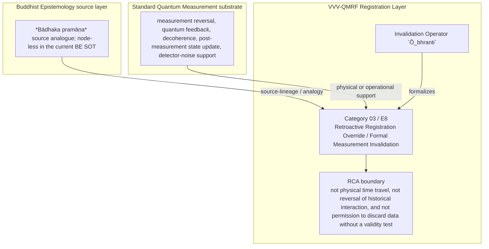

Author: VietVunVut (Viet - Nguyen Xuan); GitHub: https://github.com/AIhugART/; Facebook: https://www.facebook.com/xuanviet

# Formal Registration Category: Retroactive Registration Override
# Phạm trù Ghi nhận: Sự Phủ quyết Ghi nhận Hồi tố

**Framework:** VietVunVut Quantum Measurement Registration Framework (VVV-QMRF)
**Author:** VietVunVut (Viet - Nguyen Xuan)
**GitHub:** https://github.com/AIhugART/
**Facebook:** https://www.facebook.com/xuanviet
**Date:** 2026-05-11
**Status:** Proposal — Registration class D (Derived, awaiting formal verification)
**Lineage:** gap/ (BIAN-12) → category/ (Category 03) → framework/ (E8)

> **Context / Ngữ cảnh:** This document formally establishes a new registration category for Quantum Mechanics (QM) to resolve structural gap **BIAN-12** identified in the Buddhist Epistemology - Quantum Measurement mapping. BIAN-12 highlights the absence of a formal QM mechanism by which a subsequent measurement can invalidate the registration status assigned to a prior detector response (equivalent to *Bādhaka pramāṇa* in Buddhist logic).
>
> *Tài liệu này chính thức thiết lập một phạm trù ghi nhận mới cho Cơ học Lượng tử (QM) nhằm giải quyết khoảng trống cấu trúc **BIAN-12** được xác định trong bản đồ đối chiếu Nhận thức luận Phật giáo - Đo lường Lượng tử. BIAN-12 chỉ ra sự thiếu hụt của QM về một cơ chế chính thức cho phép một phép đo sau vô hiệu hóa trạng thái ghi nhận của một detector response trước đó (tương đương với khái niệm Bādhaka pramāṇa trong logic Phật giáo).*

---

## 1. Category Identity / Định danh Phạm trù

* **English Name:** Retroactive Registration Override (REO) / Formal Measurement Invalidation.
* **Vietnamese Name:** Sự Phủ quyết Ghi nhận Hồi tố / Hủy bỏ Phép đo Chính thức.
* **Buddhist Framework Equivalent / Tương đương trong Hệ thống Phật giáo:** *Bādhaka pramāṇa* (Invalidating registration / Cơ chế phủ quyết ghi nhận).
* **Proposed Mathematical Symbol / Ký hiệu Toán học đề xuất:** Invalidation Operator / Toán tử Phủ quyết $\hat{O}_{bhranti}$ (from *bhrānti* = error).

---

## 2. Definition / Định nghĩa

**English:**
A formal mechanism operating from within the quantum theoretical system, enabling a subsequent measurement event with stronger registration validity ($M_2$) to automatically cancel the registration validity and registration-state update effect of a prior measurement event ($M_1$), demoting $M_1$ to the status of a "local noise/illusion" (*bhrānti*) rather than a valid registration-state update.

**Vietnamese:**
Là một cơ chế chính thức nằm bên trong hệ thống lý thuyết lượng tử, cho phép một phép đo sau ($M_2$) có độ tin cậy ghi nhận cao hơn tự động **hủy bỏ registration validity và hiệu ứng cập nhật trạng thái ghi nhận** của một phép đo trước đó ($M_1$), đồng thời giáng cấp phép đo $M_1$ thành một "ảo ảnh/nhiễu loạn cục bộ" (*bhrānti*) thay vì một cập nhật trạng thái ghi nhận hợp lệ.

---

## 3. Formal Structure / Cấu trúc Hình thức

**English:**
Standard QM describes detector responses and state updates; it does not by itself assign VVV-QMRF registration validity to every detector response. Under this category, VVV-QMRF adds a K-side invalidation rule:
1. **Event 1 ($M_1$):** Measures state $|\lambda_1\rangle$. The system is (temporarily) considered collapsed into $|\lambda_1\rangle$.
2. **Event 2 ($M_2$):** A second measurement (often on an entangled particle or a conserved quantity) yields outcome $|\lambda_2\rangle$.
3. **Contradiction Detection:** The formal consistency check shows that $\langle\lambda_2|\lambda_1\rangle = 0$ (or that the relevant projectors have zero overlap) under the stated model. This is an orthogonality condition, not a dynamical transition claim. (Meaning: if the true state was actually $|\lambda_1\rangle$, then $M_2$ yielding $|\lambda_2\rangle$ is ruled out by that model).
4. **Registration Override:** The operator $\hat{O}_{bhranti}$ is triggered. VVV-QMRF classifies the result of $M_1$ as registration-invalid. The registration state is **retroactively corrected** as if $M_1$ never functioned as a valid registration event.

**Vietnamese:**
QM tiêu chuẩn mô tả detector response và cập nhật trạng thái; tự thân nó chưa gán tính hợp lệ ghi nhận VVV-QMRF cho mọi detector response. Với phạm trù này, VVV-QMRF thêm một quy tắc vô hiệu hóa phía K:
1. **Sự kiện 1 ($M_1$):** Đo được trạng thái $|\lambda_1\rangle$. Hệ thống được (tạm thời) coi là đã sụp đổ về $|\lambda_1\rangle$.
2. **Sự kiện 2 ($M_2$):** Một phép đo thứ hai (thường thực hiện trên một hạt vướng víu hoặc một đại lượng bảo toàn) thu được kết quả $|\lambda_2\rangle$.
3. **Phát hiện Mâu thuẫn:** Kiểm tra hình thức cho thấy $\langle\lambda_2|\lambda_1\rangle = 0$ (hoặc các projector liên quan không có overlap) trong mô hình đang xét. Đây là điều kiện orthogonality, không phải khẳng định về một quá trình chuyển động lực học. (Nghĩa là: nếu hệ thực sự ở $|\lambda_1\rangle$, thì $M_2$ không thể cho ra $|\lambda_2\rangle$ trong mô hình đó).
4. **Cơ chế Phủ quyết Ghi nhận:** Toán tử $\hat{O}_{bhranti}$ được kích hoạt. VVV-QMRF phân loại kết quả của $M_1$ là vô hiệu ở tầng ghi nhận. Trạng thái ghi nhận được **chỉnh sửa hồi tố (retroactively corrected)** như thể $M_1$ chưa từng đóng vai trò là một sự kiện ghi nhận hợp lệ.

---

## 4. Foundational Implications / Ý nghĩa Nền tảng

BIAN-12 resolution: Retroactive Registration Override / Formal Measurement Invalidation supplies the missing registration-layer category for standard QM and experimental practice can reject bad data, but the registration-layer status of a prior detector response is not formally demoted inside the measurement category. Formalizing REO has three bounded implications:

1. It formalizes K-side invalidation rather than physical time reversal.
2. It separates detector artifact from valid measurement result.
3. It links the error status to VVV-QMRF registration hierarchy instead of ad hoc prose.

> **Conclusion:** Retroactive Registration Override / Formal Measurement Invalidation resolves BIAN-12 only as a VVV-QMRF registration-layer category. It preserves the standard QM substrate while adding the missing K-side classification and validity boundary.

---

## 5. RCA Concept Traceability Matrix / Bảng Truy vết RCA Khái niệm

**Purpose / Mục đích:** This table records traceability for the main concepts used in this category. It separates direct SOT evidence, framework-derived proposals, QM-only support, and boundary-sensitive applications so that Retroactive Registration Override / Formal Measurement Invalidation is not confused with ordinary canonical QM or with an unrestricted Buddhist equivalence.

**RCA labels / Nhãn RCA:**
- **Strong:** direct node/edge or SOT evidence exists.
- **Medium:** structurally supported, but not a direct concept-node equivalence.
- **Derived:** proposed by this category/framework, not a source-system node.
- **QM-only:** supported in QM only, not Buddhist Epistemology.
- **No node:** no dedicated node/edge exists in the current SOT.
- **Overclaim:** wording is stronger than the traceable evidence.
- **External:** external experimental or historical support, not a current SOT node.

| Claim anchor | Concept | Evidence / Bằng chứng truy vết | Node code | Edge code | RCA label | Boundary / Fix note |
|---|---|---|---|---|---|---|
| §1-§2 | BIAN-12 / gap diagnosis | BIAN SOT resolves this gap through Category 03 + E8. | —; support: N_BE_00006, N_BE_00001 | — | Strong / No node | Gap diagnosis is not by itself an empirical proof; it identifies the missing registration category. |
| §1-§2 | Retroactive Registration Override / Formal Measurement Invalidation | VVV-QM RCA assigns the category support in node_QM_VVV. | N_QM_VVV_00029; N_QM_VVV_00030; N_QM_VVV_00031; N_QM_VVV_00032 | — | Derived | Framework category; not a canonical QM postulate unless independently validated. |
| §1 | BE source analogue | *Bādhaka pramāṇa* source analogue; node-less in the current BE SOT | —; support: N_BE_00006, N_BE_00001 | — | Medium | Source lineage or analogy; do not collapse BE ontology into QM physics. |
| §2-§3 | QM substrate | measurement reversal, quantum feedback, decoherence, post-measurement state update, detector-noise support | N_QM_00102; N_QM_00103; N_QM_00095; N_QM_00022 | ED_QM_00115; ED_QM_00116; ED_QM_00041; ED_QM_00014 | QM-only | Canonical QM supports the physical substrate, not the whole VVV-QMRF category. |
| §3 | Formal symbol / operator | Invalidation Operator `Ô_bhranti` | N_QM_VVV_00029; N_QM_VVV_00030; N_QM_VVV_00031; N_QM_VVV_00032 | — | Derived | Framework notation; do not cite as a source-system operator. |
| §4 | Category implication | Let a stronger later registration event override the earlier K-side registration status when contradiction and validity hierarchy conditions are satisfied. | N_QM_VVV_00029; N_QM_VVV_00030; N_QM_VVV_00031; N_QM_VVV_00032 | — | Medium | Valid only within the stated registration-layer boundary. |
| §4 | Overclaim risk | not physical time travel, not reversal of historical interaction, and not permission to discard data without a validity test | — | — | Overclaim | Keep wording conditional and registration-layer specific. |

### 5.1. RCA Summary / Tóm tắt RCA

1. **BIAN-12 is a structural gap, not a direct physical discovery.** The gap identifies missing registration architecture.
2. **The BE source is bounded.** *Bādhaka pramāṇa* source analogue; node-less in the current BE SOT anchors the analogy or source lineage, but does not automatically become a QM mechanism.
3. **The QM substrate is real but insufficient.** measurement reversal, quantum feedback, decoherence, post-measurement state update, detector-noise support provides support, while Retroactive Registration Override / Formal Measurement Invalidation names the added K-side layer.
4. **The VVV node(s) are derived.** N_QM_VVV_00029; N_QM_VVV_00030; N_QM_VVV_00031; N_QM_VVV_00032 belong to the framework proposal and should be labeled as derived unless later validated.
5. **Boundary control is mandatory.** The main overclaim to avoid is: not physical time travel, not reversal of historical interaction, and not permission to discard data without a validity test.

### 5.2. RCA Five-Step Analysis / Phân tích RCA 5 bước

#### 5.2.1 Define — observed issue / Xác định vấn đề

**Symptom:** The old formulation can make Retroactive Registration Override / Formal Measurement Invalidation look like either ordinary QM vocabulary or a direct Buddhist-QM equivalence.

**Cause:** The category document did not fully separate BE source support, canonical QM substrate, VVV-QMRF derived formalism, and boundary-sensitive claims.

#### 5.2.2 Trace — 5 Whys / Truy nguyên 5 lần hỏi "vì sao"

1. **Why does the ambiguity appear?** Because the same words describe source analogy, physical measurement support, and framework proposal.
2. **Why is that a schema problem?** Because older category files lacked a complete RCA matrix and assertion-boundary section.
3. **Why can this create overclaim?** Because a derived registration category may be read as a canonical QM postulate or as a literal BE equivalence.
4. **Why is traceability required?** Because each claim needs a node/edge, QM substrate, or explicit `No node` status.
5. **Why does Category 03 exist?** Because BIAN-12 isolates a registration-layer gap: standard QM and experimental practice can reject bad data, but the registration-layer status of a prior detector response is not formally demoted inside the measurement category.

#### 5.2.3 Isolate — root cause / Cô lập nguyên nhân gốc

**Root cause:** The document needed explicit schema-level separation between source-system evidence, QM support, VVV-derived notation, and boundary conditions.

#### 5.2.4 Fix — corrected formulation / Sửa đúng nguyên nhân

Use this bounded formulation when precision is required:

```text
Retroactive Registration Override / Formal Measurement Invalidation = a VVV-QMRF registration-layer category for BIAN-12.
BE source: *Bādhaka pramāṇa* source analogue; node-less in the current BE SOT.
QM substrate: measurement reversal, quantum feedback, decoherence, post-measurement state update, detector-noise support.
VVV formalism: Invalidation Operator `Ô_bhranti` / N_QM_VVV_00029; N_QM_VVV_00030; N_QM_VVV_00031; N_QM_VVV_00032.
Boundary: not physical time travel, not reversal of historical interaction, and not permission to discard data without a validity test.
```

#### 5.2.5 Verify — root cause removed / Kiểm chứng đã loại bỏ nguyên nhân gốc

The ambiguity is removed if every use of Category 03 distinguishes:

```text
BE source analogue = *Bādhaka pramāṇa* source analogue; node-less in the current BE SOT.
QM substrate = measurement reversal, quantum feedback, decoherence, post-measurement state update, detector-noise support.
VVV-QMRF category = Retroactive Registration Override / Formal Measurement Invalidation.
Formal symbol = Invalidation Operator `Ô_bhranti`.
Boundary = not physical time travel, not reversal of historical interaction, and not permission to discard data without a validity test.
```

### 5.3. Gap Type Classification / Phân loại Loại Khoảng trống

| Gap aspect | Classification | RCA note |
|---|---|---|
| Source gap | **BIAN-12** | Standard qm and experimental practice can reject bad data, but the registration-layer status of a prior detector response is not formally demoted inside the measurement category. |
| Gap type | **Retroactive validity-invalidation gap** | The missing piece is a registration-category distinction, not merely a prettier sentence. |
| Resolution type | **Category + framework postulate** | Category 03 supplies the detailed category; E8 installs it into VVV-QMRF architecture. |
| Why not only canonical QM? | Canonical QM supports the substrate but not the K-side classification. | Use QM nodes as support, not as proof that the category already exists in standard QM. |
| Boundary | **node-less BE analogue; derived K-side invalidation rule** | Keep labels such as Derived, Medium, No node, or QM-only visible in publication-facing prose. |

### 5.4. Prototype REO Instance / Trường hợp Mẫu của REO

```text
Prototype REO instance:

  Setup: M1 contains a detector-response registration-state update but remains validity-sensitive.
  Event: M2 later produces a stronger contradictory registration.
  Gate: registration weight and model-consistency test favor M2.
  Update: `Ô_bhranti` demotes M1 to registration-error status.
  Contrast: physical history remains unchanged; only registration validity is revised.

  → REO instance confirmed only within its boundary.
```

**RCA boundary:** The prototype is valid only when the stated source support, QM substrate, and registration-validity conditions are all kept distinct.

### 5.5. Layer Architecture Position / Vị trí trong Kiến trúc Tầng

```text
gap/BIAN-12
  ↓ diagnoses missing registration structure
category/Category 03 — Retroactive Registration Override / Formal Measurement Invalidation
  ↓ specifies detailed category and boundary conditions
framework/E8
  ↓ installs the rule into VVV-QMRF postulate architecture
VVV-QMRF registration-state update layer
  ↓ applies the category without replacing canonical QM physics
```

| Layer | Document / component | Role |
|---|---|---|
| Gap | BIAN-12 | Diagnoses the missing registration distinction. |
| Category | Category 03 | Defines the detailed registration category. |
| Framework | E8 | Promotes the category into postulate-level architecture. |
| BE source | *Bādhaka pramāṇa* source analogue; node-less in the current BE SOT | Supplies source-lineage or analogy under RCA boundary. |
| QM substrate | measurement reversal, quantum feedback, decoherence, post-measurement state update, detector-noise support | Supplies physical or operational support only. |

---

## 6. Assertion Level / Mức Khẳng định

| Component EN | Thành phần VN | RCA assertion class | Evidence / Boundary |
|---|---|---|---|
| BE source supports the category lineage | Nguồn BE hỗ trợ dòng nguồn của phạm trù | **M** — source-supported | —; support: N_BE_00006, N_BE_00001; —. |
| QM provides the physical substrate | QM cung cấp nền vật lý | **M / QM-only** | N_QM_00102; N_QM_00103; N_QM_00095; N_QM_00022; ED_QM_00115; ED_QM_00116; ED_QM_00041; ED_QM_00014. |
| Retroactive Registration Override / Formal Measurement Invalidation is a VVV-QMRF category | Phủ quyết Ghi nhận Hồi tố / Hủy bỏ Phép đo Chính thức là phạm trù VVV-QMRF | **D** — framework-derived | N_QM_VVV_00029; N_QM_VVV_00030; N_QM_VVV_00031; N_QM_VVV_00032; E8. |
| Invalidation Operator `Ô_bhranti` formalizes the category | Invalidation Operator `Ô_bhranti` hình thức hóa phạm trù | **D** — notation-derived | Framework notation, not a canonical source-system operator. |
| The category resolves BIAN-12 | Phạm trù giải quyết BIAN-12 | **D / M** — bounded resolution | Resolution holds at registration-layer architecture level. |
| Boundary-free reading of the category | Cách đọc không ranh giới về phạm trù | **O** — overclaim | not physical time travel, not reversal of historical interaction, and not permission to discard data without a validity test. |

**Summary / Tóm tắt:** The category is traceable as a VVV-QMRF registration-layer proposal. Its BE source and QM substrate support the architecture, but neither should be overstated as a direct one-to-one physical equivalence.

---

## 7. What Category 03 / E8 Does NOT Claim / Những gì Category 03 / E8 KHÔNG tuyên bố

1. **Not a canonical QM replacement** — Retroactive Registration Override / Formal Measurement Invalidation is a VVV-QMRF registration-layer proposal built beside standard QM support.
   *Không thay thế QM chuẩn; đây là tầng ghi nhận VVV-QMRF đặt bên cạnh nền vật lý QM.*

2. **Not unrestricted equivalence with the BE source** — *Bādhaka pramāṇa* source analogue; node-less in the current BE SOT supplies source-lineage or analogy only within the stated boundary.
   *Không đồng nhất vô điều kiện với nguồn BE; nguồn BE chỉ làm mô hình nguồn hoặc phép tương tự có ranh giới.*

3. **Not boundary-free application** — not physical time travel, not reversal of historical interaction, and not permission to discard data without a validity test.
   *Không áp dụng tự do ngoài điều kiện hợp lệ đã nêu.*

4. **Not a detector-engineering shortcut** — validity still depends on calibration, context, and the relevant E10-style gate where applicable.
   *Không bỏ qua hiệu chuẩn, bối cảnh, hoặc cổng hợp lệ kiểu E10 khi cần.*

5. **Not an empirical proof of a new physical mechanism** — the category remains derived unless formal predictions and tests are supplied.
   *Chưa phải bằng chứng thực nghiệm cho cơ chế vật lý mới nếu chưa có dự đoán và kiểm nghiệm.*

6. **Not human-consciousness dependence** — registration-state update is a K-side framework term broader than human cognition.
   *Không phụ thuộc ý thức con người; cập nhật trạng thái ghi nhận là thuật ngữ tầng K rộng hơn cognition của người.*

---

## 8. Vietnamese Explanation / Giải thích tiếng Việt rõ ràng

Nói đơn giản, Category 03 / E8 xử lý câu hỏi:

```text
Trong trường hợp này, cái gì thật sự được ghi nhận ở tầng K,
và điều kiện nào làm cho ghi nhận đó hợp lệ?
```

Câu trả lời của VVV-QMRF là:

```text
Nếu kết quả sau mạnh hơn cho thấy kết quả trước là tiếng bíp lỗi, Category 03 không nói quá khứ vật lý bị đổi. Nó chỉ nói trạng thái ghi nhận của kết quả cũ bị hạ xuống `registration error`.
```

Ranh giới cần nhớ:

```text
BE source không tự động trở thành cơ chế vật lý QM.
QM substrate không tự động chứa toàn bộ category VVV-QMRF.
VVV-QMRF thêm tầng registration-state update / cập nhật trạng thái ghi nhận.
Nếu thiếu điều kiện hợp lệ, claim phải bị hạ xuống Medium, Derived, No node, hoặc Overclaim.
```

---

## 9. Mermaid Diagram Map / Sơ đồ Mermaid



---

*Source: BIAN_index_SOT.md (BIAN-12), system_be_full.md (Bhrānti and Pramāṇa support), SYSTEM_Quantum_Measurement/system_qm_full.md, node_QM_VVV.md (N_QM_VVV_00029-00032), framework/vvv_qmrf_framework_e08_retroactive_registration_override_postulate.md*

