Author: VietVunVut (Viet - Nguyen Xuan); GitHub: https://github.com/AIhugART/; Facebook: https://www.facebook.com/xuanviet

# Formal Registration Category: Dual-Phase Registration Certification (Formal Validity Location)
# Phạm trù Ghi nhận: Sự Xác thực Ghi nhận Kép (Định vị Tính hợp lệ Chính thức)

**Framework:** VietVunVut Quantum Measurement Registration Framework (VVV-QMRF)
**Author:** VietVunVut (Viet - Nguyen Xuan)
**GitHub:** https://github.com/AIhugART/
**Facebook:** https://www.facebook.com/xuanviet
**Date:** 2026-05-11
**Status:** Proposal — Registration class D (Derived, awaiting formal verification)
**Lineage:** gap/ (BIAN-18) → category/ (Category 04) → framework/ (E7)

> **Context / Ngữ cảnh:** This document formally establishes a new registration category for Quantum Mechanics (QM) to resolve structural gap **BIAN-18** identified in the Buddhist Epistemology - Quantum Measurement mapping. BIAN-18 highlights the absence of a formal QM theoretical structure detailing whether measurement validity is established intrinsically or extrinsically (equivalent to the *Svataḥ / Parataḥ prāmāṇya* debate in Buddhist meta-epistemology).
>
> *Tài liệu này chính thức thiết lập một phạm trù ghi nhận mới cho Cơ học Lượng tử (QM) nhằm giải quyết khoảng trống cấu trúc **BIAN-18** được xác định trong bản đồ đối chiếu Nhận thức luận Phật giáo - Đo lường Lượng tử. BIAN-18 chỉ ra sự thiếu hụt của QM về một cấu trúc lý thuyết quy định tính hợp lệ của phép đo được xác lập nội tại hay ngoại tại (tương đương với cuộc tranh luận Svataḥ / Parataḥ prāmāṇya trong siêu-nhận-thức-luận Phật giáo).*

---

## 1. Category Identity / Định danh Phạm trù

* **English Name:** Dual-Phase Registration Certification (DPEC) / Formal Validity Location.
* **Vietnamese Name:** Sự Xác thực Ghi nhận Kép / Định vị Tính hợp lệ Chính thức.
* **Buddhist Framework Equivalent / Tương đương trong Hệ thống Phật giáo:** *Svataḥ / Parataḥ prāmāṇya* (Intrinsic vs. Extrinsic validity location, synthesizing Dharmakīrti's position).
* **Proposed Mathematical Symbol / Ký hiệu Toán học đề xuất:** Extrinsic Certification Operator / Toán tử Xác thực Ngoại tại $\hat{C}_{ext}$.

---

## 2. Definition / Định nghĩa

**English:**
A registration framework that splits the singular quantum measurement event (traditionally viewed as an instantaneous wave function collapse) into **two mathematically distinct phases**:
1. The intrinsic causal triggering phase (*Svataḥ*).
2. The extrinsic registration certification phase (*Parataḥ*).
This category formally asserts that a measurement does not instantaneously generate absolute "validity status" merely by producing a local physical click.

**Vietnamese:**
Là một cơ cấu ghi nhận phân tách sự kiện đo lường lượng tử (vốn xưa nay được coi là một biến cố sụp đổ hàm sóng duy nhất) thành **hai pha toán học riêng biệt**:
1. Pha kích hoạt nhân quả nội tại (*Svataḥ*).
2. Pha đóng dấu xác thực ngoại tại (*Parataḥ*).
Phạm trù này quy định rằng một phép đo không tự sinh ra "tư cách hợp lệ ghi nhận" tuyệt đối chỉ bằng cách tạo ra một tiếng bíp vật lý cục bộ.

---

## 3. Formal Structure / Cấu trúc Hình thức

**English:**
In standard QM, the mapping $\rho \rightarrow \rho_{m}$ updates the physical quantum state but does not by itself certify K-side registration validity. Under this new category, the rules follow Dharmakīrti's philosophy:
1. **Phase 1 - Intrinsic Validity (*Svataḥ*):** When the micro-system hits the detector, a physical interaction occurs. The physical formalism yields a "Conditionally Updated State" $\tilde{\rho}$. At this moment, the measurement possesses provisional validity due to its *causal efficacy* (*arthakriyāśakti*) on the detector.
2. **Phase 2 - Extrinsic Certification (*Parataḥ*):** The state $\tilde{\rho}$ is not yet universally assigned valid registration status (BE source: *Pramāṇa*). The Certification Operator $\hat{C}_{ext}$ must intervene. $\hat{C}_{ext}$ represents the network of environmental correlations, cross-measurements, or stabilizer codes.
3. **Registration Conclusion:**
   - If $\hat{C}_{ext}$ yields consensus, $\tilde{\rho}$ is formally upgraded to $\rho_{certified}$ (a validated registration state).
   - If $\hat{C}_{ext}$ contradicts, it calls upon the Retroactive Registration Override Operator (REO / BIAN-12) to void the measurement.

**Vietnamese:**
Trong QM tiêu chuẩn, $\rho \rightarrow \rho_{m}$ mô tả cập nhật trạng thái vật lý, nhưng chưa tự nó nêu rõ điều kiện xác thực ghi nhận phía K. Với phạm trù VVV-QMRF này, luật chơi tuân theo triết lý Dharmakirti:
1. **Pha 1 - Tính Hợp lệ Nội tại (*Svataḥ*):** Khi hệ vi mô chạm vào máy dò, sinh ra tương tác vật lý. Toán học ghi nhận một "Trạng thái Cập nhật Có điều kiện" $\tilde{\rho}$. Tại thời điểm này, phép đo mang tính hợp lệ tạm thời nhờ vào *tác dụng nhân quả* (*arthakriyaasakti*) của nó lên máy dò.
2. **Pha 2 - Sự Xác thực Ngoại tại (*Parataḥ*):** Trạng thái $\tilde{\rho}$ chưa được gán trạng thái ghi nhận hợp lệ (nguồn BE: *Pramāṇa*). Phải có Toán tử Xác thực $\hat{C}_{ext}$ hoạt động. $\hat{C}_{ext}$ đại diện cho mạng lưới các mối tương quan môi trường, phép đo chéo, hoặc mã ổn định.
3. **Kết luận Ghi nhận:**
   - Nếu $\hat{C}_{ext}$ đồng thuận, $\tilde{\rho}$ chính thức thăng cấp thành $\rho_{certified}$ (Trạng thái ghi nhận đã được xác thực).
   - Nếu $\hat{C}_{ext}$ mâu thuẫn, nó sẽ gọi Toán tử Phủ quyết Hồi tố (REO / BIAN-12) ra để hủy bỏ phép đo này.

---

## 4. Foundational Implications / Ý nghĩa Nền tảng

BIAN-18 resolution: Dual-Phase Registration Certification / Formal Validity Location supplies the missing registration-layer category for standard QM updates the physical state but does not locate registration validity as intrinsic trigger, extrinsic certification, or both. Formalizing DPEC has three bounded implications:

1. It answers where measurement validity is located at the registration layer.
2. It keeps intrinsic physical triggering and extrinsic certification distinct.
3. It binds DPEC to REO without collapsing BIAN-18 into BIAN-12.

> **Conclusion:** Dual-Phase Registration Certification / Formal Validity Location resolves BIAN-18 only as a VVV-QMRF registration-layer category. It preserves the standard QM substrate while adding the missing K-side classification and validity boundary.

---

## 5. RCA Concept Traceability Matrix / Bảng Truy vết RCA Khái niệm

**Purpose / Mục đích:** This table records traceability for the main concepts used in this category. It separates direct SOT evidence, framework-derived proposals, QM-only support, and boundary-sensitive applications so that Dual-Phase Registration Certification / Formal Validity Location is not confused with ordinary canonical QM or with an unrestricted Buddhist equivalence.

**RCA labels / Nhãn RCA:**
- **Strong:** direct node/edge or SOT evidence exists.
- **Medium:** structurally supported, but not a direct concept-node equivalence.
- **Derived:** proposed by this category/framework, not a source-system node.
- **QM-only:** supported in QM only, not Buddhist Epistemology.
- **No node:** no dedicated node/edge exists in the current SOT.
- **Overclaim:** wording is stronger than the traceable evidence.
- **External:** external experimental or historical support, not a current SOT node.

| Claim anchor | Concept | Evidence / Bằng chứng truy vết | Node code | Edge code | RCA label | Boundary / Fix note |
|---|---|---|---|---|---|---|
| §1-§2 | BIAN-18 / gap diagnosis | BIAN SOT resolves this gap through Category 04 + E7. | —; support: N_BE_00001, N_BE_00022, N_BE_00040 | ED_BE_00012; ED_BE_00156 | Strong / No node | Gap diagnosis is not by itself an empirical proof; it identifies the missing registration category. |
| §1-§2 | Dual-Phase Registration Certification / Formal Validity Location | VVV-QM RCA assigns the category support in node_QM_VVV. | N_QM_VVV_00011; N_QM_VVV_00012; N_QM_VVV_00013; N_QM_VVV_00014; N_QM_VVV_00015; N_QM_VVV_00016; N_QM_VVV_00018 | — | Derived | Framework category; not a canonical QM postulate unless independently validated. |
| §1 | BE source analogue | *Svataḥ / Parataḥ prāmāṇya* source debate; node-less in the current BE SOT | —; support: N_BE_00001, N_BE_00022, N_BE_00040 | ED_BE_00012; ED_BE_00156 | Medium | Source lineage or analogy; do not collapse BE ontology into QM physics. |
| §2-§3 | QM substrate | measurement act, system-meter coupling, post-measurement state update, density matrix, decoherence/environment correlations | N_QM_00019; N_QM_00021; N_QM_00022; N_QM_00025; N_QM_00095 | ED_QM_00019; ED_QM_00021; ED_QM_00025; ED_QM_00028; ED_QM_00041 | QM-only | Canonical QM supports the physical substrate, not the whole VVV-QMRF category. |
| §3 | Formal symbol / operator | Extrinsic Certification Operator `Ĉ_ext` | N_QM_VVV_00011; N_QM_VVV_00012; N_QM_VVV_00013; N_QM_VVV_00014; N_QM_VVV_00015; N_QM_VVV_00016; N_QM_VVV_00018 | — | Derived | Framework notation; do not cite as a source-system operator. |
| §4 | Category implication | Separate provisional intrinsic triggering from extrinsic registration certification and route contradiction to REO when certification fails. | N_QM_VVV_00011; N_QM_VVV_00012; N_QM_VVV_00013; N_QM_VVV_00014; N_QM_VVV_00015; N_QM_VVV_00016; N_QM_VVV_00018 | — | Medium | Valid only within the stated registration-layer boundary. |
| §4 | Overclaim risk | not a claim that every laboratory cross-check is already a new physical law, and not a replacement for density-matrix evolution | — | — | Overclaim | Keep wording conditional and registration-layer specific. |

### 5.1. RCA Summary / Tóm tắt RCA

1. **BIAN-18 is a structural gap, not a direct physical discovery.** The gap identifies missing registration architecture.
2. **The BE source is bounded.** *Svataḥ / Parataḥ prāmāṇya* source debate; node-less in the current BE SOT anchors the analogy or source lineage, but does not automatically become a QM mechanism.
3. **The QM substrate is real but insufficient.** measurement act, system-meter coupling, post-measurement state update, density matrix, decoherence/environment correlations provides support, while Dual-Phase Registration Certification / Formal Validity Location names the added K-side layer.
4. **The VVV node(s) are derived.** N_QM_VVV_00011; N_QM_VVV_00012; N_QM_VVV_00013; N_QM_VVV_00014; N_QM_VVV_00015; N_QM_VVV_00016; N_QM_VVV_00018 belong to the framework proposal and should be labeled as derived unless later validated.
5. **Boundary control is mandatory.** The main overclaim to avoid is: not a claim that every laboratory cross-check is already a new physical law, and not a replacement for density-matrix evolution.

### 5.2. RCA Five-Step Analysis / Phân tích RCA 5 bước

#### 5.2.1 Define — observed issue / Xác định vấn đề

**Symptom:** The old formulation can make Dual-Phase Registration Certification / Formal Validity Location look like either ordinary QM vocabulary or a direct Buddhist-QM equivalence.

**Cause:** The category document did not fully separate BE source support, canonical QM substrate, VVV-QMRF derived formalism, and boundary-sensitive claims.

#### 5.2.2 Trace — 5 Whys / Truy nguyên 5 lần hỏi “vì sao”

1. **Why does the ambiguity appear?** Because the same words describe source analogy, physical measurement support, and framework proposal.
2. **Why is that a schema problem?** Because older category files lacked a complete RCA matrix and assertion-boundary section.
3. **Why can this create overclaim?** Because a derived registration category may be read as a canonical QM postulate or as a literal BE equivalence.
4. **Why is traceability required?** Because each claim needs a node/edge, QM substrate, or explicit `No node` status.
5. **Why does Category 04 exist?** Because BIAN-18 isolates a registration-layer gap: standard QM updates the physical state but does not locate registration validity as intrinsic trigger, extrinsic certification, or both.

#### 5.2.3 Isolate — root cause / Cô lập nguyên nhân gốc

**Root cause:** The document needed explicit schema-level separation between source-system evidence, QM support, VVV-derived notation, and boundary conditions.

#### 5.2.4 Fix — corrected formulation / Sửa đúng nguyên nhân

Use this bounded formulation when precision is required:

```text
Dual-Phase Registration Certification / Formal Validity Location = a VVV-QMRF registration-layer category for BIAN-18.
BE source: *Svataḥ / Parataḥ prāmāṇya* source debate; node-less in the current BE SOT.
QM substrate: measurement act, system-meter coupling, post-measurement state update, density matrix, decoherence/environment correlations.
VVV formalism: Extrinsic Certification Operator `Ĉ_ext` / N_QM_VVV_00011; N_QM_VVV_00012; N_QM_VVV_00013; N_QM_VVV_00014; N_QM_VVV_00015; N_QM_VVV_00016; N_QM_VVV_00018.
Boundary: not a claim that every laboratory cross-check is already a new physical law, and not a replacement for density-matrix evolution.
```

#### 5.2.5 Verify — root cause removed / Kiểm chứng đã loại bỏ nguyên nhân gốc

The ambiguity is removed if every use of Category 04 distinguishes:

```text
BE source analogue = *Svataḥ / Parataḥ prāmāṇya* source debate; node-less in the current BE SOT.
QM substrate = measurement act, system-meter coupling, post-measurement state update, density matrix, decoherence/environment correlations.
VVV-QMRF category = Dual-Phase Registration Certification / Formal Validity Location.
Formal symbol = Extrinsic Certification Operator `Ĉ_ext`.
Boundary = not a claim that every laboratory cross-check is already a new physical law, and not a replacement for density-matrix evolution.
```

### 5.3. Gap Type Classification / Phân loại Loại Khoảng trống

| Gap aspect | Classification | RCA note |
|---|---|---|
| Source gap | **BIAN-18** | Standard qm updates the physical state but does not locate registration validity as intrinsic trigger, extrinsic certification, or both. |
| Gap type | **Measurement-validity location gap** | The missing piece is a registration-category distinction, not merely a prettier sentence. |
| Resolution type | **Category + framework postulate** | Category 04 supplies the detailed category; E7 installs it into VVV-QMRF architecture. |
| Why not only canonical QM? | Canonical QM supports the substrate but not the K-side classification. | Use QM nodes as support, not as proof that the category already exists in standard QM. |
| Boundary | **derived two-phase validity-location category** | Keep labels such as Derived, Medium, No node, or QM-only visible in publication-facing prose. |

### 5.4. Prototype DPEC Instance / Trường hợp Mẫu của DPEC

```text
Prototype DPEC instance:

  Setup: detector interaction produces a conditionally updated state.
  Event: intrinsic causal trigger gives provisional registration status.
  Gate: `Ĉ_ext` checks environmental correlations, repetition, or equivalent verification.
  Update: successful certification upgrades the state to certified registration status.
  Contrast: contradiction routes to Category 03 / E8 instead of automatic validity.

  → DPEC instance confirmed only within its boundary.
```

**RCA boundary:** The prototype is valid only when the stated source support, QM substrate, and registration-validity conditions are all kept distinct.

### 5.5. Layer Architecture Position / Vị trí trong Kiến trúc Tầng

```text
gap/BIAN-18
  ↓ diagnoses missing registration structure
category/Category 04 — Dual-Phase Registration Certification / Formal Validity Location
  ↓ specifies detailed category and boundary conditions
framework/E7
  ↓ installs the rule into VVV-QMRF postulate architecture
VVV-QMRF registration-state update layer
  ↓ applies the category without replacing canonical QM physics
```

| Layer | Document / component | Role |
|---|---|---|
| Gap | BIAN-18 | Diagnoses the missing registration distinction. |
| Category | Category 04 | Defines the detailed registration category. |
| Framework | E7 | Promotes the category into postulate-level architecture. |
| BE source | *Svataḥ / Parataḥ prāmāṇya* source debate; node-less in the current BE SOT | Supplies source-lineage or analogy under RCA boundary. |
| QM substrate | measurement act, system-meter coupling, post-measurement state update, density matrix, decoherence/environment correlations | Supplies physical or operational support only. |

---

## 6. Assertion Level / Mức Khẳng định

| Component EN | Thành phần VN | Epistemic class | Evidence / Boundary |
|---|---|---|---|
| BE source supports the category lineage | Nguồn BE hỗ trợ dòng nguồn của phạm trù | **M** — source-supported | —; support: N_BE_00001, N_BE_00022, N_BE_00040; ED_BE_00012; ED_BE_00156. |
| QM provides the physical substrate | QM cung cấp nền vật lý | **M / QM-only** | N_QM_00019; N_QM_00021; N_QM_00022; N_QM_00025; N_QM_00095; ED_QM_00019; ED_QM_00021; ED_QM_00025; ED_QM_00028; ED_QM_00041. |
| Dual-Phase Registration Certification / Formal Validity Location is a VVV-QMRF category | Sự Xác thực Ghi nhận Kép / Định vị Tính hợp lệ Chính thức là phạm trù VVV-QMRF | **D** — framework-derived | N_QM_VVV_00011; N_QM_VVV_00012; N_QM_VVV_00013; N_QM_VVV_00014; N_QM_VVV_00015; N_QM_VVV_00016; N_QM_VVV_00018; E7. |
| Extrinsic Certification Operator `Ĉ_ext` formalizes the category | Extrinsic Certification Operator `Ĉ_ext` hình thức hóa phạm trù | **D** — notation-derived | Framework notation, not a canonical source-system operator. |
| The category resolves BIAN-18 | Phạm trù giải quyết BIAN-18 | **D / M** — bounded resolution | Resolution holds at registration-layer architecture level. |
| Boundary-free reading of the category | Cách đọc không ranh giới về phạm trù | **O** — overclaim | not a claim that every laboratory cross-check is already a new physical law, and not a replacement for density-matrix evolution. |

**Summary / Tóm tắt:** The category is traceable as a VVV-QMRF registration-layer proposal. Its BE source and QM substrate support the architecture, but neither should be overstated as a direct one-to-one physical equivalence.

---

## 7. What Category 04 / E7 Does NOT Claim / Những gì Category 04 / E7 KHÔNG tuyên bố

1. **Not a canonical QM replacement** — Dual-Phase Registration Certification / Formal Validity Location is a VVV-QMRF registration-layer proposal built beside standard QM support.
   *Không thay thế QM chuẩn; đây là tầng ghi nhận VVV-QMRF đặt bên cạnh nền vật lý QM.*

2. **Not unrestricted equivalence with the BE source** — *Svataḥ / Parataḥ prāmāṇya* source debate; node-less in the current BE SOT supplies source-lineage or analogy only within the stated boundary.
   *Không đồng nhất vô điều kiện với nguồn BE; nguồn BE chỉ làm mô hình nguồn hoặc phép tương tự có ranh giới.*

3. **Not boundary-free application** — not a claim that every laboratory cross-check is already a new physical law, and not a replacement for density-matrix evolution.
   *Không áp dụng tự do ngoài điều kiện hợp lệ đã nêu.*

4. **Not a detector-engineering shortcut** — validity still depends on calibration, context, and the relevant E10-style gate where applicable.
   *Không bỏ qua hiệu chuẩn, bối cảnh, hoặc cổng hợp lệ kiểu E10 khi cần.*

5. **Not an empirical proof of a new physical mechanism** — the category remains derived unless formal predictions and tests are supplied.
   *Chưa phải bằng chứng thực nghiệm cho cơ chế vật lý mới nếu chưa có dự đoán và kiểm nghiệm.*

6. **Not human-consciousness dependence** — registration-state update is a K-side framework term broader than human cognition.
   *Không phụ thuộc ý thức con người; cập nhật trạng thái ghi nhận là thuật ngữ tầng K rộng hơn cognition của người.*

---

## 8. Vietnamese Explanation / Giải thích tiếng Việt rõ ràng

Nói đơn giản, Category 04 / E7 xử lý câu hỏi:

```text
Trong trường hợp này, cái gì thật sự được ghi nhận ở tầng K,
và điều kiện nào làm cho ghi nhận đó hợp lệ?
```

Câu trả lời của VVV-QMRF là:

```text
Một detector click có thể là mầm hợp lệ, nhưng chưa nhất thiết là ghi nhận đã được xác thực. Category 04 chia việc này thành hai pha: kích hoạt nội tại và xác thực ngoại tại.
```

Ranh giới cần nhớ:

```text
BE source không tự động trở thành cơ chế vật lý QM.
QM substrate không tự động chứa toàn bộ category VVV-QMRF.
VVV-QMRF thêm tầng registration-state update / cập nhật trạng thái ghi nhận.
Nếu thiếu điều kiện hợp lệ, claim phải bị hạ xuống Medium, Derived, No node, hoặc Overclaim.
```

---

## 9. Mermaid Diagram Map / Sơ đồ Mermaid

```mermaid
flowchart TD
    subgraph BE["Buddhist Epistemology source layer"]
        BE1["*Svataḥ / Parataḥ prāmāṇya* source debate; node-less in the current BE SOT"]
    end

    subgraph QM["Standard Quantum Measurement substrate"]
        QM1["measurement act, system-meter coupling, post-measurement state update, density matrix, decoherence/environment correlations"]
    end

    subgraph VVV["VVV-QMRF Registration Layer"]
        CAT["Category 04 / E7<br/>Dual-Phase Registration Certification / Formal Validity Location"]
        SYM["Extrinsic Certification Operator `Ĉ_ext`"]
        BOUND["RCA boundary<br/>not a claim that every laboratory cross-check is already a new physical law, and not a replacement for density-matrix evolution"]
    end

    BE1 -->|"source-lineage / analogy"| CAT
    QM1 -->|"physical or operational support"| CAT
    SYM -->|"formalizes"| CAT
    CAT --> BOUND
```



---

*Source: BIAN_index_SOT.md (BIAN-18), system_be_full.md (Pramāṇa and Arthakriyā support), SYSTEM_Quantum_Measurement/system_qm_full.md, node_QM_VVV.md (N_QM_VVV_00011-00018), framework/vvv_qmrf_framework_e07_registration_validity_location_postulate.md*

