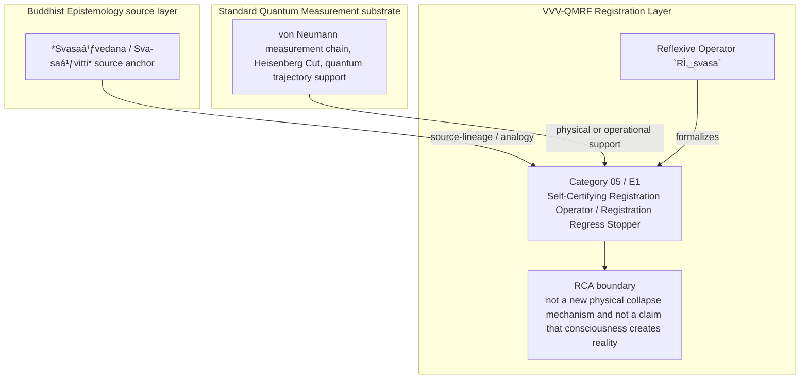

Author: VietVunVut (Viet - Nguyen Xuan); GitHub: https://github.com/AIhugART/; Facebook: https://www.facebook.com/xuanviet

# Formal Registration Category: Self-Certifying Registration Operator (Regress-Stopping Principle)
# Phạm trù Ghi nhận: Toán tử Tự chứng Ghi nhận (Nguyên lý Chấm dứt Chuỗi Vô hạn)

**Framework:** VietVunVut Quantum Measurement Registration Framework (VVV-QMRF)
**Author:** VietVunVut (Viet - Nguyen Xuan)
**GitHub:** https://github.com/AIhugART/
**Facebook:** https://www.facebook.com/xuanviet
**Date:** 2026-05-11
**Status:** Proposal — Registration class D (Derived, awaiting formal verification)
**Lineage:** gap/ (BIAN-2, 6, 17) → category/ (Category 05) → framework/ (E1)

> **Context / Ngữ cảnh:** This document formally establishes a new registration category for Quantum Mechanics (QM) to resolve the structural gaps **BIAN-2, BIAN-6, and BIAN-17** identified in the Buddhist Epistemology - Quantum Measurement mapping. These gaps highlight QM's inability to stop the infinite von Neumann measurement chain without appealing to an external meta-registering system (equivalent to the absence of *Svasaṃvedana* - Self-awareness in Buddhist logic).
>
> *Tài liệu này chính thức thiết lập một phạm trù ghi nhận mới cho Cơ học Lượng tử (QM) nhằm giải quyết các khoảng trống cấu trúc **BIAN-2, BIAN-6, và BIAN-17**. Các lỗ hổng này chỉ ra sự bất lực của QM trong việc dừng chuỗi đo lường vô hạn von Neumann mà không cần viện đến một siêu-hệ-ghi-nhận bên ngoài (tương đương với sự vắng mặt của khái niệm Svasaṃvedana - Tự chứng phần trong logic Phật giáo).*

---

## 1. Category Identity / Định danh Phạm trù

* **English Name:** Self-Certifying Registration Operator / Registration Regress Stopper.
* **Vietnamese Name:** Toán tử Tự chứng Ghi nhận / Nguyên lý Chấm dứt Chuỗi Vô hạn.
* **Buddhist Framework Equivalent / Tương đương trong Hệ thống Phật giáo:** *Svasaṃvedana* (Reflexive cognition / Tự nhận thức tự thân).
* **Proposed Mathematical Symbol / Ký hiệu Toán học đề xuất:** Reflexive Operator / Toán tử Phản thân $\hat{R}_{svasa}$.

---

## 2. Definition / Định nghĩa

**English:**
A formal, reflexive mathematical operator within the quantum system that allows a primary measurement event to certify its own occurrence simultaneously with its measurement of the object. It definitively terminates the measurement regress (the von Neumann chain) internally, eliminating the need for any external registering system or subsequent apparatus to register the first apparatus.

**Vietnamese:**
Là một toán tử toán học phản thân chính thức bên trong hệ thống lượng tử, cho phép một sự kiện đo lường sơ cấp tự xác nhận sự tồn tại của chính nó đồng thời với việc nó đo lường đối tượng. Nó chấm dứt dứt điểm chuỗi đo lường lùi vô hạn (chuỗi von Neumann) từ bên trong, loại bỏ hoàn toàn sự cần thiết của một "hệ ghi nhận bên ngoài" bên ngoài hay một cỗ máy thứ hai để xác nhận cỗ máy thứ nhất.

---

## 3. Formal Structure / Cấu trúc Hình thức

**English:**
In von Neumann-style measurement-chain discussions, Apparatus A becomes correlated with System S, and external certification of A can generate a regress. Under this VVV-QMRF category:
1. **The Reflexive Act:** The registration model includes a self-referential trace component attached to the measurement interaction.
2. **Registration Certification:** The operator $\hat{R}_{svasa}$ marks the macroscopic state transition of Apparatus A as K-side self-certified. The event $E_A$ receives registration closure at the moment it occurs.
3. **Regress Termination:** Later measurements may audit or cross-check the event, but they are not required to create the first registration closure. Asking "Who measured Apparatus A?" becomes a registration-category error within this model.

**Vietnamese:**
Trong các thảo luận kiểu chuỗi đo von Neumann, Máy A tương quan với Hệ S, và việc xác thực A từ bên ngoài có thể tạo ra chuỗi lùi. Với phạm trù VVV-QMRF này:
1. **Hành động Phản thân:** Mô hình ghi nhận thêm một vết tự tham chiếu gắn với tương tác đo lường.
2. **Xác thực Ghi nhận:** Toán tử $\hat{R}_{svasa}$ đánh dấu chuyển đổi trạng thái vĩ mô của Máy A là tự chứng ở phía K. Sự kiện $E_A$ nhận closure ghi nhận tại khoảnh khắc nó xảy ra.
3. **Chấm dứt Chuỗi Vô hạn:** Các phép đo sau có thể kiểm tra hoặc đối chiếu sự kiện, nhưng không cần tạo closure ghi nhận đầu tiên. Câu hỏi *"Ai đã đo Máy A?"* trở thành lỗi phạm trù ghi nhận trong mô hình này.

---

## 4. Foundational Implications / Ý nghĩa Nền tảng

BIAN-2, BIAN-6, BIAN-17 resolution: Self-Certifying Registration Operator / Registration Regress Stopper supplies the missing registration-layer category for measurement-chain discussions can keep asking what registers the previous registering system, creating a K-side regress. Formalizing SCRO has three bounded implications:

1. It stops the infinite registration regress at the K-side level.
2. It removes dependence on a human gaze while keeping physical QM unchanged.
3. It reframes Wigner-style cases as registration-frame conflicts rather than consciousness requirements.

> **Conclusion:** Self-Certifying Registration Operator / Registration Regress Stopper resolves BIAN-2, BIAN-6, BIAN-17 only as a VVV-QMRF registration-layer category. It preserves the standard QM substrate while adding the missing K-side classification and validity boundary.

---

## 5. RCA Concept Traceability Matrix / Bảng Truy vết RCA Khái niệm

**Purpose / Mục đích:** This table records traceability for the main concepts used in this category. It separates direct SOT evidence, framework-derived proposals, QM-only support, and boundary-sensitive applications so that Self-Certifying Registration Operator / Registration Regress Stopper is not confused with ordinary canonical QM or with an unrestricted Buddhist equivalence.

**RCA labels / Nhãn RCA:**
- **Strong:** direct node/edge or SOT evidence exists.
- **Medium:** structurally supported, but not a direct concept-node equivalence.
- **Derived:** proposed by this category/framework, not a source-system node.
- **QM-only:** supported in QM only, not Buddhist Epistemology.
- **No node:** no dedicated node/edge exists in the current SOT.
- **Overclaim:** wording is stronger than the traceable evidence.
- **External:** external experimental or historical support, not a current SOT node.

| Claim anchor | Concept | Evidence / Bằng chứng truy vết | Node code | Edge code | RCA label | Boundary / Fix note |
|---|---|---|---|---|---|---|
| §1-§2 | BIAN-2, BIAN-6, BIAN-17 / gap diagnosis | BIAN SOT resolves this gap through Category 05 + E1. | N_BE_00011 | ED_BE_00019; ED_BE_00020 | Strong / No node | Gap diagnosis is not by itself an empirical proof; it identifies the missing registration category. |
| §1-§2 | Self-Certifying Registration Operator / Registration Regress Stopper | VVV-QM RCA assigns the category support in node_QM_VVV. | N_QM_VVV_00033; N_QM_VVV_00034; N_QM_VVV_00035 | — | Derived | Framework category; not a canonical QM postulate unless independently validated. |
| §1 | BE source analogue | *Svasaṃvedana / Sva-saṃvitti* source anchor | N_BE_00011 | ED_BE_00019; ED_BE_00020 | Medium | Source lineage or analogy; do not collapse BE ontology into QM physics. |
| §2-§3 | QM substrate | von Neumann measurement chain, Heisenberg Cut, quantum trajectory support | N_QM_00020; N_QM_00094; N_QM_00038 | ED_QM_00021; ED_QM_00107; ED_QM_00043 | QM-only | Canonical QM supports the physical substrate, not the whole VVV-QMRF category. |
| §3 | Formal symbol / operator | Reflexive Operator `R̂_svasa` | N_QM_VVV_00033; N_QM_VVV_00034; N_QM_VVV_00035 | — | Derived | Framework notation; do not cite as a source-system operator. |
| §4 | Category implication | Introduce a reflexive self-certification operation that grants primary registration closure without invoking an external human observer. | N_QM_VVV_00033; N_QM_VVV_00034; N_QM_VVV_00035 | — | Medium | Valid only within the stated registration-layer boundary. |
| §4 | Overclaim risk | not a new physical collapse mechanism and not a claim that consciousness creates reality | — | — | Overclaim | Keep wording conditional and registration-layer specific. |

### 5.1. RCA Summary / Tóm tắt RCA

1. **BIAN-2, BIAN-6, BIAN-17 is a structural gap, not a direct physical discovery.** The gap identifies missing registration architecture.
2. **The BE source is bounded.** *Svasaṃvedana / Sva-saṃvitti* source anchor anchors the analogy or source lineage, but does not automatically become a QM mechanism.
3. **The QM substrate is real but insufficient.** von Neumann measurement chain, Heisenberg Cut, quantum trajectory support provides support, while Self-Certifying Registration Operator / Registration Regress Stopper names the added K-side layer.
4. **The VVV node(s) are derived.** N_QM_VVV_00033; N_QM_VVV_00034; N_QM_VVV_00035 belong to the framework proposal and should be labeled as derived unless later validated.
5. **Boundary control is mandatory.** The main overclaim to avoid is: not a new physical collapse mechanism and not a claim that consciousness creates reality.

### 5.2. RCA Five-Step Analysis / Phân tích RCA 5 bước

#### 5.2.1 Define — observed issue / Xác định vấn đề

**Symptom:** The old formulation can make Self-Certifying Registration Operator / Registration Regress Stopper look like either ordinary QM vocabulary or a direct Buddhist-QM equivalence.

**Cause:** The category document did not fully separate BE source support, canonical QM substrate, VVV-QMRF derived formalism, and boundary-sensitive claims.

#### 5.2.2 Trace — 5 Whys / Truy nguyên 5 lần hỏi “vì sao”

1. **Why does the ambiguity appear?** Because the same words describe source analogy, physical measurement support, and framework proposal.
2. **Why is that a schema problem?** Because older category files lacked a complete RCA matrix and assertion-boundary section.
3. **Why can this create overclaim?** Because a derived registration category may be read as a canonical QM postulate or as a literal BE equivalence.
4. **Why is traceability required?** Because each claim needs a node/edge, QM substrate, or explicit `No node` status.
5. **Why does Category 05 exist?** Because BIAN-2, BIAN-6, BIAN-17 isolates a registration-layer gap: measurement-chain discussions can keep asking what registers the previous registering system, creating a K-side regress.

#### 5.2.3 Isolate — root cause / Cô lập nguyên nhân gốc

**Root cause:** The document needed explicit schema-level separation between source-system evidence, QM support, VVV-derived notation, and boundary conditions.

#### 5.2.4 Fix — corrected formulation / Sửa đúng nguyên nhân

Use this bounded formulation when precision is required:

```text
Self-Certifying Registration Operator / Registration Regress Stopper = a VVV-QMRF registration-layer category for BIAN-2, BIAN-6, BIAN-17.
BE source: *Svasaṃvedana / Sva-saṃvitti* source anchor.
QM substrate: von Neumann measurement chain, Heisenberg Cut, quantum trajectory support.
VVV formalism: Reflexive Operator `RÌ‚_svasa` / N_QM_VVV_00033; N_QM_VVV_00034; N_QM_VVV_00035.
Boundary: not a new physical collapse mechanism and not a claim that consciousness creates reality.
```

#### 5.2.5 Verify — root cause removed / Kiểm chứng đã loại bỏ nguyên nhân gốc

The ambiguity is removed if every use of Category 05 distinguishes:

```text
BE source analogue = *Svasaṃvedana / Sva-saṃvitti* source anchor.
QM substrate = von Neumann measurement chain, Heisenberg Cut, quantum trajectory support.
VVV-QMRF category = Self-Certifying Registration Operator / Registration Regress Stopper.
Formal symbol = Reflexive Operator `RÌ‚_svasa`.
Boundary = not a new physical collapse mechanism and not a claim that consciousness creates reality.
```

### 5.3. Gap Type Classification / Phân loại Loại Khoảng trống

| Gap aspect | Classification | RCA note |
|---|---|---|
| Source gap | **BIAN-2, BIAN-6, BIAN-17** | Measurement-chain discussions can keep asking what registers the previous registering system, creating a k-side regress. |
| Gap type | **Registration-regress closure gap** | The missing piece is a registration-category distinction, not merely a prettier sentence. |
| Resolution type | **Category + framework postulate** | Category 05 supplies the detailed category; E1 installs it into VVV-QMRF architecture. |
| Why not only canonical QM? | Canonical QM supports the substrate but not the K-side classification. | Use QM nodes as support, not as proof that the category already exists in standard QM. |
| Boundary | **derived regress-stopping registration category** | Keep labels such as Derived, Medium, No node, or QM-only visible in publication-facing prose. |

### 5.4. Prototype SCRO Instance / Trường hợp Mẫu của SCRO

```text
Prototype SCRO instance:

  Setup: system and apparatus become correlated in a measurement-chain scenario.
  Event: apparatus reaches a macroscopic detector response.
  Gate: reflexive trace is attached to the registration event itself.
  Update: `RÌ‚_svasa` produces primary registration closure.
  Contrast: later audits can check the event but do not create first closure.

  → SCRO instance confirmed only within its boundary.
```

**RCA boundary:** The prototype is valid only when the stated source support, QM substrate, and registration-validity conditions are all kept distinct.

### 5.5. Layer Architecture Position / Vị trí trong Kiến trúc Tầng

```text
gap/BIAN-2, BIAN-6, BIAN-17
  ↓ diagnoses missing registration structure
category/Category 05 — Self-Certifying Registration Operator / Registration Regress Stopper
  ↓ specifies detailed category and boundary conditions
framework/E1
  ↓ installs the rule into VVV-QMRF postulate architecture
VVV-QMRF registration-state update layer
  ↓ applies the category without replacing canonical QM physics
```

| Layer | Document / component | Role |
|---|---|---|
| Gap | BIAN-2, BIAN-6, BIAN-17 | Diagnoses the missing registration distinction. |
| Category | Category 05 | Defines the detailed registration category. |
| Framework | E1 | Promotes the category into postulate-level architecture. |
| BE source | *Svasaṃvedana / Sva-saṃvitti* source anchor | Supplies source-lineage or analogy under RCA boundary. |
| QM substrate | von Neumann measurement chain, Heisenberg Cut, quantum trajectory support | Supplies physical or operational support only. |

---

## 6. Assertion Level / Mức Khẳng định

| Component EN | Thành phần VN | Epistemic class | Evidence / Boundary |
|---|---|---|---|
| BE source supports the category lineage | Nguồn BE hỗ trợ dòng nguồn của phạm trù | **M** — source-supported | N_BE_00011; ED_BE_00019; ED_BE_00020. |
| QM provides the physical substrate | QM cung cấp nền vật lý | **M / QM-only** | N_QM_00020; N_QM_00094; N_QM_00038; ED_QM_00021; ED_QM_00107; ED_QM_00043. |
| Self-Certifying Registration Operator / Registration Regress Stopper is a VVV-QMRF category | Toán tử Tự chứng Ghi nhận / Nguyên lý Chấm dứt Chuỗi Vô hạn là phạm trù VVV-QMRF | **D** — framework-derived | N_QM_VVV_00033; N_QM_VVV_00034; N_QM_VVV_00035; E1. |
| Reflexive Operator `R̂_svasa` formalizes the category | Reflexive Operator `R̂_svasa` hình thức hóa phạm trù | **D** — notation-derived | Framework notation, not a canonical source-system operator. |
| The category resolves BIAN-2, BIAN-6, BIAN-17 | Phạm trù giải quyết BIAN-2, BIAN-6, BIAN-17 | **D / M** — bounded resolution | Resolution holds at registration-layer architecture level. |
| Boundary-free reading of the category | Cách đọc không ranh giới về phạm trù | **O** — overclaim | not a new physical collapse mechanism and not a claim that consciousness creates reality. |

**Summary / Tóm tắt:** The category is traceable as a VVV-QMRF registration-layer proposal. Its BE source and QM substrate support the architecture, but neither should be overstated as a direct one-to-one physical equivalence.

---

## 7. What Category 05 / E1 Does NOT Claim / Những gì Category 05 / E1 KHÔNG tuyên bố

1. **Not a canonical QM replacement** — Self-Certifying Registration Operator / Registration Regress Stopper is a VVV-QMRF registration-layer proposal built beside standard QM support.
   *Không thay thế QM chuẩn; đây là tầng ghi nhận VVV-QMRF đặt bên cạnh nền vật lý QM.*

2. **Not unrestricted equivalence with the BE source** — *Svasaṃvedana / Sva-saṃvitti* source anchor supplies source-lineage or analogy only within the stated boundary.
   *Không đồng nhất vô điều kiện với nguồn BE; nguồn BE chỉ làm mô hình nguồn hoặc phép tương tự có ranh giới.*

3. **Not boundary-free application** — not a new physical collapse mechanism and not a claim that consciousness creates reality.
   *Không áp dụng tự do ngoài điều kiện hợp lệ đã nêu.*

4. **Not a detector-engineering shortcut** — validity still depends on calibration, context, and the relevant E10-style gate where applicable.
   *Không bỏ qua hiệu chuẩn, bối cảnh, hoặc cổng hợp lệ kiểu E10 khi cần.*

5. **Not an empirical proof of a new physical mechanism** — the category remains derived unless formal predictions and tests are supplied.
   *Chưa phải bằng chứng thực nghiệm cho cơ chế vật lý mới nếu chưa có dự đoán và kiểm nghiệm.*

6. **Not human-consciousness dependence** — registration-state update is a K-side framework term broader than human cognition.
   *Không phụ thuộc ý thức con người; cập nhật trạng thái ghi nhận là thuật ngữ tầng K rộng hơn cognition của người.*

---

## 8. Vietnamese Explanation / Giải thích tiếng Việt rõ ràng

Nói đơn giản, Category 05 / E1 xử lý câu hỏi:

```text
Trong trường hợp này, cái gì thật sự được ghi nhận ở tầng K,
và điều kiện nào làm cho ghi nhận đó hợp lệ?
```

Câu trả lời của VVV-QMRF là:

```text
Nếu cứ hỏi `ai ghi nhận máy đo?`, ta rơi vào chuỗi vô hạn. Category 05 đặt một điểm dừng: sự kiện ghi nhận hợp lệ tự có dấu tự chứng ở tầng K.
```

Ranh giới cần nhớ:

```text
BE source không tự động trở thành cơ chế vật lý QM.
QM substrate không tự động chứa toàn bộ category VVV-QMRF.
VVV-QMRF thêm tầng registration-state update / cập nhật trạng thái ghi nhận.
Nếu thiếu điều kiện hợp lệ, claim phải bị hạ xuống Medium, Derived, No node, hoặc Overclaim.
```

---

## 9. Mermaid Diagram Map / Sơ đồ Mermaid



---

*Source: BIAN_index_SOT.md (BIAN-2, BIAN-6, BIAN-17), system_be_full.md (N_BE_00011), SYSTEM_Quantum_Measurement/system_qm_full.md, node_QM_VVV.md (N_QM_VVV_00033-00035), framework/vvv_qmrf_framework_e01_self_certifying_registration_postulate.md*

