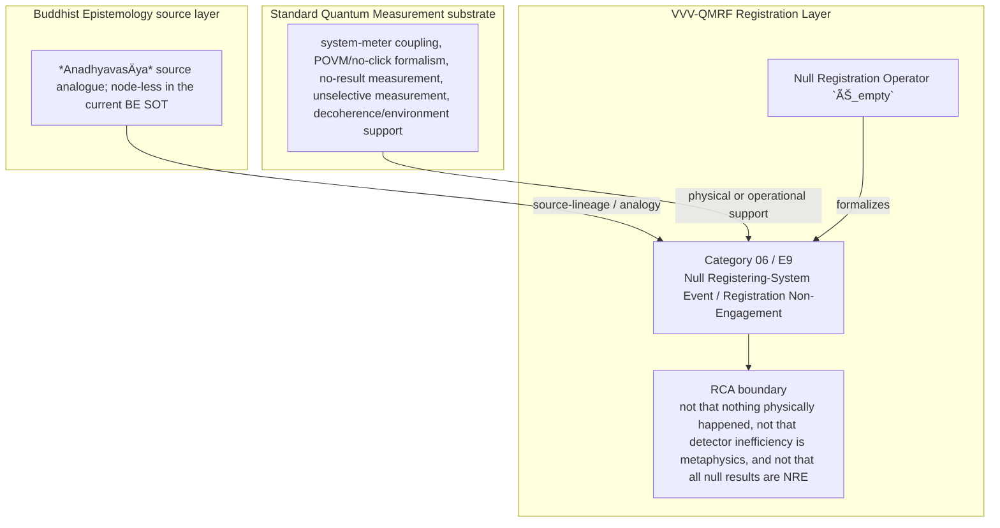

Author: VietVunVut (Viet - Nguyen Xuan); GitHub: https://github.com/AIhugART/; Facebook: https://www.facebook.com/xuanviet

# Formal Registration Category: Null Registering-System Event (Registration Non-Engagement)
# Phạm trù Ghi nhận: Sự kiện Hệ ghi nhận Rỗng (Trạng thái Bất tạo Ghi nhận)

**Framework:** VietVunVut Quantum Measurement Registration Framework (VVV-QMRF)
**Author:** VietVunVut (Viet - Nguyen Xuan)
**GitHub:** https://github.com/AIhugART/
**Facebook:** https://www.facebook.com/xuanviet
**Date:** 2026-05-11
**Status:** Proposal — Registration class D (Derived, awaiting formal verification)
**Lineage:** gap/ (BIAN-13) → category/ (Category 06) → framework/ (E9)

> **Context / Ngữ cảnh:** This document formally establishes a new registration category for Quantum Mechanics (QM) to resolve structural gap **BIAN-13** identified in the Buddhist Epistemology - Quantum Measurement mapping. BIAN-13 highlights the absence of a formal QM category for the state of a registering system when a quantum event is causally present but produces no registration outcome (equivalent to *Anadhyavasāya* in Buddhist logic).
>
> *Tài liệu này chính thức thiết lập một phạm trù ghi nhận mới cho Cơ học Lượng tử (QM) nhằm giải quyết khoảng trống cấu trúc **BIAN-13** được xác định trong bản đồ đối chiếu Nhận thức luận Phật giáo - Đo lường Lượng tử. BIAN-13 chỉ ra sự thiếu hụt của QM về một phạm trù chính thức dành cho trạng thái của hệ ghi nhận khi một sự kiện lượng tử có mặt về mặt nhân quả nhưng không sinh ra kết quả ghi nhận (tương đương với khái niệm Anadhyavasāya trong logic Phật giáo).*

---

## 1. Category Identity / Định danh Phạm trù

* **English Name:** Null Registering-System Event (NRE) / Registration Non-Engagement.
* **Vietnamese Name:** Sự kiện Hệ ghi nhận Rỗng / Trạng thái Bất tạo Ghi nhận.
* **Buddhist Framework Equivalent / Tương đương trong Hệ thống Phật giáo:** *Anadhyavasāya* (Non-determination / Sự không xác định do tâm trí trơ lỳ dù đối tượng có mặt).
* **Proposed Mathematical Symbol / Ký hiệu Toán học đề xuất:** Null Registration Operator / Toán tử Ghi nhận Rỗng $\hat{E}_{\emptyset}$.

---

## 2. Definition / Định nghĩa

**English:**
A formal quantum registration state in which a physical interaction (Hamiltonian coupling) between the microscopic system and the measurement apparatus has certainly occurred, yet it yields exactly zero change in information ($\Delta I = 0$) for the registering system. It formalizes the phenomenon of "missing reality" not merely as a hardware flaw, but as a distinct K-side non-registration state.

**Vietnamese:**
Là một trạng thái ghi nhận lượng tử chính thức, trong đó **sự tương tác vật lý** (Hamiltonian coupling) giữa hệ thống vi mô và máy đo chắc chắn đã xảy ra, nhưng lại sinh ra **độ biến thiên thông tin bằng không** ($\Delta I = 0$) đối với hệ ghi nhận. Nó chính thức hóa hiện tượng "bỏ lỡ thực tại" không phải như một lỗi phần cứng, mà là một trạng thái bất tạo ghi nhận phía K đặc thù.

---

## 3. Formal Structure / Cấu trúc Hình thức

**English:**
In standard QM, a detector failing to click (even when a particle passes through) can be described experimentally by a detection-efficiency parameter ($\eta$) and modeled formally by a POVM containing a no-click or null effect. Under this VVV-QMRF category, the same physical situation receives a K-side registration classification:
1. **Interaction Event:** The particle enters the apparatus. The time-evolution operator functions: $|\psi\rangle \otimes |A_{ready}\rangle \rightarrow \sum c_i |\phi_i\rangle |A_i\rangle$. Physical interaction is real.
2. **Registration Operator Activation:** Instead of the apparatus being forced to yield an eigenvalue, the operator $\hat{E}_{\emptyset}$ emerges.
3. **Registration Outcome (Phala):** The pointer state of the apparatus remains unchanged. For the registering system, the K-side information state experiences zero entropy reduction.
4. **K-Side Non-Registration State:** Unlike the "Unmeasured" state (where no interaction has occurred), this is the state of **"Measured but Unregistered"**. The wave function does not collapse according to standard PVM; instead, the system becomes entangled with environmental degrees of freedom, so local coherence is suppressed through decoherence without leaving any "registration trace" for the registering system.

**Vietnamese:**
Trong QM chuẩn, việc máy dò không click (dù hạt có bay qua) có thể được mô tả thực nghiệm bằng tham số hiệu suất phát hiện ($\eta$), và được mô hình hóa hình thức bằng một "POVM" chứa hiệu ứng "no-click" hoặc "null". Với phạm trù VVV-QMRF này, cùng một tình huống vật lý nhận thêm một phân loại ghi nhận phía K:
1. **Sự kiện Tương tác:** Hạt đi vào máy đo. Toán tử tiến hóa thời gian hoạt động: $|\psi\rangle \otimes |A_{ready}\rangle \rightarrow \sum c_i |\phi_i\rangle |A_i\rangle$. Tương tác vật lý là có thật.
2. **Kích hoạt Toán tử Ghi nhận:** Thay vì máy đo bắt buộc phải đưa ra một giá trị (eigenvalue), toán tử $\hat{E}_{\emptyset}$ xuất hiện.
3. **Kết quả Ghi nhận (Phala):** Trạng thái kim chỉ (pointer state) của máy đo không thay đổi. Đối với hệ ghi nhận, trạng thái thông tin phía K không có sự suy giảm entropy.
4. **Trạng thái Bất tạo Ghi nhận phía K:** Khác với trạng thái "Chưa đo" (chưa có tương tác), đây là trạng thái **"Đã đo nhưng chưa được ghi nhận"**. Hàm sóng không sụp đổ theo chuẩn PVM; thay vào đó, hệ trở nên vướng víu với các bậc tự do của môi trường, nên độ kết hợp cục bộ bị triệt tiêu qua decoherence mà không để lại "dấu vết ghi nhận" nào cho hệ ghi nhận.

---

## 4. Foundational Implications / Ý nghĩa Nền tảng

BIAN-13 resolution: Null Registering-System Event / Registration Non-Engagement supplies the missing registration-layer category for standard QM can describe interaction, inefficiency, or decoherence, but lacks a K-side category for measured-but-unregistered non-engagement. Formalizing NRE has three bounded implications:

1. It separates physical causal presence from registration availability.
2. It gives a formal name to measured-but-unregistered K-side status.
3. It supplies the negative control needed for Category 13 absence registration.

> **Conclusion:** Null Registering-System Event / Registration Non-Engagement resolves BIAN-13 only as a VVV-QMRF registration-layer category. It preserves the standard QM substrate while adding the missing K-side classification and validity boundary.

---

## 5. RCA Concept Traceability Matrix / Bảng Truy vết RCA Khái niệm

**Purpose / Mục đích:** This table records traceability for the main concepts used in this category. It separates direct SOT evidence, framework-derived proposals, QM-only support, and boundary-sensitive applications so that Null Registering-System Event / Registration Non-Engagement is not confused with ordinary canonical QM or with an unrestricted Buddhist equivalence.

**RCA labels / Nhãn RCA:**
- **Strong:** direct node/edge or SOT evidence exists.
- **Medium:** structurally supported, but not a direct concept-node equivalence.
- **Derived:** proposed by this category/framework, not a source-system node.
- **QM-only:** supported in QM only, not Buddhist Epistemology.
- **No node:** no dedicated node/edge exists in the current SOT.
- **Overclaim:** wording is stronger than the traceable evidence.
- **External:** external experimental or historical support, not a current SOT node.

| Claim anchor | Concept | Evidence / Bằng chứng truy vết | Node code | Edge code | RCA label | Boundary / Fix note |
|---|---|---|---|---|---|---|
| §1-§2 | BIAN-13 / gap diagnosis | BIAN SOT resolves this gap through Category 06 + E9. | — | — | Strong / No node | Gap diagnosis is not by itself an empirical proof; it identifies the missing registration category. |
| §1-§2 | Null Registering-System Event / Registration Non-Engagement | VVV-QM RCA assigns the category support in node_QM_VVV. | N_QM_VVV_00036; N_QM_VVV_00037; N_QM_VVV_00038 | — | Derived | Framework category; not a canonical QM postulate unless independently validated. |
| §1 | BE source analogue | *Anadhyavasāya* source analogue; node-less in the current BE SOT | — | — | Medium | Source lineage or analogy; do not collapse BE ontology into QM physics. |
| §2-§3 | QM substrate | system-meter coupling, detection-efficiency parameter, POVM/no-click effect, no-result measurement, unselective measurement, decoherence/environment support | N_QM_00021; N_QM_00024; N_QM_00033; N_QM_00035; N_QM_00095 | ED_QM_00021; ED_QM_00027; ED_QM_00039; ED_QM_00041 | QM-only | Canonical QM supports the physical substrate and formal no-click modeling, not the whole VVV-QMRF category. |
| §3 | Formal symbol / operator | Null Registration Operator `Ê_empty` | N_QM_VVV_00036; N_QM_VVV_00037; N_QM_VVV_00038 | — | Derived | Framework notation; do not cite as a source-system operator. |
| §4 | Category implication | Classify physical interaction with zero valid registration encoding as NRE, distinct from non-measurement and from valid absence registration. | N_QM_VVV_00036; N_QM_VVV_00037; N_QM_VVV_00038 | — | Medium | Valid only within the stated registration-layer boundary. |
| §4 | Overclaim risk | not that nothing physically happened, not that detector inefficiency is metaphysics, and not that all null results are NRE | — | — | Overclaim | Keep wording conditional and registration-layer specific. |

### 5.1. RCA Summary / Tóm tắt RCA

1. **BIAN-13 is a structural gap, not a direct physical discovery.** The gap identifies missing registration architecture.
2. **The BE source is bounded.** *Anadhyavasāya* source analogue; node-less in the current BE SOT anchors the analogy or source lineage, but does not automatically become a QM mechanism.
3. **The QM substrate is real but insufficient.** system-meter coupling, POVM/no-click formalism, no-result measurement, unselective measurement, decoherence/environment support provides support, while Null Registering-System Event / Registration Non-Engagement names the added K-side layer.
4. **The VVV node(s) are derived.** N_QM_VVV_00036; N_QM_VVV_00037; N_QM_VVV_00038 belong to the framework proposal and should be labeled as derived unless later validated.
5. **Boundary control is mandatory.** The main overclaim to avoid is: not that nothing physically happened, not that detector inefficiency is metaphysics, and not that all null results are NRE.

### 5.2. RCA Five-Step Analysis / Phân tích RCA 5 bước

#### 5.2.1 Define — observed issue / Xác định vấn đề

**Symptom:** The old formulation can make Null Registering-System Event / Registration Non-Engagement look like either ordinary QM vocabulary or a direct Buddhist-QM equivalence.

**Cause:** The category document did not fully separate BE source support, canonical QM substrate, VVV-QMRF derived formalism, and boundary-sensitive claims.

#### 5.2.2 Trace — 5 Whys / Truy nguyên 5 lần hỏi “vì sao”

1. **Why does the ambiguity appear?** Because the same words describe source analogy, physical measurement support, and framework proposal.
2. **Why is that a schema problem?** Because older category files lacked a complete RCA matrix and assertion-boundary section.
3. **Why can this create overclaim?** Because a derived registration category may be read as a canonical QM postulate or as a literal BE equivalence.
4. **Why is traceability required?** Because each claim needs a node/edge, QM substrate, or explicit `No node` status.
5. **Why does Category 06 exist?** Because BIAN-13 isolates a registration-layer gap: standard QM can describe interaction, experimental inefficiency, POVM/no-click formalism, or decoherence, but lacks a K-side category for measured-but-unregistered non-engagement.

#### 5.2.3 Isolate — root cause / Cô lập nguyên nhân gốc

**Root cause:** The document needed explicit schema-level separation between source-system evidence, QM support, VVV-derived notation, and boundary conditions.

#### 5.2.4 Fix — corrected formulation / Sửa đúng nguyên nhân

Use this bounded formulation when precision is required:

```text
Null Registering-System Event / Registration Non-Engagement = a VVV-QMRF registration-layer category for BIAN-13.
BE source: *Anadhyavasāya* source analogue; node-less in the current BE SOT.
QM substrate: system-meter coupling, POVM/no-click formalism, no-result measurement, unselective measurement, decoherence/environment support.
VVV formalism: Null Registration Operator `Ê_empty` / N_QM_VVV_00036; N_QM_VVV_00037; N_QM_VVV_00038.
Boundary: not that nothing physically happened, not that detector inefficiency is metaphysics, and not that all null results are NRE.
```

#### 5.2.5 Verify — root cause removed / Kiểm chứng đã loại bỏ nguyên nhân gốc

The ambiguity is removed if every use of Category 06 distinguishes:

```text
BE source analogue = *Anadhyavasāya* source analogue; node-less in the current BE SOT.
QM substrate = system-meter coupling, POVM/no-click formalism, no-result measurement, unselective measurement, decoherence/environment support.
VVV-QMRF category = Null Registering-System Event / Registration Non-Engagement.
Formal symbol = Null Registration Operator `Ê_empty`.
Boundary = not that nothing physically happened, not that detector inefficiency is metaphysics, and not that all null results are NRE.
```

### 5.3. Gap Type Classification / Phân loại Loại Khoảng trống

| Gap aspect | Classification | RCA note |
|---|---|---|
| Source gap | **BIAN-13** | Standard QM can describe interaction, experimental inefficiency, POVM/no-click formalism, or decoherence, but lacks a K-side category for measured-but-unregistered non-engagement. |
| Gap type | **Causal presence without registration gap** | The missing piece is a registration-category distinction, not merely a prettier sentence. |
| Resolution type | **Category + framework postulate** | Category 06 supplies the detailed category; E9 installs it into VVV-QMRF architecture. |
| Why not only canonical QM? | Canonical QM supports the substrate but not the K-side classification. | Use QM nodes as support, not as proof that the category already exists in standard QM. |
| Boundary | **node-less BE analogue; derived non-engagement category** | Keep labels such as Derived, Medium, No node, or QM-only visible in publication-facing prose. |

### 5.4. Prototype NRE Instance / Trường hợp Mẫu của NRE

```text
Prototype NRE instance:

  Setup: a system physically couples to the apparatus.
  Event: no valid pointer encoding or K-side information change appears.
  Gate: physical interaction is confirmed, but E10-style valid registration is absent.
  Update: `Ê_empty` classifies the event as measured-but-unregistered.
  Contrast: VAR/E14 is valid absence; NRE/E9 is non-informative non-engagement.

  → NRE instance confirmed only within its boundary.
```

**RCA boundary:** The prototype is valid only when the stated source support, QM substrate, and registration-validity conditions are all kept distinct.

### 5.5. Layer Architecture Position / Vị trí trong Kiến trúc Tầng

```text
gap/BIAN-13
  ↓ diagnoses missing registration structure
category/Category 06 — Null Registering-System Event / Registration Non-Engagement
  ↓ specifies detailed category and boundary conditions
framework/E9
  ↓ installs the rule into VVV-QMRF postulate architecture
VVV-QMRF registration-state update layer
  ↓ applies the category without replacing canonical QM physics
```

| Layer | Document / component | Role |
|---|---|---|
| Gap | BIAN-13 | Diagnoses the missing registration distinction. |
| Category | Category 06 | Defines the detailed registration category. |
| Framework | E9 | Promotes the category into postulate-level architecture. |
| BE source | *Anadhyavasāya* source analogue; node-less in the current BE SOT | Supplies source-lineage or analogy under RCA boundary. |
| QM substrate | system-meter coupling, POVM/no-click formalism, no-result measurement, unselective measurement, decoherence/environment support | Supplies physical or operational support only. |

---

## 6. Assertion Level / Mức Khẳng định

| Component EN | Thành phần VN | Epistemic class | Evidence / Boundary |
|---|---|---|---|
| BE source supports the category lineage | Nguồn BE hỗ trợ dòng nguồn của phạm trù | **M** — source-supported | —; —. |
| QM provides the physical substrate and no-click formalism | QM cung cấp nền vật lý và hình thức hóa no-click | **M / QM-only** | N_QM_00021; N_QM_00024; N_QM_00033; N_QM_00035; N_QM_00095; ED_QM_00021; ED_QM_00027; ED_QM_00039; ED_QM_00041. |
| Null Registering-System Event / Registration Non-Engagement is a VVV-QMRF category | Sự kiện Hệ ghi nhận Rỗng / Trạng thái Bất tạo Ghi nhận là phạm trù VVV-QMRF | **D** — framework-derived | N_QM_VVV_00036; N_QM_VVV_00037; N_QM_VVV_00038; E9. |
| Null Registration Operator `Ê_empty` formalizes the category | Null Registration Operator `Ê_empty` hình thức hóa phạm trù | **D** — notation-derived | Framework notation, not a canonical source-system operator. |
| The category resolves BIAN-13 | Phạm trù giải quyết BIAN-13 | **D / M** — bounded resolution | Resolution holds at registration-layer architecture level. |
| Boundary-free reading of the category | Cách đọc không ranh giới về phạm trù | **O** — overclaim | not that nothing physically happened, not that detector inefficiency is metaphysics, and not that all null results are NRE. |

**Summary / Tóm tắt:** The category is traceable as a VVV-QMRF registration-layer proposal. Its BE source and QM substrate support the architecture, but neither should be overstated as a direct one-to-one physical equivalence.

---

## 7. What Category 06 / E9 Does NOT Claim / Những gì Category 06 / E9 KHÔNG tuyên bố

1. **Not a canonical QM replacement** — Null Registering-System Event / Registration Non-Engagement is a VVV-QMRF registration-layer proposal built beside standard QM support.
   *Không thay thế QM chuẩn; đây là tầng ghi nhận VVV-QMRF đặt bên cạnh nền vật lý QM.*

2. **Not unrestricted equivalence with the BE source** — *Anadhyavasāya* source analogue; node-less in the current BE SOT supplies source-lineage or analogy only within the stated boundary.
   *Không đồng nhất vô điều kiện với nguồn BE; nguồn BE chỉ làm mô hình nguồn hoặc phép tương tự có ranh giới.*

3. **Not boundary-free application** — not that nothing physically happened, not that detector inefficiency is metaphysics, and not that all null results are NRE.
   *Không áp dụng tự do ngoài điều kiện hợp lệ đã nêu.*

4. **Not a detector-engineering shortcut** — validity still depends on calibration, context, and the relevant E10-style gate where applicable.
   *Không bỏ qua hiệu chuẩn, bối cảnh, hoặc cổng hợp lệ kiểu E10 khi cần.*

5. **Not an empirical proof of a new physical mechanism** — the category remains derived unless formal predictions and tests are supplied.
   *Chưa phải bằng chứng thực nghiệm cho cơ chế vật lý mới nếu chưa có dự đoán và kiểm nghiệm.*

6. **Not human-consciousness dependence** — registration-state update is a K-side framework term broader than human cognition.
   *Không phụ thuộc ý thức con người; cập nhật trạng thái ghi nhận là thuật ngữ tầng K rộng hơn cognition của người.*

---

## 8. Vietnamese Explanation / Giải thích tiếng Việt rõ ràng

Nói đơn giản, Category 06 / E9 xử lý câu hỏi:

```text
Trong trường hợp này, cái gì thật sự được ghi nhận ở tầng K,
và điều kiện nào làm cho ghi nhận đó hợp lệ?
```

Câu trả lời của VVV-QMRF là:

```text
Có trường hợp hạt đã tương tác với máy, nhưng hệ ghi nhận không nhận được kết quả có giá trị. Category 06 gọi đó là `measured but unregistered`, khác với `không đo` và khác với `ghi nhận vắng mặt hợp lệ`.
```

Ranh giới cần nhớ:

```text
BE source không tự động trở thành cơ chế vật lý QM.
QM substrate không tự động chứa toàn bộ category VVV-QMRF.
VVV-QMRF thêm tầng registration-state update / cập nhật trạng thái ghi nhận.
Nếu thiếu điều kiện hợp lệ, claim phải bị hạ xuống Medium, Derived, No node, hoặc Overclaim.
```

---

## 9. Mermaid Diagram Map / Sơ đồ Mermaid



---

*Source: BIAN_index_SOT.md (BIAN-13), system_be_full.md (Anadhyavasāya listed as node-less analogue in BIAN SOT), SYSTEM_Quantum_Measurement/system_qm_full.md, node_QM_VVV.md (N_QM_VVV_00036-00038), framework/vvv_qmrf_framework_e09_null_registering_system_event_postulate.md*

