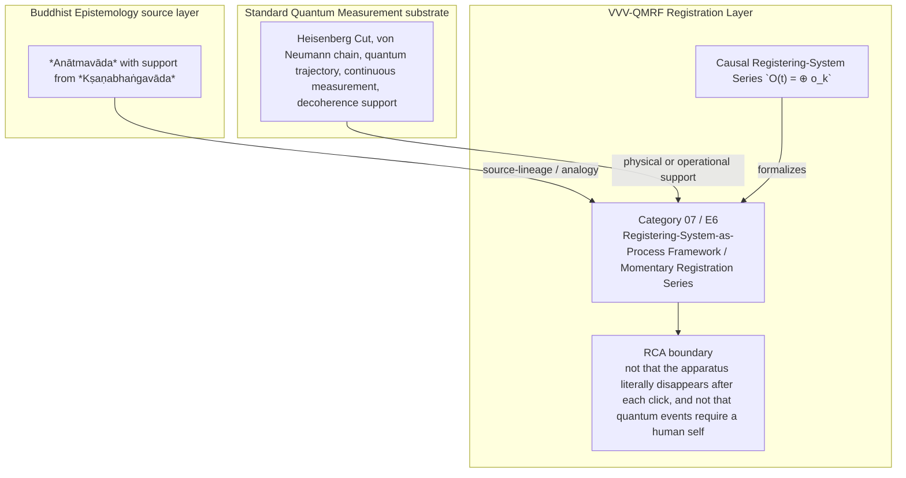

Author: VietVunVut (Viet - Nguyen Xuan); GitHub: https://github.com/AIhugART/; Facebook: https://www.facebook.com/xuanviet

# Formal Registration Category: Registering-System-as-Process Framework (BE source: Anātmavāda)
# Phạm trù Ghi nhận: Khung Hệ ghi nhận Chuỗi sự kiện (Nguồn BE: Vô ngã)

**Framework:** VietVunVut Quantum Measurement Registration Framework (VVV-QMRF)
**Document type:** category
**Author:** VietVunVut (Viet - Nguyen Xuan)
**GitHub:** https://github.com/AIhugART/
**Facebook:** https://www.facebook.com/xuanviet
**Date:** 2026-05-11
**Status:** Proposal — Registration class D (Derived, awaiting formal verification)
**Lineage:** gap/ (BIAN-19) → category/ (Category 07) → framework/ (E6)

> **Context / Ngữ cảnh:** This document formally establishes a new registration category for Quantum Mechanics (QM) to resolve structural gap **BIAN-19** identified in the Buddhist Epistemology - Quantum Measurement mapping. BIAN-19 highlights QM's implicit and problematic reliance on a persistent, substantive classical registering boundary, which conflicts with both the discrete nature of quantum events and the Buddhist principle of a process-based, momentary self (*Anātmavāda* / *Kṣaṇikavāda*).
>
> *Tài liệu này chính thức thiết lập một phạm trù ghi nhận mới cho Cơ học Lượng tử (QM) nhằm giải quyết khoảng trống cấu trúc **BIAN-19** được xác định trong bản đồ đối chiếu Nhận thức luận Phật giáo - Đo lường Lượng tử. BIAN-19 chỉ ra sự phụ thuộc ngầm định và đầy rắc rối của QM vào một ranh giới ghi nhận cổ điển mang tính thực thể, bền vững, mâu thuẫn với tính rời rạc của lượng tử và nguyên lý Vô ngã, sát-na sinh diệt của Phật giáo (Anātmavāda / Kṣaṇikavāda).*

---

## 1. Category Identity / Định danh Phạm trù

* **English Name:** Registering-System-as-Process Framework / Momentary Registration Series.
* **Vietnamese Name:** Khung Hệ ghi nhận Chuỗi sự kiện / Chuỗi Ghi nhận Khoảnh khắc.
* **Buddhist Source Analogue / Đối chiếu nguồn Phật giáo:** *Anātmavāda* (No-self / Vô ngã) applied via *Kṣaṇikavāda* (Momentariness / Sát-na luận).
* **Proposed Mathematical Symbol / Ký hiệu Toán học đề xuất:** Causal Registering-System Series / Chuỗi Hệ ghi nhận Nhân quả $\mathcal{O}(t) = \bigoplus_{k} \hat{o}_{k}$.

---

## 2. Definition / Định nghĩa

**English:**
A foundational reframing of the registering side in quantum formalism. It replaces the assumption of a persistent, classical registering entity (a static background environment or a permanent conscious being) with a discrete series of momentary measurement events bound together strictly by causal memory tensors.

**Vietnamese:**
Một sự tái cấu trúc nền tảng về "Hệ ghi nhận" trong hệ thống lượng tử. Nó thay thế giả định về một thực thể cổ điển, bền vững (như một môi trường tĩnh hay một sinh vật có ý thức vĩnh cửu) bằng một chuỗi rời rạc các sự kiện đo lường khoảnh khắc, được liên kết với nhau hoàn toàn bằng các tensor bộ nhớ nhân quả.

---

## 3. Formal Structure / Cấu trúc Hình thức

**English:**
Currently, QM treats the system under study as quantum (evolving $\psi$) but treats the registering side as a fixed classical boundary condition. Under this new category:
1. **The Dissolving Registering System:** There is no single static "registering system O". There is only a temporal sequence of registering moments $\{o_1, o_2, ..., o_n\}$.
2. **Causal Continuation:** $o_{n+1}$ is not mathematically identical to $o_n$. It is a newly generated registration state that inherits the classical data trace (memory) from $o_n$ via a causal projection operator $\hat{\Pi}_{causal}$.
3. **No Hidden Core:** The mathematics does not require any invariant substantive core (a "Soul" or a "Fixed Reference Frame") underlying this series of discrete clicks.

**Vietnamese:**
Hiện tại, QM coi hệ thống được đo là lượng tử (hàm sóng $\psi$) nhưng lại coi hệ ghi nhận là một ranh giới cổ điển cố định. Với phạm trù mới này:
1. **Hệ ghi nhận tan rã:** Không có một "Hệ ghi nhận O" duy nhất. Chỉ có một chuỗi thời gian các khoảnh khắc-ghi-nhận $\{o_1, o_2, ..., o_n\}$.
2. **Sự tiếp nối Nhân quả:** $o_{n+1}$ không đồng nhất về mặt toán học với $o_n$. Nó là một trạng thái ghi nhận mới được sinh ra, kế thừa dấu vết dữ liệu cổ điển (bộ nhớ) từ $o_n$ thông qua một toán tử chiếu nhân quả $\hat{\Pi}_{causal}$.
3. **Không có Cốt lõi Ẩn:** Toán học không đòi hỏi bất kỳ một lõi thực thể bất biến nào (như "Linh hồn" hay "Hệ quy chiếu cố định") nằm dưới chuỗi tiếng click rời rạc này.

---

## 4. Foundational Implications / Ý nghĩa Nền tảng

BIAN-19 resolution: Registering-System-as-Process Framework / Momentary Registration Series supplies the missing registration-layer category for QM can move the cut, but the registering side is often treated as a stable classical boundary rather than a causal series of registration moments. Formalizing RSPF has three bounded implications:

1. It replaces a persistent registering substance with a process architecture.
2. It aligns registration continuity with causal memory rather than identity.
3. It bounds solipsistic readings by making the registering system non-human and process-based.

> **Conclusion:** Registering-System-as-Process Framework / Momentary Registration Series resolves BIAN-19 only as a VVV-QMRF registration-layer category. It preserves the standard QM substrate while adding the missing K-side classification and validity boundary.

---

## 5. RCA Concept Traceability Matrix / Bảng Truy vết RCA Khái niệm

**Purpose / Mục đích:** This table records traceability for the main concepts used in this category. It separates direct SOT evidence, framework-derived proposals, QM-only support, and boundary-sensitive applications so that Registering-System-as-Process Framework / Momentary Registration Series is not confused with ordinary canonical QM or with an unrestricted Buddhist equivalence.

**RCA labels / Nhãn RCA:**
- **Strong:** direct node/edge or SOT evidence exists.
- **Medium:** structurally supported, but not a direct concept-node equivalence.
- **Derived:** proposed by this category/framework, not a source-system node.
- **QM-only:** supported in QM only, not Buddhist Epistemology.
- **No node:** no dedicated node/edge exists in the current SOT.
- **Overclaim:** wording is stronger than the traceable evidence.
- **External:** external experimental or historical support, not a current SOT node.

| Claim anchor | Concept | Evidence / Bằng chứng truy vết | Node code | Edge code | RCA label | Boundary / Fix note |
|---|---|---|---|---|---|---|
| §1-§2 | BIAN-19 / gap diagnosis | BIAN SOT resolves this gap through Category 07 + E6. | N_BE_00066; support: N_BE_00029 | ED_BE_00181; ED_BE_00183 | Strong / No node | Gap diagnosis is not by itself an empirical proof; it identifies the missing registration category. |
| §1-§2 | Registering-System-as-Process Framework / Momentary Registration Series | VVV-QM RCA assigns the category support in node_QM_VVV. | N_QM_VVV_00039; N_QM_VVV_00040; N_QM_VVV_00041 | — | Derived | Framework category; not a canonical QM postulate unless independently validated. |
| §1 | BE source analogue | *Anātmavāda* with support from *Kṣaṇabhaṅgavāda* | N_BE_00066; support: N_BE_00029 | ED_BE_00181; ED_BE_00183 | Medium | Source lineage or analogy; do not collapse BE ontology into QM physics. |
| §2-§3 | QM substrate | Heisenberg Cut, von Neumann chain, quantum trajectory, continuous measurement, decoherence support | N_QM_00094; N_QM_00020; N_QM_00038; N_QM_00036; N_QM_00095 | ED_QM_00107; ED_QM_00043; ED_QM_00041 | QM-only | Canonical QM supports the physical substrate, not the whole VVV-QMRF category. |
| §3 | Formal symbol / operator | Causal Registering-System Series `O(t) = ⊕ o_k` | N_QM_VVV_00039; N_QM_VVV_00040; N_QM_VVV_00041 | — | Derived | Framework notation; do not cite as a source-system operator. |
| §4 | Category implication | Model the registering system as a sequence of momentary K-side events linked by causal memory projection, not by a hidden permanent core. | N_QM_VVV_00039; N_QM_VVV_00040; N_QM_VVV_00041 | — | Medium | Valid only within the stated registration-layer boundary. |
| §4 | Overclaim risk | not that the apparatus literally disappears after each click, and not that quantum events require a human self | — | — | Overclaim | Keep wording conditional and registration-layer specific. |

### 5.1. RCA Summary / Tóm tắt RCA

1. **BIAN-19 is a structural gap, not a direct physical discovery.** The gap identifies missing registration architecture.
2. **The BE source is bounded.** *Anātmavāda* with support from *Kṣaṇabhaṅgavāda* anchors the analogy or source lineage, but does not automatically become a QM mechanism.
3. **The QM substrate is real but insufficient.** Heisenberg Cut, von Neumann chain, quantum trajectory, continuous measurement, decoherence support provides support, while Registering-System-as-Process Framework / Momentary Registration Series names the added K-side layer.
4. **The VVV node(s) are derived.** N_QM_VVV_00039; N_QM_VVV_00040; N_QM_VVV_00041 belong to the framework proposal and should be labeled as derived unless later validated.
5. **Boundary control is mandatory.** The main overclaim to avoid is: not that the apparatus literally disappears after each click, and not that quantum events require a human self.

### 5.2. RCA Five-Step Analysis / Phân tích RCA 5 bước

#### 5.2.1 Define — observed issue / Xác định vấn đề

**Symptom:** The old formulation can make Registering-System-as-Process Framework / Momentary Registration Series look like either ordinary QM vocabulary or a direct Buddhist-QM equivalence.

**Cause:** The category document did not fully separate BE source support, canonical QM substrate, VVV-QMRF derived formalism, and boundary-sensitive claims.

#### 5.2.2 Trace — 5 Whys / Truy nguyên 5 lần hỏi “vì sao”

1. **Why does the ambiguity appear?** Because the same words describe source analogy, physical measurement support, and framework proposal.
2. **Why is that a schema problem?** Because older category files lacked a complete RCA matrix and assertion-boundary section.
3. **Why can this create overclaim?** Because a derived registration category may be read as a canonical QM postulate or as a literal BE equivalence.
4. **Why is traceability required?** Because each claim needs a node/edge, QM substrate, or explicit `No node` status.
5. **Why does Category 07 exist?** Because BIAN-19 isolates a registration-layer gap: QM can move the cut, but the registering side is often treated as a stable classical boundary rather than a causal series of registration moments.

#### 5.2.3 Isolate — root cause / Cô lập nguyên nhân gốc

**Root cause:** The document needed explicit schema-level separation between source-system evidence, QM support, VVV-derived notation, and boundary conditions.

#### 5.2.4 Fix — corrected formulation / Sửa đúng nguyên nhân

Use this bounded formulation when precision is required:

```text
Registering-System-as-Process Framework / Momentary Registration Series = a VVV-QMRF registration-layer category for BIAN-19.
BE source: *Anātmavāda* with support from *Kṣaṇabhaṅgavāda*.
QM substrate: Heisenberg Cut, von Neumann chain, quantum trajectory, continuous measurement, decoherence support.
VVV formalism: Causal Registering-System Series `O(t) = ⊕ o_k` / N_QM_VVV_00039; N_QM_VVV_00040; N_QM_VVV_00041.
Boundary: not that the apparatus literally disappears after each click, and not that quantum events require a human self.
```

#### 5.2.5 Verify — root cause removed / Kiểm chứng đã loại bỏ nguyên nhân gốc

The ambiguity is removed if every use of Category 07 distinguishes:

```text
BE source analogue = *Anātmavāda* with support from *Kṣaṇabhaṅgavāda*.
QM substrate = Heisenberg Cut, von Neumann chain, quantum trajectory, continuous measurement, decoherence support.
VVV-QMRF category = Registering-System-as-Process Framework / Momentary Registration Series.
Formal symbol = Causal Registering-System Series `O(t) = ⊕ o_k`.
Boundary = not that the apparatus literally disappears after each click, and not that quantum events require a human self.
```

### 5.3. Gap Type Classification / Phân loại Loại Khoảng trống

| Gap aspect | Classification | RCA note |
|---|---|---|
| Source gap | **BIAN-19** | Qm can move the cut, but the registering side is often treated as a stable classical boundary rather than a causal series of registration moments. |
| Gap type | **Persistent registering-boundary gap** | The missing piece is a registration-category distinction, not merely a prettier sentence. |
| Resolution type | **Category + framework postulate** | Category 07 supplies the detailed category; E6 installs it into VVV-QMRF architecture. |
| Why not only canonical QM? | Canonical QM supports the substrate but not the K-side classification. | Use QM nodes as support, not as proof that the category already exists in standard QM. |
| Boundary | **derived registering-side architecture** | Keep labels such as Derived, Medium, No node, or QM-only visible in publication-facing prose. |

### 5.4. Prototype RSPF Instance / Trường hợp Mẫu của RSPF

```text
Prototype RSPF instance:

  Setup: measurement records appear across time.
  Event: each registration moment is modeled as `o_k`, not as a permanent registering substance.
  Gate: causal memory projection links `o_k` to `o_{k+1}`.
  Update: continuity is reconstructed by causal registration linkage.
  Contrast: a fixed hidden registration core is not required.

  → RSPF instance confirmed only within its boundary.
```

**RCA boundary:** The prototype is valid only when the stated source support, QM substrate, and registration-validity conditions are all kept distinct.

### 5.5. Layer Architecture Position / Vị trí trong Kiến trúc Tầng

```text
gap/BIAN-19
  ↓ diagnoses missing registration structure
category/Category 07 — Registering-System-as-Process Framework / Momentary Registration Series
  ↓ specifies detailed category and boundary conditions
framework/E6
  ↓ installs the rule into VVV-QMRF postulate architecture
VVV-QMRF registration-state update layer
  ↓ applies the category without replacing canonical QM physics
```

| Layer | Document / component | Role |
|---|---|---|
| Gap | BIAN-19 | Diagnoses the missing registration distinction. |
| Category | Category 07 | Defines the detailed registration category. |
| Framework | E6 | Promotes the category into postulate-level architecture. |
| BE source | *Anātmavāda* with support from *Kṣaṇabhaṅgavāda* | Supplies source-lineage or analogy under RCA boundary. |
| QM substrate | Heisenberg Cut, von Neumann chain, quantum trajectory, continuous measurement, decoherence support | Supplies physical or operational support only. |

---

## 6. Assertion Level / Mức Khẳng định

| Component EN | Thành phần VN | RCA assertion class | Evidence / Boundary |
|---|---|---|---|
| BE source supports the category lineage | Nguồn BE hỗ trợ dòng nguồn của phạm trù | **M** — source-supported | N_BE_00066; support: N_BE_00029; ED_BE_00181; ED_BE_00183. |
| QM provides the physical substrate | QM cung cấp nền vật lý | **M / QM-only** | N_QM_00094; N_QM_00020; N_QM_00038; N_QM_00036; N_QM_00095; ED_QM_00107; ED_QM_00043; ED_QM_00041. |
| Registering-System-as-Process Framework / Momentary Registration Series is a VVV-QMRF category | Khung Hệ ghi nhận Chuỗi sự kiện / Chuỗi Ghi nhận Khoảnh khắc là phạm trù VVV-QMRF | **D** — framework-derived | N_QM_VVV_00039; N_QM_VVV_00040; N_QM_VVV_00041; E6. |
| Causal Registering-System Series `O(t) = ⊕ o_k` formalizes the category | Causal Registering-System Series `O(t) = ⊕ o_k` hình thức hóa phạm trù | **D** — notation-derived | Framework notation, not a canonical source-system operator. |
| The category resolves BIAN-19 | Phạm trù giải quyết BIAN-19 | **D / M** — bounded resolution | Resolution holds at registration-layer architecture level. |
| Boundary-free reading of the category | Cách đọc không ranh giới về phạm trù | **O** — overclaim | not that the apparatus literally disappears after each click, and not that quantum events require a human self. |

**Summary / Tóm tắt:** The category is traceable as a VVV-QMRF registration-layer proposal. Its BE source and QM substrate support the architecture, but neither should be overstated as a direct one-to-one physical equivalence.

---

## 7. What Category 07 / E6 Does NOT Claim / Những gì Category 07 / E6 KHÔNG tuyên bố

1. **Not a canonical QM replacement** — Registering-System-as-Process Framework / Momentary Registration Series is a VVV-QMRF registration-layer proposal built beside standard QM support.
   *Không thay thế QM chuẩn; đây là tầng ghi nhận VVV-QMRF đặt bên cạnh nền vật lý QM.*

2. **Not unrestricted equivalence with the BE source** — *Anātmavāda* with support from *Kṣaṇabhaṅgavāda* supplies source-lineage or analogy only within the stated boundary.
   *Không đồng nhất vô điều kiện với nguồn BE; nguồn BE chỉ làm mô hình nguồn hoặc phép tương tự có ranh giới.*

3. **Not boundary-free application** — not that the apparatus literally disappears after each click, and not that quantum events require a human self.
   *Không áp dụng tự do ngoài điều kiện hợp lệ đã nêu.*

4. **Not a detector-engineering shortcut** — validity still depends on calibration, context, and the relevant E10-style gate where applicable.
   *Không bỏ qua hiệu chuẩn, bối cảnh, hoặc cổng hợp lệ kiểu E10 khi cần.*

5. **Not an empirical proof of a new physical mechanism** — the category remains derived unless formal predictions and tests are supplied.
   *Chưa phải bằng chứng thực nghiệm cho cơ chế vật lý mới nếu chưa có dự đoán và kiểm nghiệm.*

6. **Not human-consciousness dependence** — registration-state update is a K-side framework term broader than human cognition.
   *Không phụ thuộc ý thức con người; cập nhật trạng thái ghi nhận là thuật ngữ tầng K rộng hơn cognition của người.*

---

## 8. Vietnamese Explanation / Giải thích tiếng Việt rõ ràng

Nói đơn giản, Category 07 / E6 xử lý câu hỏi:

```text
Trong trường hợp này, cái gì thật sự được ghi nhận ở tầng K,
và điều kiện nào làm cho ghi nhận đó hợp lệ?
```

Câu trả lời của VVV-QMRF là:

```text
Hệ ghi nhận không cần là một `cái tôi` cố định. Nó có thể là chuỗi khoảnh khắc ghi nhận nối nhau bằng nhân quả, giống các frame trong video tạo cảm giác liên tục.
```

Ranh giới cần nhớ:

```text
BE source không tự động trở thành cơ chế vật lý QM.
QM substrate không tự động chứa toàn bộ category VVV-QMRF.
VVV-QMRF thêm tầng registration-state update / cập nhật trạng thái ghi nhận.
Nếu thiếu điều kiện hợp lệ, claim phải bị hạ xuống Medium, Derived, No node, hoặc Overclaim.
```

---

## 9. Mermaid Diagram Map / Sơ đồ Mermaid

### 9.1 Local Arrow Semantics / Quy ước mũi tên local

This table explains only the arrows used in this diagram. It follows the broader Arrow Semantics rule in `documents/research_documents/vvv-qmrf/schema_guide.md`.

Bảng này chỉ giải thích các mũi tên dùng trong sơ đồ này. Nó tuân theo quy tắc Arrow Semantics rộng hơn trong `documents/research_documents/vvv-qmrf/schema_guide.md`.

| Diagram arrow label | Local meaning | Must not imply |
|---|---|---|
| `source-lineage / analogy` | The Buddhist Epistemology source supplies bounded source lineage or structural analogy for the VVV-QMRF registration category. | Direct identity between Buddhist ontology and Quantum Mechanics. |
| `physical or operational support` | Standard Quantum Mechanics supplies the physical or operational substrate that the registration category analyzes. | Replacement or modification of Standard Quantum Mechanics probability or state-update rules. |
| `formalizes` | The proposed VVV-QMRF notation formalizes the registration-layer category. | A canonical Quantum Mechanics operator or experimentally validated physical mechanism by itself. |
| Unlabeled category-to-boundary arrow | The category must be read under its RCA boundary. | Boundary-free application outside the stated registration conditions. |



---

*Source: BIAN_index_SOT.md (BIAN-19), system_be_full.md (N_BE_00066, N_BE_00029), SYSTEM_Quantum_Measurement/system_qm_full.md, node_QM_VVV.md (N_QM_VVV_00039-00041), framework/vvv_qmrf_framework_e06_registering_system_as_process_postulate.md*

---

## Schema Validation Checklist / Checklist Kiểm chứng Schema

| Check | Status | RCA note |
|---|---|---|
| Document type declared | Pass | Declared as `category` for schema alignment. |
| Source traceability | Pass | Existing source/cross-reference sections provide the trace base. |
| Claim traceability | Pass | Existing assertion/claim sections classify the major claims. |
| Boundary / non-claim guardrail | Pass | Existing boundary/non-claim text limits overclaiming. |
| Validation rule | Pass | Reuse only with source, claim type, and boundary preserved; unresolved items must be marked `TODO(HOTFIX)` before publication use. |
