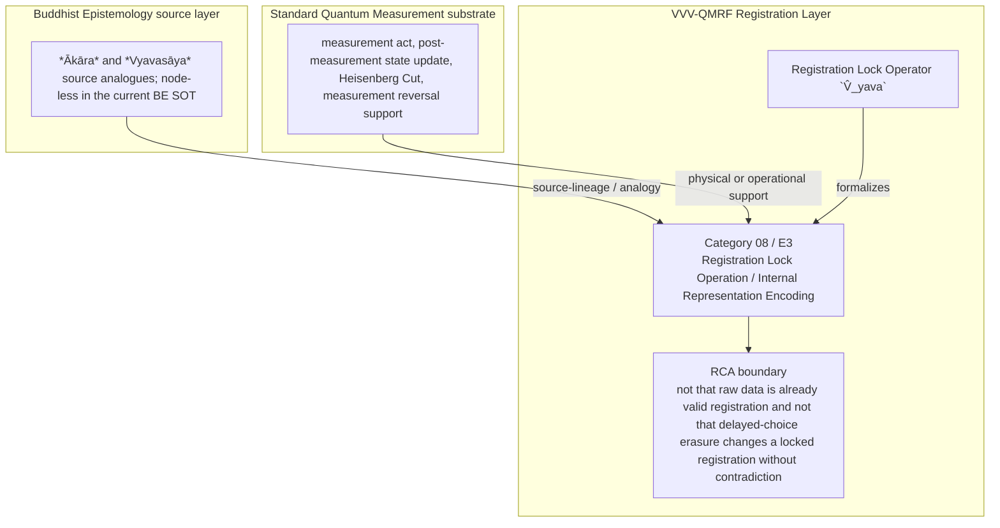

Author: VietVunVut (Viet - Nguyen Xuan); GitHub: https://github.com/AIhugART/; Facebook: https://www.facebook.com/xuanviet

# Formal Registration Category: Registration Lock Operation (BE source: Ākāra & Vyavasāya)
# Phạm trù Ghi nhận: Thao tác Khóa Ghi nhận (Nguồn BE: Ảnh tượng & Phán đoán)

**Framework:** VietVunVut Quantum Measurement Registration Framework (VVV-QMRF)
**Document type:** category
**Author:** VietVunVut (Viet - Nguyen Xuan)
**GitHub:** https://github.com/AIhugART/
**Facebook:** https://www.facebook.com/xuanviet
**Date:** 2026-05-11
**Status:** Proposal — Registration class D (Derived, awaiting formal verification)
**Lineage:** gap/ (BIAN-4, BIAN-5) → category/ (Category 08) → framework/ (E3)

> **Context / Ngữ cảnh:** This document formally establishes a new registration category for Quantum Mechanics (QM) to resolve structural gaps **BIAN-4 and BIAN-5** identified in the Buddhist Epistemology - Quantum Measurement mapping. These gaps highlight QM's failure to formalize the transition from a purely physical macroscopic state (e.g., a dial pointing to 'UP') to an actual K-side registration status (using *Ākāra* - internal representation, and *Vyavasāya* - registration lock in Buddhist-source lineage as bounded source analogues).
>
> *Tài liệu này chính thức thiết lập một phạm trù ghi nhận mới cho Cơ học Lượng tử (QM) nhằm giải quyết các khoảng trống cấu trúc **BIAN-4 và BIAN-5** được xác định trong bản đồ đối chiếu Nhận thức luận Phật giáo - Đo lường Lượng tử. Các lỗ hổng này chỉ ra sự thất bại của QM trong việc hình thức hóa bước chuyển tiếp từ một trạng thái vật lý vĩ mô thuần túy (ví dụ: kim đồng hồ chỉ chữ 'UP') sang một trạng thái ghi nhận phía K thực sự (dùng khái niệm Ākāra - Ảnh tượng nội tại, và Vyavasāya - Khóa ghi nhận trong logic Phật giáo như các đối chiếu nguồn có giới hạn).*

---

## 1. Category Identity / Định danh Phạm trù

* **English Name:** Registration Lock Operation / Internal Representation Encoding.
* **Vietnamese Name:** Thao tác Khóa Ghi nhận / Mã hóa Biểu tượng Nội tại.
* **Buddhist Source Analogue / Đối chiếu nguồn Phật giáo:** *Ākāra* (Internal form/representation) and *Vyavasāya* (Registration lock/determination).
* **Proposed Mathematical Symbol / Ký hiệu Toán học đề xuất:** Registration Lock Operator / Toán tử Khóa Ghi nhận $\hat{V}_{yava}$.

---

## 2. Definition / Định nghĩa

**English:**
A formal registration-lock operation that formalizes the registration transition across the "Heisenberg Cut" boundary at the registration layer. It takes the detector response generated by a physical measurement and encodes it as an internal representation (*Ākāra*), culminating in an irreversible registration lock (*Vyavasāya*) that updates the K-side registration state.

**Vietnamese:**
Là một thao tác khóa ghi nhận chính thức giúp hình thức hóa bước chuyển trạng thái ghi nhận qua ranh giới "Vết cắt Heisenberg" ở tầng ghi nhận. Nó lấy detector response do phép đo vật lý tạo ra, mã hóa thành một ảnh tượng nội tại (*Ākāra*), rồi khóa ghi nhận không thể đảo ngược (*Vyavasāya*) để cập nhật trạng thái ghi nhận phía K.

---

## 3. Formal Structure / Cấu trúc Hình thức

**English:**
Currently, QM assumes that once the physical pointer moves, the detector response is available. Under this new category, the process still needs a K-side registration lock:
1. **Detector Response (Nirvikalpaka as BE source):** The physical measurement leaves a detector response $D_i$ on the detector.
2. **Internal Representation Encoding Phase ($\hat{A}_{kāra}$):** The registering system's internal interface encodes $D_i$, generating an internal representation $\mathcal{M}_i$. This is still just data processing, not yet a locked registration status.
3. **The Registration Lock Act ($\hat{V}_{yava}$):** The operator $\hat{V}_{yava}$ acts upon $\mathcal{M}_i$. It resolves the K-side uncertainty and locks the registration state as registered status $D_i$. Only at this registration-lock moment does the K-side registration-state update close.

**Vietnamese:**
Hiện tại, QM giả định rằng một khi kim đo vật lý dịch chuyển, detector response đã có sẵn. Với phạm trù mới này, tiến trình vẫn cần khóa ghi nhận phía K:
1. **Detector Response (Nirvikalpaka là nguồn BE):** Phép đo vật lý để lại detector response $D_i$ trên máy dò.
2. **Pha Mã hóa Nội tại ($\hat{A}_{kāra}$):** Giao diện nội tại của hệ ghi nhận mã hóa $D_i$, tạo ra biểu tượng nội tại $\mathcal{M}_i$. Đây vẫn chỉ là quá trình xử lý dữ liệu, chưa phải trạng thái ghi nhận đã khóa.
3. **Hành động Khóa Ghi nhận ($\hat{V}_{yava}$):** Toán tử $\hat{V}_{yava}$ tác động lên $\mathcal{M}_i$. Nó xử lý bất định phía K và khóa trạng thái ghi nhận thành registered status $D_i$. Chỉ tại khoảnh khắc registration-lock này, cập nhật trạng thái ghi nhận phía K mới khép lại.

---

## 4. Foundational Implications / Ý nghĩa Nền tảng

BIAN-4, BIAN-5 resolution: Registration Lock Operation / Internal Representation Encoding supplies the missing registration-layer category for standard QM describes physical pointer traces, but does not formalize the K-side encoding and lock that turns trace into registered status. Formalizing RLO has three bounded implications:

1. It opens the black box between pointer trace and registered status.
2. It names the lock moment where K-side uncertainty ends.
3. It supplies boundaries for delayed-choice and erasure language.

> **Conclusion:** Registration Lock Operation / Internal Representation Encoding resolves BIAN-4, BIAN-5 only as a VVV-QMRF registration-layer category. It preserves the standard QM substrate while adding the missing K-side classification and validity boundary.

---

## 5. RCA Concept Traceability Matrix / Bảng Truy vết RCA Khái niệm

**Purpose / Mục đích:** This table records traceability for the main concepts used in this category. It separates direct SOT evidence, framework-derived proposals, QM-only support, and boundary-sensitive applications so that Registration Lock Operation / Internal Representation Encoding is not confused with ordinary canonical QM or with an unrestricted Buddhist equivalence.

**RCA labels / Nhãn RCA:**
- **Strong:** direct node/edge or SOT evidence exists.
- **Medium:** structurally supported, but not a direct concept-node equivalence.
- **Derived:** proposed by this category/framework, not a source-system node.
- **QM-only:** supported in QM only, not Buddhist Epistemology.
- **No node:** no dedicated node/edge exists in the current SOT.
- **Overclaim:** wording is stronger than the traceable evidence.
- **External:** external experimental or historical support, not a current SOT node.

| Claim anchor | Concept | Evidence / Bằng chứng truy vết | Node code | Edge code | RCA label | Boundary / Fix note |
|---|---|---|---|---|---|---|
| §1-§2 | BIAN-4, BIAN-5 / gap diagnosis | BIAN SOT resolves this gap through Category 08 + E3. | —; support: N_BE_00008, N_BE_00009 | ED_BE_00015; ED_BE_00144-ED_BE_00146 | Strong / No node | Gap diagnosis is not by itself an empirical proof; it identifies the missing registration category. |
| §1-§2 | Registration Lock Operation / Internal Representation Encoding | VVV-QM RCA assigns the category support in node_QM_VVV. | N_QM_VVV_00021; N_QM_VVV_00022; N_QM_VVV_00023; N_QM_VVV_00024 | — | Derived | Framework category; not a canonical QM postulate unless independently validated. |
| §1 | BE source analogue | *Ākāra* and *Vyavasāya* source analogues; node-less in the current BE SOT | —; support: N_BE_00008, N_BE_00009 | ED_BE_00015; ED_BE_00144-ED_BE_00146 | Medium | Source lineage or analogy; do not collapse BE ontology into QM physics. |
| §2-§3 | QM substrate | measurement act, post-measurement state update, Heisenberg Cut, measurement reversal support | N_QM_00019; N_QM_00022; N_QM_00094; N_QM_00102 | ED_QM_00019; ED_QM_00014; ED_QM_00107; ED_QM_00115 | QM-only | Canonical QM supports the physical substrate, not the whole VVV-QMRF category; the Heisenberg Cut is treated as an interpretive boundary, not a physical barrier. |
| §3 | Formal symbol / operator | Registration Lock Operator `V̂_yava` | N_QM_VVV_00021; N_QM_VVV_00022; N_QM_VVV_00023; N_QM_VVV_00024 | — | Derived | Framework notation; do not cite as a source-system operator. |
| §4 | Category implication | Separate detector response, internal representation encoding, and terminal registration lock before declaring registered status. | N_QM_VVV_00021; N_QM_VVV_00022; N_QM_VVV_00023; N_QM_VVV_00024 | — | Medium | Valid only within the stated registration-layer boundary. |
| §4 | Overclaim risk | not that raw data is already valid registration and not that delayed-choice erasure changes a locked registration without contradiction | — | — | Overclaim | Keep wording conditional and registration-layer specific. |

### 5.1. RCA Summary / Tóm tắt RCA

1. **BIAN-4, BIAN-5 is a structural gap, not a direct physical discovery.** The gap identifies missing registration architecture.
2. **The BE source is bounded.** *Ākāra* and *Vyavasāya* source analogues; node-less in the current BE SOT anchors the analogy or source lineage, but does not automatically become a QM mechanism.
3. **The QM substrate is real but insufficient.** measurement act, post-measurement state update, Heisenberg Cut, measurement reversal support provides support, while Registration Lock Operation / Internal Representation Encoding names the added K-side layer.
4. **The VVV node(s) are derived.** N_QM_VVV_00021; N_QM_VVV_00022; N_QM_VVV_00023; N_QM_VVV_00024 belong to the framework proposal and should be labeled as derived unless later validated.
5. **Boundary control is mandatory.** The main overclaim to avoid is: not that raw data is already valid registration and not that delayed-choice erasure changes a locked registration without contradiction.

### 5.2. RCA Five-Step Analysis / Phân tích RCA 5 bước

#### 5.2.1 Define — observed issue / Xác định vấn đề

**Symptom:** The old formulation can make Registration Lock Operation / Internal Representation Encoding look like either ordinary QM vocabulary or a direct Buddhist-QM equivalence.

**Cause:** The category document did not fully separate BE source support, canonical QM substrate, VVV-QMRF derived formalism, and boundary-sensitive claims.

#### 5.2.2 Trace — 5 Whys / Truy nguyên 5 lần hỏi “vì sao”

1. **Why does the ambiguity appear?** Because the same words describe source analogy, physical measurement support, and framework proposal.
2. **Why is that a schema problem?** Because older category files lacked a complete RCA matrix and assertion-boundary section.
3. **Why can this create overclaim?** Because a derived registration category may be read as a canonical QM postulate or as a literal BE equivalence.
4. **Why is traceability required?** Because each claim needs a node/edge, QM substrate, or explicit `No node` status.
5. **Why does Category 08 exist?** Because BIAN-4, BIAN-5 isolates a registration-layer gap: standard QM describes physical pointer traces, but does not formalize the K-side encoding and lock that turns trace into registered status.

#### 5.2.3 Isolate — root cause / Cô lập nguyên nhân gốc

**Root cause:** The document needed explicit schema-level separation between source-system evidence, QM support, VVV-derived notation, and boundary conditions.

#### 5.2.4 Fix — corrected formulation / Sửa đúng nguyên nhân

Use this bounded formulation when precision is required:

```text
Registration Lock Operation / Internal Representation Encoding = a VVV-QMRF registration-layer category for BIAN-4, BIAN-5.
BE source: *Ākāra* and *Vyavasāya* source analogues; node-less in the current BE SOT.
QM substrate: measurement act, post-measurement state update, Heisenberg Cut, measurement reversal support.
VVV formalism: Registration Lock Operator `V̂_yava` / N_QM_VVV_00021; N_QM_VVV_00022; N_QM_VVV_00023; N_QM_VVV_00024.
Boundary: not that raw data is already valid registration and not that delayed-choice erasure changes a locked registration without contradiction.
```

#### 5.2.5 Verify — root cause removed / Kiểm chứng đã loại bỏ nguyên nhân gốc

The ambiguity is removed if every use of Category 08 distinguishes:

```text
BE source analogue = *Ākāra* and *Vyavasāya* source analogues; node-less in the current BE SOT.
QM substrate = measurement act, post-measurement state update, Heisenberg Cut, measurement reversal support.
VVV-QMRF category = Registration Lock Operation / Internal Representation Encoding.
Formal symbol = Registration Lock Operator `V̂_yava`.
Boundary = not that raw data is already valid registration and not that delayed-choice erasure changes a locked registration without contradiction.
```

### 5.3. Gap Type Classification / Phân loại Loại Khoảng trống

| Gap aspect | Classification | RCA note |
|---|---|---|
| Source gap | **BIAN-4, BIAN-5** | Standard qm describes physical pointer traces, but does not formalize the k-side encoding and lock that turns trace into registered status. |
| Gap type | **Detector-response to registered-status gap** | The missing piece is a registration-category distinction, not merely a prettier sentence. |
| Resolution type | **Category + framework postulate** | Category 08 supplies the detailed category; E3 installs it into VVV-QMRF architecture. |
| Why not only canonical QM? | Canonical QM supports the substrate but not the K-side classification. | Use QM nodes as support, not as proof that the category already exists in standard QM. |
| Boundary | **node-less BE analogues; derived registration-lock category** | Keep labels such as Derived, Medium, No node, or QM-only visible in publication-facing prose. |

### 5.4. Prototype RLO Instance / Trường hợp Mẫu của RLO

```text
Prototype RLO instance:

  Setup: detector leaves a physical trace `D_i`.
  Event: registering interface encodes `D_i` into an internal representation.
  Gate: `V̂_yava` determines whether the representation locks as registered status.
  Update: registration-state update closes only after the lock.
  Contrast: pre-lock erasure and post-lock contradiction remain distinct.

  → RLO instance confirmed only within its boundary.
```

**RCA boundary:** The prototype is valid only when the stated source support, QM substrate, and registration-validity conditions are all kept distinct.

### 5.5. Layer Architecture Position / Vị trí trong Kiến trúc Tầng

```text
gap/BIAN-4, BIAN-5
  ↓ diagnoses missing registration structure
category/Category 08 — Registration Lock Operation / Internal Representation Encoding
  ↓ specifies detailed category and boundary conditions
framework/E3
  ↓ installs the rule into VVV-QMRF postulate architecture
VVV-QMRF registration-state update layer
  ↓ applies the category without replacing canonical QM physics
```

| Layer | Document / component | Role |
|---|---|---|
| Gap | BIAN-4, BIAN-5 | Diagnoses the missing registration distinction. |
| Category | Category 08 | Defines the detailed registration category. |
| Framework | E3 | Promotes the category into postulate-level architecture. |
| BE source | *Ākāra* and *Vyavasāya* source analogues; node-less in the current BE SOT | Supplies source-lineage or analogy under RCA boundary. |
| QM substrate | measurement act, post-measurement state update, Heisenberg Cut, measurement reversal support | Supplies physical or operational support only. |

---

## 6. Assertion Level / Mức Khẳng định

| Component EN | Thành phần VN | RCA assertion class | Evidence / Boundary |
|---|---|---|---|
| BE source supports the category lineage | Nguồn BE hỗ trợ dòng nguồn của phạm trù | **M** — source-supported | —; support: N_BE_00008, N_BE_00009; ED_BE_00015; ED_BE_00144-ED_BE_00146. |
| QM provides the physical substrate | QM cung cấp nền vật lý | **M / QM-only** | N_QM_00019; N_QM_00022; N_QM_00094; N_QM_00102; ED_QM_00019; ED_QM_00014; ED_QM_00107; ED_QM_00115. |
| Registration Lock Operation / Internal Representation Encoding is a VVV-QMRF category | Thao tác Khóa Ghi nhận / Mã hóa Biểu tượng Nội tại là phạm trù VVV-QMRF | **D** — framework-derived | N_QM_VVV_00021; N_QM_VVV_00022; N_QM_VVV_00023; N_QM_VVV_00024; E3. |
| Registration Lock Operator `V̂_yava` formalizes the category | Registration Lock Operator `V̂_yava` hình thức hóa phạm trù | **D** — notation-derived | Framework notation, not a canonical source-system operator. |
| The category resolves BIAN-4, BIAN-5 | Phạm trù giải quyết BIAN-4, BIAN-5 | **D / M** — bounded resolution | Resolution holds at registration-layer architecture level. |
| Boundary-free reading of the category | Cách đọc không ranh giới về phạm trù | **O** — overclaim | not that raw data is already valid registration and not that delayed-choice erasure changes a locked registration without contradiction. |

**Summary / Tóm tắt:** The category is traceable as a VVV-QMRF registration-layer proposal. Its BE source and QM substrate support the architecture, but neither should be overstated as a direct one-to-one physical equivalence.

---

## 7. What Category 08 / E3 Does NOT Claim / Những gì Category 08 / E3 KHÔNG tuyên bố

1. **Not a canonical QM replacement** — Registration Lock Operation / Internal Representation Encoding is a VVV-QMRF registration-layer proposal built beside standard QM support.
   *Không thay thế QM chuẩn; đây là tầng ghi nhận VVV-QMRF đặt bên cạnh nền vật lý QM.*

2. **Not unrestricted equivalence with the BE source** — *Ākāra* and *Vyavasāya* source analogues; node-less in the current BE SOT supplies source-lineage or analogy only within the stated boundary.
   *Không đồng nhất vô điều kiện với nguồn BE; nguồn BE chỉ làm mô hình nguồn hoặc phép tương tự có ranh giới.*

3. **Not boundary-free application** — not that raw data is already valid registration and not that delayed-choice erasure changes a locked registration without contradiction.
   *Không áp dụng tự do ngoài điều kiện hợp lệ đã nêu.*

4. **Not a detector-engineering shortcut** — validity still depends on calibration, context, and the relevant E10-style gate where applicable.
   *Không bỏ qua hiệu chuẩn, bối cảnh, hoặc cổng hợp lệ kiểu E10 khi cần.*

5. **Not an empirical proof of a new physical mechanism** — the category remains derived unless formal predictions and tests are supplied.
   *Chưa phải bằng chứng thực nghiệm cho cơ chế vật lý mới nếu chưa có dự đoán và kiểm nghiệm.*

6. **Not human-consciousness dependence** — registration-state update is a K-side framework term broader than human cognition.
   *Không phụ thuộc ý thức con người; cập nhật trạng thái ghi nhận là thuật ngữ tầng K rộng hơn cognition của người.*

---

## 8. Vietnamese Explanation / Giải thích tiếng Việt rõ ràng

Nói đơn giản, Category 08 / E3 xử lý câu hỏi:

```text
Trong trường hợp này, cái gì thật sự được ghi nhận ở tầng K,
và điều kiện nào làm cho ghi nhận đó hợp lệ?
```

Câu trả lời của VVV-QMRF là:

```text
Kim máy đo chỉ sang `UP` chưa tự động là ghi nhận đã khóa. Category 08 thêm bước mã hóa nội tại và bước `registration lock` để biết khi nào dữ liệu trở thành trạng thái ghi nhận.
```

Ranh giới cần nhớ:

```text
BE source không tự động trở thành cơ chế vật lý QM.
QM substrate không tự động chứa toàn bộ category VVV-QMRF.
VVV-QMRF thêm tầng registration-state update / cập nhật trạng thái ghi nhận.
Nếu thiếu điều kiện hợp lệ, claim phải bị hạ xuống Medium, Derived, No node, hoặc Overclaim.
```

---

## 9. Mermaid Diagram Map / Sơ đồ Mermaid

### 9.1 Local Arrow Semantics / Quy ước mũi tên local

This table explains only the arrows used in this diagram. It follows the broader Arrow Semantics rule in `documents/research_documents/vvv-qmrf/schema_guide.md`.

Bảng này chỉ giải thích các mũi tên dùng trong sơ đồ này. Nó tuân theo quy tắc Arrow Semantics rộng hơn trong `documents/research_documents/vvv-qmrf/schema_guide.md`.

| Diagram arrow label | Local meaning | Must not imply |
|---|---|---|
| `source-lineage / analogy` | The Buddhist Epistemology source supplies bounded source lineage or structural analogy for the VVV-QMRF registration category. | Direct identity between Buddhist ontology and Quantum Mechanics. |
| `physical or operational support` | Standard Quantum Mechanics supplies the physical or operational substrate that the registration category analyzes. | Replacement or modification of Standard Quantum Mechanics probability or state-update rules. |
| `formalizes` | The proposed VVV-QMRF notation formalizes the registration-layer category. | A canonical Quantum Mechanics operator or experimentally validated physical mechanism by itself. |
| Unlabeled category-to-boundary arrow | The category must be read under its RCA boundary. | Boundary-free application outside the stated registration conditions. |



---

*Source: BIAN_index_SOT.md (BIAN-4, BIAN-5), system_be_full.md (Ākāra/Vyavasāya node-less status with conceptual support), SYSTEM_Quantum_Measurement/system_qm_full.md, node_QM_VVV.md (N_QM_VVV_00021-00024), framework/vvv_qmrf_framework_e03_registration_lock_postulate.md*

---

## Schema Validation Checklist / Checklist Kiểm chứng Schema

| Check | Status | RCA note |
|---|---|---|
| Document type declared | Pass | Declared as `category` for schema alignment. |
| Source traceability | Pass | Existing source/cross-reference sections provide the trace base. |
| Claim traceability | Pass | Existing assertion/claim sections classify the major claims. |
| Boundary / non-claim guardrail | Pass | Existing boundary/non-claim text limits overclaiming. |
| Validation rule | Pass | Reuse only with source, claim type, and boundary preserved; unresolved items must be marked `TODO(HOTFIX)` before publication use. |
