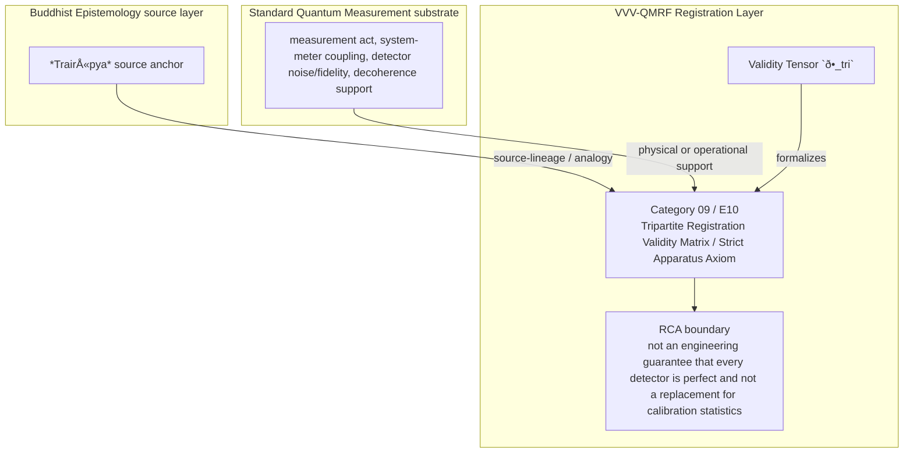

Author: VietVunVut (Viet - Nguyen Xuan); GitHub: https://github.com/AIhugART/; Facebook: https://www.facebook.com/xuanviet

# Formal Registration Category: Tripartite Registration Validity Matrix (Trairūpya)
# Phạm trù Ghi nhận: Ma trận Hợp lệ Ghi nhận Tam phân (Ba điều kiện của Logic)

**Framework:** VietVunVut Quantum Measurement Registration Framework (VVV-QMRF)
**Author:** VietVunVut (Viet - Nguyen Xuan)
**GitHub:** https://github.com/AIhugART/
**Facebook:** https://www.facebook.com/xuanviet
**Date:** 2026-05-11
**Status:** Proposal — Registration class D (Derived, awaiting formal verification)
**Lineage:** gap/ (BIAN-14) → category/ (Category 09) → framework/ (E10)

> **Context / Ngữ cảnh:** This document formally establishes a new registration category for Quantum Mechanics (QM) to resolve structural gap **BIAN-14** identified in the Buddhist Epistemology - Quantum Measurement mapping. BIAN-14 highlights QM's lack of a rigorous, formal logical criterion to distinguish a true registration-valid measurement apparatus from mere random environmental noise, using Dignāga's *Trairūpya* as an inspired source analogue rather than as a direct apparatus doctrine.
>
> *Tài liệu này chính thức thiết lập một phạm trù ghi nhận mới cho Cơ học Lượng tử (QM) nhằm giải quyết khoảng trống cấu trúc **BIAN-14** được xác định trong bản đồ đối chiếu Nhận thức luận Phật giáo - Đo lường Lượng tử. BIAN-14 chỉ ra sự thiếu hụt của QM về một tiêu chuẩn logic hình thức khắt khe nhằm phân biệt một máy đo có ghi nhận hợp lệ với những nhiễu loạn môi trường ngẫu nhiên, dùng Trairūpya của Dignāga như một mô hình nguồn được gợi hứng, không phải như học thuyết trực tiếp về apparatus vật lý.*

---

## 1. Category Identity / Định danh Phạm trù

* **English Name:** Tripartite Registration Validity Matrix / Strict Apparatus Axiom.
* **Vietnamese Name:** Ma trận Hợp lệ Ghi nhận Tam phân / Tiên đề Máy đo Khắt khe.
* **Buddhist Framework Source Analogue / Mô hình nguồn trong Hệ thống Phật giáo:** *Trairūpya* (The three necessary and sufficient conditions for a valid inferential sign, not a direct doctrine about physical apparatus).
* **Proposed Mathematical Symbol / Ký hiệu Toán học đề xuất:** Validity Tensor / Tensor Hợp lệ $\mathbb{V}_{tri}$.

---

## 2. Definition / Định nghĩa

**English:**
A proposed registration-validity matrix defining three boundary conditions that a physical Hamiltonian interaction ($H_{int}$) must satisfy before VVV-QMRF classifies its detector response as a formal "Measurement - registration" event.

**Vietnamese:**
Một ma trận hợp lệ ghi nhận đề xuất định nghĩa ba điều kiện biên mà tương tác Hamiltonian vật lý ($H_{int}$) phải thỏa mãn trước khi VVV-QMRF phân loại detector response của nó thành một "Measurement - registration" chính thức.

---

## 3. Formal Structure / Cấu trúc Hình thức

**English:**
Standard QM already distinguishes physical interaction, decoherence, and measurement, but VVV-QMRF needs an explicit registration-validity boundary. The *Tripartite Validity Matrix* proposes three filters inspired by Buddhist Logic (*Trairūpya*). In classical Dignāga logic, Pakṣadharmatā, Sapakṣasattva, and Vipakṣāsattva evaluate a *hetu* (reason/mark) in inference, not a physical apparatus; VVV-QMRF uses them only as a structural template for an apparatus validity gate:
1. **Condition 1: Pakṣadharmatā (Presence in the Subject):** A non-zero, direct Hamiltonian coupling should exist between the specific observable of the quantum system and the pointer basis of the apparatus. (The detector physically couples to the particle).
2. **Condition 2: Sapaká¹£asattva (Positive Concomitance):** In calibration trials, when the system is prepared in eigenstate $|\lambda_i\rangle$, the apparatus should yield pointer state $|A_i\rangle$ with specified high fidelity. (The detector response tracks the target condition).
3. **Condition 3: Vipakṣāsattva (Negative Concomitance / Exclusivity):** When the system is in an orthogonal state $|\lambda_j\rangle$ (or absent), false-positive response should be constrained by an explicit validity threshold, ideally zero in the idealized model.

**Vietnamese:**
QM tiêu chuẩn đã phân biệt tương tác vật lý, decoherence, và measurement, nhưng VVV-QMRF cần một ranh giới hợp lệ ghi nhận rõ ràng. *Ma trận Hợp lệ Ghi nhận Tam phân* đề xuất ba bộ lọc lấy cảm hứng từ Logic học Phật giáo (*Trairūpya*). Trong Dignāga cổ điển, Pakṣadharmatā, Sapakṣasattva, và Vipakṣāsattva kiểm tra *hetu* (lý do/dấu hiệu) trong suy luận, không kiểm tra apparatus vật lý; VVV-QMRF chỉ dùng chúng như khuôn mẫu cấu trúc cho cổng hợp lệ của apparatus:
1. **Điều kiện 1: Pakṣadharmatā (Sự hiện diện ở Chủ thể):** Nên tồn tại một liên kết Hamiltonian trực tiếp, khác không giữa đại lượng cần đo của hệ lượng tử và cơ sở kim đo của cỗ máy. (Máy dò ghép nối vật lý với hạt).
2. **Điều kiện 2: Sapakṣasattva (Sự hiện diện ở Đồng vị):** Trong các thử nghiệm hiệu chuẩn, khi hệ thống được chuẩn bị ở trạng thái $|\lambda_i\rangle$, máy đo nên cho ra trạng thái kim $|A_i\rangle$ với độ chính xác cao được quy định. (Detector response bám theo điều kiện mục tiêu).
3. **Điều kiện 3: Vipakṣāsattva (Sự vắng mặt ở Dị vị / Tính Độc quyền):** Khi hệ thống ở trạng thái trực giao $|\lambda_j\rangle$ (hoặc trống rỗng), phản hồi dương tính giả nên bị ràng buộc bởi một ngưỡng hợp lệ rõ ràng, lý tưởng là bằng không trong mô hình lý tưởng hóa.

---

## 4. Foundational Implications / Ý nghĩa Nền tảng

BIAN-14 resolution: Tripartite Registration Validity Matrix / Strict Apparatus Axiom supplies the missing registration-layer category for QM has physical interaction and detector theory, but VVV-QMRF needs explicit registration-validity criteria for when an interaction counts as measurement-registration. Formalizing TRVM has three bounded implications:

1. It supplies the validity gate used by later categories such as VAR and TOM.
2. It distinguishes random environmental interaction from registration-valid measurement.
3. It keeps the three Buddhist logic conditions as a criteria-set rather than three unrelated nodes.

> **Conclusion:** Tripartite Registration Validity Matrix / Strict Apparatus Axiom resolves BIAN-14 only as a VVV-QMRF registration-layer category. It preserves the standard QM substrate while adding the missing K-side classification and validity boundary.

---

## 5. RCA Concept Traceability Matrix / Bảng Truy vết RCA Khái niệm

**Purpose / Mục đích:** This table records traceability for the main concepts used in this category. It separates direct SOT evidence, framework-derived proposals, QM-only support, and boundary-sensitive applications so that Tripartite Registration Validity Matrix / Strict Apparatus Axiom is not confused with ordinary canonical QM or with an unrestricted Buddhist equivalence.

**RCA labels / Nhãn RCA:**
- **Strong:** direct node/edge or SOT evidence exists.
- **Medium:** structurally supported, but not a direct concept-node equivalence.
- **Derived:** proposed by this category/framework, not a source-system node.
- **QM-only:** supported in QM only, not Buddhist Epistemology.
- **No node:** no dedicated node/edge exists in the current SOT.
- **Overclaim:** wording is stronger than the traceable evidence.
- **External:** external experimental or historical support, not a current SOT node.

| Claim anchor | Concept | Evidence / Bằng chứng truy vết | Node code | Edge code | RCA label | Boundary / Fix note |
|---|---|---|---|---|---|---|
| §1-§2 | BIAN-14 / gap diagnosis | BIAN SOT resolves this gap through Category 09 + E10. | N_BE_00018; support: N_BE_00210, N_BE_00211, N_BE_00212, N_BE_00213 | ED_BE_00008; ED_BE_00108; ED_BE_00109; ED_BE_00110 | Strong / No node | Gap diagnosis is not by itself an empirical proof; it identifies the missing registration category. |
| §1-§2 | Tripartite Registration Validity Matrix / Strict Apparatus Axiom | VVV-QM RCA assigns the category support in node_QM_VVV. | N_QM_VVV_00042; N_QM_VVV_00043; support: N_QM_VVV_00032 | — | Derived | Framework category; not a canonical QM postulate unless independently validated. |
| §1 | BE source analogue | *Trairūpya* source anchor; classical conditions apply to inferential *hetu* | N_BE_00018; support: N_BE_00210, N_BE_00211, N_BE_00212, N_BE_00213 | ED_BE_00008; ED_BE_00108; ED_BE_00109; ED_BE_00110 | Medium | Source lineage or analogy; do not collapse BE inferential logic into a direct physical-apparatus doctrine. |
| §2-§3 | QM substrate | measurement act, system-meter coupling, detector noise/fidelity, decoherence support | N_QM_00019; N_QM_00021; N_QM_00061; N_QM_00095 | ED_QM_00019; ED_QM_00021; ED_QM_00024; ED_QM_00041 | QM-only | Canonical QM supports the physical substrate, not the whole VVV-QMRF category. |
| §3 | Formal symbol / operator | Validity Tensor `𝕍_tri` | N_QM_VVV_00042; N_QM_VVV_00043; support: N_QM_VVV_00032 | — | Derived | Framework notation; do not cite as a source-system operator. |
| §4 | Category implication | Use Trairūpya-inspired coupling, positive calibration, and false-positive exclusion as a validity gate for registration status. | N_QM_VVV_00042; N_QM_VVV_00043; support: N_QM_VVV_00032 | — | Medium | Valid only within the stated registration-layer boundary. |
| §4 | Overclaim risk | not an engineering guarantee that every detector is perfect and not a replacement for calibration statistics | — | — | Overclaim | Keep wording conditional and registration-layer specific. |

### 5.1. RCA Summary / Tóm tắt RCA

1. **BIAN-14 is a structural gap, not a direct physical discovery.** The gap identifies missing registration architecture.
2. **The BE source is bounded.** *Trairūpya* source anchor anchors the analogy or source lineage; its classical conditions evaluate an inferential *hetu*, so they do not automatically become a QM mechanism or apparatus doctrine.
3. **The QM substrate is real but insufficient.** measurement act, system-meter coupling, detector noise/fidelity, decoherence support provides support, while Tripartite Registration Validity Matrix / Strict Apparatus Axiom names the added K-side layer.
4. **The VVV node(s) are derived.** N_QM_VVV_00042; N_QM_VVV_00043; support: N_QM_VVV_00032 belong to the framework proposal and should be labeled as derived unless later validated.
5. **Boundary control is mandatory.** The main overclaim to avoid is: not an engineering guarantee that every detector is perfect and not a replacement for calibration statistics.

### 5.2. RCA Five-Step Analysis / Phân tích RCA 5 bước

#### 5.2.1 Define — observed issue / Xác định vấn đề

**Symptom:** The old formulation can make Tripartite Registration Validity Matrix / Strict Apparatus Axiom look like either ordinary QM vocabulary or a direct Buddhist-QM equivalence.

**Cause:** The category document did not fully separate BE source support, canonical QM substrate, VVV-QMRF derived formalism, and boundary-sensitive claims.

#### 5.2.2 Trace — 5 Whys / Truy nguyên 5 lần hỏi “vì sao”

1. **Why does the ambiguity appear?** Because the same words describe source analogy, physical measurement support, and framework proposal.
2. **Why is that a schema problem?** Because older category files lacked a complete RCA matrix and assertion-boundary section.
3. **Why can this create overclaim?** Because a derived registration category may be read as a canonical QM postulate or as a literal BE equivalence.
4. **Why is traceability required?** Because each claim needs a node/edge, QM substrate, or explicit `No node` status.
5. **Why does Category 09 exist?** Because BIAN-14 isolates a registration-layer gap: QM has physical interaction and detector theory, but VVV-QMRF needs explicit registration-validity criteria for when an interaction counts as measurement-registration.

#### 5.2.3 Isolate — root cause / Cô lập nguyên nhân gốc

**Root cause:** The document needed explicit schema-level separation between source-system evidence, QM support, VVV-derived notation, and boundary conditions.

#### 5.2.4 Fix — corrected formulation / Sửa đúng nguyên nhân

Use this bounded formulation when precision is required:

```text
Tripartite Registration Validity Matrix / Strict Apparatus Axiom = a VVV-QMRF registration-layer category for BIAN-14.
BE source: *Trairūpya* source anchor, whose classical conditions evaluate an inferential *hetu* rather than a physical apparatus.
QM substrate: measurement act, system-meter coupling, detector noise/fidelity, decoherence support.
VVV formalism: Validity Tensor `𝕍_tri` / N_QM_VVV_00042; N_QM_VVV_00043; support: N_QM_VVV_00032.
Boundary: not an engineering guarantee that every detector is perfect and not a replacement for calibration statistics.
```

#### 5.2.5 Verify — root cause removed / Kiểm chứng đã loại bỏ nguyên nhân gốc

The ambiguity is removed if every use of Category 09 distinguishes:

```text
BE source analogue = *Trairūpya* source anchor; classical *hetu* criteria are structurally adapted, not transferred as apparatus doctrine.
QM substrate = measurement act, system-meter coupling, detector noise/fidelity, decoherence support.
VVV-QMRF category = Tripartite Registration Validity Matrix / Strict Apparatus Axiom.
Formal symbol = Validity Tensor `𝕍_tri`.
Boundary = not an engineering guarantee that every detector is perfect and not a replacement for calibration statistics.
```

### 5.3. Gap Type Classification / Phân loại Loại Khoảng trống

| Gap aspect | Classification | RCA note |
|---|---|---|
| Source gap | **BIAN-14** | Qm has physical interaction and detector theory, but vvv-qmrf needs explicit registration-validity criteria for when an interaction counts as measurement-registration. |
| Gap type | **Apparatus validity criterion gap** | The missing piece is a registration-category distinction, not merely a prettier sentence. |
| Resolution type | **Category + framework postulate** | Category 09 supplies the detailed category; E10 installs it into VVV-QMRF architecture. |
| Why not only canonical QM? | Canonical QM supports the substrate but not the K-side classification. | Use QM nodes as support, not as proof that the category already exists in standard QM. |
| Boundary | **source-supported BE criteria; derived registration-validity gate** | Keep labels such as Derived, Medium, No node, or QM-only visible in publication-facing prose. |

### 5.4. Prototype TRVM Instance / Trường hợp Mẫu của TRVM

```text
Prototype TRVM instance:

  Setup: apparatus is proposed as a valid registering system.
  Event: Hamiltonian coupling to the target observable is present.
  Gate: positive calibration and negative-control exclusion pass thresholds.
  Update: detector response receives measurement-registration status.
  Contrast: failure of the gate downgrades the response to noise or registration error.

  → TRVM instance confirmed only within its boundary.
```

**RCA boundary:** The prototype is valid only when the stated source support, QM substrate, and registration-validity conditions are all kept distinct.

### 5.5. Layer Architecture Position / Vị trí trong Kiến trúc Tầng

```text
gap/BIAN-14
  ↓ diagnoses missing registration structure
category/Category 09 — Tripartite Registration Validity Matrix / Strict Apparatus Axiom
  ↓ specifies detailed category and boundary conditions
framework/E10
  ↓ installs the rule into VVV-QMRF postulate architecture
VVV-QMRF registration-state update layer
  ↓ applies the category without replacing canonical QM physics
```

| Layer | Document / component | Role |
|---|---|---|
| Gap | BIAN-14 | Diagnoses the missing registration distinction. |
| Category | Category 09 | Defines the detailed registration category. |
| Framework | E10 | Promotes the category into postulate-level architecture. |
| BE source | *Trairūpya* source anchor | Supplies source-lineage or analogy under RCA boundary. |
| QM substrate | measurement act, system-meter coupling, detector noise/fidelity, decoherence support | Supplies physical or operational support only. |

---

## 6. Assertion Level / Mức Khẳng định

| Component EN | Thành phần VN | Epistemic class | Evidence / Boundary |
|---|---|---|---|
| BE source supports the category lineage | Nguồn BE hỗ trợ dòng nguồn của phạm trù | **M** — source-supported | N_BE_00018; support: N_BE_00210, N_BE_00211, N_BE_00212, N_BE_00213; ED_BE_00008; ED_BE_00108; ED_BE_00109; ED_BE_00110. |
| QM provides the physical substrate | QM cung cấp nền vật lý | **M / QM-only** | N_QM_00019; N_QM_00021; N_QM_00061; N_QM_00095; ED_QM_00019; ED_QM_00021; ED_QM_00024; ED_QM_00041. |
| Tripartite Registration Validity Matrix / Strict Apparatus Axiom is a VVV-QMRF category | Ma trận Hợp lệ Ghi nhận Tam phân / Tiên đề Máy đo Khắt khe là phạm trù VVV-QMRF | **D** — framework-derived | N_QM_VVV_00042; N_QM_VVV_00043; support: N_QM_VVV_00032; E10. |
| Validity Tensor `𝕍_tri` formalizes the category | Validity Tensor `𝕍_tri` hình thức hóa phạm trù | **D** — notation-derived | Framework notation, not a canonical source-system operator. |
| The category resolves BIAN-14 | Phạm trù giải quyết BIAN-14 | **D / M** — bounded resolution | Resolution holds at registration-layer architecture level. |
| Boundary-free reading of the category | Cách đọc không ranh giới về phạm trù | **O** — overclaim | not an engineering guarantee that every detector is perfect and not a replacement for calibration statistics. |

**Summary / Tóm tắt:** The category is traceable as a VVV-QMRF registration-layer proposal. Its BE source and QM substrate support the architecture, but neither should be overstated as a direct one-to-one physical equivalence.

---

## 7. What Category 09 / E10 Does NOT Claim / Những gì Category 09 / E10 KHÔNG tuyên bố

1. **Not a canonical QM replacement** — Tripartite Registration Validity Matrix / Strict Apparatus Axiom is a VVV-QMRF registration-layer proposal built beside standard QM support.
   *Không thay thế QM chuẩn; đây là tầng ghi nhận VVV-QMRF đặt bên cạnh nền vật lý QM.*

2. **Not unrestricted equivalence with the BE source** — *Trairūpya* source anchor supplies source-lineage or analogy only within the stated boundary; Pakṣadharmatā, Sapakṣasattva, and Vipakṣāsattva classically evaluate *hetu* in inference, not physical apparatus.
   *Không đồng nhất vô điều kiện với nguồn BE; nguồn BE chỉ làm mô hình nguồn hoặc phép tương tự có ranh giới. Pakṣadharmatā, Sapakṣasattva, và Vipakṣāsattva trong nghĩa cổ điển kiểm tra *hetu* trong suy luận, không kiểm tra apparatus vật lý.*

3. **Not boundary-free application** — not an engineering guarantee that every detector is perfect and not a replacement for calibration statistics.
   *Không áp dụng tự do ngoài điều kiện hợp lệ đã nêu.*

4. **Not a detector-engineering shortcut** — validity still depends on calibration, context, and the relevant E10-style gate where applicable.
   *Không bỏ qua hiệu chuẩn, bối cảnh, hoặc cổng hợp lệ kiểu E10 khi cần.*

5. **Not an empirical proof of a new physical mechanism** — the category remains derived unless formal predictions and tests are supplied.
   *Chưa phải bằng chứng thực nghiệm cho cơ chế vật lý mới nếu chưa có dự đoán và kiểm nghiệm.*

6. **Not human-consciousness dependence** — registration-state update is a K-side framework term broader than human cognition.
   *Không phụ thuộc ý thức con người; cập nhật trạng thái ghi nhận là thuật ngữ tầng K rộng hơn cognition của người.*

---

## 8. Vietnamese Explanation / Giải thích tiếng Việt rõ ràng

Nói đơn giản, Category 09 / E10 xử lý câu hỏi:

```text
Trong trường hợp này, cái gì thật sự được ghi nhận ở tầng K,
và điều kiện nào làm cho ghi nhận đó hợp lệ?
```

Câu trả lời của VVV-QMRF là:

```text
Muốn gọi một detector response là phép đo hợp lệ, cần ba điều kiện: có ghép nối đúng đối tượng, có phản hồi đúng khi đối tượng có mặt, và không phản hồi sai khi đối tượng vắng mặt.
```

Ranh giới cần nhớ:

```text
BE source không tự động trở thành cơ chế vật lý QM.
QM substrate không tự động chứa toàn bộ category VVV-QMRF.
VVV-QMRF thêm tầng registration-state update / cập nhật trạng thái ghi nhận.
Nếu thiếu điều kiện hợp lệ, claim phải bị hạ xuống Medium, Derived, No node, hoặc Overclaim.
```

---

## 9. Mermaid Diagram Map / Sơ đồ Mermaid



---

*Source: BIAN_index_SOT.md (BIAN-14), system_be_full.md (N_BE_00018 and Trairūpya support nodes), SYSTEM_Quantum_Measurement/system_qm_full.md, node_QM_VVV.md (N_QM_VVV_00042-00043), framework/vvv_qmrf_framework_e10_tripartite_registration_validity_matrix_postulate.md*

