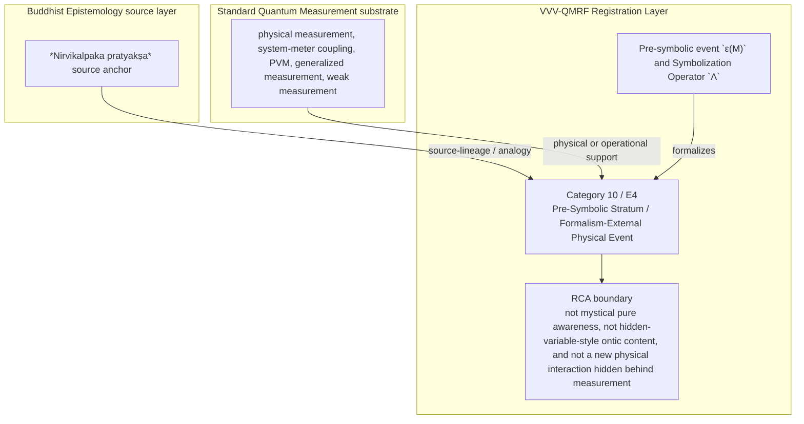

Author: VietVunVut (Viet - Nguyen Xuan); GitHub: https://github.com/AIhugART/; Facebook: https://www.facebook.com/xuanviet

# Formal Registration Category: Pre-Symbolic Stratum / Formalism-External Physical Event
# Phạm trù Ghi nhận: Tầng Tiền Biểu tượng / Sự kiện Vật lý Ngoài Hình thức

**Framework:** VietVunVut Quantum Measurement Registration Framework (VVV-QMRF)
**Document type:** category
**Author:** VietVunVut (Viet - Nguyen Xuan)
**GitHub:** https://github.com/AIhugART/
**Facebook:** https://www.facebook.com/xuanviet
**Date:** 2026-05-11
**Status:** Proposal — Registration class D (Derived, awaiting formal verification)
**Lineage:** gap/ (BIAN-7) → category/ (Category 10) → framework/ (E4)

> **Context / Ngữ cảnh:** This document formally establishes a new registration category for Quantum Mechanics (QM) to resolve the structural gap **BIAN-7** identified in the Buddhist Epistemology - Quantum Measurement mapping. This gap highlights QM's inability to represent the pre-symbolic, pre-conceptual physical event that precedes the emergence of a definite eigenvalue.
>
> *Tài liệu này chính thức thiết lập một phạm trù ghi nhận mới cho Cơ học Lượng tử (QM) nhằm giải quyết khoảng trống cấu trúc **BIAN-7**. Khoảng trống này chỉ ra sự bất lực của QM trong việc biểu diễn sự kiện vật lý tiền biểu tượng, tiền khái niệm xảy ra trước khi eigenvalue xác định xuất hiện.*

---

## 1. Category Identity / Định danh Phạm trù

* **Category Number:** 10
* **English Name:** Pre-Symbolic Stratum / Formalism-External Physical Event
* **Vietnamese Name:** Tầng Tiền Biểu tượng / Sự kiện Vật lý Ngoài Hình thức
* **Buddhist Source Analogue:** *Nirvikalpaka pratyakṣa* (Non-conceptual perception / Tri giác phi khái niệm)
* **Proposed Mathematical Symbol:** ε(M) — Pre-symbolic event; Λ — Symbolization operator
* **BIAN Resolved:** BIAN-7
* **Framework Postulate:** E4

---

## 2. Definition / Định nghĩa

**English:**
A formal registration category that represents the pre-conceptual, pre-symbolic physical event occurring during measurement, prior to any eigenvalue assignment or K-side symbolic registration. This event has causal content but no symbolic value. It is the physical stratum from which measurement results emerge through a symbolization process.

**Vietnamese:**
Phạm trù ghi nhận chính thức biểu diễn sự kiện vật lý tiền khái niệm, tiền biểu tượng xảy ra trong quá trình đo lường, trước bất kỳ phép gán eigenvalue hay ghi nhận biểu tượng phía K nào. Sự kiện này có nội dung nhân quả nhưng không có giá trị biểu tượng. Đây là tầng vật lý từ đó kết quả đo phát sinh qua quá trình biểu tượng hóa.

---

## 3. Formal Structure / Cấu trúc Hình thức

```text
For measurement M yielding result r with symbolic label λ:
  ∃ pre-symbolic event ε(M) such that:
    (i)   ε(M) precedes λ-assignment
    (ii)  ε(M) has causal content but no symbolic value
    (iii) r = Λ(ε(M)) where Λ is the symbolization operator

In weak measurement: Λ is partial → r is partial.
In projective measurement: Λ is complete → r is eigenvalue.
```

**RCA boundary:** `ε(M)` is not an extra mystical entity. It names the registration-layer slot between physical interaction and symbolic/eigenvalue assignment. `ε(M)` is a registration-layer classification, not a claim about ontic sub-quantum content.

---

## 4. Foundational Implications / Ý nghĩa Nền tảng

BIAN-7 resolution: Pre-Symbolic Stratum / Formalism-External Physical Event supplies the missing registration-layer category for QM models physical interaction and readout, but lacks a category for the pre-symbolic event before eigenvalue or symbolic registration assignment. Formalizing PSS has three bounded implications:

1. It bridges physical interaction and symbolic result.
2. It explains weak/projective difference as degree of symbolization at the registration layer.
3. It keeps the category non-mystical and formalism-focused.

> **Conclusion:** Pre-Symbolic Stratum / Formalism-External Physical Event resolves BIAN-7 only as a VVV-QMRF registration-layer category. It preserves the standard QM substrate while adding the missing K-side classification and validity boundary.

---

## 5. RCA Concept Traceability Matrix / Bảng Truy vết RCA Khái niệm

**Purpose / Mục đích:** This table records traceability for the main concepts used in this category. It separates direct SOT evidence, framework-derived proposals, QM-only support, and boundary-sensitive applications so that Pre-Symbolic Stratum / Formalism-External Physical Event is not confused with ordinary canonical QM or with an unrestricted Buddhist equivalence.

**RCA labels / Nhãn RCA:**
- **Strong:** direct node/edge or SOT evidence exists.
- **Medium:** structurally supported, but not a direct concept-node equivalence.
- **Derived:** proposed by this category/framework, not a source-system node.
- **QM-only:** supported in QM only, not Buddhist Epistemology.
- **No node:** no dedicated node/edge exists in the current SOT.
- **Overclaim:** wording is stronger than the traceable evidence.
- **External:** external experimental or historical support, not a current SOT node.

| Claim anchor | Concept | Evidence / Bằng chứng truy vết | Node code | Edge code | RCA label | Boundary / Fix note |
|---|---|---|---|---|---|---|
| §1-§2 | BIAN-7 / gap diagnosis | BIAN SOT resolves this gap through Category 10 + E4. | N_BE_00009; support: N_BE_00183, N_BE_00184, N_BE_00167 | ED_BE_00014; ED_BE_00015; ED_BE_00144; ED_BE_00145; ED_BE_00146 | Strong / No node | Gap diagnosis is not by itself an empirical proof; it identifies the missing registration category. |
| §1-§2 | Pre-Symbolic Stratum / Formalism-External Physical Event | VVV-QM RCA assigns the category support in node_QM_VVV. | N_QM_VVV_00044; N_QM_VVV_00045; N_QM_VVV_00046; N_QM_VVV_00047 | — | Derived | Framework category; not a canonical QM postulate unless independently validated. |
| §1 | BE source analogue | *Nirvikalpaka pratyakṣa* source anchor | N_BE_00009; support: N_BE_00183, N_BE_00184, N_BE_00167 | ED_BE_00014; ED_BE_00015; ED_BE_00144; ED_BE_00145; ED_BE_00146 | Medium | Source lineage or analogy; do not collapse BE ontology into QM physics. |
| §2-§3 | QM substrate | physical measurement, system-meter coupling, PVM, generalized measurement, weak measurement | N_QM_00019; N_QM_00021; N_QM_00014; N_QM_00026; N_QM_00028 | ED_QM_00019; ED_QM_00021; ED_QM_00029; ED_QM_00031; ED_QM_00038 | QM-only | Canonical QM supports the physical substrate, not the whole VVV-QMRF category. |
| §3 | Formal symbol / operator | Pre-symbolic event `ε(M)` and Symbolization Operator `Λ` | N_QM_VVV_00044; N_QM_VVV_00045; N_QM_VVV_00046; N_QM_VVV_00047 | — | Derived | Framework notation; do not cite as a source-system operator. |
| §4 | Category implication | Name `ε(M)` as the causal but not-yet-symbolic event and `Λ` as the mapping from causal event to symbolic/eigenvalue result. | N_QM_VVV_00044; N_QM_VVV_00045; N_QM_VVV_00046; N_QM_VVV_00047 | — | Medium | Valid only within the stated registration-layer boundary. |
| §4 | Overclaim risk | not mystical pure awareness, not hidden-variable-style ontic content, and not a new physical interaction hidden behind measurement | — | — | Overclaim | Keep wording conditional and registration-layer specific. |

### 5.1. RCA Summary / Tóm tắt RCA

1. **BIAN-7 is a structural gap, not a direct physical discovery.** The gap identifies missing registration architecture.
2. **The BE source is bounded.** *Nirvikalpaka pratyakṣa* source anchor anchors the analogy or source lineage, but does not automatically become a QM mechanism.
3. **The QM substrate is real but insufficient.** physical measurement, system-meter coupling, PVM, generalized measurement, weak measurement provides support, while Pre-Symbolic Stratum / Formalism-External Physical Event names the added K-side layer.
4. **The VVV node(s) are derived.** N_QM_VVV_00044; N_QM_VVV_00045; N_QM_VVV_00046; N_QM_VVV_00047 belong to the framework proposal and should be labeled as derived unless later validated.
5. **Boundary control is mandatory.** The main overclaim to avoid is: not mystical pure awareness, not hidden-variable-style ontic content, and not a new physical interaction hidden behind measurement.

### 5.2. RCA Five-Step Analysis / Phân tích RCA 5 bước

#### 5.2.1 Define — observed issue / Xác định vấn đề

**Symptom:** The old formulation can make Pre-Symbolic Stratum / Formalism-External Physical Event look like either ordinary QM vocabulary or a direct Buddhist-QM equivalence.

**Cause:** The category document did not fully separate BE source support, canonical QM substrate, VVV-QMRF derived formalism, and boundary-sensitive claims.

#### 5.2.2 Trace — 5 Whys / Truy nguyên 5 lần hỏi "vì sao"

1. **Why does the ambiguity appear?** Because the same words describe source analogy, physical measurement support, and framework proposal.
2. **Why is that a schema problem?** Because older category files lacked a complete RCA matrix and assertion-boundary section.
3. **Why can this create overclaim?** Because a derived registration category may be read as a canonical QM postulate or as a literal BE equivalence.
4. **Why is traceability required?** Because each claim needs a node/edge, QM substrate, or explicit `No node` status.
5. **Why does Category 10 exist?** Because BIAN-7 isolates a registration-layer gap: QM models physical interaction and readout, but lacks a category for the pre-symbolic event before eigenvalue or symbolic registration assignment.

#### 5.2.3 Isolate — root cause / Cô lập nguyên nhân gốc

**Root cause:** The document needed explicit schema-level separation between source-system evidence, QM support, VVV-derived notation, and boundary conditions.

#### 5.2.4 Fix — corrected formulation / Sửa đúng nguyên nhân

Use this bounded formulation when precision is required:

```text
Pre-Symbolic Stratum / Formalism-External Physical Event = a VVV-QMRF registration-layer category for BIAN-7.
BE source: *Nirvikalpaka pratyakṣa* source anchor.
QM substrate: physical measurement, system-meter coupling, PVM, generalized measurement, weak measurement.
VVV formalism: Pre-symbolic event `ε(M)` and Symbolization Operator `Λ` / N_QM_VVV_00044; N_QM_VVV_00045; N_QM_VVV_00046; N_QM_VVV_00047.
Boundary: not mystical pure awareness, not hidden-variable-style ontic content, and not a new physical interaction hidden behind measurement.
```

#### 5.2.5 Verify — root cause removed / Kiểm chứng đã loại bỏ nguyên nhân gốc

The ambiguity is removed if every use of Category 10 distinguishes:

```text
BE source analogue = *Nirvikalpaka pratyakṣa* source anchor.
QM substrate = physical measurement, system-meter coupling, PVM, generalized measurement, weak measurement.
VVV-QMRF category = Pre-Symbolic Stratum / Formalism-External Physical Event.
Formal symbol = Pre-symbolic event `ε(M)` and Symbolization Operator `Λ`.
Boundary = not mystical pure awareness, not hidden-variable-style ontic content, and not a new physical interaction hidden behind measurement.
```

### 5.3. Gap Type Classification / Phân loại Loại Khoảng trống

| Gap aspect | Classification | RCA note |
|---|---|---|
| Source gap | **BIAN-7** | Qm models physical interaction and readout, but lacks a category for the pre-symbolic event before eigenvalue or symbolic registration assignment. |
| Gap type | **Pre-symbolic registration-layer gap** | The missing piece is a registration-category distinction, not merely a prettier sentence. |
| Resolution type | **Category + framework postulate** | Category 10 supplies the detailed category; E4 installs it into VVV-QMRF architecture. |
| Why not only canonical QM? | Canonical QM supports the substrate but not the K-side classification. | Use QM nodes as support, not as proof that the category already exists in standard QM. |
| Boundary | **source-supported BE anchor; derived symbolization-layer category** | Keep labels such as Derived, Medium, No node, or QM-only visible in publication-facing prose. |

### 5.4. Prototype PSS Instance / Trường hợp Mẫu của PSS

```text
Prototype PSS instance:

  Setup: measurement interaction occurs before the outcome label is assigned.
  Event: `ε(M)` carries causal content without symbolic value.
  Gate: `Λ` maps the event into a symbolic result according to measurement strength.
  Update: partial or complete symbolization yields weak or projective registration output.
  Contrast: the pre-symbolic layer is structural, not psychological.

  → PSS instance confirmed only within its boundary.
```

**RCA boundary:** The prototype is valid only when the stated source support, QM substrate, and registration-validity conditions are all kept distinct.

### 5.5. Layer Architecture Position / Vị trí trong Kiến trúc Tầng

```text
gap/BIAN-7
  ↓ diagnoses missing registration structure
category/Category 10 — Pre-Symbolic Stratum / Formalism-External Physical Event
  ↓ specifies detailed category and boundary conditions
framework/E4
  ↓ installs the rule into VVV-QMRF postulate architecture
VVV-QMRF registration-state update layer
  ↓ applies the category without replacing canonical QM physics
```

| Layer | Document / component | Role |
|---|---|---|
| Gap | BIAN-7 | Diagnoses the missing registration distinction. |
| Category | Category 10 | Defines the detailed registration category. |
| Framework | E4 | Promotes the category into postulate-level architecture. |
| BE source | *Nirvikalpaka pratyakṣa* source anchor | Supplies source-lineage or analogy under RCA boundary. |
| QM substrate | physical measurement, system-meter coupling, PVM, generalized measurement, weak measurement | Supplies physical or operational support only. |

---

## 6. Assertion Level / Mức Khẳng định

| Component EN | Thành phần VN | RCA assertion class | Evidence / Boundary |
|---|---|---|---|
| BE source supports the category lineage | Nguồn BE hỗ trợ dòng nguồn của phạm trù | **M** — source-supported | N_BE_00009; support: N_BE_00183, N_BE_00184, N_BE_00167; ED_BE_00014; ED_BE_00015; ED_BE_00144; ED_BE_00145; ED_BE_00146. |
| QM provides the physical substrate | QM cung cấp nền vật lý | **M / QM-only** | N_QM_00019; N_QM_00021; N_QM_00014; N_QM_00026; N_QM_00028; ED_QM_00019; ED_QM_00021; ED_QM_00029; ED_QM_00031; ED_QM_00038. |
| Pre-Symbolic Stratum / Formalism-External Physical Event is a VVV-QMRF category | Tầng Tiền Biểu tượng / Sự kiện Vật lý Ngoài Hình thức là phạm trù VVV-QMRF | **D** — framework-derived | N_QM_VVV_00044; N_QM_VVV_00045; N_QM_VVV_00046; N_QM_VVV_00047; E4. |
| Pre-symbolic event `ε(M)` and Symbolization Operator `Λ` formalizes the category | Pre-symbolic event `ε(M)` and Symbolization Operator `Λ` hình thức hóa phạm trù | **D** — notation-derived | Framework notation, not a canonical source-system operator. |
| The category resolves BIAN-7 | Phạm trù giải quyết BIAN-7 | **D / M** — bounded resolution | Resolution holds at registration-layer architecture level. |
| Boundary-free reading of the category | Cách đọc không ranh giới về phạm trù | **O** — overclaim | not mystical pure awareness, not hidden-variable-style ontic content, and not a new physical interaction hidden behind measurement. |

**Summary / Tóm tắt:** The category is traceable as a VVV-QMRF registration-layer proposal. Its BE source and QM substrate support the architecture, but neither should be overstated as a direct one-to-one physical equivalence.

---

## 7. What Category 10 / E4 Does NOT Claim / Những gì Category 10 / E4 KHÔNG tuyên bố

1. **Not a canonical QM replacement** — Pre-Symbolic Stratum / Formalism-External Physical Event is a VVV-QMRF registration-layer proposal built beside standard QM support.
   *Không thay thế QM chuẩn; đây là tầng ghi nhận VVV-QMRF đặt bên cạnh nền vật lý QM.*

2. **Not unrestricted equivalence with the BE source** — *Nirvikalpaka pratyakṣa* source anchor supplies source-lineage or analogy only within the stated boundary.
   *Không đồng nhất vô điều kiện với nguồn BE; nguồn BE chỉ làm mô hình nguồn hoặc phép tương tự có ranh giới.*

3. **Not boundary-free application** — not mystical pure awareness, not hidden-variable-style ontic content, and not a new physical interaction hidden behind measurement.
   *Không áp dụng tự do ngoài điều kiện hợp lệ đã nêu.*

4. **Not a detector-engineering shortcut** — validity still depends on calibration, context, and the relevant E10-style gate where applicable.
   *Không bỏ qua hiệu chuẩn, bối cảnh, hoặc cổng hợp lệ kiểu E10 khi cần.*

5. **Not an empirical proof of a new physical mechanism** — the category remains derived unless formal predictions and tests are supplied.
   *Chưa phải bằng chứng thực nghiệm cho cơ chế vật lý mới nếu chưa có dự đoán và kiểm nghiệm.*

6. **Not human-consciousness dependence** — registration-state update is a K-side framework term broader than human cognition.
   *Không phụ thuộc ý thức con người; cập nhật trạng thái ghi nhận là thuật ngữ tầng K rộng hơn cognition của người.*

---

## 8. Vietnamese Explanation / Giải thích tiếng Việt rõ ràng

Nói đơn giản, Category 10 / E4 xử lý câu hỏi:

```text
Trong trường hợp này, cái gì thật sự được ghi nhận ở tầng K,
và điều kiện nào làm cho ghi nhận đó hợp lệ?
```

Câu trả lời của VVV-QMRF là:

```text
Trước khi có con số eigenvalue, đã có một sự kiện vật lý xảy ra. Category 10 gọi lớp đó là `pre-symbolic`: có nhân quả nhưng chưa thành ký hiệu đo.
```

Ranh giới cần nhớ:

```text
BE source không tự động trở thành cơ chế vật lý QM.
QM substrate không tự động chứa toàn bộ category VVV-QMRF.
VVV-QMRF thêm tầng registration-state update / cập nhật trạng thái ghi nhận.
Nếu thiếu điều kiện hợp lệ, claim phải bị hạ xuống Medium, Derived, No node, hoặc Overclaim.
```

---

## 9. Mermaid Diagram Map / Sơ đồ Mermaid

### 9.1 Local Arrow Semantics / Quy ước mũi tên local

This table explains only the arrows used in this diagram. It follows the broader Arrow Semantics rule in `documents/research_documents/vvv-qmrf/schema_guide.md`.

Bảng này chỉ giải thích các mũi tên dùng trong sơ đồ này. Nó tuân theo quy tắc Arrow Semantics rộng hơn trong `documents/research_documents/vvv-qmrf/schema_guide.md`.

| Diagram arrow label | Local meaning | Must not imply |
|---|---|---|
| `source-lineage / analogy` | The Buddhist Epistemology source supplies bounded source lineage or structural analogy for the VVV-QMRF registration category. | Direct identity between Buddhist ontology and Quantum Mechanics. |
| `physical or operational support` | Standard Quantum Mechanics supplies the physical or operational substrate that the registration category analyzes. | Replacement or modification of Standard Quantum Mechanics probability or state-update rules. |
| `formalizes` | The proposed VVV-QMRF notation formalizes the registration-layer category. | A canonical Quantum Mechanics operator or experimentally validated physical mechanism by itself. |
| Unlabeled category-to-boundary arrow | The category must be read under its RCA boundary. | Boundary-free application outside the stated registration conditions. |



---

*Source: BIAN_index_SOT.md (BIAN-7), system_be_full.md (N_BE_00009), SYSTEM_Quantum_Measurement/system_qm_full.md, node_QM_VVV.md (N_QM_VVV_00044-00047), framework/vvv_qmrf_framework_e04_pre_symbolic_registration_stratum_postulate.md*

---

## Schema Validation Checklist / Checklist Kiểm chứng Schema

| Check | Status | RCA note |
|---|---|---|
| Document type declared | Pass | Declared as `category` for schema alignment. |
| Source traceability | Pass | Existing source/cross-reference sections provide the trace base. |
| Claim traceability | Pass | Existing assertion/claim sections classify the major claims. |
| Boundary / non-claim guardrail | Pass | Existing boundary/non-claim text limits overclaiming. |
| Validation rule | Pass | Reuse only with source, claim type, and boundary preserved; unresolved items must be marked `TODO(HOTFIX)` before publication use. |
