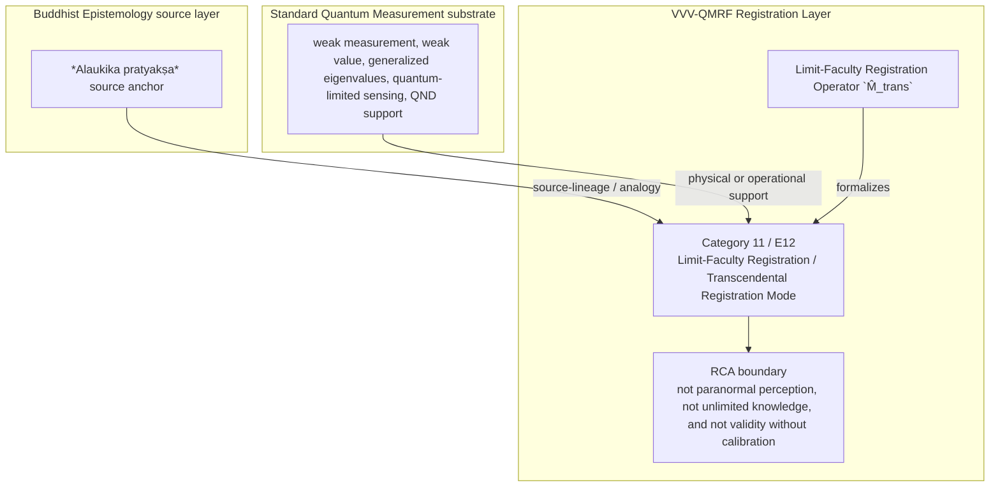

Author: VietVunVut (Viet - Nguyen Xuan); GitHub: https://github.com/AIhugART/; Facebook: https://www.facebook.com/xuanviet

# Formal Registration Category: Limit-Faculty Registration / Transcendental Registration Mode
# Phạm trù Ghi nhận: Ghi nhận Giới hạn Năng lực / Chế độ Ghi nhận Siêu việt

**Framework:** VietVunVut Quantum Measurement Registration Framework (VVV-QMRF)
**Author:** VietVunVut (Viet - Nguyen Xuan)
**GitHub:** https://github.com/AIhugART/
**Date:** 2026-05-12
**Status:** Proposal — Registration class D
**Lineage:** gap/ (BIAN-3) → category/ (Category 11) → framework/ (E12)

> **Context:** This document formally establishes a new registration category for QM to resolve structural gap **BIAN-3**. BIAN-3 highlights QM's lack of a formal category for registration by a faculty operating beyond the limits of ordinary classical perception — equivalent to *Alaukika pratyakṣa* (Transcendental/Extraordinary Perception) in Buddhist Epistemology.
>
> *Tài liệu này giải quyết khoảng trống cấu trúc **BIAN-3**. BIAN-3 chỉ ra sự thiếu hụt của QM về phạm trù ghi nhận bởi một năng lực vượt giới hạn tri giác thông thường — tương đương Alaukika pratyakṣa (Tri giác Phi thường) trong Phật giáo.*

---

## 1. Category Identity

* **English Name:** Limit-Faculty Registration / Transcendental Registration Mode (TOM)
* **Vietnamese Name:** Ghi nhận Giới hạn Năng lực / Chế độ Ghi nhận Siêu việt
* **Buddhist Equivalent:** *Alaukika pratyakṣa* (Extraordinary perception — perception by a faculty operating beyond ordinary sensory limits)
* **Node:** N_BE_00012
* **Mathematical Symbol:** Limit-Faculty Registration Operator $\hat{M}_{trans}$

---

## 2. Definition

**English:**
A formal quantum measurement mode in which the measurement instrument operates at or beyond the classical information-theoretic resolution limit, yet still yields valid registration content. This includes: weak measurements (extracting partial information without full collapse), quantum-limited amplifiers, and back-action-evading measurements. The defining characteristic is that the measurement faculty transcends ordinary projective measurement constraints while remaining registration-valid.

**Vietnamese:**
Một chế độ đo lường lượng tử chính thức trong đó công cụ quan sát hoạt động tại hoặc vượt giới hạn phân giải thông tin cổ điển, nhưng vẫn cho ra nội dung ghi nhận hợp lệ. Gồm: phép đo yếu (trích xuất thông tin một phần không sụp đổ đầy đủ), khuếch đại giới hạn lượng tử, và phép đo né tránh phản tác dụng.

---

## 3. Formal Structure

```
Standard PVM:   Full collapse — |ψ⟩ → |λᵢ⟩, ΔI = max, Δback-action = max

TOM (Weak):     Partial collapse — |ψ⟩ → |ψ'⟩ (slightly shifted)
                ΔI = ε (small), Δback-action = ε (small)
                Valid registration content extracted via: weak value Aᵥ = ⟨φ|Â|ψ⟩/⟨φ|ψ⟩
                Aᵥ ∈ ℂ in general

Key property: anomalous weak values occur when Re(Aᵥ) lies OUTSIDE the eigenvalue spectrum of Â
  → reveals interference-sensitive weak-value structure without the full back-action of a corresponding PVM readout
  → transcends the ordinary eigenvalue-readout profile of PVM without treating complex Aᵥ as a direct eigenvalue
```

### Trairūpya check for TOM (E10 compatibility)

| Condition | TOM Status | Note |
|-----------|:----------:|------|
| C1 Pakṣadharmatā | ✅ | Coupling to observable exists |
| C2 Sapakṣasattva | ✅ | Weak but statistically valid signal |
| C3 Vipakṣāsattva | ✅ (modified) | False positive → zero in limit of many trials |

TOM satisfies the E10 validity gate — it is a genuine measurement, not decoherence.

---

## 4. Foundational Implications / Ý nghĩa Nền tảng

BIAN-3 resolution: Limit-Faculty Registration / Transcendental Registration Mode supplies the missing registration-layer category for standard projective measurement does not exhaust all valid registration modes, yet QM lacks a registration category for non-ordinary valid faculties. Formalizing TOM has three bounded implications:

1. It legitimizes non-projective valid outputs at the registration layer.
2. It keeps extraordinary faculty as structural analogy, not supernatural claim.
3. It binds TOM to E10 so unusual output still requires validity conditions.

> **Conclusion:** Limit-Faculty Registration / Transcendental Registration Mode resolves BIAN-3 only as a VVV-QMRF registration-layer category. It preserves the standard QM substrate while adding the missing K-side classification and validity boundary.

---

## 5. RCA Concept Traceability Matrix / Bảng Truy vết RCA Khái niệm

**Purpose / Mục đích:** This table records traceability for the main concepts used in this category. It separates direct SOT evidence, framework-derived proposals, QM-only support, and boundary-sensitive applications so that Limit-Faculty Registration / Transcendental Registration Mode is not confused with ordinary canonical QM or with an unrestricted Buddhist equivalence.

**RCA labels / Nhãn RCA:**
- **Strong:** direct node/edge or SOT evidence exists.
- **Medium:** structurally supported, but not a direct concept-node equivalence.
- **Derived:** proposed by this category/framework, not a source-system node.
- **QM-only:** supported in QM only, not Buddhist Epistemology.
- **No node:** no dedicated node/edge exists in the current SOT.
- **Overclaim:** wording is stronger than the traceable evidence.
- **External:** external experimental or historical support, not a current SOT node.

| Claim anchor | Concept | Evidence / Bằng chứng truy vết | Node code | Edge code | RCA label | Boundary / Fix note |
|---|---|---|---|---|---|---|
| §1-§2 | BIAN-3 / gap diagnosis | BIAN SOT resolves this gap through Category 11 + E12. | N_BE_00012; support: N_BE_00132 | ED_BE_00021; ED_BE_00158 | Strong / No node | Gap diagnosis is not by itself an empirical proof; it identifies the missing registration category. |
| §1-§2 | Limit-Faculty Registration / Transcendental Registration Mode | VVV-QM RCA assigns the category support in node_QM_VVV. | N_QM_VVV_00048; N_QM_VVV_00049; N_QM_VVV_00050; support: N_QM_VVV_00043 | — | Derived | Framework category; not a canonical QM postulate unless independently validated. |
| §1 | BE source analogue | *Alaukika pratyakṣa* source anchor | N_BE_00012; support: N_BE_00132 | ED_BE_00021; ED_BE_00158 | Medium | Source lineage or analogy; do not collapse BE ontology into QM physics. |
| §2-§3 | QM substrate | weak measurement, weak value, generalized eigenvalues, quantum-limited sensing, QND support | N_QM_00028; N_QM_00029; N_QM_00031; N_QM_00086; N_QM_00027 | ED_QM_00034; ED_QM_00035; ED_QM_00037; ED_QM_00100; ED_QM_00026 | QM-only | Canonical QM supports the physical substrate, not the whole VVV-QMRF category. |
| §3 | Formal symbol / operator | Limit-Faculty Registration Operator `M̂_trans` | N_QM_VVV_00048; N_QM_VVV_00049; N_QM_VVV_00050; support: N_QM_VVV_00043 | — | Derived | Framework notation; do not cite as a source-system operator. |
| §4 | Category implication | Classify weak, quantum-limited, or back-action-evading registration as valid TOM only when E10-compatible validity conditions hold. | N_QM_VVV_00048; N_QM_VVV_00049; N_QM_VVV_00050; support: N_QM_VVV_00043 | — | Medium | Valid only within the stated registration-layer boundary. |
| §4 | Overclaim risk | not paranormal perception, not unlimited knowledge, and not validity without calibration | — | — | Overclaim | Keep wording conditional and registration-layer specific. |

### 5.1. RCA Summary / Tóm tắt RCA

1. **BIAN-3 is a structural gap, not a direct physical discovery.** The gap identifies missing registration architecture.
2. **The BE source is bounded.** *Alaukika pratyakṣa* source anchor anchors the analogy or source lineage, but does not automatically become a QM mechanism.
3. **The QM substrate is real but insufficient.** weak measurement, weak value, generalized eigenvalues, quantum-limited sensing, QND support provides support, while Limit-Faculty Registration / Transcendental Registration Mode names the added K-side layer.
4. **The VVV node(s) are derived.** N_QM_VVV_00048; N_QM_VVV_00049; N_QM_VVV_00050; support: N_QM_VVV_00043 belong to the framework proposal and should be labeled as derived unless later validated.
5. **Boundary control is mandatory.** The main overclaim to avoid is: not paranormal perception, not unlimited knowledge, and not validity without calibration.

### 5.2. RCA Five-Step Analysis / Phân tích RCA 5 bước

#### 5.2.1 Define — observed issue / Xác định vấn đề

**Symptom:** The old formulation can make Limit-Faculty Registration / Transcendental Registration Mode look like either ordinary QM vocabulary or a direct Buddhist-QM equivalence.

**Cause:** The category document did not fully separate BE source support, canonical QM substrate, VVV-QMRF derived formalism, and boundary-sensitive claims.

#### 5.2.2 Trace — 5 Whys / Truy nguyên 5 lần hỏi “vì sao”

1. **Why does the ambiguity appear?** Because the same words describe source analogy, physical measurement support, and framework proposal.
2. **Why is that a schema problem?** Because older category files lacked a complete RCA matrix and assertion-boundary section.
3. **Why can this create overclaim?** Because a derived registration category may be read as a canonical QM postulate or as a literal BE equivalence.
4. **Why is traceability required?** Because each claim needs a node/edge, QM substrate, or explicit `No node` status.
5. **Why does Category 11 exist?** Because BIAN-3 isolates a registration-layer gap: standard projective measurement does not exhaust all valid registration modes, yet QM lacks a registration category for non-ordinary valid faculties.

#### 5.2.3 Isolate — root cause / Cô lập nguyên nhân gốc

**Root cause:** The document needed explicit schema-level separation between source-system evidence, QM support, VVV-derived notation, and boundary conditions.

#### 5.2.4 Fix — corrected formulation / Sửa đúng nguyên nhân

Use this bounded formulation when precision is required:

```text
Limit-Faculty Registration / Transcendental Registration Mode = a VVV-QMRF registration-layer category for BIAN-3.
BE source: *Alaukika pratyakṣa* source anchor.
QM substrate: weak measurement, weak value, generalized eigenvalues, quantum-limited sensing, QND support.
VVV formalism: Limit-Faculty Registration Operator `M̂_trans` / N_QM_VVV_00048; N_QM_VVV_00049; N_QM_VVV_00050; support: N_QM_VVV_00043.
Boundary: not paranormal perception, not unlimited knowledge, and not validity without calibration.
```

#### 5.2.5 Verify — root cause removed / Kiểm chứng đã loại bỏ nguyên nhân gốc

The ambiguity is removed if every use of Category 11 distinguishes:

```text
BE source analogue = *Alaukika pratyakṣa* source anchor.
QM substrate = weak measurement, weak value, generalized eigenvalues, quantum-limited sensing, QND support.
VVV-QMRF category = Limit-Faculty Registration / Transcendental Registration Mode.
Formal symbol = Limit-Faculty Registration Operator `M̂_trans`.
Boundary = not paranormal perception, not unlimited knowledge, and not validity without calibration.
```

### 5.3. Gap Type Classification / Phân loại Loại Khoảng trống

| Gap aspect | Classification | RCA note |
|---|---|---|
| Source gap | **BIAN-3** | Standard projective measurement does not exhaust all valid registration modes, yet qm lacks a registration category for non-ordinary valid faculties. |
| Gap type | **Limit-faculty registration gap** | The missing piece is a registration-category distinction, not merely a prettier sentence. |
| Resolution type | **Category + framework postulate** | Category 11 supplies the detailed category; E12 installs it into VVV-QMRF architecture. |
| Why not only canonical QM? | Canonical QM supports the substrate but not the K-side classification. | Use QM nodes as support, not as proof that the category already exists in standard QM. |
| Boundary | **source-supported BE anchor; derived non-ordinary measurement-faculty category** | Keep labels such as Derived, Medium, No node, or QM-only visible in publication-facing prose. |

### 5.4. Prototype TOM Instance / Trường hợp Mẫu của TOM

```text
Prototype TOM instance:

  Setup: measurement is weak, quantum-limited, or back-action-evading.
  Event: the instrument extracts non-ordinary but traceable registration content.
  Gate: E10 criteria still pass statistically or in the appropriate limit.
  Update: a valid limit-faculty registration output is established by `M̂_trans`.
  Contrast: anomalous weak values are bounded registration outputs, not magic.

  → TOM instance confirmed only within its boundary.
```

**RCA boundary:** The prototype is valid only when the stated source support, QM substrate, and registration-validity conditions are all kept distinct.

### 5.5. Layer Architecture Position / Vị trí trong Kiến trúc Tầng

```text
gap/BIAN-3
  ↓ diagnoses missing registration structure
category/Category 11 — Limit-Faculty Registration / Transcendental Registration Mode
  ↓ specifies detailed category and boundary conditions
framework/E12
  ↓ installs the rule into VVV-QMRF postulate architecture
VVV-QMRF registration-state update layer
  ↓ applies the category without replacing canonical QM physics
```

| Layer | Document / component | Role |
|---|---|---|
| Gap | BIAN-3 | Diagnoses the missing registration distinction. |
| Category | Category 11 | Defines the detailed registration category. |
| Framework | E12 | Promotes the category into postulate-level architecture. |
| BE source | *Alaukika pratyakṣa* source anchor | Supplies source-lineage or analogy under RCA boundary. |
| QM substrate | weak measurement, weak value, generalized eigenvalues, quantum-limited sensing, QND support | Supplies physical or operational support only. |

---

## 6. Assertion Level / Mức Khẳng định

| Component EN | Thành phần VN | RCA assertion class | Evidence / Boundary |
|---|---|---|---|
| BE source supports the category lineage | Nguồn BE hỗ trợ dòng nguồn của phạm trù | **M** — source-supported | N_BE_00012; support: N_BE_00132; ED_BE_00021; ED_BE_00158. |
| QM provides the physical substrate | QM cung cấp nền vật lý | **M / QM-only** | N_QM_00028; N_QM_00029; N_QM_00031; N_QM_00086; N_QM_00027; ED_QM_00034; ED_QM_00035; ED_QM_00037; ED_QM_00100; ED_QM_00026. |
| Limit-Faculty Registration / Transcendental Registration Mode is a VVV-QMRF category | Ghi nhận Giới hạn Năng lực / Chế độ Ghi nhận Siêu việt là phạm trù VVV-QMRF | **D** — framework-derived | N_QM_VVV_00048; N_QM_VVV_00049; N_QM_VVV_00050; support: N_QM_VVV_00043; E12. |
| Limit-Faculty Registration Operator `M̂_trans` formalizes the category | Limit-Faculty Registration Operator `M̂_trans` hình thức hóa phạm trù | **D** — notation-derived | Framework notation, not a canonical source-system operator. |
| The category resolves BIAN-3 | Phạm trù giải quyết BIAN-3 | **D / M** — bounded resolution | Resolution holds at registration-layer architecture level. |
| Boundary-free reading of the category | Cách đọc không ranh giới về phạm trù | **O** — overclaim | not paranormal perception, not unlimited knowledge, and not validity without calibration. |

**Summary / Tóm tắt:** The category is traceable as a VVV-QMRF registration-layer proposal. Its BE source and QM substrate support the architecture, but neither should be overstated as a direct one-to-one physical equivalence.

---

## 7. What Category 11 / E12 Does NOT Claim / Những gì Category 11 / E12 KHÔNG tuyên bố

1. **Not a canonical QM replacement** — Limit-Faculty Registration / Transcendental Registration Mode is a VVV-QMRF registration-layer proposal built beside standard QM support.
   *Không thay thế QM chuẩn; đây là tầng ghi nhận VVV-QMRF đặt bên cạnh nền vật lý QM.*

2. **Not unrestricted equivalence with the BE source** — *Alaukika pratyakṣa* source anchor supplies source-lineage or analogy only within the stated boundary.
   *Không đồng nhất vô điều kiện với nguồn BE; nguồn BE chỉ làm mô hình nguồn hoặc phép tương tự có ranh giới.*

3. **Not boundary-free application** — not paranormal perception, not unlimited knowledge, and not validity without calibration.
   *Không áp dụng tự do ngoài điều kiện hợp lệ đã nêu.*

4. **Not a detector-engineering shortcut** — validity still depends on calibration, context, and the relevant E10-style gate where applicable.
   *Không bỏ qua hiệu chuẩn, bối cảnh, hoặc cổng hợp lệ kiểu E10 khi cần.*

5. **Not an empirical proof of a new physical mechanism** — the category remains derived unless formal predictions and tests are supplied.
   *Chưa phải bằng chứng thực nghiệm cho cơ chế vật lý mới nếu chưa có dự đoán và kiểm nghiệm.*

6. **Not human-consciousness dependence** — registration-state update is a K-side framework term broader than human cognition.
   *Không phụ thuộc ý thức con người; cập nhật trạng thái ghi nhận là thuật ngữ tầng K rộng hơn cognition của người.*

---

## 8. Vietnamese Explanation / Giải thích tiếng Việt rõ ràng

Nói đơn giản, Category 11 / E12 xử lý câu hỏi:

```text
Trong trường hợp này, cái gì thật sự được ghi nhận ở tầng K,
và điều kiện nào làm cho ghi nhận đó hợp lệ?
```

Câu trả lời của VVV-QMRF là:

```text
Category 11 nói có những cách đo hợp lệ không giống PVM bình thường, như weak measurement. `Siêu việt` ở đây nghĩa là vượt kiểu đo thường, không phải phép màu.
```

Ranh giới cần nhớ:

```text
BE source không tự động trở thành cơ chế vật lý QM.
QM substrate không tự động chứa toàn bộ category VVV-QMRF.
VVV-QMRF thêm tầng registration-state update / cập nhật trạng thái ghi nhận.
Nếu thiếu điều kiện hợp lệ, claim phải bị hạ xuống Medium, Derived, No node, hoặc Overclaim.
```

---

## 9. Mermaid Diagram Map / Sơ đồ Mermaid



---

*Source: BIAN_index_SOT.md (BIAN-3), system_be_full.md (N_BE_00012), SYSTEM_Quantum_Measurement/system_qm_full.md, node_QM_VVV.md (N_QM_VVV_00048-00050), framework/vvv_qmrf_framework_e12_limit_faculty_registration_postulate.md*
