Author: VietVunVut (Viet - Nguyen Xuan); GitHub: https://github.com/AIhugART/; Facebook: https://www.facebook.com/xuanviet

# Formal Registration Category: Temporal Discontinuity Doctrine / Moment-to-Moment Quantum Transition
# Phạm trù Ghi nhận: Học thuyết Gián đoạn Thời gian / Chuyển đổi Lượng tử Sát-na

**Framework:** VietVunVut Quantum Measurement Registration Framework (VVV-QMRF)
**Author:** VietVunVut (Viet - Nguyen Xuan)
**GitHub:** https://github.com/AIhugART/
**Date:** 2026-05-12
**Status:** Proposal — Registration class D
**Lineage:** gap/ (BIAN-8) → category/ (Category 12) → framework/ (E13)

> **Context:** This document formally establishes a new registration category for QM to resolve structural gap **BIAN-8**. BIAN-8 highlights QM's lack of a formal registration-layer theorization of temporal discontinuity — the quantum jump. Buddhist *Kṣaṇabhaṅgavāda* (Momentariness Doctrine) provides the rigorous source analogue: in BE, momentariness is an ontological doctrine about the arising and perishing of dharmas, while MMT uses *kṣaṇa* only as a bounded registration-event unit.
>
> *Tài liệu này giải quyết **BIAN-8**. BIAN-8 chỉ ra QM thiếu một lý thuyết lớp ghi nhận chính thức về tính gián đoạn thời gian — bước nhảy lượng tử. Kṣaṇabhaṅgavāda (Học thuyết Sát-na) cung cấp tương tự nguồn: trong BE, sát-na là học thuyết bản thể học về sự sinh-diệt của các dharma, còn MMT chỉ dùng *kṣaṇa* như đơn vị biên của một sự kiện ghi nhận.*

---

## 1. Category Identity

* **English Name:** Temporal Discontinuity Doctrine / Moment-to-Moment Quantum Transition (MMT)
* **Vietnamese Name:** Học thuyết Gián đoạn Thời gian / Chuyển đổi Lượng tử Sát-na
* **Buddhist Source Analogue:** *Kṣaṇabhaṅgavāda* (Momentariness — ontology of momentary dharma existence, not full QM equivalence)
* **Node:** N_BE_00029
* **Mathematical Symbol:** Discrete Transition Operator $\hat{T}_{kṣaṇa}$

---

## 2. Definition

**English:**
A formal registration-layer framework treating quantum state transitions (quantum jumps) as discrete registration discontinuities. The quantum jump between eigenstate $|E_n\rangle$ and $|E_m\rangle$ is modeled as a structurally bounded registration moment — a *kṣaṇa* — while Schrödinger evolution remains the standard continuous physical dynamics between such registration events.

**Vietnamese:**
Một khung tầng ghi nhận xem các chuyển đổi trạng thái lượng tử (quantum jumps) như các gián đoạn ghi nhận rời rạc. Bước nhảy lượng tử giữa $|E_n\rangle$ và $|E_m\rangle$ được mô hình hóa như một khoảnh khắc ghi nhận có biên cấu trúc — một *kṣaṇa* — trong khi tiến hóa Schrödinger vẫn là động lực vật lý liên tục chuẩn giữa các sự kiện ghi nhận đó.

---

## 3. Formal Structure

```
Standard QM narrative:
  Continuous: |ψ(t)⟩ = e^{-iHt/ℏ}|ψ(0)⟩  ← Schrödinger (between jumps)
  Discontinuous registration: |E_n⟩ → |E_m⟩  ← completed jump registration (not a zero-duration physical claim)

Kṣaṇa model:
  BE kṣaṇa: ontological existence-moment of dharmas
  MMT kṣaṇa: bounded registration-event moment, not a physical-duration claim
  The jump is treated as the registration unit — the kṣaṇa moment
  Schrödinger evolution remains the physical dynamics between registration events
  Each kṣaṇa: bounded as a registration event and causally linked to the next kṣaṇa

Formal distinction:
  Continuous evolution: ρ(t) = e^{-iHt/ℏ}ρ(0)e^{+iHt/ℏ}  (unitary, smooth)
  MMT event (jump):    ρ → |E_m⟩⟨E_m|  (discrete and irreversible from registration-layer view; not a zero-duration claim about monitored physical jump dynamics)
```

**Minev 2019 qualifier:** In monitored systems, a quantum jump may exhibit finite-time trajectory or early-warning dynamics; MMT treats the completed jump as a bounded registration-state update, not as a claim that the underlying physical process has zero duration.

### Mapping to quantum jump literature

| QM phenomenon | Kṣaṇa interpretation |
|---------------|---------------------|
| Spontaneous emission | Completed atom-photon event as one kṣaṇa-like registration seal |
| Quantum Zeno effect | Frequent observation = frequent kṣaṇa-sealing |
| Wavefunction collapse | The kṣaṇa of registration determination |
| Decoherence - registration | Accumulation of kṣaṇa-scale environmental correlations used as registration support |

---

## 4. Foundational Implications / Ý nghĩa Nền tảng

BIAN-8 resolution: Temporal Discontinuity Doctrine / Moment-to-Moment Quantum Transition supplies the missing registration-layer category for QM uses continuous evolution plus discontinuous collapse or jumps, but lacks a registration-layer category naming the bounded discontinuous moment. Formalizing MMT has three bounded implications:

1. It gives quantum jumps a registration-layer unit.
2. It avoids replacing continuous dynamics; it classifies discontinuous registration moments.
3. It supports the process model of Category 07.

> **Conclusion:** Temporal Discontinuity Doctrine / Moment-to-Moment Quantum Transition resolves BIAN-8 only as a VVV-QMRF registration-layer category. It preserves the standard QM substrate while adding the missing K-side classification and validity boundary.

---

## 5. RCA Concept Traceability Matrix / Bảng Truy vết RCA Khái niệm

**Purpose / Mục đích:** This table records traceability for the main concepts used in this category. It separates direct SOT evidence, framework-derived proposals, QM-only support, and boundary-sensitive applications so that Temporal Discontinuity Doctrine / Moment-to-Moment Quantum Transition is not confused with ordinary canonical QM or with an unrestricted Buddhist equivalence.

**RCA labels / Nhãn RCA:**
- **Strong:** direct node/edge or SOT evidence exists.
- **Medium:** structurally supported, but not a direct concept-node equivalence.
- **Derived:** proposed by this category/framework, not a source-system node.
- **QM-only:** supported in QM only, not Buddhist Epistemology.
- **No node:** no dedicated node/edge exists in the current SOT.
- **Overclaim:** wording is stronger than the traceable evidence.
- **External:** external experimental or historical support, not a current SOT node.

| Claim anchor | Concept | Evidence / Bằng chứng truy vết | Node code | Edge code | RCA label | Boundary / Fix note |
|---|---|---|---|---|---|---|
| §1-§2 | BIAN-8 / gap diagnosis | BIAN SOT resolves this gap through Category 12 + E13. | N_BE_00029; support: N_BE_00087 | ED_BE_00183 | Strong / No node | Gap diagnosis is not by itself an empirical proof; it identifies the missing registration category. |
| §1-§2 | Temporal Discontinuity Doctrine / Moment-to-Moment Quantum Transition | VVV-QM RCA assigns the category support in node_QM_VVV. | N_QM_VVV_00051; N_QM_VVV_00052; N_QM_VVV_00053; support: N_QM_VVV_00039 | — | Derived | Framework category; not a canonical QM postulate unless independently validated. |
| §1 | BE source analogue | *Kṣaṇabhaṅgavāda* source anchor | N_BE_00029; support: N_BE_00087 | ED_BE_00183 | Medium | Source lineage or analogy; do not collapse BE ontology into QM physics. |
| §2-§3 | QM substrate | Schrödinger evolution, wavefunction collapse, quantum jumps, Quantum Zeno effect, decoherence support | N_QM_00077; N_QM_00081; N_QM_00087; N_QM_00095; N_QM_00014 | ED_QM_00090; ED_QM_00094; ED_QM_00101; ED_QM_00041 | QM-only | Canonical QM supports the physical substrate, not the whole VVV-QMRF category. |
| §3 | Formal symbol / operator | Discrete Transition Operator `T̂_kṣaṇa` | N_QM_VVV_00051; N_QM_VVV_00052; N_QM_VVV_00053; support: N_QM_VVV_00039 | — | Derived | Framework notation; do not cite as a source-system operator. |
| §4 | Category implication | Treat each quantum jump or registration seal as a kṣaṇa-like bounded registration event while leaving Schrödinger evolution as physical dynamics between events. | N_QM_VVV_00051; N_QM_VVV_00052; N_QM_VVV_00053; support: N_QM_VVV_00039 | — | Medium | Valid only within the stated registration-layer boundary. |
| §4 | Overclaim risk | not that Schrödinger evolution is false and not that Buddhist momentariness is a physical proof of quantum jumps | — | — | Overclaim | Keep wording conditional and registration-layer specific. |

### 5.1. RCA Summary / Tóm tắt RCA

1. **BIAN-8 is a structural gap, not a direct physical discovery.** The gap identifies missing registration architecture.
2. **The BE source is bounded.** *Kṣaṇabhaṅgavāda* source anchor anchors the analogy or source lineage, but does not automatically become a QM mechanism.
3. **The QM substrate is real but insufficient.** Schrödinger evolution, wavefunction collapse, quantum jumps, Quantum Zeno effect, decoherence support provides support, while Temporal Discontinuity Doctrine / Moment-to-Moment Quantum Transition names the added K-side layer.
4. **The VVV node(s) are derived.** N_QM_VVV_00051; N_QM_VVV_00052; N_QM_VVV_00053; support: N_QM_VVV_00039 belong to the framework proposal and should be labeled as derived unless later validated.
5. **Boundary control is mandatory.** The main overclaim to avoid is: not that Schrödinger evolution is false and not that Buddhist momentariness is a physical proof of quantum jumps.

### 5.2. RCA Five-Step Analysis / Phân tích RCA 5 bước

#### 5.2.1 Define — observed issue / Xác định vấn đề

**Symptom:** The old formulation can make Temporal Discontinuity Doctrine / Moment-to-Moment Quantum Transition look like either ordinary QM vocabulary or a direct Buddhist-QM equivalence.

**Cause:** The category document did not fully separate BE source support, canonical QM substrate, VVV-QMRF derived formalism, and boundary-sensitive claims.

#### 5.2.2 Trace — 5 Whys / Truy nguyên 5 lần hỏi “vì sao”

1. **Why does the ambiguity appear?** Because the same words describe source analogy, physical measurement support, and framework proposal.
2. **Why is that a schema problem?** Because older category files lacked a complete RCA matrix and assertion-boundary section.
3. **Why can this create overclaim?** Because a derived registration category may be read as a canonical QM postulate or as a literal BE equivalence.
4. **Why is traceability required?** Because each claim needs a node/edge, QM substrate, or explicit `No node` status.
5. **Why does Category 12 exist?** Because BIAN-8 isolates a registration-layer gap: QM uses continuous evolution plus discontinuous collapse or jumps, but lacks a registration-layer category naming the bounded discontinuous moment.

#### 5.2.3 Isolate — root cause / Cô lập nguyên nhân gốc

**Root cause:** The document needed explicit schema-level separation between source-system evidence, QM support, VVV-derived notation, and boundary conditions.

#### 5.2.4 Fix — corrected formulation / Sửa đúng nguyên nhân

Use this bounded formulation when precision is required:

```text
Temporal Discontinuity Doctrine / Moment-to-Moment Quantum Transition = a VVV-QMRF registration-layer category for BIAN-8.
BE source: *Kṣaṇabhaṅgavāda* source anchor.
QM substrate: Schrödinger evolution, wavefunction collapse, quantum jumps, Quantum Zeno effect, decoherence support.
VVV formalism: Discrete Transition Operator `T̂_kṣaṇa` / N_QM_VVV_00051; N_QM_VVV_00052; N_QM_VVV_00053; support: N_QM_VVV_00039.
Boundary: not that Schrödinger evolution is false and not that Buddhist momentariness is a physical proof of quantum jumps.
```

#### 5.2.5 Verify — root cause removed / Kiểm chứng đã loại bỏ nguyên nhân gốc

The ambiguity is removed if every use of Category 12 distinguishes:

```text
BE source analogue = *Kṣaṇabhaṅgavāda* source anchor.
QM substrate = Schrödinger evolution, wavefunction collapse, quantum jumps, Quantum Zeno effect, decoherence support.
VVV-QMRF category = Temporal Discontinuity Doctrine / Moment-to-Moment Quantum Transition.
Formal symbol = Discrete Transition Operator `T̂_kṣaṇa`.
Boundary = not that Schrödinger evolution is false and not that Buddhist momentariness is a physical proof of quantum jumps.
```

### 5.3. Gap Type Classification / Phân loại Loại Khoảng trống

| Gap aspect | Classification | RCA note |
|---|---|---|
| Source gap | **BIAN-8** | Qm uses continuous evolution plus discontinuous collapse or jumps, but lacks a registration-layer category naming the bounded discontinuous moment. |
| Gap type | **Temporal-discontinuity registration gap** | The missing piece is a registration-category distinction, not merely a prettier sentence. |
| Resolution type | **Category + framework postulate** | Category 12 supplies the detailed category; E13 installs it into VVV-QMRF architecture. |
| Why not only canonical QM? | Canonical QM supports the substrate but not the K-side classification. | Use QM nodes as support, not as proof that the category already exists in standard QM. |
| Boundary | **source-supported BE anchor; derived registration-discontinuity category** | Keep labels such as Derived, Medium, No node, or QM-only visible in publication-facing prose. |

### 5.4. Prototype MMT Instance / Trường hợp Mẫu của MMT

```text
Prototype MMT instance:

  Setup: the system evolves continuously between registrations.
  Event: collapse or jump appears as a discontinuous transition.
  Gate: the transition is identified as a bounded registration event.
  Update: `T̂_kṣaṇa` names the discrete registration transition.
  Contrast: continuity is physical evolution between seals, not the registration seal itself.

  → MMT instance confirmed only within its boundary.
```

**RCA boundary:** The prototype is valid only when the stated source support, QM substrate, and registration-validity conditions are all kept distinct.

### 5.5. Layer Architecture Position / Vị trí trong Kiến trúc Tầng

```text
gap/BIAN-8
  ↓ diagnoses missing registration structure
category/Category 12 — Temporal Discontinuity Doctrine / Moment-to-Moment Quantum Transition
  ↓ specifies detailed category and boundary conditions
framework/E13
  ↓ installs the rule into VVV-QMRF postulate architecture
VVV-QMRF registration-state update layer
  ↓ applies the category without replacing canonical QM physics
```

| Layer | Document / component | Role |
|---|---|---|
| Gap | BIAN-8 | Diagnoses the missing registration distinction. |
| Category | Category 12 | Defines the detailed registration category. |
| Framework | E13 | Promotes the category into postulate-level architecture. |
| BE source | *Kṣaṇabhaṅgavāda* source anchor | Supplies source-lineage or analogy under RCA boundary. |
| QM substrate | Schrödinger evolution, wavefunction collapse, quantum jumps, Quantum Zeno effect, decoherence support | Supplies physical or operational support only. |

---

## 6. Assertion Level / Mức Khẳng định

| Component EN | Thành phần VN | Epistemic class | Evidence / Boundary |
|---|---|---|---|
| BE source supports the category lineage | Nguồn BE hỗ trợ dòng nguồn của phạm trù | **M** — source-supported | N_BE_00029; support: N_BE_00087; ED_BE_00183. |
| QM provides the physical substrate | QM cung cấp nền vật lý | **M / QM-only** | N_QM_00077; N_QM_00081; N_QM_00087; N_QM_00095; N_QM_00014; ED_QM_00090; ED_QM_00094; ED_QM_00101; ED_QM_00041. |
| Temporal Discontinuity Doctrine / Moment-to-Moment Quantum Transition is a VVV-QMRF category | Học thuyết Gián đoạn Thời gian / Chuyển đổi Lượng tử Sát-na là phạm trù VVV-QMRF | **D** — framework-derived | N_QM_VVV_00051; N_QM_VVV_00052; N_QM_VVV_00053; support: N_QM_VVV_00039; E13. |
| Discrete Transition Operator `T̂_kṣaṇa` formalizes the category | Discrete Transition Operator `T̂_kṣaṇa` hình thức hóa phạm trù | **D** — notation-derived | Framework notation, not a canonical source-system operator. |
| The category resolves BIAN-8 | Phạm trù giải quyết BIAN-8 | **D / M** — bounded resolution | Resolution holds at registration-layer architecture level. |
| Boundary-free reading of the category | Cách đọc không ranh giới về phạm trù | **O** — overclaim | not that Schrödinger evolution is false and not that Buddhist momentariness is a physical proof of quantum jumps. |

**Summary / Tóm tắt:** The category is traceable as a VVV-QMRF registration-layer proposal. Its BE source and QM substrate support the architecture, but neither should be overstated as a direct one-to-one physical equivalence.

---

## 7. What Category 12 / E13 Does NOT Claim / Những gì Category 12 / E13 KHÔNG tuyên bố

1. **Not a canonical QM replacement** — Temporal Discontinuity Doctrine / Moment-to-Moment Quantum Transition is a VVV-QMRF registration-layer proposal built beside standard QM support.
   *Không thay thế QM chuẩn; đây là tầng ghi nhận VVV-QMRF đặt bên cạnh nền vật lý QM.*

2. **Not unrestricted equivalence with the BE source** — *Kṣaṇabhaṅgavāda* source anchor supplies source-lineage or analogy only within the stated boundary.
   *Không đồng nhất vô điều kiện với nguồn BE; nguồn BE chỉ làm mô hình nguồn hoặc phép tương tự có ranh giới.*

3. **Not boundary-free application** — not that Schrödinger evolution is false and not that Buddhist momentariness is a physical proof of quantum jumps.
   *Không áp dụng tự do ngoài điều kiện hợp lệ đã nêu.*

4. **Not a detector-engineering shortcut** — validity still depends on calibration, context, and the relevant E10-style gate where applicable.
   *Không bỏ qua hiệu chuẩn, bối cảnh, hoặc cổng hợp lệ kiểu E10 khi cần.*

5. **Not an empirical proof of a new physical mechanism** — the category remains derived unless formal predictions and tests are supplied.
   *Chưa phải bằng chứng thực nghiệm cho cơ chế vật lý mới nếu chưa có dự đoán và kiểm nghiệm.*

6. **Not human-consciousness dependence** — registration-state update is a K-side framework term broader than human cognition.
   *Không phụ thuộc ý thức con người; cập nhật trạng thái ghi nhận là thuật ngữ tầng K rộng hơn cognition của người.*

---

## 8. Vietnamese Explanation / Giải thích tiếng Việt rõ ràng

Nói đơn giản, Category 12 / E13 xử lý câu hỏi:

```text
Trong trường hợp này, cái gì thật sự được ghi nhận ở tầng K,
và điều kiện nào làm cho ghi nhận đó hợp lệ?
```

Câu trả lời của VVV-QMRF là:

```text
QM có phần tiến hóa liên tục và phần nhảy rời rạc khi đo. Category 12 gọi khoảnh khắc nhảy/đóng dấu ghi nhận đó là một `kṣaṇa` ở tầng ghi nhận.
```

Ranh giới cần nhớ:

```text
BE source không tự động trở thành cơ chế vật lý QM.
QM substrate không tự động chứa toàn bộ category VVV-QMRF.
VVV-QMRF thêm tầng registration-state update / cập nhật trạng thái ghi nhận.
Nếu thiếu điều kiện hợp lệ, claim phải bị hạ xuống Medium, Derived, No node, hoặc Overclaim.
```

---

## 9. Mermaid Diagram Map / Sơ đồ Mermaid

```mermaid
flowchart TD
    subgraph BE["Buddhist Epistemology source layer"]
        BE1["*Kṣaṇabhaṅgavāda* source anchor"]
    end

    subgraph QM["Standard Quantum Measurement substrate"]
        QM1["Schrödinger evolution, wavefunction collapse, quantum jumps, Quantum Zeno effect, decoherence support"]
    end

    subgraph VVV["VVV-QMRF Registration Layer"]
        CAT["Category 12 / E13<br/>Temporal Discontinuity Doctrine / Moment-to-Moment Quantum Transition"]
        SYM["Discrete Transition Operator `T̂_kṣaṇa`"]
        BOUND["RCA boundary<br/>not that Schrödinger evolution is false and not that Buddhist momentariness is a physical proof of quantum jumps"]
    end

    BE1 -->|"source-lineage / analogy"| CAT
    QM1 -->|"physical or operational support"| CAT
    SYM -->|"formalizes"| CAT
    CAT --> BOUND
```



---

*Source: BIAN_index_SOT.md (BIAN-8), system_be_full.md (N_BE_00029), SYSTEM_Quantum_Measurement/system_qm_full.md, node_QM_VVV.md (N_QM_VVV_00051-00053), framework/vvv_qmrf_framework_e13_temporal_discontinuity_registration_postulate.md*

