Author: VietVunVut (Viet - Nguyen Xuan); GitHub: https://github.com/AIhugART/; Facebook: https://www.facebook.com/xuanviet

# Formal Registration Category: Validated Absence Registration / Conditioned Null Registration
# Phạm trù Ghi nhận: Ghi nhận Vắng mặt Hợp lệ / Ghi nhận Rỗng Có Điều kiện

**Framework:** VietVunVut Quantum Measurement Registration Framework (VVV-QMRF)
**Author:** VietVunVut (Viet - Nguyen Xuan)
**GitHub:** https://github.com/AIhugART/
**Date:** 2026-05-12
**Status:** Proposal — Registration class D
**Lineage:** gap/ (BIAN-9) → category/ (Category 13) → framework/ (E14)

> **Context:** This document formally establishes a new registration category for QM to resolve structural gap **BIAN-9**. BIAN-9 highlights QM's lack of a formal category treating the absence registration (null measurement result) as a distinct, positive registration act — equivalent to *Anupalabdhi* (Non-perception as valid cognition) in Buddhist Epistemology.
>
> *Tài liệu này giải quyết **BIAN-9**. BIAN-9 chỉ ra QM thiếu phạm trù coi ghi nhận vắng mặt (kết quả đo rỗng) là hành vi ghi nhận dương tính riêng biệt — tương đương Anupalabdhi (Vô tri giác như nguồn BE cho ghi nhận hợp lệ) trong Phật giáo.*

---

## 1. Category Identity

* **English Name:** Validated Absence Registration / Conditioned Null Registration (VAR)
* **Vietnamese Name:** Ghi nhận Vắng mặt Hợp lệ / Ghi nhận Rỗng Có Điều kiện
* **Buddhist Equivalent:** *Anupalabdhi* (Non-perception — the valid registration of the absence of a perceivable object)
* **Node:** N_BE_00253 — Anupalabdhi (RCA node; `SYSTEM_Buddhist_Epistemology/system_be_full.md`)
* **Mathematical Symbol:** Absence Projection Operator - registration $\hat{\Pi}_{absent}$

---

## 2. Definition

**English:**
A formal quantum registration category establishing that the null result of a measurement — detecting no particle, no photon, no signal — is not a registration failure but a distinct positive registration act under validity conditions. When the measurement setup satisfies E10's Trairūpya conditions, the null result registers the *absence* of the measured property as conditioned absence registration. This is categorically different from both "measurement not performed" and "measurement failed."

**Vietnamese:**
Một phạm trù ghi nhận lượng tử chính thức khẳng định rằng kết quả rỗng của phép đo — không phát hiện hạt, không có photon, không có tín hiệu — không phải là thất bại ghi nhận mà là một hành vi ghi nhận dương tính riêng biệt trong điều kiện hợp lệ. Khi thiết lập đo thỏa điều kiện Trairūpya của E10, kết quả rỗng ghi nhận *sự vắng mặt* của thuộc tính đo như ghi nhận vắng mặt có điều kiện.

---

## 3. Formal Structure

```
Standard QM treatment of null result:
  → "No detection" = system not in that eigenstate (implicit)
  → No formal operator for the null result itself
  → Treated as residual probability: P(null) = 1 - Σᵢ P(λᵢ)

VAR formal treatment:
  Absence Projector (within measurement-accessible subspace â„‹_M):
    Π̂_absent^(ℋ_M) = Î_ℋ_M - Σᵢ |λᵢ⟩⟨λᵢ|, with |λᵢ⟩ ∈ ℋ_M

  Subspace condition:
    Π̂_absent^(ℋ_M) only registers absence inside the measurement-accessible subspace ℋ_M;
    it does not assert absence outside the domain that the setup can validly test.

  Null measurement event:
    Pre-state:   |ψ⟩ in possible superposition
    Null click:  Π̂_absent^(ℋ_M) triggers
    Post-state:  ρ → Π̂_absent^(ℋ_M) ρ Π̂_absent^(ℋ_M) / Tr(Π̂_absent^(ℋ_M) ρ)

  Registration content:
    "The system does NOT have any tested property in {λᵢ} within ℋ_M" — positive registration of absence
    This is NOT the same as "we don't know what the system is"

Key distinction from E9 (Null Registering-System Event):
  E9: Physical interaction occurred, no registration information received (apparatus failure)
  VAR/E14: Physical interaction occurred, positive absence registration received
```

### Anupalabdhi conditions (Buddhist logic)

| Condition | QM translation | Status |
|-----------|---------------|--------|
| Object is perceivable IF present | System would couple to detector if in {λᵢ} | ✅ Must hold |
| Object is not perceived | Null click — detector does not fire | ✅ Observed |
| Conclusion | Tested property is absent from {λᵢ} inside ℋ_M | ✅ Valid registration |

---

## 4. Foundational Implications

BIAN-9 resolution: QM treats null results as statistical leftovers. *Anupalabdhi* establishes that absence registration, when conditions are right, is as registration-authoritative as presence registration. Formalizing VAR:

1. **Elevates null measurement to pramāṇa status** — the null result is a valid registration status.
2. **Connects to interaction-free measurement** (E11/BIAN-15) but extends it: VAR covers ANY null result under proper Trairūpya conditions, not only interferometer cases.
3. **Provides the formal basis for "dark matter" registration reasoning**: absence of detection under rigorous conditions IS positive registration evidence.

> **Conclusion:** Validated Absence Registration resolves BIAN-9 by providing QM with the category it lacks: the null measurement result treated as a distinct, positive registration act — the quantum counterpart of Buddhist *Anupalabdhi*.

---

## 5. RCA Concept Traceability Matrix / Bảng Truy vết RCA Khái niệm

**Purpose / Mục đích:** This table records traceability for the main concepts used in this category. It separates direct SOT evidence, framework-derived proposals, QM-only support, and boundary-sensitive applications so that the positive absence registration is not confused with ordinary detector silence or failed measurement.

**RCA labels / Nhãn RCA:**
- **Strong:** direct node/edge or SOT evidence exists.
- **Medium:** structurally supported, but not a direct concept-node equivalence.
- **Derived:** proposed by this category/framework, not a source-system node.
- **QM-only:** supported in QM only, not Buddhist Epistemology.
- **No node:** no dedicated node/edge exists in the current SOT.
- **Overclaim:** wording is stronger than the traceable evidence.
- **External:** external experimental or historical support, not a current SOT node.

| Claim anchor | Concept | Evidence / Bằng chứng truy vết | Node code | Edge code | RCA label | Boundary / Fix note |
|---|---|---|---|---|---|---|
| §1-§2 | BIAN-9 / Formal Absence Registration as Distinct Category | BIAN SOT identifies BIAN-9 as formal absence registration, linked to *Anupalabdhi*, resolved by Category 13 + E14. | N_BE_00253 | ED_BE_00116 | Strong | BIAN-9 is a gap diagnosis and resolution path; it is not by itself an empirical QM proof. |
| §1-§2 | Validated Absence Registration (VAR) | VVV-QM RCA assigns VAR to `N_QM_VVV_00020` as the BIAN-9 category broader than contrapositive null evidence. | N_QM_VVV_00020 | — | Derived | Framework category; canonical QM only supports its physical substrate through null measurement and state update. |
| §1-§2 | *Anupalabdhi* / Non-perception | BE system defines *Anupalabdhi* as non-perception replacing realist absence theory with a Buddhist epistemological account. | N_BE_00253 | ED_BE_00115; ED_BE_00116 | Strong | Direct BE support for absence cognition as source lineage; not a canonical QM mechanism by itself. |
| §2-§4 | Abhāva / Absence | BE system links *Anupalabdhi* to Abhāva as the absence theory it replaces or reframes. | N_BE_00151; N_BE_00253 | ED_BE_00116 | Strong | Absence remains a BE epistemological source, not as a separate realist object added to QM. |
| §2-§3 | Null result / no detection | QM system defines No-Result Measurement as a detector non-click that still updates the state and produces partial collapse. | N_QM_00033 → N_QM_00032 | ED_QM_00039 | Strong | Supports the operational null event; VAR adds the positive absence-registration interpretation. |
| §3 | Absence Projection Operator `Π̂_absent^(ℋ_M)` | QM has Projection Operator support, and VVV-QM RCA folds `Π̂_absent^(ℋ_M)` into the existing proposed null-projection operator rather than creating a new node. | N_QM_00018; support: N_QM_VVV_00003 | ED_QM_00012; ED_QM_00018 | Derived | Framework notation; do not treat as a canonical source-system operator or separate VVV node; its absence claim is bounded by the measurement-accessible subspace. |
| §3 | Post-state update / "registration-state update" | QM system defines Post-Measurement State Update and Bayesian update support; VAR uses this as the K-side update after valid null projection. | N_QM_00022; N_QM_00034 | ED_QM_00014; ED_QM_00025; ED_QM_00040 | QM-only | Use "registration-state update" for the VVV-QMRF K-side term; QM support is state update only. |
| §2-§3 | Trairūpya validity conditions | BE system defines Trairūpya as the triple-condition validity criterion; E10 imports it as the measurement-validity gate. | N_BE_00018; support: N_BE_00210 | ED_BE_00008; ED_BE_00108; ED_BE_00109; ED_BE_00110 | Medium | Validity condition for VAR, not a standalone QM category or separate VAR node. |
| §3 | VAR vs Null Registering-System Event / apparatus failure | E14 distinguishes VAR from E9 and failure domains; VVV-QM RCA requires contrast with non-informative broken-detector null events. | N_QM_VVV_00020; support: N_QM_VVV_00005 | — | Derived | Negative control: not every silence is evidence; only valid null events under E10 conditions count. |
| §4 item 1 | Null result as *pramāṇa* status | BE support comes from *Anupalabdhi* as valid cognition; VAR elevates controlled null results to a valid registration status. | N_BE_00253; N_QM_VVV_00020 | ED_BE_00115; ED_BE_00116 | Medium | Registration authority applies only when the object would be detectable if present and validity conditions hold. |
| §4 item 2 | Relation to E11 / interaction-free measurement | VVV-QM RCA says VAR generalizes contrapositive evidence; E11/IFSI remains narrower and interaction-free. | N_QM_VVV_00001; N_QM_VVV_00002; N_QM_VVV_00020 | — | Medium | VAR should not be reduced to E11; VAR covers broader absence registration with physical interaction offered. |
| §4 item 3 | Dark-matter registration reasoning | The category uses dark-matter reasoning as an application of controlled non-detection, but no dedicated SOT node exists here. | — | — | Overclaim | Keep as bounded example: absence under rigorous conditions can be evidential, not proof of dark matter theory by itself. |
| §3-§4 | Measurement failed / measurement not performed | VAR distinguishes valid absence registration from failed measurement and non-measurement; current support is structural through E14 and VVV failure contrast. | support: N_QM_VVV_00005; N_QM_VVV_00020 | — | No node | Explanatory distinction unless promoted into a formal node/edge system. |

### 5.1. RCA Summary / Tóm tắt RCA

1. **BIAN-9 is strongly anchored on the BE side.** The direct source-system support is *Anupalabdhi* (`N_BE_00253`) and its relation to absence (`ED_BE_00116`).
2. **VAR is a VVV-QMRF derived category, not ordinary QM.** Canonical QM supports null measurement, projection, and state update, while `N_QM_VVV_00020` names the new registration-category layer.
3. **`Π̂_absent^(ℋ_M)` is formal notation, not a separate canonical operator.** It should remain folded into the null/absence projection support and bounded by the measurement-accessible subspace rather than being promoted as an independent source-system node.
4. **Trairūpya is the validity gate.** A null event becomes positive absence registration only when the setup makes the object detectable if present and rules out detector failure or non-measurement.
5. **Application claims require boundaries.** Dark-matter reasoning and pramāṇa-level authority are useful framework applications, but they must remain conditional on rigorous measurement validity.

### 5.2. RCA Five-Step Analysis / Phân tích RCA 5 bước

#### 5.2.1 Define — observed issue / Xác định vấn đề

**Symptom:** In standard QM language, a null result can look like ordinary detector silence, failed measurement, residual probability, or lack of information.

**Cause:** Canonical QM supports no-result measurement and state update, but it does not provide a registration-layer category that distinguishes valid absence registration from apparatus failure or non-measurement.

#### 5.2.2 Trace — 5 Whys / Truy nguyên 5 lần hỏi “vì sao”

1. **Why can a null result be ambiguous?** Because “no detection” may mean absence, detector failure, no interaction, or incomplete setup.
2. **Why is this ambiguity structural?** Because standard QM formalism records probabilities and state update, but not the authority conditions under which silence counts as a valid registration.
3. **Why is a validity gate required?** Because a null event is evidential only if the object would be detectable if present and the registering system is functioning.
4. **Why does Buddhist Epistemology help here?** Because *Anupalabdhi* treats non-perception of a perceivable object as valid absence cognition only under proper conditions.
5. **Why does Category 13 exist?** Because VVV-QMRF needs a formal category that separates conditioned absence registration from E9-style non-informative null events.

#### 5.2.3 Isolate — root cause / Cô lập nguyên nhân gốc

**Root cause:** The old QM-side description of null results lacked a registration-category distinction between valid conditioned absence and invalid detector silence.

#### 5.2.4 Fix — corrected formulation / Sửa đúng nguyên nhân

Use this corrected formulation when precision is required:

```text
Validated Absence Registration (VAR) = a null result that positively registers absence
only when E10-style validity conditions hold.

VAR is not ordinary silence.
VAR is not detector failure.
VAR is not proof of a hidden physical substance.
VAR is conditioned absence registration.
```

#### 5.2.5 Verify — root cause removed / Kiểm chứng đã loại bỏ nguyên nhân gốc

The ambiguity is removed if every use of Category 13 distinguishes:

```text
Null result = operational no-click event.
Failed measurement = no reliable registration.
VAR/E14 = valid positive absence registration under conditions.
Anupalabdhi = BE source for valid absence cognition.
Π̂_absent^(ℋ_M) = framework notation for conditioned absence projection inside the measurement-accessible subspace.
```

### 5.3. Gap Type Classification / Phân loại Loại Khoảng trống

| Gap aspect | Classification | RCA note |
|---|---|---|
| Source gap | **BIAN-9** — formal absence registration gap | QM lacks a registration category that treats valid null results as positive absence registration. |
| Gap type | **Registration-category gap** | This is not merely a missing equation; it is a missing category for when null evidence becomes authoritative. |
| Resolution type | **Category + framework postulate** | Category 13 supplies the detailed registration class; E14 supplies the framework-level postulate. |
| Why not only a lemma? | A lemma connects existing stages; BIAN-9 requires a new registration class. | Unlike ENI/S1-Λ, this is not an interface between already-defined stages. |
| Why not a canonical QM postulate? | VAR is VVV-QMRF registration-layer architecture. | Canonical QM supports null measurement and state update, but not the Buddhist-derived validity category. |
| Boundary | **Derived, not canonical** | Treat VAR as a framework proposal unless future formal and experimental validation upgrades it. |

### 5.4. Prototype VAR Instance / Trường hợp Mẫu của VAR

```text
Prototype VAR instance:

  Setup:      Detector and measurement context are valid under E10 conditions.
  Target:     The measured property would couple to the detector if present.
  Event:      Detector does not fire / no-result measurement occurs.
  Gate:       E10 / Trairūpya validity check passes.
  Operator:   Π̂_absent^(ℋ_M) applies as conditioned absence projection inside the measurement-accessible subspace.
  Update:     Registration-state update records absence, not ignorance.
  Contrast:   E9 failure path is ruled out.

  → VAR instance confirmed.
```

**RCA boundary:** The prototype is confirmed only when the detector was capable of registering the target if present. If the detector is broken, misaligned, or outside the valid measurement context, the event falls back to E9-style non-informative null registration.

### 5.5. Layer Architecture Position / Vị trí trong Kiến trúc Tầng

```text
gap/BIAN-9
  ↓ diagnoses missing formal absence-registration category
category/Category 13 — Validated Absence Registration (VAR)
  ↓ specifies detailed registration class and boundary conditions
framework/E14 — Epistemic Absence Postulate
  ↓ installs VAR into VVV-QMRF postulate architecture
VVV-QMRF registration-state update layer
  ↓ applies conditioned absence registration in valid null events
```

| Layer | Document / component | Role |
|---|---|---|
| Gap | BIAN-9 | Diagnoses QM's missing category for valid absence registration. |
| Category | Category 13 / VAR | Defines the registration class and validity boundaries. |
| Framework | E14 | Promotes the category into a postulate-level rule. |
| Validation gate | E10 / Trairūpya | Decides when a null event is valid evidence rather than failure. |
| Failure contrast | E9 | Separates VAR from non-informative null events and detector failure. |

---

## 6. Assertion Level / Mức Khẳng định

| Component EN | Thành phần VN | Epistemic class | Evidence / Boundary |
|---|---|---|---|
| *Anupalabdhi* supports valid absence cognition | *Anupalabdhi* hỗ trợ nhận thức vắng mặt hợp lệ | **M** — source-supported | Direct BE support: `N_BE_00253`; `ED_BE_00115`; `ED_BE_00116`. |
| A no-result measurement can still update the quantum state | Phép đo không có kết quả vẫn có thể cập nhật trạng thái lượng tử | **M** — QM-operational | QM support: `N_QM_00033 → N_QM_00032`; `ED_QM_00039`. |
| VAR treats a valid null result as a positive registration act | VAR coi kết quả rỗng hợp lệ là hành vi ghi nhận dương tính | **D** — framework-derived | VVV-QMRF category proposal: `N_QM_VVV_00020`; depends on E10 validity conditions. |
| `Π̂_absent^(ℋ_M)` formalizes conditioned absence projection | `Π̂_absent^(ℋ_M)` hình thức hóa phép chiếu vắng mặt có điều kiện trong miền đo hợp lệ | **D** — notation-derived | Supported by projection/state-update structure; not a separate canonical QM operator; bounded to the measurement-accessible subspace. |
| Trairūpya functions as the validity gate for VAR | Trairūpya là cổng điều kiện hợp lệ cho VAR | **D** — cross-system mapping | BE support: `N_BE_00018`; framework use through E10; not a native QM condition. |
| VAR generalizes beyond E11 interaction-free measurement | VAR khái quát rộng hơn E11 về phép đo không tương tác | **D** — framework relation | VAR covers conditioned null registration; E11 remains the narrower interaction-free case. |
| Dark-matter registration reasoning follows from VAR | Lập luận ghi nhận kiểu vật chất tối đi theo VAR | **B** — boundary-sensitive application | No dedicated SOT node here; use only as conditional evidential analogy, not proof. |
| VAR proves absence as a physical substance or hidden object | VAR chứng minh vắng mặt như một thực thể vật lý hoặc vật ẩn | **O** — overclaim | Not supported; absence is treated as conditioned registration content, not an added ontology. |

**Summary / Tóm tắt:** Source-side absence cognition and QM null-state update are traceable. VAR/E14 remains a VVV-QMRF registration-layer proposal. Application claims are valid only when E10-style measurement-validity conditions are satisfied.

---

## 7. What Category 13 / E14 Does NOT Claim / Những gì Category 13 / E14 KHÔNG tuyên bố

1. **Not every detector silence is valid absence registration** — a null event counts as VAR only when the object would be detectable if present and measurement validity conditions are satisfied.
   *Không phải mọi sự im lặng của máy dò đều là ghi nhận vắng mặt hợp lệ — sự kiện rỗng chỉ là VAR khi đối tượng đáng lẽ phát hiện được nếu hiện diện và điều kiện hợp lệ của phép đo được thỏa mãn.*

2. **Not a measurement failure claim** — VAR is distinct from broken-detector silence, non-measurement, or E9-style non-informative null events.
   *Không phải tuyên bố về thất bại đo — VAR khác với máy dò hỏng, không đo, hoặc sự kiện rỗng không mang thông tin kiểu E9.*

3. **Not a new canonical QM postulate** — VAR is a VVV-QMRF registration-layer category built on canonical null measurement and state-update support.
   *Không phải tiên đề QM tiêu chuẩn mới — VAR là phạm trù tầng ghi nhận của VVV-QMRF, dựa trên nền hỗ trợ từ phép đo rỗng và cập nhật trạng thái trong QM.*

4. **Not proof that absence is a physical substance** — the framework treats absence as conditioned registration content, not as an independent physical object added to QM ontology.
   *Không chứng minh rằng vắng mặt là một thực thể vật lý — framework coi vắng mặt là nội dung ghi nhận có điều kiện, không phải vật thể vật lý độc lập được thêm vào bản thể luận QM.*

5. **Not proof of dark matter or any specific hidden entity** — dark-matter reasoning is only a bounded example of evidential non-detection under rigorous conditions.
   *Không chứng minh vật chất tối hay bất kỳ thực thể ẩn cụ thể nào — lập luận vật chất tối chỉ là ví dụ có giới hạn về không-phát-hiện có giá trị chứng cứ trong điều kiện nghiêm ngặt.*

6. **Not experimentally validated as a new physical mechanism** — E14 is an architectural registration postulate unless future formal predictions and tests are supplied.
   *Chưa được kiểm chứng thực nghiệm như một cơ chế vật lý mới — E14 là tiên đề kiến trúc về ghi nhận trừ khi có dự đoán hình thức và kiểm nghiệm tương lai.*

---

## 8. Vietnamese Explanation / Giải thích tiếng Việt rõ ràng

Nói đơn giản, Category 13 / E14 xử lý câu hỏi:

```text
Khi máy đo không phát hiện gì, đó là “không biết”, “máy hỏng”, hay là một ghi nhận hợp lệ rằng cái cần tìm vắng mặt?
```

Câu trả lời của VVV-QMRF là:

```text
Không phải mọi “no detection” đều có giá trị.
Chỉ khi điều kiện đo hợp lệ, “no detection” mới trở thành “Validated Absence Registration”.
```

Ví dụ dễ hiểu:

```text
Nếu đèn cảm biến hoạt động tốt và chắc chắn sẽ sáng khi có người,
thì việc đèn không sáng có thể ghi nhận rằng không có người trong vùng cảm biến.

Nhưng nếu đèn hỏng, mất điện, hoặc đặt sai chỗ,
thì việc đèn không sáng không chứng minh được gì.
```

Trong ngôn ngữ của project:

```text
Anupalabdhi = nguồn BE cho nhận thức vắng mặt hợp lệ.
VAR/E14 = tầng VVV-QMRF biến no-result hợp lệ thành ghi nhận vắng mặt.
Π̂_absent^(ℋ_M) = ký hiệu framework cho phép chiếu vắng mặt có điều kiện trong miền đo hợp lệ.
E10 / Trairūpya = cổng kiểm tra điều kiện hợp lệ.
E9 = vùng lỗi hoặc null event không mang thông tin.
```

Ranh giới cần nhớ:

```text
VAR giống “Anupalabdhi” ở cấu trúc ghi nhận vắng mặt hợp lệ,
nhưng VAR không biến vắng mặt thành một vật thể vật lý mới.
VAR cũng không chứng minh dark matter; nó chỉ cho thấy non-detection có thể là evidence nếu điều kiện đo đủ chặt.
```

---

## 9. Mermaid Diagram Map / Sơ đồ Mermaid

```mermaid
flowchart TD
    subgraph BE["Buddhist Epistemology — Pramāṇavāda"]
        ANU["N_BE_00253<br/>Anupalabdhi<br/>valid absence cognition"]
        ABH["N_BE_00151<br/>Abhāva<br/>absence"]
        TRA["N_BE_00018<br/>Trairūpya<br/>validity conditions"]
    end

    subgraph QMS["Standard Quantum Measurement"]
        NULL["N_QM_00033<br/>No-result measurement<br/>detector non-click"]
        UPDATE["N_QM_00022<br/>Post-measurement state update"]
        PROJ["N_QM_00018<br/>Projection operator support"]
    end

    subgraph VVV["VVV-QMRF Registration Layer"]
        VAR["N_QM_VVV_00020<br/>Validated Absence Registration<br/>Category 13 / E14"]
        PI["Π̂_absent^(ℋ_M)<br/>conditioned absence projection"]
        E10["E10<br/>measurement-validity gate"]
        E9["E9<br/>non-informative null event / failure contrast"]
        BOUND["RCA boundary<br/>evidence under conditions, not physical substance"]
    end

    ANU -->|"supports absence cognition"| VAR
    ABH -->|"absence source lineage"| ANU
    TRA -->|"validity structure"| E10

    NULL -->|"operational null event"| VAR
    PROJ -->|"formal support"| PI
    UPDATE -->|"state-update support"| VAR

    E10 -->|"validates"| VAR
    PI -->|"formalizes"| VAR
    E9 -. "negative control" .-> VAR
    VAR --> BOUND
```



---

*Source: BIAN_index_SOT.md (BIAN-9), system_be_full.md (N_BE_00253), SYSTEM_Quantum_Measurement/system_qm_full.md, documents/research_documents/mapping/Buddhist_Epistemology_and_Quantum_Measurement_system_mapping_SOT.md, node_QM_VVV.md (N_QM_VVV_00020), framework/vvv_qmrf_framework_e10_tripartite_registration_validity_matrix_postulate.md, framework/vvv_qmrf_framework_e14_validated_absence_registration_postulate.md; schema pattern adapted from framework/vvv_qmrf_framework_e01_self_certifying_registration_postulate.md, mapping/BE15_Apoha_exclusion.md, and meta_architecture/ENI_epistemic_natural_interface.md*

