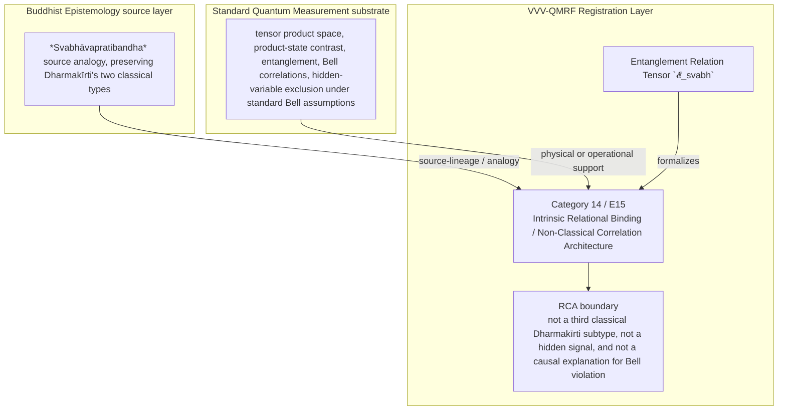

Author: VietVunVut (Viet - Nguyen Xuan); GitHub: https://github.com/AIhugART/; Facebook: https://www.facebook.com/xuanviet

# Formal Registration Category: Intrinsic Relational Binding / Non-Classical Correlation Architecture
# Phạm trù Ghi nhận: Liên kết Quan hệ Nội tại / Kiến trúc Tương quan Phi cổ điển

**Framework:** VietVunVut Quantum Measurement Registration Framework (VVV-QMRF)
**Document type:** category
**Author:** VietVunVut (Viet - Nguyen Xuan)
**GitHub:** https://github.com/AIhugART/
**Date:** 2026-05-12
**Status:** Proposal — Registration class D
**Lineage:** gap/ (BIAN-10) → category/ (Category 14) → framework/ (E15)

> **Context:** This document formally establishes a new VVV-QMRF registration category for QM to resolve structural gap **BIAN-10**. BIAN-10 highlights QM's lack of a formal VVV-QMRF relation category for non-classical correlation architecture outside the scope of Dharmakīrti's two recognized *svabhāvapratibandha* types: *tadutpatti* and *tādātmya*.

---

## 1. Category Identity

* **English Name:** Intrinsic Relational Binding / Non-Classical Correlation Architecture (IRB)
* **Vietnamese Name:** Liên kết Quan hệ Nội tại / Kiến trúc Tương quan Phi cổ điển
* **Buddhist Source Analogue:** *Svabhāvapratibandha* (Essential connection; source concept for analogy, not a claim that IRB is a classical Dharmakīrti subtype)
* **Node:** N_BE_00021
* **Symbol:** Entanglement Relation Tensor $\mathcal{E}_{svabh}$

---

## 2. Definition

**English:**
A formal VVV-QMRF registration category establishing quantum entanglement as an extension relation — not a classical Dharmakīrti subtype, and not reducible to causal (A causes B) or logical identity (A is B / genus-species) models. As *intrinsic relational binding*, A and B share an inseparable, nature-grounded registration bond. Measurements on entangled A and B are registration-non-separable not due to any signal or interaction, but due to the intrinsic nature of their shared quantum state.

**Vietnamese:**
Phạm trù ghi nhận VVV-QMRF thiết lập vướng víu lượng tử như một quan hệ mở rộng, không phải subtype cổ điển của Dharmakīrti và không thể giản lược về mô hình nhân quả hoặc đồng nhất. Dưới dạng *liên kết quan hệ nội tại*, A và B chia sẻ mối liên kết ghi nhận không thể tách rời xuất phát từ bản chất.

---

## 3. Formal Structure

```
Classical contrast relations: Causal (A→B) and logical identity (A=B; genus-species)

Entanglement — IRB (VVV-QMRF extension relation):
  |ψ_AB⟩ ≠ |ψ_A⟩ ⊗ |ψ_B⟩

  Bell inequality violation: |⟨CHSH⟩| > 2
  → supports a registration-layer reading of non-separability as irreducible
  → under standard Bell assumptions (locality + measurement independence), no local hidden-variable account can reproduce the Bell-violating correlations
  → superdeterministic and retrocausal interpretations remain exotic loopholes / alternative assumption frameworks, not ordinary local hidden-variable accounts

Dharmakīrti's recognized svabhāvapratibandha types and VVV-QMRF extension:
  Tādātmya (logical genus-species identity; classical Dharmakīrti type) → logical-identity contrast only; not QM state-vector identity or identical-particle exchange symmetry
  Tadutpatti (causal-grounded; classical Dharmakīrti type)  → causal-coupling contrast
  IRB (VVV-QMRF extension, not a classical subtype)         → Bell-nonlocal entanglement ← BIAN-10
```

---

## 4. Foundational Implications / Ý nghĩa Nền tảng

BIAN-10 resolution: Intrinsic Relational Binding / Non-Classical Correlation Architecture supplies the missing registration-layer category for QM has the mathematics of entanglement but no VVV-QMRF registration relation category that names it as non-causal and non-identity intrinsic binding. Formalizing IRB has three bounded implications:

1. It names entanglement as a registration relation category, not merely a physical curiosity.
2. It preserves Dharmakīrti's two-type taxonomy by marking IRB as a VVV extension.
3. It explains local-hidden-variable failure under standard Bell assumptions through Bell violation, not by saying all local theories are causal only.

> **Conclusion:** Intrinsic Relational Binding / Non-Classical Correlation Architecture resolves BIAN-10 only as a VVV-QMRF registration-layer category. It preserves the standard QM substrate while adding the missing K-side classification and validity boundary.

---

## 5. RCA Concept Traceability Matrix / Bảng Truy vết RCA Khái niệm

**Purpose / Mục đích:** This table records traceability for the main concepts used in this category. It separates direct SOT evidence, framework-derived proposals, QM-only support, and boundary-sensitive applications so that Intrinsic Relational Binding / Non-Classical Correlation Architecture is not confused with ordinary canonical QM or with an unrestricted Buddhist equivalence.

**RCA labels / Nhãn RCA:**
- **Strong:** direct node/edge or SOT evidence exists.
- **Medium:** structurally supported, but not a direct concept-node equivalence.
- **Derived:** proposed by this category/framework, not a source-system node.
- **QM-only:** supported in QM only, not Buddhist Epistemology.
- **No node:** no dedicated node/edge exists in the current SOT.
- **Overclaim:** wording is stronger than the traceable evidence.
- **External:** external experimental or historical support, not a current SOT node.

| Claim anchor | Concept | Evidence / Bằng chứng truy vết | Node code | Edge code | RCA label | Boundary / Fix note |
|---|---|---|---|---|---|---|
| §1-§2 | BIAN-10 / gap diagnosis | BIAN SOT resolves this gap through Category 14 + E15. | N_BE_00021; support: N_BE_00100 | ED_BE_00012 | Strong / No node | Gap diagnosis is not by itself an empirical proof; it identifies the missing registration category. |
| §1-§2 | Intrinsic Relational Binding / Non-Classical Correlation Architecture | VVV-QM RCA assigns the category support in node_QM_VVV. | N_QM_VVV_00025 | — | Derived | Framework category; not a canonical QM postulate unless independently validated. |
| §1 | BE source analogue | *Svabhāvapratibandha* source analogy, preserving Dharmakīrti's two classical types | N_BE_00021; support: N_BE_00100 | ED_BE_00012 | Medium | Source lineage or analogy; do not collapse BE ontology into QM physics. |
| §2-§3 | QM substrate | tensor product space, product-state contrast, entanglement, Bell correlations, hidden-variable exclusion under standard Bell assumptions | N_QM_00045; N_QM_00046; N_QM_00047; N_QM_00090; N_QM_00091 | ED_QM_00053; ED_QM_00054; ED_QM_00055; ED_QM_00103; ED_QM_00104 | QM-only | Canonical QM supports the physical substrate, not the whole VVV-QMRF category. |
| §3 | Formal symbol / operator | Entanglement Relation Tensor `𝓔_svabh` | N_QM_VVV_00025 | — | Derived | Framework notation; do not cite as a source-system operator. |
| §4 | Category implication | Classify non-classical correlation architecture as IRB: an extension relation supported by entanglement and Bell-nonlocal correlations but not reducible to Dharmakīrti's classical causal or identity types. | N_QM_VVV_00025 | — | Medium | Valid only within the stated registration-layer boundary. |
| §4 | Overclaim risk | not a third classical Dharmakīrti subtype, not a hidden signal, and not a causal explanation for Bell violation | — | — | Overclaim | Keep wording conditional and registration-layer specific. |

### 5.1. RCA Summary / Tóm tắt RCA

1. **BIAN-10 is a structural gap, not a direct physical discovery.** The gap identifies missing registration architecture.
2. **The BE source is bounded.** *Svabhāvapratibandha* source analogy, preserving Dharmakīrti's two classical types anchors the analogy or source lineage, but does not automatically become a QM mechanism.
3. **The QM substrate is real but insufficient.** tensor product space, product-state contrast, entanglement, Bell correlations, hidden-variable exclusion under standard Bell assumptions provides support, while Intrinsic Relational Binding / Non-Classical Correlation Architecture names the added K-side layer.
4. **The VVV node(s) are derived.** N_QM_VVV_00025 belong to the framework proposal and should be labeled as derived unless later validated.
5. **Boundary control is mandatory.** The main overclaim to avoid is: not a third classical Dharmakīrti subtype, not a hidden signal, and not a causal explanation for Bell violation.

### 5.2. RCA Five-Step Analysis / Phân tích RCA 5 bước

#### 5.2.1 Define — observed issue / Xác định vấn đề

**Symptom:** The old formulation can make Intrinsic Relational Binding / Non-Classical Correlation Architecture look like either ordinary QM vocabulary or a direct Buddhist-QM equivalence.

**Cause:** The category document did not fully separate BE source support, canonical QM substrate, VVV-QMRF derived formalism, and boundary-sensitive claims.

#### 5.2.2 Trace — 5 Whys / Truy nguyên 5 lần hỏi “vì sao”

1. **Why does the ambiguity appear?** Because the same words describe source analogy, physical measurement support, and framework proposal.
2. **Why is that a schema problem?** Because older category files lacked a complete RCA matrix and assertion-boundary section.
3. **Why can this create overclaim?** Because a derived registration category may be read as a canonical QM postulate or as a literal BE equivalence.
4. **Why is traceability required?** Because each claim needs a node/edge, QM substrate, or explicit `No node` status.
5. **Why does Category 14 exist?** Because BIAN-10 isolates a registration-layer gap: QM has the mathematics of entanglement but no VVV-QMRF registration relation category that names it as non-causal and non-identity intrinsic binding.

#### 5.2.3 Isolate — root cause / Cô lập nguyên nhân gốc

**Root cause:** The document needed explicit schema-level separation between source-system evidence, QM support, VVV-derived notation, and boundary conditions.

#### 5.2.4 Fix — corrected formulation / Sửa đúng nguyên nhân

Use this bounded formulation when precision is required:

```text
Intrinsic Relational Binding / Non-Classical Correlation Architecture = a VVV-QMRF registration-layer category for BIAN-10.
BE source: *Svabhāvapratibandha* source analogy, preserving Dharmakīrti's two classical types.
QM substrate: tensor product space, product-state contrast, entanglement, Bell correlations, hidden-variable exclusion under standard Bell assumptions.
VVV formalism: Entanglement Relation Tensor `𝓔_svabh` / N_QM_VVV_00025.
Boundary: not a third classical Dharmakīrti subtype, not a hidden signal, and not a causal explanation for Bell violation.
```

#### 5.2.5 Verify — root cause removed / Kiểm chứng đã loại bỏ nguyên nhân gốc

The ambiguity is removed if every use of Category 14 distinguishes:

```text
BE source analogue = *Svabhāvapratibandha* source analogy, preserving Dharmakīrti's two classical types.
QM substrate = tensor product space, product-state contrast, entanglement, Bell correlations, hidden-variable exclusion under standard Bell assumptions.
VVV-QMRF category = Intrinsic Relational Binding / Non-Classical Correlation Architecture.
Formal symbol = Entanglement Relation Tensor `𝓔_svabh`.
Boundary = not a third classical Dharmakīrti subtype, not a hidden signal, and not a causal explanation for Bell violation.
```

### 5.3. Gap Type Classification / Phân loại Loại Khoảng trống

| Gap aspect | Classification | RCA note |
|---|---|---|
| Source gap | **BIAN-10** | Qm has the mathematics of entanglement but no vvv-qmrf registration relation category that names it as non-causal and non-identity intrinsic binding. |
| Gap type | **Entanglement relation-category gap** | The missing piece is a registration-category distinction, not merely a prettier sentence. |
| Resolution type | **Category + framework postulate** | Category 14 supplies the detailed category; E15 installs it into VVV-QMRF architecture. |
| Why not only canonical QM? | Canonical QM supports the substrate but not the K-side classification. | Use QM nodes as support, not as proof that the category already exists in standard QM. |
| Boundary | **derived VVV extension-relation category, not a new physical entanglement mechanism** | Keep labels such as Derived, Medium, No node, or QM-only visible in publication-facing prose. |

### 5.4. Prototype IRB Instance / Trường hợp Mẫu của IRB

```text
Prototype IRB instance:

  Setup: composite state is non-factorizable.
  Event: measurements show Bell-violating correlations under standard Bell assumptions.
  Gate: local hidden-variable explanation is ruled out by Bell-type support under those assumptions.
  Update: VVV-QMRF classifies the relation as IRB at the registration layer.
  Contrast: causal production and identity remain contrast classes, not equivalents.

  → IRB instance confirmed only within its boundary.
```

**RCA boundary:** The prototype is valid only when the stated source support, QM substrate, and registration-validity conditions are all kept distinct.

### 5.5. RCA Boundary Cross-Reference — Entanglement, Bell Correlations, and IRB

This category inherits the E15 boundary note on `entanglement`, Bell correlations, and `registration relation` terminology. The RCA separation is:

```text
Standard QM term = entanglement: a non-factorizable joint state, with Bell-type correlations as statistical support under standard Bell-test assumptions.
BE source analogue = svabhāvapratibandha: source-lineage analogy only, preserving Dharmakīrti's two classical types.
VVV-QMRF term = registration-layer relation category: the derived IRB/E15 classification at the K-side registration layer.
```

**Anthropomorphism guardrail:** IRB/E15 does not mean that particles know, recognize, intend, communicate, or certify each other. It only classifies the registration significance of entanglement-related non-separability within VVV-QMRF.

**Publication-safe wording:** `IRB/E15 is a VVV-QMRF-defined registration-layer category for entanglement-related non-separability. It preserves Standard QM entanglement and Bell-correlation formalism while adding K-side classification, not a new physical force, signal, hidden variable, or conscious observer.`

---

### 5.6. Layer Architecture Position / Vị trí trong Kiến trúc Tầng

```text
gap/BIAN-10
  ↓ diagnoses missing registration structure
category/Category 14 — Intrinsic Relational Binding / Non-Classical Correlation Architecture
  ↓ specifies detailed category and boundary conditions
framework/E15
  ↓ installs the rule into VVV-QMRF postulate architecture
VVV-QMRF registration-state update layer
  ↓ applies the category without replacing canonical QM physics
```

| Layer | Document / component | Role |
|---|---|---|
| Gap | BIAN-10 | Diagnoses the missing registration distinction. |
| Category | Category 14 | Defines the detailed registration category. |
| Framework | E15 | Promotes the category into postulate-level architecture. |
| BE source | *Svabhāvapratibandha* source analogy, preserving Dharmakīrti's two classical types | Supplies source-lineage or analogy under RCA boundary. |
| QM substrate | tensor product space, product-state contrast, entanglement, Bell correlations, hidden-variable exclusion under standard Bell assumptions | Supplies physical or operational support only. |

---

## 6. Assertion Level / Mức Khẳng định

| Component EN | Thành phần VN | RCA assertion class | Evidence / Boundary |
|---|---|---|---|
| BE source supports the category lineage | Nguồn BE hỗ trợ dòng nguồn của phạm trù | **M** — source-supported | N_BE_00021; support: N_BE_00100; ED_BE_00012. |
| QM provides the physical substrate | QM cung cấp nền vật lý | **M / QM-only** | N_QM_00045; N_QM_00046; N_QM_00047; N_QM_00090; N_QM_00091; ED_QM_00053; ED_QM_00054; ED_QM_00055; ED_QM_00103; ED_QM_00104. |
| Intrinsic Relational Binding / Non-Classical Correlation Architecture is a VVV-QMRF category | Liên kết Quan hệ Nội tại / Kiến trúc Tương quan Phi cổ điển là phạm trù VVV-QMRF | **D** — framework-derived | N_QM_VVV_00025; E15. |
| Entanglement Relation Tensor `𝓔_svabh` formalizes the category | Entanglement Relation Tensor `𝓔_svabh` hình thức hóa phạm trù | **D** — notation-derived | Framework notation, not a canonical source-system operator. |
| The category resolves BIAN-10 | Phạm trù giải quyết BIAN-10 | **D / M** — bounded resolution | Resolution holds at registration-layer architecture level. |
| Boundary-free reading of the category | Cách đọc không ranh giới về phạm trù | **O** — overclaim | not a third classical Dharmakīrti subtype, not a hidden signal, and not a causal explanation for Bell violation. |

**Summary / Tóm tắt:** The category is traceable as a VVV-QMRF registration-layer proposal. Its BE source and QM substrate support the architecture, but neither should be overstated as a direct one-to-one physical equivalence.

---

## 7. What Category 14 / E15 Does NOT Claim / Những gì Category 14 / E15 KHÔNG tuyên bố

1. **Not a canonical QM replacement** — Intrinsic Relational Binding / Non-Classical Correlation Architecture is a VVV-QMRF registration-layer proposal built beside standard QM support.
   *Không thay thế QM chuẩn; đây là tầng ghi nhận VVV-QMRF đặt bên cạnh nền vật lý QM.*

2. **Not unrestricted equivalence with the BE source** — *Svabhāvapratibandha* source analogy, preserving Dharmakīrti's two classical types supplies source-lineage or analogy only within the stated boundary.
   *Không đồng nhất vô điều kiện với nguồn BE; nguồn BE chỉ làm mô hình nguồn hoặc phép tương tự có ranh giới.*

3. **Not boundary-free application** — not a third classical Dharmakīrti subtype, not a hidden signal, and not a causal explanation for Bell violation.
   *Không áp dụng tự do ngoài điều kiện hợp lệ đã nêu.*

4. **Not closure of exotic Bell loopholes** — superdeterminism and retrocausality remain interpretation-dependent alternative assumption frameworks.
   *Không đóng hoàn toàn các loophole diễn giải hiếm như superdeterminism hoặc retrocausality.*

5. **Not a detector-engineering shortcut** — validity still depends on calibration, context, and the relevant E10-style gate where applicable.
   *Không bỏ qua hiệu chuẩn, bối cảnh, hoặc cổng hợp lệ kiểu E10 khi cần.*

6. **Not an empirical proof of a new physical mechanism** — the category remains derived unless formal predictions and tests are supplied.
   *Chưa phải bằng chứng thực nghiệm cho cơ chế vật lý mới nếu chưa có dự đoán và kiểm nghiệm.*

7. **Not human-consciousness dependence** — registration-state update is a K-side framework term broader than human cognition.
   *Không phụ thuộc ý thức con người; cập nhật trạng thái ghi nhận là thuật ngữ tầng K rộng hơn cognition của người.*

---

## 8. Vietnamese Explanation / Giải thích tiếng Việt rõ ràng

Nói đơn giản, Category 14 / E15 xử lý câu hỏi:

```text
Trong trường hợp này, cái gì thật sự được ghi nhận ở tầng K,
và điều kiện nào làm cho ghi nhận đó hợp lệ?
```

Câu trả lời của VVV-QMRF là:

```text
Vướng víu không phải A gây ra B, cũng không phải A chính là B. Category 14 gọi nó là một kiểu liên kết ghi nhận nội tại, nhưng chỉ như extension của VVV-QMRF, không sửa taxonomy cổ điển của Dharmakīrti.
```

Ranh giới cần nhớ:

```text
BE source không tự động trở thành cơ chế vật lý QM.
QM substrate không tự động chứa toàn bộ category VVV-QMRF.
VVV-QMRF thêm tầng registration-state update / cập nhật trạng thái ghi nhận.
Nếu thiếu điều kiện hợp lệ, claim phải bị hạ xuống Medium, Derived, No node, hoặc Overclaim.
```

---

## 9. Mermaid Diagram Map / Sơ đồ Mermaid

### 9.1 Local Arrow Semantics / Quy ước mũi tên local

This table explains only the arrows used in this diagram. It follows the broader Arrow Semantics rule in `documents/research_documents/vvv-qmrf/schema_guide.md`.

Bảng này chỉ giải thích các mũi tên dùng trong sơ đồ này. Nó tuân theo quy tắc Arrow Semantics rộng hơn trong `documents/research_documents/vvv-qmrf/schema_guide.md`.

| Diagram arrow label | Local meaning | Must not imply |
|---|---|---|
| `source-lineage / analogy` | The Buddhist Epistemology source supplies bounded source lineage or structural analogy for the VVV-QMRF registration category. | Direct identity between Buddhist ontology and Quantum Mechanics. |
| `physical or operational support` | Standard Quantum Mechanics supplies the physical or operational substrate that the registration category analyzes. | Replacement or modification of Standard Quantum Mechanics probability or state-update rules. |
| `formalizes` | The proposed VVV-QMRF notation formalizes the registration-layer category. | A canonical Quantum Mechanics operator or experimentally validated physical mechanism by itself. |
| Unlabeled category-to-boundary arrow | The category must be read under its RCA boundary. | Boundary-free application outside the stated registration conditions. |



---

*Source: BIAN_index_SOT.md (BIAN-10), system_be_full.md (N_BE_00021), SYSTEM_Quantum_Measurement/system_qm_full.md, node_QM_VVV.md (N_QM_VVV_00025), academic taxonomy note cited in the original file*

---

## Schema Validation Checklist / Checklist Kiểm chứng Schema

| Check | Status | RCA note |
|---|---|---|
| Document type declared | Pass | Declared as `category` for schema alignment. |
| Source traceability | Pass | Existing source/cross-reference sections provide the trace base. |
| Claim traceability | Pass | Existing assertion/claim sections classify the major claims. |
| Boundary / non-claim guardrail | Pass | Existing boundary/non-claim text limits overclaiming. |
| Validation rule | Pass | Reuse only with source, claim type, and boundary preserved; unresolved items must be marked `TODO(HOTFIX)` before publication use. |
