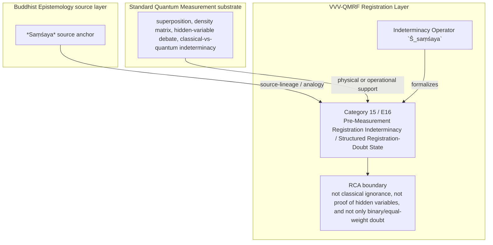

Author: VietVunVut (Viet - Nguyen Xuan); GitHub: https://github.com/AIhugART/; Facebook: https://www.facebook.com/xuanviet

# Formal Registration Category: Pre-Measurement Registration Indeterminacy / Structured Registration-Doubt State
# Phạm trù Ghi nhận: Bất định Ghi nhận Tiền đo / Trạng thái Nghi ngờ Ghi nhận Có Cấu trúc

**Framework:** VietVunVut Quantum Measurement Registration Framework (VVV-QMRF)
**Author:** VietVunVut (Viet - Nguyen Xuan)
**GitHub:** https://github.com/AIhugART/
**Date:** 2026-05-12
**Status:** Proposal — Registration class D
**Lineage:** gap/ (BIAN-11) → category/ (Category 15) → framework/ (E16)

> **Context:** This document formally establishes a new registration category for QM to resolve structural gap **BIAN-11**. BIAN-11 highlights QM's lack of a formal registration category for the registering system's K-state of indeterminacy *before* measurement — structurally analogous to *Saṃśaya* (Doubt — the BE source model of epistemic suspension that motivates inquiry toward certainty).

---

## 1. Category Identity

* **English Name:** Pre-Measurement Registration Indeterminacy / Structured Registration-Doubt State (SDS)
* **Vietnamese Name:** Bất định Ghi nhận Tiền đo / Trạng thái Nghi ngờ Ghi nhận Có Cấu trúc
* **Buddhist Equivalent:** *Saṃśaya* (Doubt — epistemic suspension that motivates inquiry toward certainty; used here as a bounded source analogue for structured non-determination, not a binary/equal-weight state)
* **Node:** N_BE_00007
* **Symbol:** Indeterminacy Operator $\hat{S}_{saṃśaya}$

---

## 2. Definition

**English:**
A formal registration category for the registering system's K-state when facing a quantum system in superposition before measurement. This state is NOT mere ignorance (the registering system encodes the superposition structure), NOT certainty (no eigenvalue is determined), but *structured indeterminacy* — the registering system holds a structured K-side suspension between definite alternatives, with a known probability distribution over them. This is the quantum counterpart of Buddhist *Saṃśaya*: doubt not as confusion but as a rigorous source-lineage analogue for structured non-determination.

**Vietnamese:**
Phạm trù ghi nhận chính thức cho trạng thái K của hệ ghi nhận khi đối mặt với hệ lượng tử trong chồng chập trước khi đo. Không phải vô tri (hệ ghi nhận mã hóa cấu trúc chồng chập), không phải chắc chắn (chưa có eigenvalue), mà là *bất định có cấu trúc* — hệ ghi nhận ở trạng thái treo có cấu trúc giữa các lựa chọn xác định với phân phối xác suất đã biết.

---

## 3. Formal Structure

```
Ignorance (classical): P(λ) = unknown
Certainty: ρ = |λᵢ⟩⟨λᵢ| (definite eigenstate)

SDS (Structured Doubt State):
  ρ = Σᵢ pᵢ |λᵢ⟩⟨λᵢ| + Σᵢ≠ⱼ ρᵢⱼ |λᵢ⟩⟨λⱼ|, where pᵢ = |cᵢ|²
  Registering system encodes: {λᵢ}, {pᵢ = |cᵢ|²}, AND the coherences ρᵢⱼ
  Registering system has NOT registered: which λᵢ will actualize

This is richer than classical probability distribution:
  Classical ignorance: P(λᵢ) = pᵢ (diagonal only)
  SDS: ρ contains off-diagonal terms — superposition, not mixture
       → the "doubt" is quantum-coherent, not merely statistical

Saṃśaya mapping:
  "Hovering between tree-stump and man in dusk" (Nyāya example)
  → Quantum: state |ψ⟩ = Σᵢ cᵢ |λᵢ⟩
  → Registering system encodes the alternatives, their weights, and coherence relations
  → K-side state: suspended, awaiting registration-state update

Hidden variable connection (QM#91):
  Some hidden-variable readings treat SDS as hidden classical ignorance
  → Bell-type results rule out local hidden-variable completion under standard assumptions
  → Within VVV-QMRF, SDS is treated as the pre-measurement K-side category, not as a missing physical variable
```

[^nyaya-samsaya]: The tree-stump/man-at-dusk illustration is a standard Nyāya example of *Saṃśaya*. It is used here only as a cross-tradition illustration of structured doubt; within Buddhist Pramāṇavāda, *Saṃśaya* remains a non-pramāṇa / epistemic-error state that motivates inquiry toward valid cognition, not an independent source of valid knowledge.

---

## 4. Foundational Implications / Ý nghĩa Nền tảng

BIAN-11 resolution: Pre-Measurement Registration Indeterminacy / Structured Registration-Doubt State supplies the missing registration-layer category for QM represents superposition physically, but does not name the registering system's K-side structured suspension before measurement. Formalizing SDS has three bounded implications:

1. It distinguishes quantum superposition from ordinary ignorance at the registration layer.
2. It bounds hidden-variable interpretations instead of endorsing them.
3. It treats doubt as structured non-determination, not confusion.

> **Conclusion:** Pre-Measurement Registration Indeterminacy / Structured Registration-Doubt State resolves BIAN-11 only as a VVV-QMRF registration-layer category. It preserves the standard QM substrate while adding the missing K-side classification and validity boundary.

---

## 5. RCA Concept Traceability Matrix / Bảng Truy vết RCA Khái niệm

**Purpose / Mục đích:** This table records traceability for the main concepts used in this category. It separates direct SOT evidence, framework-derived proposals, QM-only support, and boundary-sensitive applications so that Pre-Measurement Registration Indeterminacy / Structured Registration-Doubt State is not confused with ordinary canonical QM or with an unrestricted Buddhist equivalence.

**RCA labels / Nhãn RCA:**
- **Strong:** direct node/edge or SOT evidence exists.
- **Medium:** structurally supported, but not a direct concept-node equivalence.
- **Derived:** proposed by this category/framework, not a source-system node.
- **QM-only:** supported in QM only, not Buddhist Epistemology.
- **No node:** no dedicated node/edge exists in the current SOT.
- **Overclaim:** wording is stronger than the traceable evidence.
- **External:** external experimental or historical support, not a current SOT node.

| Claim anchor | Concept | Evidence / Bằng chứng truy vết | Node code | Edge code | RCA label | Boundary / Fix note |
|---|---|---|---|---|---|---|
| §1-§2 | BIAN-11 / gap diagnosis | BIAN SOT resolves this gap through Category 15 + E16. | N_BE_00007; support: N_BE_00137 | — | Strong / No node | Gap diagnosis is not by itself an empirical proof; it identifies the missing registration category. |
| §1-§2 | Pre-Measurement Registration Indeterminacy / Structured Registration-Doubt State | VVV-QM RCA assigns the category support in node_QM_VVV. | N_QM_VVV_00054; N_QM_VVV_00055 | — | Derived | Framework category; not a canonical QM postulate unless independently validated. |
| §1 | BE source analogue | *Saṃśaya* source anchor | N_BE_00007; support: N_BE_00137 | — | Medium | Source lineage or analogy; do not collapse BE ontology into QM physics. |
| §2-§3 | QM substrate | superposition, density matrix, hidden-variable debate, classical-vs-quantum indeterminacy | N_QM_00005; N_QM_00025; N_QM_00091; N_QM_00100; N_QM_00002 | ED_QM_00003; ED_QM_00028; ED_QM_00103; ED_QM_00113 | QM-only | Canonical QM supports the physical substrate, not the whole VVV-QMRF category. |
| §3 | Formal symbol / operator | Indeterminacy Operator `Ŝ_saṃśaya` | N_QM_VVV_00054; N_QM_VVV_00055 | — | Derived | Framework notation; do not cite as a source-system operator. |
| §4 | Category implication | Classify the pre-measurement registration state as structured doubt: not ignorance, not certainty, and not a hidden variable. | N_QM_VVV_00054; N_QM_VVV_00055 | — | Medium | Valid only within the stated registration-layer boundary. |
| §4 | Overclaim risk | not classical ignorance, not proof of hidden variables, and not only binary/equal-weight doubt | — | — | Overclaim | Keep wording conditional and registration-layer specific. |

### 5.1. RCA Summary / Tóm tắt RCA

1. **BIAN-11 is a structural gap, not a direct physical discovery.** The gap identifies missing registration architecture.
2. **The BE source is bounded.** *Saṃśaya* source anchor anchors the analogy or source lineage, but does not automatically become a QM mechanism.
3. **The QM substrate is real but insufficient.** superposition, density matrix, hidden-variable debate, classical-vs-quantum indeterminacy provides support, while Pre-Measurement Registration Indeterminacy / Structured Registration-Doubt State names the added K-side layer.
4. **The VVV node(s) are derived.** N_QM_VVV_00054; N_QM_VVV_00055 belong to the framework proposal and should be labeled as derived unless later validated.
5. **Boundary control is mandatory.** The main overclaim to avoid is: not classical ignorance, not proof of hidden variables, and not only binary/equal-weight doubt.

### 5.2. RCA Five-Step Analysis / Phân tích RCA 5 bước

#### 5.2.1 Define — observed issue / Xác định vấn đề

**Symptom:** The old formulation can make Pre-Measurement Registration Indeterminacy / Structured Registration-Doubt State look like either ordinary QM vocabulary or a direct Buddhist-QM equivalence.

**Cause:** The category document did not fully separate BE source support, canonical QM substrate, VVV-QMRF derived formalism, and boundary-sensitive claims.

#### 5.2.2 Trace — 5 Whys / Truy nguyên 5 lần hỏi “vì sao”

1. **Why does the ambiguity appear?** Because the same words describe source analogy, physical measurement support, and framework proposal.
2. **Why is that a schema problem?** Because older category files lacked a complete RCA matrix and assertion-boundary section.
3. **Why can this create overclaim?** Because a derived registration category may be read as a canonical QM postulate or as a literal BE equivalence.
4. **Why is traceability required?** Because each claim needs a node/edge, QM substrate, or explicit `No node` status.
5. **Why does Category 15 exist?** Because BIAN-11 isolates a registration-layer gap: QM represents superposition physically, but does not name the registering system's K-side structured suspension before measurement.

#### 5.2.3 Isolate — root cause / Cô lập nguyên nhân gốc

**Root cause:** The document needed explicit schema-level separation between source-system evidence, QM support, VVV-derived notation, and boundary conditions.

#### 5.2.4 Fix — corrected formulation / Sửa đúng nguyên nhân

Use this bounded formulation when precision is required:

```text
Pre-Measurement Registration Indeterminacy / Structured Registration-Doubt State = a VVV-QMRF registration-layer category for BIAN-11.
BE source: *Saṃśaya* source anchor.
QM substrate: superposition, density matrix, hidden-variable debate, classical-vs-quantum indeterminacy.
VVV formalism: Indeterminacy Operator `Ŝ_saṃśaya` / N_QM_VVV_00054; N_QM_VVV_00055.
Boundary: not classical ignorance, not proof of hidden variables, and not only binary/equal-weight doubt.
```

#### 5.2.5 Verify — root cause removed / Kiểm chứng đã loại bỏ nguyên nhân gốc

The ambiguity is removed if every use of Category 15 distinguishes:

```text
BE source analogue = *Saṃśaya* source anchor.
QM substrate = superposition, density matrix, hidden-variable debate, classical-vs-quantum indeterminacy.
VVV-QMRF category = Pre-Measurement Registration Indeterminacy / Structured Registration-Doubt State.
Formal symbol = Indeterminacy Operator `Ŝ_saṃśaya`.
Boundary = not classical ignorance, not proof of hidden variables, and not only binary/equal-weight doubt.
```

### 5.3. Gap Type Classification / Phân loại Loại Khoảng trống

| Gap aspect | Classification | RCA note |
|---|---|---|
| Source gap | **BIAN-11** | Qm represents superposition physically, but does not name the registering system's k-side structured suspension before measurement. |
| Gap type | **Pre-measurement registration-state gap** | The missing piece is a registration-category distinction, not merely a prettier sentence. |
| Resolution type | **Category + framework postulate** | Category 15 supplies the detailed category; E16 installs it into VVV-QMRF architecture. |
| Why not only canonical QM? | Canonical QM supports the substrate but not the K-side classification. | Use QM nodes as support, not as proof that the category already exists in standard QM. |
| Boundary | **source-supported BE anchor; derived pre-measurement K-state category** | Keep labels such as Derived, Medium, No node, or QM-only visible in publication-facing prose. |

### 5.4. Prototype SDS Instance / Trường hợp Mẫu của SDS

```text
Prototype SDS instance:

  Setup: system is prepared in a superposition or density-matrix state.
  Event: registering system knows the alternatives and weights but no eigenvalue is actualized.
  Gate: off-diagonal coherence means the state is richer than classical ignorance.
  Update: `Ŝ_saṃśaya` names the suspended K-side registration state.
  Contrast: Bell-type limits block treating SDS as merely hidden classical ignorance.

  → SDS instance confirmed only within its boundary.
```

**RCA boundary:** The prototype is valid only when the stated source support, QM substrate, and registration-validity conditions are all kept distinct.

### 5.5. Layer Architecture Position / Vị trí trong Kiến trúc Tầng

```text
gap/BIAN-11
  ↓ diagnoses missing registration structure
category/Category 15 — Pre-Measurement Registration Indeterminacy / Structured Registration-Doubt State
  ↓ specifies detailed category and boundary conditions
framework/E16
  ↓ installs the rule into VVV-QMRF postulate architecture
VVV-QMRF registration-state update layer
  ↓ applies the category without replacing canonical QM physics
```

| Layer | Document / component | Role |
|---|---|---|
| Gap | BIAN-11 | Diagnoses the missing registration distinction. |
| Category | Category 15 | Defines the detailed registration category. |
| Framework | E16 | Promotes the category into postulate-level architecture. |
| BE source | *Saṃśaya* source anchor | Supplies source-lineage or analogy under RCA boundary. |
| QM substrate | superposition, density matrix, hidden-variable debate, classical-vs-quantum indeterminacy | Supplies physical or operational support only. |

---

## 6. Assertion Level / Mức Khẳng định

| Component EN | Thành phần VN | Epistemic class | Evidence / Boundary |
|---|---|---|---|
| BE source supports the category lineage | Nguồn BE hỗ trợ dòng nguồn của phạm trù | **M** — source-supported | N_BE_00007; support: N_BE_00137; —. |
| QM provides the physical substrate | QM cung cấp nền vật lý | **M / QM-only** | N_QM_00005; N_QM_00025; N_QM_00091; N_QM_00100; N_QM_00002; ED_QM_00003; ED_QM_00028; ED_QM_00103; ED_QM_00113. |
| Pre-Measurement Registration Indeterminacy / Structured Registration-Doubt State is a VVV-QMRF category | Bất định Ghi nhận Tiền đo / Trạng thái Nghi ngờ Ghi nhận Có Cấu trúc là phạm trù VVV-QMRF | **D** — framework-derived | N_QM_VVV_00054; N_QM_VVV_00055; E16. |
| Indeterminacy Operator `Ŝ_saṃśaya` formalizes the category | Indeterminacy Operator `Ŝ_saṃśaya` hình thức hóa phạm trù | **D** — notation-derived | Framework notation, not a canonical source-system operator. |
| The category resolves BIAN-11 | Phạm trù giải quyết BIAN-11 | **D / M** — bounded resolution | Resolution holds at registration-layer architecture level. |
| Boundary-free reading of the category | Cách đọc không ranh giới về phạm trù | **O** — overclaim | not classical ignorance, not proof of hidden variables, and not only binary/equal-weight doubt. |

**Summary / Tóm tắt:** The category is traceable as a VVV-QMRF registration-layer proposal. Its BE source and QM substrate support the architecture, but neither should be overstated as a direct one-to-one physical equivalence.

---

## 7. What Category 15 / E16 Does NOT Claim / Những gì Category 15 / E16 KHÔNG tuyên bố

1. **Not a canonical QM replacement** — Pre-Measurement Registration Indeterminacy / Structured Registration-Doubt State is a VVV-QMRF registration-layer proposal built beside standard QM support.
   *Không thay thế QM chuẩn; đây là tầng ghi nhận VVV-QMRF đặt bên cạnh nền vật lý QM.*

2. **Not unrestricted equivalence with the BE source** — *Saṃśaya* source anchor supplies source-lineage or analogy only within the stated boundary.
   *Không đồng nhất vô điều kiện với nguồn BE; nguồn BE chỉ làm mô hình nguồn hoặc phép tương tự có ranh giới.*

3. **Not boundary-free application** — not classical ignorance, not proof of hidden variables, and not only binary/equal-weight doubt.
   *Không áp dụng tự do ngoài điều kiện hợp lệ đã nêu.*

4. **Not a detector-engineering shortcut** — validity still depends on calibration, context, and the relevant E10-style gate where applicable.
   *Không bỏ qua hiệu chuẩn, bối cảnh, hoặc cổng hợp lệ kiểu E10 khi cần.*

5. **Not an empirical proof of a new physical mechanism** — the category remains derived unless formal predictions and tests are supplied.
   *Chưa phải bằng chứng thực nghiệm cho cơ chế vật lý mới nếu chưa có dự đoán và kiểm nghiệm.*

6. **Not human-consciousness dependence** — registration-state update is a K-side framework term broader than human cognition.
   *Không phụ thuộc ý thức con người; cập nhật trạng thái ghi nhận là thuật ngữ tầng K rộng hơn cognition của người.*

---

## 8. Vietnamese Explanation / Giải thích tiếng Việt rõ ràng

Nói đơn giản, Category 15 / E16 xử lý câu hỏi:

```text
Trong trường hợp này, cái gì thật sự được ghi nhận ở tầng K,
và điều kiện nào làm cho ghi nhận đó hợp lệ?
```

Câu trả lời của VVV-QMRF là:

```text
Trước khi đo, hệ ghi nhận không phải `không biết gì`. Nó biết cấu trúc các khả năng và trọng số, nhưng chưa có kết quả nào được khóa. Category 15 gọi đó là `structured doubt`.
```

Ranh giới cần nhớ:

```text
BE source không tự động trở thành cơ chế vật lý QM.
QM substrate không tự động chứa toàn bộ category VVV-QMRF.
VVV-QMRF thêm tầng registration-state update / cập nhật trạng thái ghi nhận.
Nếu thiếu điều kiện hợp lệ, claim phải bị hạ xuống Medium, Derived, No node, hoặc Overclaim.
```

---

## 9. Mermaid Diagram Map / Sơ đồ Mermaid



---

*Source: BIAN_index_SOT.md (BIAN-11), system_be_full.md (N_BE_00007), SYSTEM_Quantum_Measurement/system_qm_full.md, node_QM_VVV.md (N_QM_VVV_00054-00055), framework/E16_pre_measurement_indeterminacy_postulate.md*
