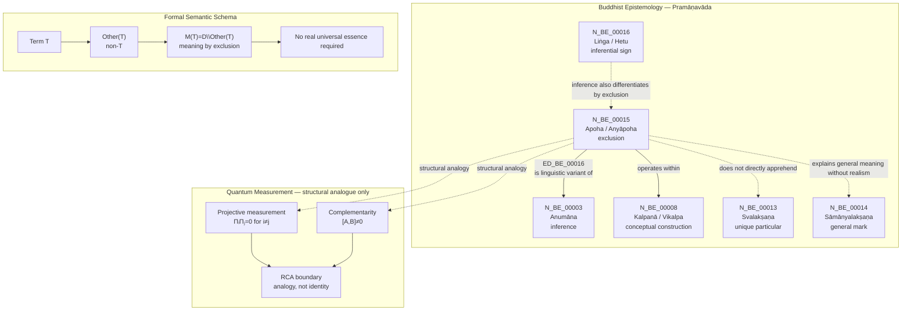

Author: VietVunVut (Viet - Nguyen Xuan); GitHub: https://github.com/AIhugART/; Facebook: https://www.facebook.com/xuanviet

# RCA: BE15 / N_BE_00015 — Apoha as Exclusion

## 1. Canonical Identification

| Field | Value |
|---|---|
| Short label | BE15 |
| Canonical node code | N_BE_00015 |
| Concept | Apoha / Anyāpoha |
| English rendering | Exclusion / exclusion of the other |
| Vietnamese rendering | Loại trừ / loại trừ cái-khác |
| Category | Philosophy of language |
| Framework | Buddhist Epistemology / Pramāṇavāda |
| Ground tradition | Dignāga epistemology and Buddhist nominalism |
| Tier in mapping | T6.05 — Meta-semantic principle |
| Primary relation | ED_BE_00016: N_BE_00015 → N_BE_00003 |
| Related node | N_BE_00003 — Anumāna / Inference |
| Structural QM analogue | Complementarity / mutual exclusion of incompatible observables |

**Canonical statement:** N_BE_00015 denotes Apoha / Anyāpoha, Dignāga's theory that linguistic meaning is established by excluding what the term does not denote. A word does not grasp a real universal essence; it functions by excluding the other. Within the graph, Apoha is classified under Philosophy of language and is linked to N_BE_00003 — Anumāna because verbal cognition is treated as a linguistic variant of inference.

---

## 2. RCA Definition

### 2.1 Define — observed issue

**Symptom:** The short diagram label `BE15` can be misunderstood as ordinary negation, a general category, or a quantum-physical exclusion rule.

**Cause:** The abbreviated label hides the canonical node code, Sanskrit term, semantic function, and boundary between Buddhist philosophy of language and quantum-measurement analogy.

### 2.2 Trace — 5 Whys

1. **Why does `BE15` look ambiguous?** Because it is a shortened diagram label rather than the canonical node code `N_BE_00015`.
2. **Why can `Apoha` be misread as simple negation?** Because the English word "exclusion" sounds like ordinary denial rather than a theory of how words mean.
3. **Why is that wrong?** Because Apoha is not merely saying "not X"; it explains how `X` is understood through exclusion of `non-X`.
4. **Why does this matter for the BE-QM mapping?** Because quantum complementarity also uses exclusion-like structure, but it operates in physical measurement contexts, not linguistic meaning.
5. **Why must the boundary be explicit?** Because treating Apoha as a physical law would collapse a semantic principle into a quantum-mechanical principle, producing a category error.

### 2.3 Isolate — root cause

**Root cause:** `BE15` was used as a shorthand label without explicitly preserving its canonical status as `N_BE_00015 — Apoha / Anyāpoha`, a Philosophy-of-language node whose function is semantic exclusion, not physical exclusion.

### 2.4 Fix — corrected formulation

Use the canonical form when precision is required:

```text
N_BE_00015 — Apoha / Anyāpoha / Exclusion
Category: Philosophy of language
Framework: Buddhist Epistemology / Pramāṇavāda
Role: linguistic meaning through exclusion of what the term is not
Primary graph relation: N_BE_00015 → N_BE_00003 via ED_BE_00016
```

### 2.5 Verify — root cause removed

The ambiguity is removed if every usage distinguishes:

```text
BE15 = diagram shorthand
N_BE_00015 = canonical node code
Apoha / Anyāpoha = concept
Philosophy of language = category
Pramāṇavāda = framework
Anumāna = linked epistemic process
Complementarity = QM structural analogue only
```

---

## 3. Formal Semantic Schema

### 3.1 Minimal schema

```text
BE15 = N_BE_00015 = Apoha / Anyāpoha
Apoha = meaning through exclusion of the other
```

### 3.2 Core formula

Let:

```text
D = domain of possible referents
T = linguistic term
Other(T) = what is excluded by T
M(T) = semantic meaning-function of T
```

Then:

```text
M(T) := D \ Other(T)
```

Equivalent predicate form:

```text
M(T)(x) ⇔ x ∉ Other(T)
```

Or in the common double-negative expression:

```text
Meaning(T) = not-non-T
```

### 3.3 Example formula

For the word "cow":

```text
Meaning("cow") = ¬(non-cow)
```

More explicitly:

```text
Cow_semantic(x) ⇔ x ∉ NonCow
```

This does not mean that a real universal essence called "cow-ness" has been found. It means that the word "cow" functions by excluding what is not cow.

### 3.4 Anti-essentialist constraint

```text
Apoha(T) does not require RealUniversal(T)
```

Therefore:

```text
Meaning(T) ≠ grasping an independent universal essence
Meaning(T) = exclusion of the other within conceptual cognition
```

### 3.5 Linguistic-inferential formula

```text
Hear(T) → Exclude(Other(T)) → Cognize(T-as-designation)
```

Graphically:

```text
N_BE_00015 → N_BE_00003
Apoha is a linguistic variant of Anumāna
```

---

## 4. Graph Relations

| Edge | Relation | Meaning |
|---|---|---|
| ED_BE_00016 | N_BE_00015 → N_BE_00003 | Apoha is a linguistic variant of Anumāna |

### Graph expression

```text
N_BE_00015 —is linguistic variant of→ N_BE_00003
Apoha —is linguistic variant of→ Anumāna
```

### Interpretation

Apoha belongs to language and conceptual cognition. It does not belong to direct perception. A word does not directly reveal a unique particular; it operates by excluding non-applicable alternatives, which makes verbal cognition inferential in structure.

---

## 5. Position in Buddhist Epistemology

### 5.1 What BE15 is

```text
BE15 is a semantic mechanism.
BE15 explains how words mean.
BE15 belongs to Philosophy of language.
BE15 is connected to Anumāna because verbal cognition is inferentially structured.
```

### 5.2 What BE15 is not

```text
BE15 is not a framework.
BE15 is not a source of direct perception.
BE15 is not ordinary negation only.
BE15 is not a quantum-mechanical law.
BE15 is not an ontological proof of real universals.
```

### 5.3 Relation to nearby BE nodes

| Node | Relation to BE15 |
|---|---|
| N_BE_00003 — Anumāna | Apoha is treated as a linguistic variant of inference. |
| N_BE_00008 — Kalpanā / Vikalpa | Apoha operates inside conceptual construction and linguistic classification. |
| N_BE_00013 — Svalakṣaṇa | Apoha does not directly apprehend the unique particular. |
| N_BE_00014 — Sāmānyalakṣaṇa | Apoha explains conceptual/general meaning without accepting real universals. |
| N_BE_00016 — Liṅga / Hetu | Both Apoha and inferential signs work by exclusion-like differentiation. |

---

## 6. Relation to Quantum Measurement

Within the BE-QM mapping, `N_BE_00015 — Apoha` is structurally related to exclusion-like features in quantum theory, especially complementarity and mutual exclusivity inside a measurement context.

### 6.1 Structural mapping

```text
BE15: meaning is formed by excluding what the term is not.
QM analogue: a measurement context defines possible outcomes partly by excluding incompatible alternatives.
```

### 6.2 Projective measurement analogue

For a projective measurement with projectors `Πᵢ`:

```text
ΠᵢΠⱼ = 0, for i ≠ j
Σᵢ Πᵢ = I
```

Structural reading only:

```text
Outcome i is distinguished by excluding other mutually exclusive outcomes j ≠ i within the same measurement context.
```

### 6.3 Complementarity analogue

For incompatible observables `A` and `B`:

```text
[A, B] ≠ 0
```

Structural reading only:

```text
A measurement context for A excludes simultaneous sharp determination of B.
```

### 6.4 RCA boundary

This relation is not an identity claim.

```text
Apoha = semantic exclusion in Buddhist philosophy of language.
Quantum complementarity = physical and formal incompatibility of measurement contexts.
```

Therefore:

```text
Complementarity plays an Apoha-like structural role, but complementarity is not Apoha.
```

---

## 7. Scientific English Statement

`N_BE_00015` denotes `Apoha` or `Anyāpoha`, the Buddhist semantic theory of exclusion associated with Dignāga. In this framework, a word does not denote by grasping a real universal essence; rather, it functions by excluding what is other than its intended referent. The meaning of a term such as "cow" is therefore formally expressible as the exclusion of non-cow, not as the direct apprehension of a universal cow-essence.

Within the Buddhist epistemological graph, Apoha is classified under Philosophy of language and is connected to `N_BE_00003 — Anumāna` by `ED_BE_00016`, because verbal cognition is treated as inferential in structure. In the quantum-measurement mapping, Apoha may be structurally compared to complementarity or mutually exclusive measurement outcomes, since both involve determination through exclusion. However, this comparison is only structural and functional. Apoha is a semantic principle, while quantum complementarity is a formal-physical relation among observables and measurement contexts.

---

## 8. Vietnamese Explanation

`BE15` là nhãn ngắn trong diagram. Tên chuẩn là:

```text
N_BE_00015 — Apoha / Anyāpoha
```

Nói đơn giản:

```text
Apoha = hiểu một từ bằng cách loại trừ cái không phải nó
```

Ví dụ:

```text
"cow" = not non-cow
"con bò" = không-phải-không-phải-con-bò
```

Điểm quan trọng: đây không phải chỉ là phủ định bình thường. Đây là cách giải thích nghĩa của ngôn ngữ. Khi ta nói "con bò", theo Apoha, tâm không cần nắm một bản chất phổ quát gọi là "cow-ness". Nó chỉ loại trừ những thứ không thuộc phạm vi "cow".

Trong mapping với Quantum Measurement, BE15 có thể so với "complementarity" hoặc sự loại trừ giữa các kết quả đo không tương thích. Nhưng đây chỉ là giống nhau về cấu trúc.

```text
Apoha = nguyên lý ngữ nghĩa
Complementarity = nguyên lý vật lý / toán học trong đo lường lượng tử
```

Vì vậy:

```text
BE15 giống QM ở cấu trúc loại trừ,
nhưng BE15 không phải là quy luật lượng tử.
```

---

## 9. Mermaid Diagram Map



---

## 10. Final RCA Conclusion

```text
BE15 is not a framework, not a general category label, and not a quantum-mechanical law.
BE15 is the diagram shorthand for the canonical node N_BE_00015.
N_BE_00015 denotes Apoha / Anyāpoha, Dignāga's semantic theory of exclusion, classified under Philosophy of language within Buddhist Epistemology / Pramāṇavāda.
```

The correct graph statement is:

```text
N_BE_00015 → N_BE_00003
```

meaning:

```text
Apoha is a linguistic variant of Anumāna: verbal meaning is established by excluding what the term is not, rather than by grasping an independent universal essence.
```

The correct cross-domain statement is:

```text
Apoha structurally parallels complementarity and mutually exclusive measurement outcomes, but only as an analogy.
```

Final boundary:

```text
Apoha = semantic exclusion.
Quantum complementarity = physical-formal incompatibility.
They are structurally comparable, not identical.
```
