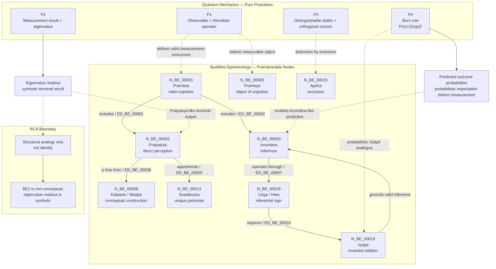

Author: VietVunVut (Viet - Nguyen Xuan); GitHub: https://github.com/AIhugART/; Facebook: https://www.facebook.com/xuanviet

# RCA: BE2 / N_BE_00002 — Pratyakṣa as Direct Perception

## 1. Canonical Identification

| Field | Value |
|---|---|
| Short label | BE2 |
| Canonical node code | N_BE_00002 |
| Concept | Pratyakṣa |
| English rendering | Direct perception / non-inferential cognition |
| Vietnamese rendering | Nhận thức trực tiếp / nhận thức không qua suy luận |
| Category | Source of knowledge |
| Framework | Buddhist Epistemology / Pramāṇavāda |
| Ground tradition | Dignāga–Dharmakīrti epistemology |
| Parent node | N_BE_00001 — Pramāṇa |
| Primary object | N_BE_00013 — Svalakṣaṇa |
| Primary exclusion | N_BE_00008 — Vikalpa / Kalpanā |

**Canonical statement:** N_BE_00002 denotes Pratyakṣa, the Buddhist epistemological category of direct perception within the Pramāṇavāda framework. It is classified as a source of knowledge and functions as one of the two primary forms of Pramāṇa, alongside N_BE_00003 — Anumāna.

---

## 2. RCA Definition

### 2.1 Define — observed issue

**Symptom:** The short diagram label `BE2` can be misunderstood as a framework, a category family, or ordinary perception in general.

**Cause:** The abbreviated label hides the canonical node code, Sanskrit term, category, and internal graph relations.

### 2.2 Trace — 5 Whys

1. **Why does `BE2` look ambiguous?** Because it is a shortened diagram label rather than the canonical node code `N_BE_00002`.
2. **Why does this matter?** Because the project distinguishes node, category, framework, and cross-domain mapping status.
3. **Why can `Pratyakṣa` be misread as ordinary perception?** Because English "perception" often includes interpreted, conceptual, and linguistic recognition.
4. **Why is that wrong in this framework?** Because Dignāga defines Pratyakṣa as cognition free from conceptual construction, not as ordinary interpreted perception.
5. **Why must the definition be constrained?** Because mapping Pratyakṣa directly to a symbolic quantum readout would collapse a non-conceptual epistemic act into a mathematical output.

### 2.3 Isolate — root cause

**Root cause:** `BE2` was used as a shorthand label without explicitly preserving its canonical status as `N_BE_00002 — Pratyakṣa`, a source-of-knowledge node in Buddhist Epistemology whose defining condition is direct, non-inferential, non-conceptual cognition.

### 2.4 Fix — corrected formulation

Use the canonical form when precision is required:

```text
N_BE_00002 — Pratyakṣa / Direct perception
Category: Source of knowledge
Framework: Buddhist Epistemology / Pramāṇavāda
Role: direct, non-inferential cognition free from conceptual construction
```

### 2.5 Verify — root cause removed

The ambiguity is removed if every usage distinguishes:

```text
BE2 = diagram shorthand
N_BE_00002 = canonical node code
Pratyakṣa = concept
Source of knowledge = category
Pramāṇavāda = framework
Eigenvalue readout = QM structural analogue only
```

---

## 3. Formal Epistemic Schema

### 3.1 Minimal schema

```text
BE2 = N_BE_00002 = Pratyakṣa
Pratyakṣa = direct cognition free from kalpanā
```

### 3.2 Expanded condition schema

```text
Pratyakṣa(C, O) is valid if and only if:

1. direct_apprehension(C, O) = true
2. inferential_mediation(C, O) = false
3. conceptual_construction(C, O) = false
4. error_or_deception(C, O) = false
5. object_type(O) = svalakṣaṇa
```

Where:

```text
C = cognitive event
O = object as directly apprehended
svalakṣaṇa = unique, concrete, causally efficacious particular
kalpanā = conceptual construction / linguistic-categorical overlay
```

### 3.3 Compressed formula

```text
N_BE_00002 := Pratyakṣa(C, O)
             ⇔ Direct(C, O) ∧ ¬Inferential(C, O) ∧ ¬Kalpanā(C, O) ∧ ¬Bhrānti(C, O)
```

### 3.4 Object relation formula

```text
N_BE_00002 → N_BE_00013
Pratyakṣa apprehends Svalakṣaṇa
```

### 3.5 Exclusion relation formula

```text
N_BE_00002 → N_BE_00008
Pratyakṣa is free from Kalpanā
```

---

## 4. Graph Relations

| Edge | Relation | Meaning |
|---|---|---|
| ED_BE_00001 | N_BE_00001 → N_BE_00002 | Pramāṇa includes Pratyakṣa |
| ED_BE_00005 | N_BE_00002 → N_BE_00013 | Pratyakṣa apprehends Svalakṣaṇa |
| ED_BE_00038 | N_BE_00002 → N_BE_00008 | Pratyakṣa is free from Vikalpa / Kalpanā |

### Graph expression

```text
N_BE_00001 —includes→ N_BE_00002
N_BE_00002 —apprehends→ N_BE_00013
N_BE_00002 —is free from→ N_BE_00008
```

---

## 5. Relation to the Four Quantum-Mechanics Postulates

Within the four-postulate structure, `N_BE_00002 — Pratyakṣa` is most closely related to the second postulate:

```text
P2: possible measurement results are the eigenvalues of the measured operator.
```

The structural relation is:

```text
P2 → N_BE_00002
Measurement eigenvalue readout structurally parallels Pratyakṣa.
```

### RCA boundary

This relation is not an identity claim.

```text
Pratyakṣa = non-conceptual direct cognition.
Eigenvalue readout = symbolic, mathematically encoded measurement result.
```

Therefore:

```text
P2 functions as a formal measurement-output analogue of BE2, but P2 is not BE2.
```

---

## 6. Scientific English Statement

`N_BE_00002` denotes `Pratyakṣa`, the category of direct perception in Buddhist epistemology. Within the Pramāṇavāda framework, Pratyakṣa is a primary source of valid cognition and is defined as immediate, non-inferential cognition free from conceptual construction (`kalpanā`). Its proper object is the `svalakṣaṇa`, the unique and causally efficacious particular.

In the quantum-measurement mapping, Pratyakṣa can be structurally compared to an eigenvalue readout, because both function as terminal, non-inferential outcome-events within their respective systems. However, the comparison is only structural and functional, not ontological or doctrinal. A quantum eigenvalue is already a symbolic and mathematically encoded result, whereas Pratyakṣa is defined precisely by its freedom from conceptual and linguistic construction. Thus, `P2 → N_BE_00002` should be read as a constrained analogy: the eigenvalue readout plays a Pratyakṣa-like role as the terminal measurement event, but it does not instantiate Pratyakṣa in the strict Buddhist epistemological sense.

---

## 7. Vietnamese Explanation

`BE2` là nhãn ngắn trong diagram. Tên chuẩn là `N_BE_00002 — Pratyakṣa`.

Nói đơn giản:

```text
Pratyakṣa = biết trực tiếp
không qua suy luận
không qua đặt tên
không qua phân loại
không qua diễn giải khái niệm
```

Ví dụ gần đúng:

```text
Thấy một màu đỏ ngay khi nó xuất hiện.
```

Nhưng khi nói:

```text
"Đây là hoa hồng đỏ"
```

thì đã có thêm `kalpanā`, tức "conceptual construction". Vì vậy nó không còn là Pratyakṣa thuần túy theo nghĩa nghiêm ngặt.

Trong mapping với Quantum Measurement, kết quả đo như:

```text
spin = up
energy = 1.2 eV
detector = click
```

có thể được so với `Pratyakṣa` vì nó là kết quả trực tiếp của phép đo. Nhưng nó không đồng nhất với `Pratyakṣa`, vì kết quả lượng tử đã được viết thành số, ký hiệu, hoặc giá trị toán học.

---

## 8. Mermaid Diagram Map



---

## 9. Final RCA Conclusion

```text
BE2 is not a framework and not a general category label.
BE2 is the diagram shorthand for the canonical node N_BE_00002.
N_BE_00002 denotes Pratyakṣa, direct non-inferential cognition, classified as a Source of Knowledge within the Buddhist Epistemology / Pramāṇavāda framework.
```

The correct cross-domain statement is:

```text
P2 → N_BE_00002
```

meaning:

```text
The eigenvalue readout of quantum measurement plays a Pratyakṣa-like terminal-output role, but only as a structural analogy, because Pratyakṣa is non-conceptual whereas an eigenvalue is already symbolic.
```
