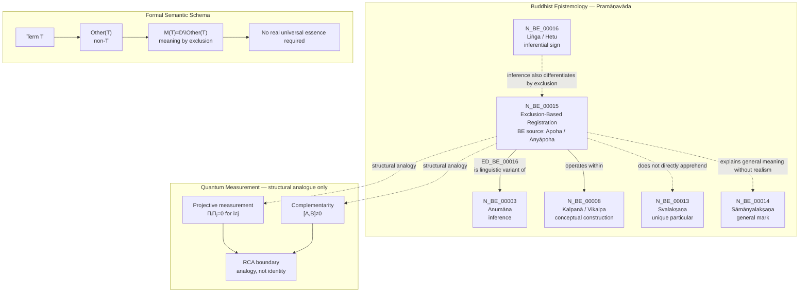

Author: VietVunVut (Viet - Nguyen Xuan); GitHub: https://github.com/AIhugART/; Facebook: https://www.facebook.com/xuanviet

# RCA: BE15 / N_BE_00015 — Exclusion-Based Registration (legacy label: Apoha / Exclusion)

## 1. Canonical Identification

| Field | Value |
|---|---|
| Short label | BE15 |
| Canonical node code | N_BE_00015 |
| Preferred VVV-QMRF name | Exclusion-Based Registration |
| BE source term | Apoha / Anyāpoha |
| English rendering | Exclusion-Based Registration |
| Vietnamese rendering | Ghi nhận bằng loại trừ / ghi nhận dựa trên loại trừ |
| Category | Philosophy of language |
| Framework | Buddhist Epistemology / Pramāṇavāda |
| Ground tradition | Dignāga epistemology and Buddhist nominalism |
| Tier in mapping | T6.05 — Meta-semantic principle |
| Primary relation | ED_BE_00016: N_BE_00015 → N_BE_00003 |
| Related node | N_BE_00003 — Anumāna / Inference |
| Structural QM analogue | Complementarity / mutual exclusion of incompatible observables |

**Name comparison**

| Layer | Label | Use |
|---|---|---|
| Legacy VVV-EQM filename | BE15_Apoha_exclusion.md | Keep as the old VVV-EQM filename for side-by-side comparison |
| Legacy comparison label | Apoha / Exclusion | Keep only for older notes and side-by-side comparison |
| BE source term | Apoha / Anyāpoha | Source term from Buddhist Epistemology |
| Preferred normalized label | Exclusion-Based Registration | Use in new standardized text |

**Canonical statement:** `N_BE_00015` denotes `Exclusion-Based Registration`. The BE source term is `Apoha / Anyāpoha`, Dignāga's theory that linguistic meaning is established by excluding what the term does not denote. A word does not grasp a real universal essence; it functions by excluding the other. Within the graph, the BE source term is classified under Philosophy of language and is linked to `N_BE_00003 — Anumāna` because verbal cognition is treated as a linguistic variant of inference.

---

## 2. RCA Definition

### 2.1 Define — observed issue

**Symptom:** The old label `Apoha / Exclusion` can look like the current primary name, so the normalized label `Exclusion-Based Registration` is easy to miss.

**Cause:** The document did not separate legacy label, BE source term, and normalized registration-facing label.

### 2.2 Trace — 5 Whys

1. **Why does `Apoha / Exclusion` stay visible?** Because older notes preserved the comparison label.
2. **Why is that a problem?** Because `Apoha / Anyāpoha` is the BE source term, while `Exclusion-Based Registration` is the preferred normalized label.
3. **Why does that need a split?** Because source-lineage language and neutral registration-facing language serve different purposes.
4. **Why does the difference matter here?** Because without the split, the semantic principle can look like a new physical QM operator.
5. **Why is that the root issue?** Because the file needs one stable normalized label plus one explicit source label, not a blended name.

### 2.3 Isolate — root cause

**Root cause:** The file lacks a clear three-way split between `Apoha / Exclusion` as legacy comparison, `Apoha / Anyāpoha` as BE source term, and `Exclusion-Based Registration` as the normalized label.

### 2.4 Fix — corrected formulation

Use the normalized form when precision is required:

```text
N_BE_00015 — Exclusion-Based Registration
BE source term: Apoha / Anyāpoha
Legacy comparison label: Apoha / Exclusion
Category: Philosophy of language
Framework: Buddhist Epistemology / Pramāṇavāda
Role: meaning through exclusion of what the term is not
Primary graph relation: N_BE_00015 → N_BE_00003 via ED_BE_00016
```

### 2.5 Verify — root cause removed

The ambiguity is removed if every usage distinguishes:

```text
BE15 = diagram shorthand
N_BE_00015 = canonical node code
Exclusion-Based Registration = preferred normalized label
Apoha / Anyāpoha = BE source term
Apoha / Exclusion = legacy comparison label
Philosophy of language = category
Pramāṇavāda = framework
Anumāna = linked epistemic process
Complementarity = QM structural analogue only
```

---

## 3. Formal Semantic Schema

### 3.1 Minimal schema

```text
BE15 = N_BE_00015 = Exclusion-Based Registration
Apoha / Anyāpoha = BE source term
Exclusion-Based Registration = meaning through exclusion of the other
```

### 3.2 Core formula

Let:

```text
D = domain of possible referents
T = linguistic term
Other(T) = what is excluded by T
M(T) = semantic meaning-function of T
```

Then:

```text
M(T) := D \ Other(T)
```

Equivalent predicate form:

```text
M(T)(x) ⇔ x ∉ Other(T)
```

Or in the common double-negative expression:

```text
Meaning(T) = not-non-T
```

### 3.3 Example formula

For the word "cow":

```text
Meaning("cow") = ¬(non-cow)
```

More explicitly:

```text
Cow_semantic(x) ⇔ x ∉ NonCow
```

This does not mean that a real universal essence called "cow-ness" has been found. It means that the word "cow" functions by excluding what is not cow.

### 3.4 Anti-essentialist constraint

```text
Exclusion-Based Registration(T) does not require RealUniversal(T)
```

Therefore:

```text
Meaning(T) ≠ grasping an independent universal essence
Meaning(T) = exclusion of the other within conceptual cognition
```

### 3.5 Linguistic-inferential formula

```text
Hear(T) → Exclude(Other(T)) → Cognize(T-as-designation)
```

Graphically:

```text
N_BE_00015 → N_BE_00003
Exclusion-Based Registration (BE source: Apoha / Anyāpoha) is a linguistic variant of Anumāna
```

---

## 4. Graph Relations

| Edge | Relation | Meaning |
|---|---|---|
| ED_BE_00016 | N_BE_00015 → N_BE_00003 | Exclusion-Based Registration (BE source: Apoha / Anyāpoha) is a linguistic variant of Anumāna |

### Graph expression

```text
N_BE_00015 —is linguistic variant of→ N_BE_00003
Exclusion-Based Registration —is linguistic variant of→ Anumāna
```

### Interpretation

Exclusion-Based Registration belongs to language and conceptual cognition. It does not belong to direct perception. A word does not directly reveal a unique particular; it operates by excluding non-applicable alternatives, which makes verbal cognition inferential in structure.

---

## 5. Position in Buddhist Epistemology

### 5.1 What BE15 is

```text
BE15 is a semantic mechanism.
BE15 explains how words mean.
BE15 belongs to Philosophy of language.
BE15 is presented with the normalized label Exclusion-Based Registration.
BE15 keeps Apoha / Anyāpoha as the BE source term.
BE15 is connected to Anumāna because verbal cognition is inferentially structured.
```

### 5.2 What BE15 is not

```text
BE15 is not a framework.
BE15 is not a source of direct perception.
BE15 is not ordinary negation only.
BE15 is not a quantum-mechanical law.
BE15 is not an ontological proof of real universals.
```

### 5.3 Relation to nearby BE nodes

| Node | Relation to BE15 |
|---|---|
| N_BE_00003 — Anumāna | Exclusion-Based Registration is treated as a linguistic variant of inference. |
| N_BE_00008 — Kalpanā / Vikalpa | Exclusion-Based Registration operates inside conceptual construction and linguistic classification. |
| N_BE_00013 — Svalakṣaṇa | Exclusion-Based Registration does not directly apprehend the unique particular. |
| N_BE_00014 — Sāmānyalakṣaṇa | Exclusion-Based Registration explains conceptual/general meaning without accepting real universals. |
| N_BE_00016 — Liṅga / Hetu | Both Exclusion-Based Registration and inferential signs work by exclusion-like differentiation. |

---

## 6. Relation to Quantum Measurement

Within the BE-QM mapping, `N_BE_00015 — Exclusion-Based Registration` (BE source term: `Apoha / Anyāpoha`) is structurally related to exclusion-like features in quantum theory, especially complementarity and mutual exclusivity inside a measurement context.

### 6.1 Structural mapping

```text
BE15: Exclusion-Based Registration means meaning is formed by excluding what the term is not.
QM analogue: a measurement context defines possible outcomes partly by excluding incompatible alternatives.
```

### 6.2 Projective measurement analogue

For a projective measurement with projectors `Πᵢ`:

```text
ΠᵢΠⱼ = 0, for i ≠ j
Σᵢ Πᵢ = I
```

Structural reading only:

```text
Outcome i is distinguished by excluding other mutually exclusive outcomes j ≠ i within the same measurement context.
```

### 6.3 Complementarity analogue

For incompatible observables `A` and `B`:

```text
[A, B] ≠ 0
```

Structural reading only:

```text
A measurement context for A excludes simultaneous sharp determination of B.
```

### 6.4 RCA boundary

This relation is not an identity claim.

```text
Exclusion-Based Registration = semantic exclusion in Buddhist philosophy of language.
Quantum complementarity = physical and formal incompatibility of measurement contexts.
```

Therefore:

```text
Complementarity plays an Exclusion-Based Registration-like structural role, but complementarity is not Exclusion-Based Registration.
```

---

## 7. Scientific English Statement

`N_BE_00015` denotes `Exclusion-Based Registration`, with `Apoha / Anyāpoha` retained as the BE source term. In this framework, a word does not denote by grasping a real universal essence; rather, it functions by excluding what is other than its intended referent. The meaning of a term such as "cow" is therefore formally expressible as the exclusion of non-cow, not as the direct apprehension of a universal cow-essence.

Within the Buddhist epistemological graph, the BE source term `Apoha / Anyāpoha` is classified under Philosophy of language and is connected to `N_BE_00003 — Anumāna` by `ED_BE_00016`, because verbal cognition is treated as inferential in structure. In the quantum-measurement mapping, `Exclusion-Based Registration` may be structurally compared to complementarity or mutually exclusive measurement outcomes, since both involve determination through exclusion. However, this comparison is only structural and functional. `Exclusion-Based Registration` is a semantic principle, while quantum complementarity is a formal-physical relation among observables and measurement contexts.

---

## 8. Vietnamese Explanation

`BE15` là nhãn ngắn trong diagram. Tên chuẩn hóa mới là:

```text
N_BE_00015 — Exclusion-Based Registration
BE source term: Apoha / Anyāpoha
```

Nói đơn giản:

```text
Exclusion-Based Registration = ghi nhận bằng cách loại trừ cái không phải nó
```

Ví dụ:

```text
"cow" = not non-cow
"con bò" = không-phải-không-phải-con-bò
```

Điểm quan trọng: đây không phải chỉ là phủ định bình thường. Đây là cách giải thích nghĩa của ngôn ngữ. Khi ta nói "con bò", theo BE source `Apoha / Anyāpoha`, tâm không cần nắm một bản chất phổ quát gọi là "cow-ness". Nó chỉ loại trừ những thứ không thuộc phạm vi "cow".

Trong mapping với Quantum Measurement, `BE15` có thể so với "complementarity" hoặc sự loại trừ giữa các kết quả đo không tương thích. Nhưng đây chỉ là giống nhau về cấu trúc.

```text
Exclusion-Based Registration = nguyên lý ngữ nghĩa
Complementarity = nguyên lý vật lý / toán học trong đo lường lượng tử
```

Vì vậy:

```text
BE15 giống QM ở cấu trúc loại trừ,
nhưng BE15 không phải là quy luật lượng tử.
```

---

## 9. Mermaid Diagram Map



---

## 10. Final RCA Conclusion

```text
BE15 is the diagram shorthand for the canonical node N_BE_00015.
N_BE_00015 denotes Exclusion-Based Registration.
Apoha / Anyāpoha is the BE source term preserved for lineage.
Apoha / Exclusion is kept only as a legacy comparison label.
```

The correct graph statement is:

```text
N_BE_00015 → N_BE_00003
```

meaning:

```text
Exclusion-Based Registration is a linguistic variant of Anumāna: verbal meaning is established by excluding what the term is not, rather than by grasping an independent universal essence.
```

The correct cross-domain statement is:

```text
Exclusion-Based Registration structurally parallels complementarity and mutually exclusive measurement outcomes, but only as an analogy.
```

Final boundary:

```text
Exclusion-Based Registration = semantic exclusion.
Quantum complementarity = physical-formal incompatibility.
They are structurally comparable, not identical.
```
