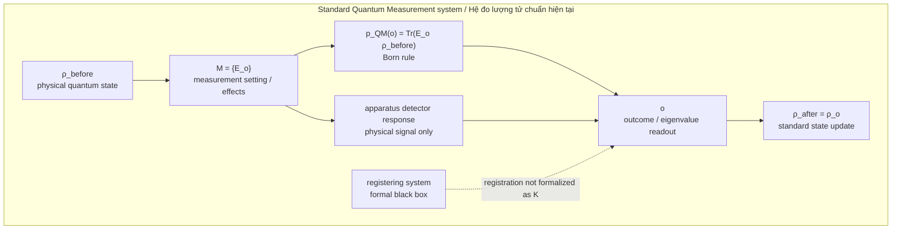
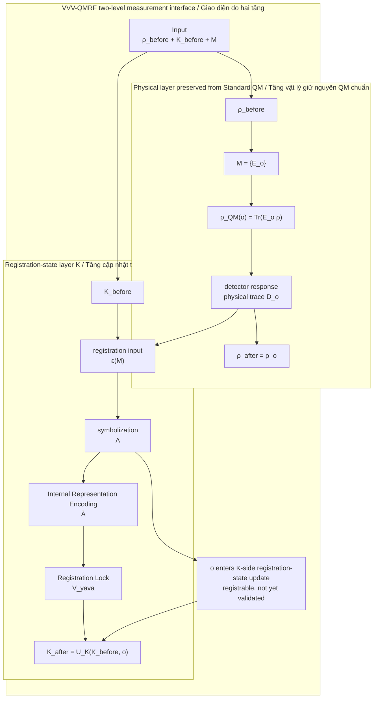
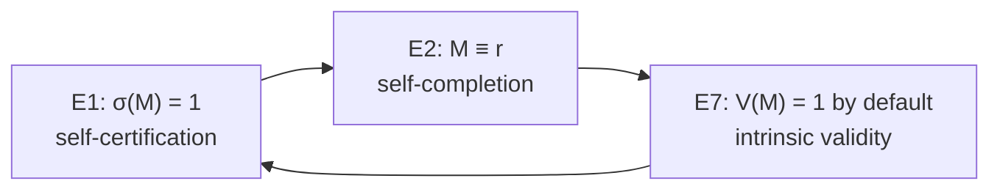
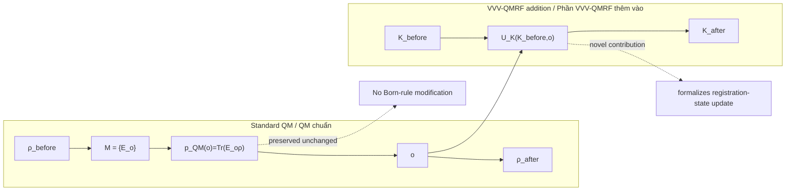

Author: VietVunVut (Viet - Nguyen Xuan); GitHub: https://github.com/AIhugART/; Facebook: https://www.facebook.com/xuanviet

# RCA System Diagram: VVV-QMRF vs Standard Quantum Measurement

## Vietnamese title

Sơ đồ RCA hệ thống VVV-QMRF và hệ thống đo lượng tử chuẩn hiện tại

## Document status

- **Document type:** RCA system diagram / sơ đồ hệ thống RCA
- **Primary frame:** Buddhist Epistemology
- **Mapped domain:** Quantum Measurement
- **Claim level:** Interpretive mapping and formal registration-layer model
- **Boundary:** This diagram preserves standard quantum probabilities and state-update rules. It does not claim to replace standard quantum mechanics.

---

# 1. RCA finding

## English

**Symptom:** Diagrams of quantum measurement often compress the physical outcome and the known/validated outcome into one box called "measurement".

**Root cause:** The physical quantum state `ρ` and the registration state `K` are not separated explicitly. This makes it too easy to confuse a physical state transition with a registration-state update.

**Fix:** Draw the systems as two layers:

1. Standard Quantum Measurement keeps the physical layer: `ρ`, `M = {E_o}`, `p_QM(o)`, `o`, and `ρ_after`.
2. VVV-QMRF adds the registration-state layer: `K_before → K_after`, formalized as `K_after = U_K(K_before, o)`.

**Verification:** The diagram keeps `p_QM(o) = Tr(E_o ρ)` unchanged. Novelty is placed only in `U_K`, not in the Born rule or physical collapse mechanism.

## Tiếng Việt

**Triệu chứng:** Nhiều sơ đồ phép đo lượng tử gom kết quả vật lý và kết quả đã được biết/xác nhận vào một hộp duy nhất gọi là "measurement".

**Nguyên nhân gốc:** Trạng thái lượng tử vật lý `ρ` và trạng thái ghi nhận `K` chưa được tách rõ. Vì vậy dễ nhầm chuyển đổi vật lý với "registration-state update" / cập nhật trạng thái ghi nhận.

**Cách sửa:** Vẽ hệ thống thành hai tầng:

1. Hệ đo lượng tử chuẩn giữ tầng vật lý: `ρ`, `M = {E_o}`, `p_QM(o)`, `o`, và `ρ_after`.
2. VVV-QMRF thêm tầng trạng thái ghi nhận: `K_before → K_after`, hình thức hóa bằng `K_after = U_K(K_before, o)`.

**Kiểm chứng:** Sơ đồ giữ nguyên `p_QM(o) = Tr(E_o ρ)`. Điểm mới chỉ nằm ở `U_K`, không nằm ở "Born rule" hay cơ chế vật lý của "collapse".

---

# 2. Diagram A — Standard Quantum Measurement system

## RCA note

Standard Quantum Measurement has a precise physical-probabilistic structure. Its weak point for this project is not the physical mathematics, but the undefined registration side: the registering system is needed in practice but not formalized as a `K`-state.

---

# 3. Diagram B — VVV-QMRF two-level measurement interface

## RCA note

VVV-QMRF does not replace the physical layer. It opens the black box between detector response and validated registration. `detector response` remains a physical input, not registration by itself. The key move is to model the K-side registration-state update explicitly while leaving standard physical probabilities intact.

---

# 4. Diagram C — VVV-QMRF self-validation loop

## RCA note

This loop addresses the regress problem at the registration-validity level. It should not be read as a new physical collapse equation. It says why a registration can be treated as complete and valid inside the VVV-QMRF registration model.

---

# 5. Diagram D — Boundary map between the two systems

## RCA note

The boundary is the outcome `o`. Standard QM explains how `o` is physically probable and how `ρ` updates. VVV-QMRF explains how `o` becomes registered, classified, and validated as `K_after`.

---

# 6. Claim ladder for this diagram

| Level | Allowed claim | Not allowed claim |
|---|---|---|
| Diagram level | VVV-QMRF adds a registration-state layer to Standard QM. | VVV-QMRF replaces Standard QM. |
| Mathematical level | `K_after = U_K(K_before, o)` can be formalized. | `p_QM(o)` is changed without a new equation. |
| Physical level | Current status is interpretive unless `δ(o) ≠ 0`. | The framework already gives a new experimentally verified physical theory. |
| RCA level | Root cause is the hidden mixing of `ρ` and `K`. | The root cause is that QM mathematics is simply wrong. |

---

# 7. Source traceability

| Source file | Role in this diagram |
|---|---|
| [vvv_qmrf_framework_formal_registration_state_measurement_model.md](research_documents/framework/vvv_qmrf_framework_formal_registration_state_measurement_model.md) | Defines the conservative two-level model: `ρ` transition plus `K` registration-state update. |
| [vvv_qmrf_synthesis_s1_registration_state_update_pipeline.md](research_documents/synthesis/vvv_qmrf_synthesis_s1_registration_state_update_pipeline.md) | Defines the S1 registration pipeline: `ε(M) → Λ → Ā → V_yava`; `Ā` and `V_yava` remain source notation, not physical QM names. |
| [vvv_qmrf_synthesis_s2_self_certifying_registration_loop.md](research_documents/synthesis/vvv_qmrf_synthesis_s2_self_certifying_registration_loop.md) | Defines the S2 loop: E1 self-certification, E2 self-completion, E7 intrinsic validity. |
| [system_qm_full.md](../SYSTEM_Quantum_Measurement/system_qm_full.md) | Provides the Quantum Measurement system nodes and standard measurement concepts. |
| [system_be_full.md](../SYSTEM_Buddhist_Epistemology/system_be_full.md) | Single RCA SOT for Buddhist Epistemology node and edge definitions. |

---

# 8. Final RCA verification

- **Root cause removed:** The diagram explicitly separates `ρ` and `K`.
- **Physical boundary preserved:** Standard QM probability remains `p_QM(o) = Tr(E_o ρ)`.
- **Novelty localized:** VVV-QMRF novelty is `U_K`, the registration-state update function.
- **No category error:** The diagram does not claim that Buddhist Epistemology supplies a new physical collapse mechanism.
- **Scope respected:** The diagram stays within Buddhist Epistemology as the primary frame and Quantum Measurement as the mapped domain.

