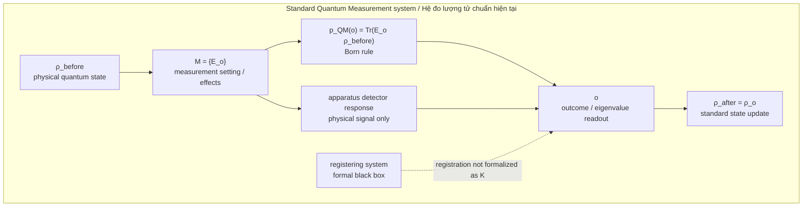
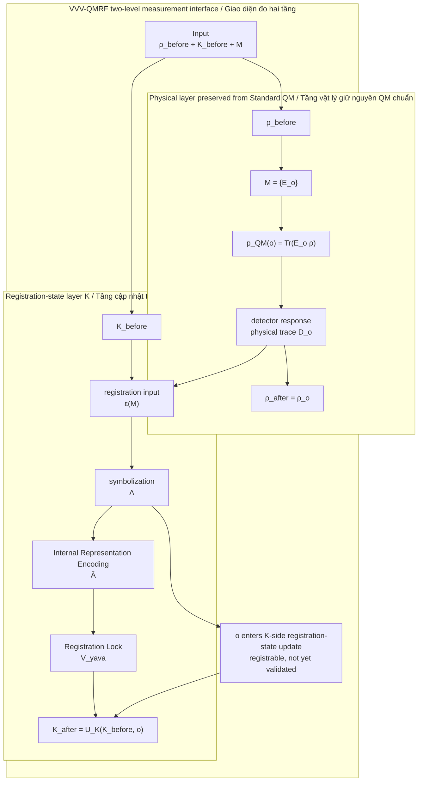
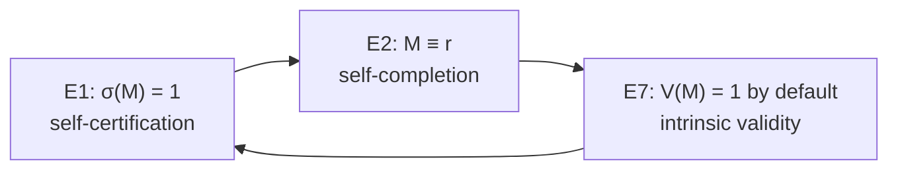
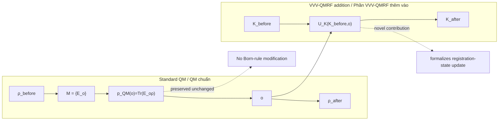

Author: VietVunVut (Viet - Nguyen Xuan); GitHub: https://github.com/AIhugART/; Facebook: https://www.facebook.com/xuanviet

> **DISCLAIMER / CẢNH BÁO:** VVV-QMRF is independent Class D personal research, not Standard Quantum Mechanics, not peer-reviewed or experimentally validated, and not for real-world technical use. Full boundary protocol: `DISCLAIMER.md`.
>
> VVV-QMRF là nghiên cứu cá nhân độc lập ở Class D, không phải Standard Quantum Mechanics, chưa peer-reviewed hoặc kiểm chứng thực nghiệm, và không dùng cho ứng dụng kỹ thuật ngoài thực tế. Giao thức giới hạn đầy đủ: `DISCLAIMER.md`.

# RCA System Diagram: VVV-QMRF vs Standard Quantum Measurement

## Vietnamese title

Sơ đồ RCA hệ thống VVV-QMRF và hệ thống đo lượng tử chuẩn hiện tại

## Document status

- **Document type:** RCA system diagram / sơ đồ hệ thống RCA
- **Primary frame:** Buddhist Epistemology
- **Mapped domain:** Quantum Measurement
- **Claim level:** Interpretive mapping and formal registration-layer model
- **Boundary:** This diagram preserves standard quantum probabilities and state-update rules. It does not claim to replace standard quantum mechanics.
- **Notation contract:** Arrows follow the Arrow Semantics rule in `documents/research_documents/vvv-qmrf/schema_guide.md`; they mark declared relation types, not automatic physical causation.

---

# 1. RCA finding

## English

**Symptom:** Diagrams of quantum measurement often compress the physical outcome and the known/validated outcome into one box called "measurement".

**Root cause:** The physical quantum state `ρ` and the registration state `K` are not separated explicitly. This makes it too easy to confuse a physical state transition with a registration-state update.

**Fix:** Draw the systems as two layers:

1. Standard Quantum Measurement keeps the physical layer: `ρ`, `M = {E_o}`, `p_QM(o)`, `o`, and `ρ_after`.
2. VVV-QMRF adds the registration-state layer: `K_before → K_after`, formalized as `K_after = U_K(K_before, o)`.

**Verification:** The diagram keeps `p_QM(o) = Tr(E_o ρ)` unchanged. Novelty is placed only in `U_K`, not in the Born rule or physical collapse mechanism.

## Tiếng Việt

**Triệu chứng:** Nhiều sơ đồ phép đo lượng tử gom kết quả vật lý và kết quả đã được biết/xác nhận vào một hộp duy nhất gọi là "measurement".

**Nguyên nhân gốc:** Trạng thái lượng tử vật lý `ρ` và trạng thái ghi nhận `K` chưa được tách rõ. Vì vậy dễ nhầm chuyển đổi vật lý với "registration-state update" / cập nhật trạng thái ghi nhận.

**Cách sửa:** Vẽ hệ thống thành hai tầng:

1. Hệ đo lượng tử chuẩn giữ tầng vật lý: `ρ`, `M = {E_o}`, `p_QM(o)`, `o`, và `ρ_after`.
2. VVV-QMRF thêm tầng trạng thái ghi nhận: `K_before → K_after`, hình thức hóa bằng `K_after = U_K(K_before, o)`.

**Kiểm chứng:** Sơ đồ giữ nguyên `p_QM(o) = Tr(E_o ρ)`. Điểm mới chỉ nằm ở `U_K`, không nằm ở "Born rule" hay cơ chế vật lý của "collapse".

---

# 2. Diagram 0 — One-page styled system comparison

This styled version gives the full system view in one diagram. The simpler basic diagrams remain in Sections 3–6 for step-by-step reading.

```mermaid
flowchart LR
  %% Diagram 0: one-page system boundary map.
  %% Blue nodes are the Standard QM physical/probability layer.
  %% Green nodes are the VVV-QMRF registration-state layer.
  %% Red nodes are boundary guards, not new physics claims.

  subgraph STD["Standard Quantum Measurement<br/>physical-probabilistic layer"]
    direction LR
    S0["ρ_before<br/>quantum state"]
    S1["M = {E_o}<br/>measurement setting"]
    S2["p_QM(o) = Tr(E_o ρ)<br/>Born rule"]
    S3["detector response D_o<br/>physical trace"]
    S4["o<br/>outcome value"]
    S5["ρ_after = ρ_o<br/>standard state update"]

    S0 --> S1 --> S2 --> S3 --> S4 --> S5
  end

  subgraph GAP["RCA boundary<br/>where 'measurement' gets compressed"]
    direction TB
    G1["Symptom<br/>physical outcome and known outcome are merged"]
    G2["Root cause<br/>ρ-state and K-state are not separated"]
    G1 --> G2
  end

  subgraph VVV["VVV-QMRF addition<br/>registration-state layer K"]
    direction LR
    K0["K_before<br/>prior registration state"]
    K1["ε(M)<br/>pre-symbolic trace"]
    K2["Λ<br/>symbolization"]
    K3["Ā<br/>internal representation encoding"]
    K4["V_yava<br/>registration lock"]
    K5["K_after = U_K(K_before, o)<br/>validated registration state"]

    K0 --> K1 --> K2 --> K3 --> K4 --> K5
  end

  S3 --> K1
  S4 --> K5
  G2 -. "fix: split layers" .-> STD
  G2 -. "fix: formalize K-side" .-> VVV
  S2 -. "preserved unchanged" .-> B1["Boundary guard<br/>no Born-rule modification"]
  S5 -. "preserved unchanged" .-> B2["Boundary guard<br/>no replacement of Standard QM"]
  K5 -. "novelty localized here" .-> B3["VVV-QMRF claim<br/>formal registration-state update"]

  classDef qm fill:#e8f1ff,stroke:#2f65c8,stroke-width:1.5px,color:#10213f;
  classDef reg fill:#eaf7ef,stroke:#23804a,stroke-width:1.5px,color:#102b17;
  classDef rca fill:#fff6dc,stroke:#b7791f,stroke-width:1.5px,color:#3b2600;
  classDef guard fill:#fdecec,stroke:#c53030,stroke-width:1.5px,color:#3b0808;
  class S0,S1,S2,S3,S4,S5 qm;
  class K0,K1,K2,K3,K4,K5 reg;
  class G1,G2 rca;
  class B1,B2,B3 guard;
```

## Rendering note

Use any Mermaid-compatible Markdown renderer. If the diagram becomes too wide, export it as SVG or switch the top line from `flowchart LR` to `flowchart TB`.

## Accessibility note

The color coding is redundant with labels: Standard QM is marked by `ρ`, `M`, `p_QM(o)`, and `ρ_after`; VVV-QMRF is marked by `K_before`, `ε(M)`, `Λ`, `Ā`, `V_yava`, and `K_after`.

---

# 3. Diagram A — Standard Quantum Measurement system

## RCA note

Standard Quantum Measurement has a precise physical-probabilistic structure. Its weak point for this project is not the physical mathematics, but the undefined registration side: the registering system is needed in practice but not formalized as a `K`-state.

---

# 4. Diagram B — VVV-QMRF two-level measurement interface

## RCA note

VVV-QMRF does not replace the physical layer. It opens the black box between detector response and validated registration. `detector response` remains a physical input, not registration by itself. The key move is to model the K-side registration-state update explicitly while leaving standard physical probabilities intact.

---

# 5. Diagram C — VVV-QMRF self-validation loop

## RCA note

This loop addresses the regress problem at the registration-validity level. It should not be read as a new physical collapse equation. It says why a registration can be treated as complete and valid inside the VVV-QMRF registration model.

---

# 6. Diagram D — Boundary map between the two systems

## RCA note

The boundary is the outcome `o`. Standard QM explains how `o` is physically probable and how `ρ` updates. VVV-QMRF explains how `o` becomes registered, classified, and validated as `K_after`.

---

# 7. Claim ladder for this diagram

| Level | Allowed claim | Not allowed claim |
|---|---|---|
| Diagram level | VVV-QMRF adds a registration-state layer to Standard QM. | VVV-QMRF replaces Standard QM. |
| Mathematical level | `K_after = U_K(K_before, o)` can be formalized. | `p_QM(o)` is changed without a new equation. |
| Physical level | Current status is interpretive unless `δ(o) ≠ 0`. | The framework already gives a new experimentally verified physical theory. |
| RCA level | Root cause is the hidden mixing of `ρ` and `K`. | The root cause is that QM mathematics is simply wrong. |

---

# 8. Claim Traceability Matrix

This table connects each major diagram claim to its source role, claim type, boundary, and RCA verification rule.

| Claim ID | Diagram element | Claim | Claim type | Source anchor | Boundary | Verification rule |
|---|---|---|---|---|---|---|
| C-001 | `ρ_before`, `M = {E_o}`, `p_QM(o)`, `ρ_after` | Standard QM keeps the physical-probabilistic measurement layer intact. | source / boundary_guard | `system_qm_full.md`; formal registration-state model, sections on core definitions and mathematical model | Does not weaken or replace Standard QM mathematics. | Check that all diagrams keep `p_QM(o) = Tr(E_o ρ)` and `ρ_before → ρ_after` on the physical layer. |
| C-002 | `K_before → K_after` | VVV-QMRF adds a registration-state layer to the measurement event. | formal_model / interpretive_mapping | `vvv_qmrf_framework_formal_registration_state_measurement_model.md`, two-level model | K-side addition only; not a new physical state-transition law. | Check that `K` is drawn separately from `ρ`. |
| C-003 | `K_after = U_K(K_before, o)` | `U_K` formalizes a registration-state update after outcome `o`. | formal_model | Formal registration-state model; S1 registration-state update pipeline | `U_K` is not a collapse mechanism and not a Born-rule replacement. | Check that `U_K` receives `o` from Standard QM but does not modify `p_QM(o)`. |
| C-004 | `detector response D_o` | A detector response is a physical trace, not yet a validated registration. | derived / boundary_guard | S1 pipeline: `ε(M) → Λ → Ā → V_yava` | Raw signal must not be treated as already validated `K_after`. | Check that `D_o` enters `ε(M)` before `Λ`, `Ā`, and `V_yava`. |
| C-005 | `ε(M) → Λ → Ā → V_yava` | S1 describes the K-side transition from raw physical trace to registered status. | synthesis / formal_model | `vvv_qmrf_synthesis_s1_registration_state_update_pipeline.md` | S1 describes registration processing, not detector physics itself. | Check that S1 nodes appear only in the registration-state layer. |
| C-006 | `E1 → E2 → E7 → E1` | S2 describes self-certifying registration validity without an external meta-certifier. | synthesis / interpretive_mapping | `vvv_qmrf_synthesis_s2_self_certifying_registration_loop.md` | Validity loop is registration-layer closure, not a physical collapse equation. | Check that the loop is labeled as validity/regress handling, not physical dynamics. |
| C-007 | `No Born-rule modification` | VVV-QMRF does not modify `p_QM(o) = Tr(E_o ρ)`. | boundary_guard | Formal model mandatory boundary; Standard QM Born rule source concepts | No claim of changed quantum probabilities unless a separate `δ(o) ≠ 0` model is supplied. | Check that every diagram keeps `p_QM(o)` unchanged. |
| C-008 | `No replacement of Standard QM` | VVV-QMRF is an added registration-layer model, not a replacement for Standard QM. | boundary_guard | Document status and formal model mandatory boundary | Do not frame Standard QM as defective or superseded. | Check that Standard QM is described as preserved, not corrected. |
| C-009 | `δ(o)` boundary in claim ladder | Current status remains interpretive if `δ(o) = 0`. | boundary_guard / empirical_status | Formal registration-state model, testable difference section | No experimental validation claim without a nonzero predictive difference and tests. | Check that the physical-level claim stays interpretive unless `δ(o) ≠ 0`. |
| C-010 | RCA boundary box | Root cause is the hidden compression of `ρ-state` and `K-state` inside the word "measurement". | RCA finding | This document's RCA finding; schema guide RCA rules | The root cause is not that Standard QM mathematics is invalid. | Check that the fix separates layers instead of attacking Standard QM. |

---

# 9. Source traceability

| Source file | Role in this diagram |
|---|---|
| [vvv_qmrf_framework_formal_registration_state_measurement_model.md](research_documents/framework/vvv_qmrf_framework_formal_registration_state_measurement_model.md) | Defines the conservative two-level model: `ρ` transition plus `K` registration-state update. |
| [vvv_qmrf_synthesis_s1_registration_state_update_pipeline.md](research_documents/synthesis/vvv_qmrf_synthesis_s1_registration_state_update_pipeline.md) | Defines the S1 registration pipeline: `ε(M) → Λ → Ā → V_yava`; `Ā` and `V_yava` remain source notation, not physical QM names. |
| [vvv_qmrf_synthesis_s2_self_certifying_registration_loop.md](research_documents/synthesis/vvv_qmrf_synthesis_s2_self_certifying_registration_loop.md) | Defines the S2 loop: E1 self-certification, E2 self-completion, E7 intrinsic validity. |
| [system_qm_full.md](../SYSTEM_Quantum_Measurement/system_qm_full.md) | Provides the Quantum Measurement system nodes and standard measurement concepts. |
| [system_be_full.md](../SYSTEM_Buddhist_Epistemology/system_be_full.md) | Single RCA SOT for Buddhist Epistemology node and edge definitions. |

---

# 10. Final RCA verification

- **Root cause removed:** The diagram explicitly separates `ρ` and `K`.
- **Physical boundary preserved:** Standard QM probability remains `p_QM(o) = Tr(E_o ρ)`.
- **Novelty localized:** VVV-QMRF novelty is `U_K`, the registration-state update function.
- **No category error:** The diagram does not claim that Buddhist Epistemology supplies a new physical collapse mechanism.
- **Scope respected:** The diagram stays within Buddhist Epistemology as the primary frame and Quantum Measurement as the mapped domain.

---

## Schema Validation Checklist / Checklist Kiểm chứng Schema

| Check | Status | RCA note |
|---|---|---|
| Document type declared | Pass | Declared as `RCA system diagram / sơ đồ hệ thống RCA` for schema alignment. |
| RCA root cause isolated | Pass | Root cause is stated as hidden compression of `ρ-state` and `K-state`, not as a defect in Standard QM. |
| Two-layer separation | Pass | The diagrams separate the physical `ρ-side` from the registration `K-side`. |
| Source traceability | Pass | Source files are listed in Source traceability and major claims cite source anchors in the Claim Traceability Matrix. |
| Claim traceability | Pass | Claim IDs, claim types, source anchors, boundaries, and RCA verification rules are listed in the Claim Traceability Matrix. |
| Arrow semantics / notation contract | Pass | The document declares that arrows follow the Arrow Semantics rule in `schema_guide.md`; arrows are relation markers, not automatic physical causation. |
| Boundary / non-claim guardrail | Pass | Existing boundary/non-claim text limits overclaiming: no Born-rule modification, no replacement of Standard QM, no experimental validation claim without `δ(o) ≠ 0`. |
| Symbol registry | Pass | Core diagram symbols are covered by `documents/research_documents/vvv-qmrf/VVV_QMRF_research_terminology.md`, including domain, notation type, claim class, status, usage rule, source trace, and boundary. |
| Mermaid render preview | Review required | Mermaid fences and headings are structurally present; render the diagrams in a Mermaid preview/export tool before publication use. |
| Validation rule | Pass | Reuse only with source, claim type, arrow semantics, and boundary preserved; unresolved items must be marked `TODO(HOTFIX)` before publication use. |
