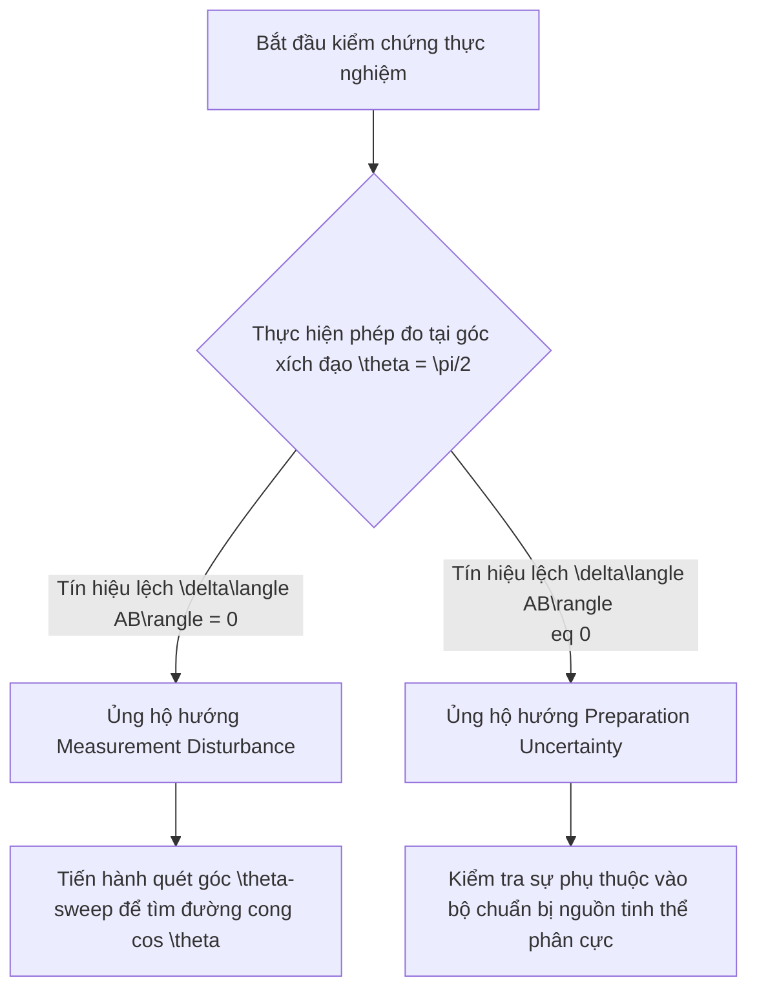

# Báo cáo Phân tích Chuyên sâu: Tái cấu trúc VVV-QMRF theo hướng Preparation Uncertainty

Báo cáo này xây dựng một khung lý thuyết giả định và phân tích hệ quả toán học, vật lý, triết học nếu dự án **VVV-QMRF** (VietVunVut Quantum Measurement Registration Framework) được chuyển dịch trọng tâm từ **Measurement Disturbance** (Nhiễu loạn Đo đạc) sang **Preparation Uncertainty** (Độ bất định do Chuẩn bị Trạng thái).

---

## 1. Mở đầu & Khái quát (Introduction)

Trong cơ học lượng tử tiêu chuẩn, hai khái niệm về độ bất định thường bị nhầm lẫn nhưng có nguồn gốc vật lý hoàn toàn khác biệt:
1. **Measurement Disturbance (Nhiễu loạn do đo đạc):** Hệ quả vật lý trực tiếp của sự tương tác giữa hệ thống và thiết bị đo (System–Meter Coupling). Việc đo đạc một đại lượng vật lý này sẽ phá hủy hoặc làm xáo trộn thông tin của một đại lượng liên hợp khác (ví dụ: đo vị trí làm thay đổi động lượng thông qua xung lực truyền từ photon).
2. **Preparation Uncertainty (Độ bất định do chuẩn bị):** Giới hạn thống kê nội tại của một trạng thái được chuẩn bị sẵn. Nếu ta chuẩn bị một tập hợp trạng thái giống hệt nhau (state ensemble), cơ học lượng tử cấm các phép đo của các observable không giao hoán đồng thời có phương sai bằng 0 (ví dụ: nguyên lý bất định Heisenberg dạng $\Delta x \Delta p \geq \hbar/2$ thực chất mô tả sự phân tán thống kê của trạng thái được chuẩn bị, chứ không phải sự can thiệp của phép đo).

Mô hình VVV-QMRF hiện tại (đặc biệt là phương trình biến dạng xác suất liên quan đến tham số $\beta$ trong phép đo Superobserver-Friend) đang đi theo hướng **Measurement Disturbance**. Dưới đây là phân tích chi tiết nếu chúng ta chuyển dịch toàn bộ khung lý thuyết này sang hướng **Preparation Uncertainty**.

---

## 2. Sự chuyển dịch Bản thể luận (Ontological Shift)

Sự chuyển đổi từ tập trung vào phép đo sang tập trung vào pha chuẩn bị dẫn đến sự thay đổi sâu sắc về mặt bản thể luận:

| Khía cạnh | Khung hiện tại: Measurement Disturbance | Khung giả thuyết: Preparation Uncertainty |
| :--- | :--- | :--- |
| **Bản chất của Sai lệch ($\beta$)** | Do sự bất tương thích hình học giữa bộ đo của Superobserver và trạng thái ghi nhận của Friend ($f_{perp} = 1 - |\langle b\|d\rangle|^2$). | Do giới hạn nội tại trong khả năng chuẩn bị một trạng thái đồng thời xác định cho cả hai hệ quy chiếu của Friend và Superobserver. |
| **Vị trí của sự biến dạng** | Xảy ra tại **Registration Layer** (lớp đăng ký/đo đạc). Trạng thái vật lý vẫn chuẩn, nhưng quy luật gán xác suất bị nhiễu do căn chỉnh góc đo. | Xảy ra tại **Preparation Layer** (lớp chuẩn bị). Trạng thái ban đầu được tạo ra đã mang sai lệch cấu trúc so với trạng thái thuần túy lượng tử. |
| **Vai trò của Quan sát viên** | Chủ động gây nhiễu khi thực hiện hành vi "đọc" bản ghi của quan sát viên trước. | Bị giới hạn bởi ngữ cảnh chuẩn bị chung (shared preparation context); thông tin bị giới hạn ngay từ đầu. |

### Ánh xạ Triết học Phật học (Buddhist Epistemology Mapping)
*   **Trong hướng Measurement Disturbance:** Ánh xạ chủ đạo là **Bādhaka pramāṇa** (nhận thức phủ định/triệt tiêu). Hành vi đo đạc tích cực của Superobserver đóng vai trò như một tác nhân nhận thức mới can thiệp và làm sụp đổ (hoặc thay đổi) các đăng ký trước đó của Friend.
*   **Trong hướng Preparation Uncertainty:** Ánh xạ chủ đạo dịch chuyển sang **Saṃśaya** (Nghi ngờ cấu trúc nội tại - *Structured doubt*) ở trạng thái tiền nhận thức, hoặc sự phân cực giữa **Svalakṣaṇa** (Tự tướng - thực tại cụ thể đơn nhất) và **Sāmānyalakṣaṇa** (Cộng tướng - khái niệm khái quát hóa). Quá trình tâm trí "chuẩn bị" khái niệm (concept construction) luôn mang tính bất định và không thể đồng thời sắc nét ở mọi khía cạnh nhận thức. Trạng thái lượng tử $\rho$ đóng vai trò như dòng năng lượng nhận thức chưa phân cực, và độ bất định chuẩn bị thể hiện giới hạn của việc kiến tạo đối tượng nhận thức (*Kalpanā*).

---

## 3. Khung Toán học Thay thế (Formal Framework Modification)

### 3.1. Mô hình Hiện tại (Measurement Disturbance)
Xác suất khớp bị biến dạng bởi góc đo của bộ đo Superobserver ($b$) và bản ghi của Friend ($d$):
$$P'(a,b | x,y) = \frac{P_{QM}(a,b | x,y) \cdot [1 - \beta (1 - |\langle b|d\rangle|^2)]}{Z}$$
Tại đây, nếu $\theta = \pi/2$ (xích đạo), góc đo đối xứng khiến $|\langle b\|d\rangle|^2 = 1/2$ cho mọi kết quả, dẫn đến sự triệt tiêu hoàn toàn sai lệch (Equatorial Cancellation Theorem).

### 3.2. Mô hình Giả thuyết (Preparation Uncertainty)
Nếu sự biến dạng nằm ở khâu chuẩn bị, trạng thái lượng tử thực tế đi vào hệ thống không còn là trạng thái thuần túy $\rho_0 = |\Psi^-\rangle\langle\Psi^-|$ (singlet), mà là một trạng thái bị biến dạng sẵn $\rho_{prep}(\beta)$ dựa trên cấu trúc hình học của không gian chuẩn bị:
$$\rho_{prep}(\beta) = (1 - \beta)\rho_0 + \beta \rho_{error}(\theta_{prep}, \phi_{prep})$$
Trong đó:
*   $\beta$ là tham số bất định của pha chuẩn bị.
*   $\rho_{error}$ đại diện cho sự thăng giáng hoặc lệch pha cấu trúc do giới hạn của thiết bị chuẩn bị (ví dụ: sự lệch pha trong nguồn SPDC hoặc bất định trong phân cực của các tinh thể phi tuyến).

Một cách tiếp cận sâu sắc hơn là sử dụng **Khung Trạng thái Epistemic của Spekkens (Spekkens Toy Model)**. Trong đó:
*   Trạng thái chuẩn bị đại diện cho một phân bố xác suất trên các trạng thái ontic thực tại.
*   Độ bất định chuẩn bị $\beta$ giới hạn lượng thông tin tối đa mà một quy trình chuẩn bị có thể cô lập. Phép toán biến đổi trạng thái sẽ là một ánh xạ phi-đơn-tử (non-unitary channel) đại diện cho sự suy giảm thông tin:
$$\mathcal{E}(\rho) = \operatorname{Tr}_{env} [U (\rho \otimes \rho_{env}) U^\dagger]$$

---

## 4. Ảnh hưởng tới Giao thức Thực nghiệm (Experimental Signatures)

Sự chuyển dịch này làm thay đổi hoàn toàn cách chúng ta kiểm chứng và bác bỏ mô hình trong thực nghiệm:

### 4.1. Sự phá vỡ Định lý Triệt tiêu Xích đạo (Equatorial Cancellation)
*   **Measurement Disturbance:** Định lý triệt tiêu xích đạo bắt buộc $\delta\langle AB\rangle = 0$ tại $\theta = \pi/2$ vì phép đo của Superobserver tại xích đạo hoàn toàn đối xứng với các trục phân cực của Friend.
*   **Preparation Uncertainty:** Sự sai lệch được tích tụ từ trước khi đo. Do đó, ngay cả khi Superobserver đo ở góc xích đạo $\theta = \pi/2$, họ vẫn ghi nhận sự sai lệch $\delta\langle AB\rangle \neq 0$ vì bản thân trạng thái đi vào đã bị suy hao hoặc biến dạng.

### 4.2. Dấu hiệu đặc trưng khi Quét góc Polar ($\theta$-sweep)
*   **Measurement Disturbance:** Tín hiệu lệch $\delta\langle AB\rangle(\theta)$ có hình dạng hình học rất đặc trưng (tương đương $\cos\theta$ ở bậc thấp nhất, triệt tiêu tại $90^\circ$ và đạt cực đại gần $31^\circ - 35^\circ$).
*   **Preparation Uncertainty:** Đường cong quét góc sẽ phản ánh cấu trúc đối xứng của nguồn chuẩn bị trạng thái $\rho_{prep}$, chứ không phụ thuộc vào góc tương đối giữa bộ đo Superobserver và Friend. Nếu nguồn chuẩn bị có lỗi lệch pha tĩnh (static phase drift), tín hiệu lệch sẽ có dạng hình học cố định độc lập với việc xoay waveplate đo của Superobserver.

---

## 5. Bảng So sánh Đối chiếu Toàn diện (Comparative Report)

| Tiêu chí | Hướng Hiện tại: Measurement Disturbance | Hướng Giả thuyết: Preparation Uncertainty |
| :--- | :--- | :--- |
| **Bản chất Vật lý** | Cường độ tương tác đo đạc và sự bất tương thích của các góc quan sát. | Giới hạn nội tại về thông tin có thể nén vào trạng thái khi chuẩn bị. |
| **Công thức Toán học chủ đạo** | Sửa đổi xác suất khớp thông qua độ chồng chéo đế phép đo: $P' = P_{QM} \cdot g(|\langle b\|d\rangle|^2)/Z$. | Sửa đổi mật độ trạng thái đầu vào: $\rho \to \rho_{prep}(\beta)$ hoặc qua kênh nhiễu chuẩn bị. |
| **Hệ quả tại góc $\theta = \pi/2$** | $\delta\langle AB\rangle$ triệt tiêu hoàn toàn (Equatorial Cancellation). | $\delta\langle AB\rangle \neq 0$ (vẫn tồn tại sai lệch do nguồn trạng thái đã bị lỗi/bất định sẵn). |
| **Hành vi khi quét góc ($\theta$-sweep)** | Tín hiệu thay đổi tuần hoàn theo $\cos\theta$, triệt tiêu tại $90^\circ$. | Tín hiệu biến đổi phụ thuộc vào đặc tính nguồn chuẩn bị, không triệt tiêu tại $90^\circ$. |
| **Phương pháp kiểm chứng thực nghiệm** | Chèn 1 tấm QWP để nghiêng góc Superobserver sang $\theta = 31^\circ$ và đo sự xuất hiện của tín hiệu lệch. | Giữ nguyên góc đo, thay đổi phương pháp hoặc bộ lọc chuẩn bị nguồn (SPDC) để thay đổi $\beta$. |
| **Triết học Phật học tương ứng** | **Bādhaka pramāṇa** (Lực phủ định nhận thức chủ động làm thay đổi thực tại khách quan). | **Saṃśaya** (Sự nghi ngờ nội tại, giới hạn của nhận thức khi kiến tạo các khái niệm tương hỗ). |
| **Chiến lược bác bỏ (Falsification)** | Nếu quét góc $\theta$ cho thấy $\delta\langle AB\rangle = 0$ tại mọi góc khác xích đạo $\to$ Bác bỏ. | Nếu thay đổi kỹ thuật chuẩn bị nguồn mà phương sai sai lệch không đổi $\to$ Bác bỏ. |

## 6. Kết luận & Khuyến nghị Nghiên cứu (Conclusion & Recommendations)

Việc giả định VVV-QMRF đi theo hướng **Preparation Uncertainty** mở ra một hướng đi mới cho việc giải thích các sai lệch thực nghiệm:
1.  Nó chuyển trách nhiệm giải thích sai lệch từ **thiết bị đo** sang **nguồn phát trạng thái**. Điều này rất có ích nếu thực nghiệm tương lai phát hiện tín hiệu lệch $\delta\langle AB\rangle$ không triệt tiêu tại góc xích đạo $90^\circ$ (điều mà mô hình Measurement Disturbance hiện tại cấm).
2.  Tuy nhiên, hướng đi này làm giảm đi tính "hình học thuần túy" và tính đơn giản của giao thức kiểm chứng (đòi hỏi phải kiểm soát nguồn chuẩn bị vốn rất phức tạp, thay vì chỉ cần chèn 1 waveplate như hiện tại).

Khuyến nghị: Nên duy trì hướng **Measurement Disturbance** làm giả thuyết ưu tiên (Level 0) vì nó có tính bác bỏ cao hơn (falsifiability) nhờ định lý triệt tiêu xích đạo. Hướng **Preparation Uncertainty** nên được lưu trữ như một phương án dự phòng (Level 1/Level 2) trong trường hợp thực nghiệm tại xích đạo phát hiện ra sai lệch phi-lượng-tử nằm ngoài sai số hệ thống.

---
*Báo cáo được biên soạn vào ngày 2026-06-03 để phục vụ nghiên cứu và đối chiếu lý thuyết cho khung dự án VVV-QMRF.*
