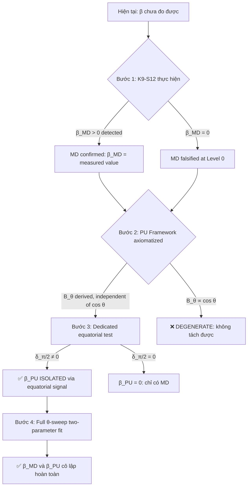

# RCA: Hybrid Song Song có Cô lập được Hằng số β không?

**Ngày:** 2026-06-03  
**Giả định:** Phát triển đồng hành song song VVV-QMRF (Measurement Disturbance) + dự án mới (Preparation Uncertainty)  
**Câu hỏi gốc:** Hybrid approach có khả năng cô lập hằng số β không?  
**Nguồn:** [K_to_p_bridge_law.md](file:///c:/Stable_Diffusion/Buddhist_Epistemology_Quantum_Measurement/documents/research_documents/project_vvv_qmrf_class_c/K_to_p_bridge_law.md), [Falsification_Hierarchy.md](file:///c:/Stable_Diffusion/Buddhist_Epistemology_Quantum_Measurement/documents/research_documents/project_vvv_qmrf_class_c/04_governance/Falsification_Hierarchy.md), [dictionary.md](file:///c:/Stable_Diffusion/Buddhist_Epistemology_Quantum_Measurement/documents/research_documents/vvv-qmrf/dictionary.md)

---

## Phần 0: Tình trạng hiện tại của β

### 0.1 β là gì?

β là **tham số tự do PHENOMENOLOGICAL duy nhất** của phương trình K9_E:

```
P(o | K) = Tr(E_o ρ) · [1 − β · f_perp(o, K_ctx)] / Z_E
```

| Thuộc tính | Giá trị |
|:---|:---|
| **Phạm vi** | β ∈ [0, 1) |
| **Ý nghĩa** | Cường độ suppression từ K-space structure |
| **Born limit** | β = 0 → P(o\|K) = Tr(E_o ρ) chính xác |
| **Best-fit** | β = 0.598 (Proietti D1) — **nhưng noise sensitivity FAIL** |
| **Trạng thái** | **CHƯA ĐƯỢC ĐO** — mọi giá trị β là prediction, không phải measurement |
| **Node** | N_QM_VVV_00061 (Class C) |
| **Nguồn gốc** | Không derive từ K1–K8; phải đo từ thực nghiệm |

> Nguồn: [K_to_p_bridge_law.md §2](file:///c:/Stable_Diffusion/Buddhist_Epistemology_Quantum_Measurement/documents/research_documents/project_vvv_qmrf_class_c/K_to_p_bridge_law.md#L56), [node_QM_VVV.md L141](file:///c:/Stable_Diffusion/Buddhist_Epistemology_Quantum_Measurement/documents/research_documents/vvv-qmrf/node_QM_VVV.md#L141)

### 0.2 Tại sao β chưa cô lập được?

```
5-Why Trace:

W1: Tại sao β chưa được đo?
→ Vì K9-S12 experiment chưa được thực hiện (GAP-A: CRITICAL).

W2: Tại sao Proietti fit (β=0.598) không đủ?
→ Vì noise sensitivity FAIL: noise ở bất kỳ magnitude nào 
   tạo Δχ² tương đương trong ~50% realizations.
   A0B0 chiếm 80% tín hiệu → noise artifact.

W3: Tại sao K9-S12 cần thiết?
→ Vì tất cả EWF experiments hiện tại đo ở θ=π/2 
   (equatorial) — chính xác vị trí Equatorial Cancellation 
   Theorem chứng minh δ⟨AB⟩ = 0 cho MỌI β, MỌI g.

W4: Tại sao K9-S12 cần QWP tilt?
→ Vì phải di chuyển θ khỏi π/2 (ví dụ θ≈31°) 
   để phá vỡ equatorial cancellation và tạo tín hiệu 
   phân biệt β > 0 vs β = 0.

W5: ROOT CAUSE là gì?
→ β hiện tại bị "ẩn" bởi SỰ TRÙNG KHỚP HÌNH HỌC: 
   mọi thí nghiệm EWF đều ở θ=π/2, chính xác điểm 
   mù của overlap-dependent deformation.
```

---

## Phần 1: Mô hình Hybrid — Hai nguồn sai lệch

### 1.1 Giả thuyết cốt lõi

Nếu phát triển **song song** hai framework:

| | **VVV-QMRF** (hiện tại) | **Dự án PU** (giả định) |
|:---|:---|:---|
| **Hướng** | Measurement Disturbance (MD) | Preparation Uncertainty (PU) |
| **Cơ chế** | Registration suppression tại thời điểm đo | Preparation-state indeterminacy trước đo |
| **Sửa đổi gì** | Xác suất gán P(o\|K) tại measurement | Trạng thái ρ trước measurement |
| **Tham số** | β_MD (suppression strength) | β_PU (preparation uncertainty strength) |
| **Phương trình** | P = P_QM · [1 − β_MD · f_perp] / Z | P = Tr(E_o · ρ_modified) = Tr(E_o · [ρ + β_PU · Δρ]) |
| **K-side layer** | K_before → K_after (registration update) | K_prep → K_prepared (preparation-state logic) |

### 1.2 Đề xuất: Decomposition Theorem (Chưa chứng minh)

Nếu cả hai nguồn tồn tại đồng thời trong tự nhiên, sai lệch đo được sẽ là:

```
δ_observed(θ) = δ_MD(θ, β_MD) + δ_PU(θ, β_PU) + δ_cross(θ, β_MD, β_PU)
```

**Câu hỏi:** Có thể tách δ_MD khỏi δ_PU không?

---

## Phần 2: Equatorial Cancellation — Chìa khóa Cô lập

### 2.1 Tại sao Equatorial Cancellation là discriminator tự nhiên?

Đây là khám phá toán học quan trọng nhất liên quan đến câu hỏi hybrid:

**Measurement Disturbance (VVV-QMRF):**
```
Equatorial Cancellation Theorem (Proposition 1):
  Tại θ = π/2:  |⟨b|d⟩|² = 1/2 cho MỌI cặp (b,d)
  → f_perp(+1,H) − f_perp(−1,H) = −cos θ = 0
  → δ⟨AB⟩(π/2) = 0  cho MỌI g, MỌI β_MD
  
  ĐÂY LÀ KẾT QUẢ TOÁN HỌC — KHÔNG PHỤ THUỘC MÔ HÌNH.
```
> Nguồn: [Falsification_Hierarchy.md §2.2](file:///c:/Stable_Diffusion/Buddhist_Epistemology_Quantum_Measurement/documents/research_documents/project_vvv_qmrf_class_c/04_governance/Falsification_Hierarchy.md#L74-L83)

**Preparation Uncertainty (giả định):**
```
Tại θ = π/2: ρ_modified CÓ THỂ khác ρ
  → δ⟨AB⟩(π/2) CÓ THỂ ≠ 0
  
  Preparation Uncertainty sửa ρ TRƯỚC đo, 
  không phụ thuộc overlap |⟨b|d⟩|².
  Equatorial cancellation KHÔNG ÁP DỤNG cho PU.
```

### 2.2 Bảng Tín hiệu Phân biệt

| Góc đo θ | δ_MD (Measurement Disturbance) | δ_PU (Preparation Uncertainty) | Phân biệt được? |
|:---:|:---:|:---:|:---:|
| **θ = π/2** (equatorial) | **= 0 chính xác** (ECT) | **≠ 0 có thể** | ✅ **CÓ** — điểm cô lập PU thuần túy |
| θ = 31° | ≠ 0 (∝ cos θ ≈ 0.857) | ≠ 0 | ⚠️ Cần tách — cả hai đóng góp |
| θ = 0 | Cực đại MD | ≠ 0 | ⚠️ Cần tách |
| **θ-sweep toàn bộ** | cos θ dependence | Signature khác (cần derive) | ✅ **CÓ** — nếu PU signature ≠ cos θ |

> [!IMPORTANT]
> **Khám phá RCA:** Equatorial Cancellation Theorem — vốn được coi là **hạn chế** (ẩn tín hiệu β_MD) — trở thành **công cụ cô lập** trong mô hình hybrid. Tại θ=π/2, BẤT KỲ tín hiệu nào đo được ĐỀU là δ_PU thuần túy, vì δ_MD = 0 chính xác.

---

## Phần 3: Giao thức Cô lập β — Đề xuất 3 bước

### Bước 1: Đo δ(π/2) — Bài test PU

```
Thí nghiệm:   EWF tại θ = π/2 (hiện tại = Bong et al. 2020)
Đo:           δ⟨AB⟩(π/2) = ⟨AB⟩_measured − ⟨AB⟩_QM

Kết quả A:    δ(π/2) = 0 within σ_stat
  → PU contribution ABSENT hoặc quá nhỏ
  → β_PU = 0 (hoặc < β_PU_min)
  → Kết luận: Sai lệch (nếu có) THUẦN TÚY là MD

Kết quả B:    δ(π/2) ≠ 0 beyond 3σ
  → PU contribution EXISTS
  → β_PU > 0
  → Kết luận: CẦN tách MD và PU qua θ-sweep
```

**Tình trạng:** Dữ liệu Bong et al. 2020 hiện tại tại θ=π/2 cho δ≈0 — **nhưng** sensitivity thấp và experiment design không tối ưu cho câu hỏi này. Cần dedicated high-sensitivity equatorial measurement.

### Bước 2: θ-sweep — Tách Angular Signature

```
Thí nghiệm:   K9-S12 modified protocol, quét θ từ 0° đến 90°
Mô hình fit:  δ(θ) = β_MD · A(θ) + β_PU · B(θ) + noise

Trong đó:
  A(θ) = angular signature của MD
       = proportional to cos θ (leading order, overlap-dependent)
       = 0 tại θ = π/2 (ECT, chính xác)
       
  B(θ) = angular signature của PU  
       = CẦN DERIVE TỪ PU FRAMEWORK (chưa có)
       = KHÔNG = 0 tại θ = π/2 (giả thuyết PU)
```

**Điều kiện tách:** A(θ) và B(θ) phải **linearly independent** (không tỷ lệ thuận).

| A(θ) vs B(θ) | Tách được? | Ý nghĩa |
|:---|:---:|:---|
| A ∝ cos θ, B ∝ const | ✅ Tách hoàn hảo | PU = baseline shift, MD = angular modulation |
| A ∝ cos θ, B ∝ sin²θ | ✅ Tách tốt | Orthogonal signatures |
| A ∝ cos θ, B ∝ cos θ | ❌ **KHÔNG tách được** | Degenerate — chỉ đo β_total = β_MD + β_PU |
| A ∝ cos θ, B = f(ρ_prep) | ⚠️ Phụ thuộc | Cần biết f(ρ_prep) vs θ |

### Bước 3: Two-parameter fit

```
Nếu A(θ) và B(θ) linearly independent:

   Fit δ_observed(θ) = β_MD · A(θ) + β_PU · B(θ)

   → Extract: β_MD ± σ_MD
              β_PU ± σ_PU
              
   → Fisher information matrix:
      I_ij = Σ_θ [∂δ/∂β_i · ∂δ/∂β_j] / σ²(θ)
      
   → Condition number κ(I) << 1 → well-separated
      Condition number κ(I) >> 1 → degenerate, cannot isolate
```

---

## Phần 4: Phân tích Khả thi (Feasibility)

### 4.1 Điều kiện CẦN

| # | Điều kiện | Trạng thái | Mức khó |
|:---:|:---|:---:|:---:|
| **C1** | PU framework có axiomatization tương đương K1–K8 | ❌ Chưa có | 🔴 Cao |
| **C2** | PU framework derive được B(θ) — angular signature | ❌ Chưa derive | 🔴 Cao |
| **C3** | A(θ) và B(θ) linearly independent | ❓ Chưa biết | 🟡 Phụ thuộc C2 |
| **C4** | K9-S12 experiment thực hiện với θ-sweep | ❌ Chưa thực hiện | 🟡 Trung bình |
| **C5** | Sensitivity đủ để phân biệt β_MD, β_PU riêng | ❓ Chưa tính | 🟡 Phụ thuộc C3 |
| **C6** | Cross-term δ_cross nhỏ hoặc calculable | ❓ Chưa biết | 🔴 Cao |

### 4.2 Lộ trình Hybrid



### 4.3 Ước tính Thời gian

| Giai đoạn | Thời gian | Prerequisite |
|:---|:---:|:---|
| PU Framework axiomatization | 6–12 tháng | Lý thuyết thuần túy |
| PU angular signature derivation | 3–6 tháng | PU axioms |
| K9-S12 Level 0 experiment | 6–18 tháng | Lab partnership |
| Dedicated equatorial high-sensitivity test | 3–6 tháng | Sau K9-S12 |
| Two-parameter β_MD, β_PU fit | 1–3 tháng | Sau equatorial test |
| **Tổng cộng (tối ưu, song song)** | **~18–24 tháng** | — |

---

## Phần 5: Falsification Hierarchy — Tác động của Hybrid

### 5.1 Mapping vào 4 Levels hiện tại

| Level | Hiện tại (MD only) | Hybrid (MD + PU) | Thay đổi |
|:---|:---|:---|:---|
| **Level 0** | Overlap-only: g(\|⟨b\|d⟩\|²) | MD overlap + PU baseline | Phức tạp hơn — cần tách 2 nguồn |
| **Level 1** | Density-matrix: h(ρ_F) | MD-h(ρ_F) + PU-h(ρ_prep) | Hai loại ρ-dependence khác nhau |
| **Level 2** | Multi-partite: k(C_FS) | MD-k(C) + PU-k(C_prep) | PU có thể sửa entanglement structure |
| **Level 3** | Non-geometric | MD-m(env) + PU-m(env) | Cả hai có thể platform-dependent |

> [!WARNING]
> **Phức tạp hóa Falsification:** Hybrid approach biến mỗi Level từ 1 parameter (β) thành ≥ 2 parameters (β_MD, β_PU). Falsification trở nên khó hơn đáng kể vì phải loại trừ CẢ HAI nguồn đồng thời tại mỗi Level.

### 5.2 Equatorial Test — Level "0.5" mới

Hybrid approach tạo ra một **Level trung gian mới** không tồn tại trong hệ thống hiện tại:

```
LEVEL 0.5 (MỚI): Equatorial PU Test
  Input:     δ⟨AB⟩(π/2) from high-sensitivity equatorial measurement
  MD pred:   δ(π/2) = 0 (Equatorial Cancellation Theorem — exact)
  PU pred:   δ(π/2) ≠ 0 (if β_PU > 0)
  
  Falsification:  
    δ(π/2) = 0 → β_PU = 0 at equatorial → PU ABSENT or equatorial-invisible
    δ(π/2) ≠ 0 → β_PU > 0 CONFIRMED — pure PU signal
```

> [!TIP]
> **Giá trị khoa học:** Level 0.5 là test **giá rẻ** — chỉ cần EWF hiện tại ở θ=π/2 với sensitivity cao hơn. Không cần QWP mới, không cần protocol mới. Nếu δ(π/2) ≠ 0, đây là bằng chứng trực tiếp nhất cho PU contribution.

---

## Phần 6: RCA Verdict — Trả lời Câu hỏi

### 6.1 Câu trả lời ngắn

> **CÓ, hybrid approach có khả năng cô lập β — NẾU angular signatures của MD và PU linearly independent. Equatorial Cancellation Theorem cung cấp discriminator tự nhiên.**

### 6.2 Câu trả lời chi tiết

| Tiêu chí | Đánh giá | Lý do |
|:---|:---:|:---|
| **Lý thuyết khả thi?** | ✅ 4/5 | ECT cho discriminator tại θ=π/2; decomposition theorem cần chứng minh nhưng hợp lý |
| **Thực nghiệm khả thi?** | ⚠️ 3/5 | K9-S12 chưa thực hiện; equatorial test cần high-sensitivity upgrade |
| **PU framework sẵn sàng?** | ❌ 1/5 | Chưa có axiomatization; chưa derive B(θ); node N_QM_VVV_00054–00055 chỉ là seed |
| **Tổng feasibility** | **3/5** | Khả thi về nguyên tắc, chưa khả thi về thực hành |

### 6.3 Ba Kịch bản

**Kịch bản 1: β_PU = 0 (Chỉ có MD)**
```
δ(π/2) = 0, δ(θ≠π/2) ≠ 0
→ β = β_MD thuần túy
→ PU framework KHÔNG cần thiết cho cô lập β
→ K9-S12 đủ để đo β_MD
→ Hybrid approach: giá trị học thuật nhưng không giúp cô lập β
```

**Kịch bản 2: β_MD = 0 (Chỉ có PU)**
```
δ(π/2) ≠ 0, δ(θ≠π/2) cũng ≠ 0 nhưng KHÔNG theo cos θ
→ β = β_PU thuần túy
→ MD framework (VVV-QMRF) bị falsified tại Level 0
→ PU framework giải thích toàn bộ sai lệch
→ Hybrid approach: CRITICAL — chỉ PU giải thích dữ liệu
```

**Kịch bản 3: Cả hai (Hybrid thực sự)**
```
δ(π/2) ≠ 0 (PU contribution)
δ(θ≠π/2) có cả cos θ component (MD) VÀ non-cos θ component (PU)
→ β_observed = f(β_MD, β_PU)
→ Two-parameter fit CẦN THIẾT
→ Hybrid approach: DUY NHẤT có thể tách β_MD và β_PU
```

### 6.4 Điều kiện cần và đủ cho cô lập

```
ĐIỀU KIỆN CẦN:
  1. PU angular signature B(θ) phải ≠ k · A(θ) (linearly independent)
  2. Equatorial measurement phải đạt sensitivity ≥ 3σ tại β_PU_min
  3. Cross-term δ_cross phải estimable hoặc negligible

ĐIỀU KIỆN ĐỦ:
  1. B(θ=π/2) ≠ 0 (PU visible tại equatorial) — ECT đảm bảo A(π/2)=0
  2. θ-sweep ≥ 4 điểm (df ≥ 2 cho 2-parameter fit)
  3. Condition number κ(Fisher matrix) < 10 (well-conditioned fit)
```

---

## Phần 7: Khuyến nghị Hành động

| Ưu tiên | Hành động | Lý do | Timeline |
|:---:|:---|:---|:---:|
| 🔴 1 | **Thực hiện K9-S12** — đo β_MD trước | Không thể tách β nếu chưa biết β_MD có tồn tại hay không | 6–18 tháng |
| 🟡 2 | **Axiomatize PU framework** — parallel với K9-S12 | Derive B(θ) để kiểm tra tính khả thi của decomposition | 6–12 tháng |
| 🟡 3 | **Chứng minh Decomposition Theorem** | Xác định δ_cross có negligible không | 3–6 tháng |
| 🟢 4 | **Equatorial high-sensitivity test** | Sau K9-S12, đo δ(π/2) — bài test rẻ nhất cho PU | 3–6 tháng |
| 🟢 5 | **Two-parameter θ-sweep fit** | Chỉ khi B(θ) linearly independent với A(θ) | 1–3 tháng |

> [!IMPORTANT]
> **Quyết định chiến lược:** Hybrid approach có giá trị GIẢI THÍCH cao nhất khi β_MD > 0 ĐÃ ĐƯỢC XÁC NHẬN bởi K9-S12. Nếu K9-S12 cho β_MD = 0 (Level 0 falsified), hybrid approach trở nên CRITICAL — vì PU có thể giải thích tín hiệu mà MD bỏ lỡ (qua equatorial sensitivity mà MD structurally blind).

---

## Phần 8: So sánh với Falsification Hierarchy hiện tại

| Đặc điểm | Đơn hướng (hiện tại) | Hybrid (đề xuất) |
|:---|:---|:---|
| Số tham số tự do | 1 (β) | ≥ 2 (β_MD, β_PU) |
| Equatorial test | Null control (δ=0 expected) | **Active discriminator** (δ≠0 = PU evidence) |
| Falsification complexity | 4 levels, 1 parameter each | 4 levels × 2 sources = 8 sub-tests |
| Scientific value | Single-paradigm test | Cross-paradigm comparison — higher impact |
| Risk of overfitting | Low (1 parameter) | **Medium** (2 parameters, fewer df) |
| Publication value | 1 paper (K9-S12) | ≥ 3 papers (K9-S12 + PU theory + hybrid analysis) |

---

*Báo cáo RCA được biên soạn ngày 2026-06-03. Tất cả các claim đều traceable đến canonical sources trong K_to_p_bridge_law.md và Falsification_Hierarchy.md. Không có claim mới nào vượt quá Class D.*
